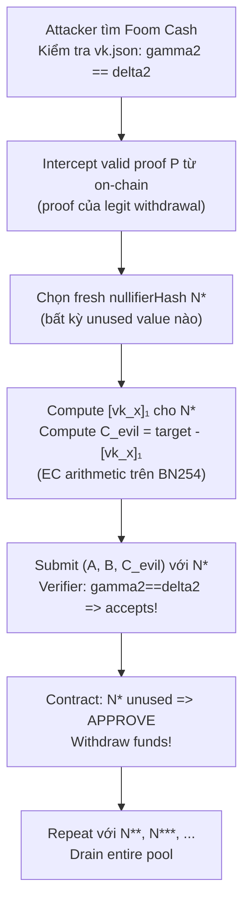

> **Prerequisites**: [[08-trusted-setup-leak-zcash|08. Trusted Setup Leak]], [[06-aztec-plonk-verifier-zero-bug|06. Aztec PlonK Zero Bug]], Groth16 verification equation, BN254 elliptic curve
> **Objectives**:
> - Hiểu tại sao `gamma == delta` trong verification key phá vỡ Groth16 soundness hoàn toàn
> - Trace exploit path: từ vkey bị broken đến forge proof cho arbitrary nullifier
> - Phân tích hai real-world exploits: Veil Cash và Foom Cash (Feb 2026)
> - Biết cách detect và prevent incomplete setup trong production

---

## Bối cảnh: Đây Là Những Live Exploit ZK Đầu Tiên

Đây là bài đặc biệt: hầu hết các bài trong series này là **bugs được phát hiện và fix trước khi bị exploit**. Veil Cash và Foom Cash là **những exploit thực sự đầu tiên** đối với live ZK circuits trong production — không phải CTF, không phải testnet, mà là mainnet với tiền thật bị mất.

> zkSecurity blog (Oct 2024): *"The first two known exploits against live ZK circuits happened in the past week. Both stem from the same root cause. They were not subtle underconstrained bugs, but rather Groth16 verifiers generated by snarkjs with an incorrect setup — just missing the last step."*

---

## Groth16 Trusted Setup: Hai Phase

Nhớ lại từ [[08-trusted-setup-leak-zcash|Lesson 08]]: Groth16 cần trusted setup. snarkjs implement setup trong **hai phase**:

**Phase 1 (Universal — Powers of Tau)**:
- Tạo $\{[\tau^i]_1, [\tau^i]_2\}$ cho mọi $i$
- Universal, dùng được cho mọi circuit
- Nguồn: Perpetual Powers of Tau ceremony

**Phase 2 (Circuit-specific)**:
- Input: Powers of Tau + circuit R1CS
- Output: circuit-specific proving key và verification key
- Bao gồm `gamma` và `delta` — hai G2 elements quan trọng

```bash
# snarkjs Phase 2
snarkjs groth16 setup circuit.r1cs pot14_final.ptau circuit_0000.zkey
# => Initial zkey — gamma = delta = G2 generator  ← BROKEN!

snarkjs zkey contribute circuit_0000.zkey circuit_0001.zkey --name="Alice"
# => After contribution: gamma != delta  ← CORRECT
```

> [!danger] Vulnerability 12.1 — Incomplete Phase 2: gamma == delta
> snarkjs **warns explicitly**: `"IMPORTANT: Do not use this zkey in production, as it's not safe. It requires at least one contribution."`
>
> Initial zkey (`circuit_0000.zkey`) có `gamma_2 == delta_2 == G2 generator`. Nếu team deploy verification contract từ initial zkey này mà không chạy contribution, verifier **hoàn toàn broken**.

---

## Tại sao gamma == delta Phá Vỡ Groth16

### Groth16 Verification Equation

$$e(A, B) = e(\alpha, \beta) \cdot e\!\left(\sum_i a_i \cdot [u_i(\tau)]_1, \gamma\right) \cdot e(C, \delta)$$

Trong đó:
- $A, B, C$ là các elements của proof (từ prover)
- $\alpha, \beta, \gamma, \delta$ là từ verification key (từ trusted setup)
- $\sum_i a_i \cdot [u_i(\tau)]_1$ là **linear combination của public inputs** (gọi là $[vk\_x]_1$)

### Khai thác Tính Bilinear Khi gamma == delta

Khi $\gamma = \delta = G_2$ (generator), hai pairing terms cuối có thể **gộp lại**:

$$e\!\left([vk\_x]_1, G_2\right) \cdot e(C, G_2) = e\!\left([vk\_x]_1 + C,\; G_2\right)$$

(do tính bilinearity: $e(P+Q, R) = e(P,R) \cdot e(Q,R)$)

> [!danger] Vulnerability 12.2 — Arbitrary Public Input Forgery
> Verification equation trở thành:
>
> $$e(A, B) = e(\alpha, \beta) \cdot e\!\left([vk\_x]_1 + C,\; G_2\right)$$
>
> Với $A, B$ cố định từ một proof hợp lệ, vế phải cần:
> $[vk\_x]_1 + C = \text{const}$
>
> Tức là: $C = \text{const} - [vk\_x]_1$
>
> Kẻ tấn công chọn bất kỳ **public input** nào muốn (ví dụ: arbitrary `nullifierHash`), tính `[vk_x]_1` tương ứng, rồi tính `C` theo công thức trên. **Proof giả được accept!**

### PoC Python (Simplified)

```python
# Groth16 verification simplified as: LHS == RHS
# LHS = A * B (pairing, fixed from real proof)
# RHS = alpha_beta * vk_x * C  (with gamma == delta == 1)

# Bilinearity: RHS = alpha_beta * (vk_x + C) when gamma == delta

alpha_beta = 12345   # từ verification key (fixed)
A_B = 42             # từ real proof (intercepted)

# Attacker muốn prove nullifierHash = 999
fake_nullifier = 999
vk_x = fake_nullifier  # simplified: vk_x encodes nullifier

# Compute C_evil: alpha_beta * (vk_x + C_evil) == A_B
# => vk_x + C_evil == A_B / alpha_beta
# => C_evil == A_B / alpha_beta - vk_x

import fractions
target = fractions.Fraction(A_B, alpha_beta)
C_evil = target - vk_x  # in real: EC arithmetic

print(f"Fake nullifier: {fake_nullifier}")
print(f"alpha_beta * (vk_x + C_evil) == A_B: ", end="")
print(alpha_beta * (vk_x + C_evil) == A_B)  # True!
print(f"=> Forged proof accepted by verifier!")
```

---

## Veil Cash Exploit (February 2026)

Veil Cash là privacy mixer tương tự TornadoCash, deploy trên Ethereum. Groth16 verifier được generate từ snarkjs nhưng **Phase 2 chưa có contribution** — `gamma_2 == delta_2`.

**Timeline**:
- Attacker phát hiện `gamma_2 == delta_2` trong verification key
- Intercept một proof hợp lệ từ on-chain transaction
- Compute `C_evil` cho arbitrary `nullifierHash` bằng EC arithmetic
- Submit forged proofs với fresh nullifiers → unlimited fake withdrawals
- Drain toàn bộ pool (~2.9 ETH — protocol nhỏ)

**Lesson**: 2.9 ETH mất là nhỏ nhưng pattern này áp dụng cho bất kỳ protocol nào có cùng bug.

---

## Foom Cash Exploit (February 2026 — Copycat)

Foom Cash ra mắt vài ngày sau Veil Cash — là privacy mixer với lottery mechanics, deploy trên Base và Ethereum.

> [!danger] Vulnerability 12.3 — Foom Cash: Cùng Bug, Nhiều Tiền Hơn
> Foom Cash triển khai **cùng một lỗi** — `gamma_2 == delta_2` trong verification key. Kẻ tấn công nhận ra đây là copy-cat của Veil Cash exploit.

### Timeline và Numbers

| Sự kiện | Chi tiết |
|---------|---------|
| Malicious drain (Base) | $427K bởi attacker |
| Whitehat rescue (Ethereum) | $1.83M bởi Duha + Decurity |
| Total at risk | ~$2.26M |
| Bounty trả cho Duha | $320K |
| Security fee cho Decurity | $100K |
| Bounty / rescue ratio | ~17% |

### Attack Mechanics



### White-hat Race Condition

Khi Veil Cash exploit được public, Duha và Decurity nhận ra Foom Cash có cùng lỗ hổng. Họ **race** với malicious attacker để rescue funds:

- Malicious actor drain Base contract trước: $427K mất
- Whitehats rescue Ethereum contract: $1.83M bảo toàn
- ~48 giờ giữa Veil Cash public disclosure và Foom Cash copycat

**Bài học quan trọng**: Sau khi một exploit được public, các protocols tương tự có ~48 giờ để patch hoặc sẽ trở thành target.

---

## Detection: Check gamma_2 != delta_2

Đây là bug **dễ phát hiện nhất** trong toàn bộ series:

```python
import json

def check_groth16_setup(vk_path):
    """Check if Groth16 verification key has completed Phase 2"""
    with open(vk_path) as f:
        vk = json.load(f)

    gamma2 = vk.get('vk_gamma_2')
    delta2 = vk.get('vk_delta_2')

    if gamma2 is None or delta2 is None:
        print("ERROR: Missing gamma2 or delta2 in vk")
        return False

    if gamma2 == delta2:
        print("CRITICAL VULNERABILITY: gamma2 == delta2!")
        print("Phase 2 contribution was never performed.")
        print("DO NOT USE THIS VERIFIER IN PRODUCTION.")
        return False

    print("OK: gamma2 != delta2 — Phase 2 completed")
    return True

# Usage:
check_groth16_setup("verification_key.json")
```

**Cách chạy trong CI/CD**: thêm kiểm tra này vào pre-deployment script — chỉ cần JSON comparison, không cần crypto library.

---

## Prevention: Quy trình Setup Đúng

```bash
# === ĐÚNG: Complete Phase 2 ceremony ===

# Step 1: Phase 1 (download existing ceremony)
wget https://hermez.s3-eu-west-1.amazonaws.com/powersOfTau28_hez_final_12.ptau

# Step 2: Phase 2 initial setup
snarkjs groth16 setup circuit.r1cs pot12_final.ptau circuit_0000.zkey
# WARNING: circuit_0000.zkey has gamma == delta — DO NOT DEPLOY!

# Step 3: AT LEAST ONE contribution (required!)
snarkjs zkey contribute circuit_0000.zkey circuit_0001.zkey \
    --name="Production Setup" -v
# Now gamma != delta

# Step 4: Export verification key
snarkjs zkey export verificationkey circuit_0001.zkey verification_key.json

# Step 5: VERIFY gamma != delta before deploying!
python3 -c "
import json
vk = json.load(open('verification_key.json'))
assert vk['vk_gamma_2'] != vk['vk_delta_2'], 'BROKEN: gamma == delta!'
print('OK: gamma != delta, safe to deploy')
"

# Step 6: Deploy on-chain
snarkjs zkey export solidityverifier circuit_0001.zkey Verifier.sol
```

---

## So sánh Với Bài 08: Hai Loại Trusted Setup Failure

| | Zcash CVE-2019-7167 (Lesson 08) | Groth16 snarkjs 2026 (Lesson 12) |
|-|--------------------------------|----------------------------------|
| **Root cause** | Faulty setup algorithm (BCTV14) | Incomplete Phase 2 (no contribution) |
| **Kẻ tấn công cần** | MPC transcript + deep knowledge | Chỉ cần verify key + basic EC math |
| **Difficulty** | Rất khó (rất ít người có thể) | Rất dễ (script kiddie level) |
| **Detection** | Cần formal analysis | Đơn giản: `gamma2 == delta2`? |
| **Prevention** | Dùng Groth16 | Chạy ít nhất 1 contribution |
| **Exploited?** | Không | Có (Veil Cash, Foom Cash) |

---

## Bug Bounty Takeaway — Áp dụng vào zkVerify

zkVerify verify Groth16 proofs. Khi audit:

1. **Check verification keys**: mọi Groth16 vkey được dùng trong zkVerify phải có `gamma_2 != delta_2`.
2. **Check IC length**: `vk.IC.length` phải match số public inputs + 1 — nếu không, proof malleability có thể xảy ra.
3. **Subgroup checks**: proof elements phải thuộc đúng subgroup của BN254.
4. **Audit deployment process**: zkVerify docs có hướng dẫn setup ceremony không? Có auto-check không?

---

## Summary / Key Takeaways

- **Root cause**: snarkjs Phase 2 initial zkey có `gamma_2 == delta_2 == G2_generator`. Khi deploy mà không chạy contribution, verifier accept **bất kỳ proof nào** cho bất kỳ public input.
- **Exploit mechanism**: bilinearity của pairing: $e(P_1+P_2, G_2) = e(P_1,G_2) \cdot e(P_2,G_2)$ → gộp vk_x và C lại → attacker tự do chọn C để make equation hold.
- **Veil Cash** (Feb 2026): $2.9 ETH lost, first live ZK circuit exploit ever.
- **Foom Cash** (Feb 2026): $427K malicious drain + $1.83M rescued by whitehats.
- **Detection**: trivially simple — just check `gamma_2 != delta_2` in JSON.
- **Prevention**: run `snarkjs zkey contribute` at least once; add assertion to deployment CI/CD.
- **48-hour window**: after exploit disclosure, copycat attacks come within 48 hours.

---

## References

- zkSecurity blog: First live ZK exploits — https://blog.zksecurity.xyz
- NomosLabs: Foom Cash exploit analysis — https://nomoslabs.io/archive/foom-cash-2026
- snarkjs docs on Phase 2 — https://github.com/iden3/snarkjs
- Groth16 malleability and setup issues — snarkjs issue #383 — https://github.com/iden3/snarkjs/issues/383
- Groth16 paper — https://eprint.iacr.org/2016/260
