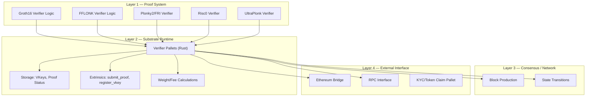

> **Prerequisites**: Tất cả [[01-intro-taxonomy-zk-exploits|Lesson 01]] – [[12-live-exploits-groth16-snarkjs-2024|12]], kiến trúc Substrate cơ bản
> **Objectives**:
> - Nắm vững attack surface của zkVerify theo từng layer
> - Mapping từng exploit class (Lessons 02–12) sang các điểm cụ thể trong codebase zkVerify
> - Hiểu quy trình Immunefi submission: severity classification, PoC requirements, KYC
> - Xây dựng được hunting checklist thực tế cho zkVerify

---

## zkVerify là gì?

zkVerify là **decentralized proof verification layer** xây dựng trên Substrate/Polkadot. Thay vì mỗi dApp tự verify ZK proof on-chain (tốn $2–$50 gas/proof trên Ethereum), các protocol submit proof đến zkVerify và nhận kết quả verification với chi phí thấp hơn nhiều.

**Kiến trúc cốt lõi**:
- Substrate blockchain (Rust)
- Các **verifier pallets** cho từng proof system: Groth16, FFLONK, Risc0, Plonky2, UltraPlonk...
- On-chain state lưu verification keys và proof statuses
- Bridge với Ethereum để các smart contract query kết quả

**Program**: Immunefi, tối đa **$50,000 Critical** (5% funds at risk, min $15,000)
**Audits**: Trail of Bits (Feb 2025), SRLabs (Sep 2025)
**Live**: September 2025

---

## Attack Surface Map



---

## Mapping Exploit Classes → zkVerify Attack Vectors

### 1. Under-constrained Circuit Bugs (Lessons 02, 03)

zkVerify implement verifier logic trực tiếp trong Rust, không phải Circom. Tuy nhiên, nếu zkVerify cho phép users submit custom circuits (ví dụ: qua FFLONK hay UltraPlonk), cần check:

> [!tip] Hunting Tips 13.1 — Under-constrained / Missing Output Check
> - Trong Groth16 verifier Rust code: tìm các chỗ `PublicInputs` được validate — có check tất cả elements `< scalar_field_order` không?
> - Với verifier nhận `G1Affine` / `G2Affine` points: check xem có `is_on_curve()` và `is_torsion_free()` validation không?
> - Pattern: `let point = G1Affine::from(...)` mà thiếu `.is_on_curve()` sau đó → miss subgroup check

### 2. Nondeterministic / EVM Field Mismatch (Lesson 04)

> [!tip] Hunting Tips 13.2 — Field Boundary
> - Ethereum bridge: khi proof status hoặc nullifier được relay từ zkVerify sang Ethereum, có check `value < SNARK_FIELD_ORDER` không?
> - Substrate u256 vs BN254 scalar field: `u256` trên Substrate có thể lưu giá trị `>= p` — nếu dùng để index hay compare, có thể bị double-spend pattern

### 3. Assigned but Not Constrained — LinearCombination (Lessons 05, 10)

> [!tip] Hunting Tips 13.3 — Builder Patterns trong Rust
> zkVerify dùng các Rust circuit libraries (arkworks, bellman). Tìm:
> - Pattern `LinearCombination::zero()` với `.add(...)` calls nhưng không có `cs.enforce(...)` cuối
> - Struct accumulator pattern: `Transcript`, `Challenge`, `ProofAccumulator` — mọi `.push()` phải được `.finalize()` vào constraint
> - `grep -r "linear_combination" --include="*.rs"` trong verifier code

### 4. EC Point Validation (Lesson 06)

> [!danger] High-value Target 13.4 — Identity Point Checks
> zkVerify verify nhiều EC-based proofs. Với **bất kỳ** G1/G2 point nào nhận từ user:
>
> ```rust
> // BAD: không check
> let a = G1Affine::from_bytes(&proof.a)?;
> pairing_check(a, b, ...);
>
> // GOOD:
> let a = G1Affine::from_bytes(&proof.a)?;
> if a.is_zero() { return Err(InvalidProof); }  // identity check
> if !a.is_in_correct_subgroup_assuming_on_curve() { return Err(InvalidProof); }
> pairing_check(a, b, ...);
> ```
>
> Tìm: tất cả chỗ deserialize proof elements → check có validate `!= identity` + subgroup không.

### 5. Frozen Heart — Fiat-Shamir (Lesson 07)

> [!tip] Hunting Tips 13.5 — Fiat-Shamir Transcript
> zkVerify implement FFLONK, Plonky2 có Fiat-Shamir. Tìm:
> - Struct `Transcript` hay `Challenger` — check xem `append_message()` có bao gồm public inputs không
> - Pattern: `transcript.challenge()` sau khi chỉ `append(commitments)` mà không `append(public_inputs)` → Frozen Heart
> - PLONK verifier: challenge `zeta` phải include `public_inputs` + `circuit_vk`

### 6. Trusted Setup / Verification Key Integrity (Lessons 08, 12)

> [!danger] High-value Target 13.6 — VKey Validation
> zkVerify cho phép register verification keys on-chain. Cần check:
>
> **Groth16 vkey**: `gamma_2 == delta_2`? Nếu ai đó register vkey với `gamma == delta`, mọi proof đều pass. zkVerify có validate điều này trước khi lưu vkey không?
>
> ```rust
> // Trong register_vkey extrinsic:
> fn validate_groth16_vkey(vk: &VerificationKey) -> Result<()> {
>     // PHẢI có check này:
>     ensure!(vk.gamma_g2 != vk.delta_g2, Error::InvalidVKey)?;
>     Ok(())
> }
> ```
>
> Nếu không có check này → attacker register broken vkey → mọi proof pass → **Critical finding**.

### 7. Arithmetic Overflow trong Verifier (Lesson 09)

> [!tip] Hunting Tips 13.7 — Overflow trong Rust Verifier
> - Rust không panic on overflow trong release builds (`--release`). Tìm các phép tính u256/u128 trong verifier mà thiếu overflow check.
> - Đặc biệt: operations kiểu `a * b + c` trên BigInt-style types → có check `< 2^256` sau đó không?
> - Substrate `sp_arithmetic`: tìm dùng `saturating_*` vs `checked_*` — trong crypto context cần `checked` và explicit error.

### 8. Cross-layer / Pallet Integration

> [!tip] Hunting Tips 13.8 — Pallet Interaction
> - **Token Claim Pallet**: nếu dùng Merkle proof on-chain, check nullifier range vs field order
> - **Aggregate Pallet**: khi aggregate nhiều proofs, check rằng aggregation không introduce new unconstrained elements
> - **TEE Verifier**: nếu có TEE integration, check attestation verification logic tách biệt khỏi ZK logic

---

## Severity Classification cho zkVerify

Theo Immunefi V2.3 và đặc thù của zkVerify:

| Finding | Typical Severity | Reward Range |
|---------|----------------|--------------|
| Proof forgery (accept invalid proof) | Critical | $15K–$50K |
| Missing EC subgroup check | Critical | $15K–$50K |
| Frozen Heart (bypass public inputs) | Critical | $15K–$50K |
| Broken VKey registration (`gamma==delta` not rejected) | Critical | $15K–$50K |
| Arithmetic overflow in verifier | High–Critical | $5K–$50K |
| Field boundary mismatch (u256 vs F_p) | High | $5K–$10K |
| DoS via malformed input | High | $5K–$10K |
| Missing range check on public inputs | Medium–High | $1K–$10K |

---

## Quy trình Submission Immunefi

### Bước 1: Reproduce Locally

```bash
# Fork zkVerify repo
git clone https://github.com/HorizenLabs/zkVerify

# Build và run local node
cd zkVerify
cargo build --release

# Test với custom proof (local fork, không mainnet!)
./target/release/zkverify-node --dev
```

**Lưu ý**: KHÔNG test trên mainnet hay public testnet.

### Bước 2: Viết PoC

> [!warning] Warning 13.9 — PoC là Bắt Buộc
> zkVerify yêu cầu PoC cho **mọi** severity level. PoC phải demonstrate:
> - Input cụ thể dẫn đến vulnerability
> - Expected vs actual behavior
> - Impact rõ ràng (funds at risk? network halt? proof forgery?)
>
> Với proof forgery: PoC = tạo forged proof pass verifier (`groth16::verify()` returns `true` cho invalid proof)

### Bước 3: Submit Report

Cấu trúc report tốt:

```text
1. Summary (2-3 câu)
2. Severity & Impact
3. Root Cause (đoạn code cụ thể, dòng số)
4. Attack Scenario (step-by-step)
5. PoC Code (Rust test hoặc Python script)
6. Fix Recommendation
7. References (relevant papers, similar bugs)
```

### Bước 4: KYC

zkVerify yêu cầu KYC để nhận bounty. Chuẩn bị CMND/CCCD hoặc passport.

---

## Master Hunting Checklist

Khi bắt đầu audit zkVerify, thực hiện theo thứ tự sau:

**Pass 1 — Quick Wins (30 phút)**

```bash
# 1. Check Groth16 vkey validation
grep -r "gamma" --include="*.rs" | grep -i "delta\|equal\|check"

# 2. Check EC point validation  
grep -r "from_bytes\|from_compressed\|deserialize" --include="*.rs" | grep -v "test"

# 3. Check identity point checks
grep -r "is_zero\|is_identity\|infinity" --include="*.rs"

# 4. Check Fiat-Shamir transcripts
grep -r "Transcript\|Challenger\|challenge" --include="*.rs"

# 5. Check public inputs in challenges
grep -r "public_input\|pub_input" --include="*.rs"
```

**Pass 2 — Deep Dive (2–4 giờ)**

Với mỗi verifier pallet (`pallet_groth16`, `pallet_fflonk`, v.v.):

1. Trace `submit_proof()` extrinsic từ entry đến `verify()` call
2. Tại mỗi điểm nhận user data: list tất cả validation checks
3. So sánh với required checks từ Audit Checklist (Appendix A1)
4. Chú ý boundary giữa pallet code và external library

**Pass 3 — Newer/Unaudited Code**

Theo DEV Community article: Trail of Bits và SRLabs đã audit code cũ. Focus vào:
- `XCM integration pallet` (nếu có)
- `ParaVerifier pallet` (mới)
- `EZKL verifier adapter` (mới, nếu có)
- Bất kỳ pallet nào được thêm sau Sep 2025

---

## Bug Bounty Mindset

Từ series này, ba patterns có **highest ROI** khi hunting zkVerify:

**Pattern A — VKey integrity**: Check xem `gamma_2 == delta_2` có bị reject không khi register Groth16 vkey. Nếu không → **$50K Critical** ngay lập tức.

**Pattern B — EC point validation**: Với mọi `G1Affine` / `G2Affine` nhận từ user proof → check có validate `is_on_curve() && !is_zero() && is_torsion_free()` không. Nếu thiếu bất kỳ check nào → **Critical**.

**Pattern C — Fiat-Shamir public inputs**: Với FFLONK/PLONK verifier → trace challenge computation → check public inputs có trong transcript không. Nếu không → **Critical**.

---

## Summary / Key Takeaways

- zkVerify là shared proof verification layer với bounty $50K Critical (Immunefi).
- Attack surface bao gồm: verifier pallets (Groth16, FFLONK, Plonky2...), Substrate runtime, pallet interactions, Ethereum bridge.
- **Ba quick-win targets**: VKey validation (`gamma != delta`), EC point checks (`is_zero + subgroup`), Fiat-Shamir transcript completeness.
- Mọi finding cần PoC; không test trên mainnet; KYC bắt buộc để nhận bounty.
- Focus vào code mới/chưa audit: XCM integration, ParaVerifier, EZKL adapter.
- Dùng Audit Checklist (Appendix A1) và Security Tools (Appendix A0) để systematic coverage.

---

## References

- zkVerify Immunefi Program — https://immunefi.com/bug-bounty/zkverify/
- zkVerify GitHub — https://github.com/HorizenLabs/zkVerify
- Trail of Bits Audit (Feb 2025) — https://github.com/trailofbits/publications/blob/master/reviews/2025-02-zkverify-foundation-blockchain-securityreview.pdf
- SRLabs Audit (Sep 2025) — https://github.com/srlabs/audit-reports/blob/main/Polkadot/SRL-zkVerify_baseline_assurance-report-2025.pdf
- Immunefi Severity Classification V2.3 — https://immunefi.com/severity-updated/
