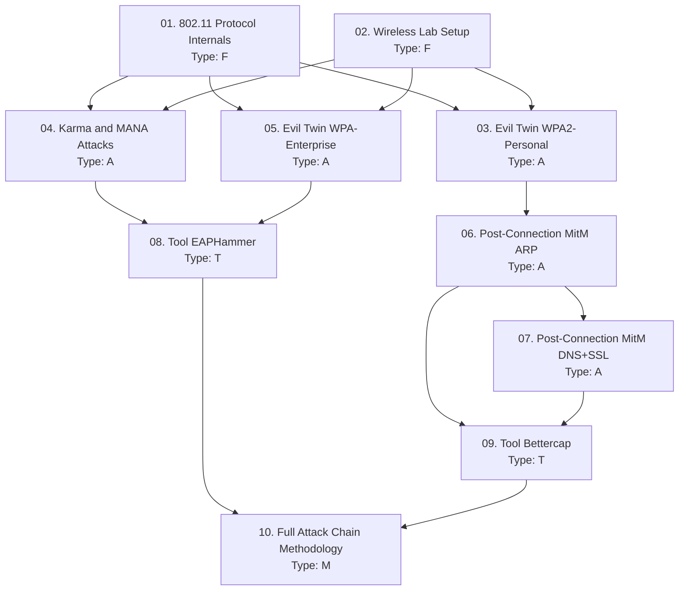

> **Course**: Rogue AP, Evil Twin & Post-Connection MitM Attacks
> **Scope**: Toàn bộ wireless attack chain — từ 802.11 fundamentals, Evil Twin trên WPA2/WPA3/Enterprise, Karma/MANA attacks, đến Post-Connection MitM (ARP spoofing, DNS spoofing, SSL interception)
> **Depth**: Advanced + Exam-focused (HTB CWPE / OSCP+)
> **Lab**: HTB Academy (Wi-Fi Evil Twin Attacks module) + Local VMs (VMware/VirtualBox)
> **Estimated sessions**: 5 sessions × 2 lessons

---

## SVG Assets Plan

| SVG File | Lesson | Mô tả | Priority |
|----------|-------|-------|---------|
| `assets/img-01-802.11-probe-flow.svg` | [[01-802.11-protocol-internals\|01. 802.11 Protocol Internals]] | Beacon/Probe request/response cycle, PNL selection, Evil Twin connection flow | H |
| `assets/img-03-evil-twin-topology.svg` | [[03-evil-twin-wpa2-personal\|03. Evil Twin WPA2-Personal]] | Rogue AP full topology: deauth + open AP + captive portal + credential harvest | H |
| `assets/img-04-karma-mana-flow.svg` | [[04-karma-mana-attacks\|04. Karma & MANA Attacks]] | PNL reconstruction logic, Karma vs MANA comparison, Loud mode | M |
| `assets/img-05-wpa-enterprise-eap-flow.svg` | [[05-evil-twin-wpa-enterprise\|05. Evil Twin WPA-Enterprise]] | PEAP/TTLS tunnel, fake RADIUS, EAP downgrade, NTHash capture | H |
| `assets/img-06-arp-mitm-topology.svg` | [[06-post-connection-mitm-arp\|06. Post-Connection MitM — ARP]] | ARP poisoning: victim ↔ attacker ↔ gateway, bettercap commands | M |

**Priority**: H = Cần thiết cho hiểu cơ chế · M = Tăng clarity · L = Nice-to-have

---

## Lesson Map

| # | Tên Lesson | Type | Phụ thuộc | Ước tính |
|---|-----------|------|----------|---------|
| 01 | [[01-802.11-protocol-internals\|01. 802.11 Protocol Internals & Wireless Attack Surface]] | F | — | 1 session |
| 02 | [[02-wireless-lab-setup\|02. Wireless Lab Setup — Monitor Mode & Adapter Config]] | F | — | 1 session |
| 03 | [[03-evil-twin-wpa2-personal\|03. Evil Twin Attack — WPA2-Personal]] | A | 01, 02 | 1 session |
| 04 | [[04-karma-mana-attacks\|04. Karma & MANA Attacks — Khai thác PNL]] | A | 01, 02 | 1 session |
| 05 | [[05-evil-twin-wpa-enterprise\|05. Evil Twin against WPA-Enterprise]] | A | 01, 02 | 1 session |
| 06 | [[06-post-connection-mitm-arp\|06. Post-Connection MitM — ARP Spoofing]] | A | 03 | 1 session |
| 07 | [[07-post-connection-mitm-dns-ssl\|07. Post-Connection MitM — DNS Spoofing & SSL Interception]] | A | 06 | 1 session |
| 08 | [[08-tool-eaphammer\|08. Tool: EAPHammer]] | T | 04, 05 | 1 session |
| 09 | [[09-tool-bettercap\|09. Tool: Bettercap]] | T | 06, 07 | 1 session |
| 10 | [[10-full-wireless-attack-methodology\|10. Full Wireless Attack Chain Methodology]] | M | All | 1 session |
| FM | [[fm-field-manual\|Field Manual]] | Ref | Tích lũy | — |

**Type legend**: F = Foundation · A = Attack · T = Tool · M = Methodology

---

## Dependency Graph

---

## Phase Breakdown

### Phase 1 — Foundation (Lessons 01–02)
**Lessons**: 01–02
**Mục tiêu**: Hiểu cơ chế 802.11 roaming và lý do Evil Twin hoạt động; thiết lập lab environment đúng cách với monitor mode và adapter configuration
**Lab**: Không cần lab — đọc và setup tool environment

### Phase 2 — Core Attacks (Lessons 03–05)
**Lessons**: 03–05
**Mục tiêu**: Ba attack vector chính — WPA2-Personal (captive portal), Karma/MANA (PNL exploitation), WPA-Enterprise (PEAP/TTLS hash capture)
**Lab**: HTB Academy — *Wi-Fi Evil Twin Attacks* module; Local VMs với hostapd

### Phase 3 — Post-Connection MitM (Lessons 06–07)
**Lessons**: 06–07
**Mục tiêu**: Sau khi client connect vào Rogue AP — intercept traffic bằng ARP poisoning, DNS spoofing, SSL stripping, HSTS bypass
**Lab**: Local VM lab với hai máy ảo (victim + attacker)

### Phase 4 — Tools & Full Chain (Lessons 08–10)
**Lessons**: 08–10
**Mục tiêu**: Deep-dive EAPHammer và Bettercap; tổng hợp thành full attack chain từ recon đến lateral movement vào AD
**Lab**: HTB Academy — *Attacking Corporate Wi-Fi Networks* module

---

## Progress Tracker

- [ ] 01. 802.11 Protocol Internals & Wireless Attack Surface
- [ ] 02. Wireless Lab Setup — Monitor Mode & Adapter Config
- [ ] 03. Evil Twin Attack — WPA2-Personal
- [ ] 04. Karma & MANA Attacks — Khai thác PNL
- [ ] 05. Evil Twin against WPA-Enterprise
- [ ] 06. Post-Connection MitM — ARP Spoofing
- [ ] 07. Post-Connection MitM — DNS Spoofing & SSL Interception
- [ ] 08. Tool: EAPHammer
- [ ] 09. Tool: Bettercap
- [ ] 10. Full Wireless Attack Chain Methodology
- [ ] Field Manual complete

---

## Appendices

| File | Nội dung |
|------|---------|
| [[fm-field-manual\|Field Manual]] | Tài liệu tra cứu thực chiến — tích lũy từ tất cả lessons |

---

## Study Notes

*Ghi chú thêm của người học — cập nhật trong quá trình học*
