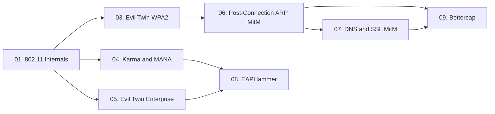

> **Prerequisites**: Không có — đây là bài đầu tiên
> **Objectives**:
> - Hiểu cơ chế beacon frame, probe request/response và quá trình roaming 802.11
> - Nắm rõ Preferred Network List (PNL) và cách khai thác
> - Xác định tại sao 802.11 standard không require AP authentication
> - Chuẩn bị nền tảng cho Evil Twin, Karma/MANA và Post-Connection MitM

---

## Động lực

Mọi cuộc tấn công wireless đều bắt đầu từ một câu hỏi đơn giản: **tại sao client lại connect vào Rogue AP?**

Câu trả lời nằm trong chính thiết kế của 802.11 standard. Không phải do lỗi triển khai — mà là một quyết định thiết kế thực sự: **chuẩn 802.11 không yêu cầu AP phải chứng minh danh tính với client**. Client tin tưởng SSID. Chấm.

Hiểu điểm này ở mức cơ chế là bắt buộc — không phải để thuộc lý thuyết, mà vì nó trực tiếp quyết định: tại sao deauth hoạt động, tại sao Karma attack tồn tại, tại sao MANA phức tạp hơn, và tại sao WPA3 PMF chỉ giải quyết một phần vấn đề.

---

## Kiến trúc & Cơ chế

### Các thành phần trong 802.11 Network

**Station (STA)** — bất kỳ device nào kết nối wireless: laptop, phone, IoT device.

**Access Point (AP)** — thiết bị quản lý wireless network, cầu nối giữa wireless và wired.

**Basic Service Set (BSS)** — một AP và các stations kết nối với nó. Được định danh bằng BSSID (MAC address của AP).

**Extended Service Set (ESS)** — nhiều BSSs dùng cùng SSID. Client có thể roam giữa các APs trong cùng ESS mà không cần reconnect thủ công.

**SSID / ESSID** — tên mạng (string up to 32 bytes). Không phải định danh duy nhất — hai AP có thể dùng cùng SSID nhưng là hai mạng hoàn toàn khác nhau.

### Frame Types quan trọng

802.11 có 3 loại frame:

**Management Frames** — không được mã hóa (trừ khi PMF/802.11w bật):
- **Beacon Frame**: AP broadcast định kỳ (~100ms) thông báo sự hiện diện. Chứa SSID, BSSID, channel, capabilities, cipher suites.
- **Probe Request**: Client gửi để tìm AP. Có hai dạng: directed (kèm SSID cụ thể) hoặc broadcast (SSID null).
- **Probe Response**: AP trả lời probe request với thông tin giống beacon.
- **Authentication Frame**: Bước xác thực ban đầu (open auth = automatic).
- **Association Request/Response**: Client yêu cầu join BSS, AP chấp nhận.
- **Deauthentication / Disassociation Frame**: Ngắt kết nối. Không cần mã hóa, không cần xác thực nguồn gốc (trừ PMF).

**Data Frames** — traffic thực tế (mã hóa bằng AES-CCMP trong WPA2/WPA3).

**Control Frames** — ACK, RTS/CTS.

### Preferred Network List (PNL) và Roaming

![[img-01-802.11-probe-flow.svg]]
*Hình 1: 802.11 probe mechanism — passive scanning, active probing, và Evil Twin connection flow*

Khi device kết nối vào một mạng lần đầu, nó lưu SSID vào **Preferred Network List (PNL)**. Lần sau, device tự động reconnect khi gặp SSID đó.

Có hai cơ chế scanning:

**Passive Scanning** — device lắng nghe beacon frames. Nếu thấy SSID nằm trong PNL → kết nối. Không gửi probe requests → attacker không biết PNL của device.

**Active Probing** — device chủ động gửi probe requests:
- **Directed probe**: Gửi kèm SSID cụ thể từ PNL. AP phải match SSID mới reply.
- **Broadcast probe**: Gửi với SSID=NULL. Mọi AP nearby đều có thể reply.

Khi nhận được probe response cho SSID trong PNL, client thực hiện quá trình kết nối:

```
Probe Request → Probe Response → Authentication Request
→ Authentication Response → Association Request
→ Association Response → [WPA2: 4-way handshake]
```

**Vấn đề then chốt**: 802.11 standard không định nghĩa tiêu chí chọn AP khi có nhiều AP cùng SSID. Client thường chọn AP có signal mạnh nhất. **Không có xác thực AP → client tin tưởng bất kỳ AP nào có đúng SSID.**

### Cơ chế Roaming và Điểm Yếu

Khi client đang kết nối với AP A nhưng thấy AP B (cùng SSID) có signal mạnh hơn, nó có thể roam sang AP B. Quá trình này diễn ra tự động và không cần xác nhận từ user.

Attacker khai thác điều này theo hai cách:

**Enticement (Dụ dỗ)** — tạo rogue AP cùng SSID với signal mạnh hơn AP thật (tăng TX power hoặc đặt gần victim). Client tự nguyện roam sang.

**Coercion (Ép buộc)** — gửi deauthentication frames giả mạo để ngắt kết nối client khỏi AP thật. Client buộc phải reconnect, và do rogue AP có signal mạnh hoặc là AP duy nhất còn online, client sẽ kết nối vào đó.

> [!info] Tại sao Deauth không cần authentication?
> Trong WPA2 (không có 802.11w/PMF), deauthentication frame là Management Frame không được mã hóa và không có nguồn gốc xác thực. Bất kỳ ai biết BSSID của AP đều có thể gửi deauth giả mạo. Client nhận deauth và ngắt kết nối ngay lập tức.

### WPA3 và Protected Management Frames (PMF)

WPA3 bắt buộc **Protected Management Frames (PMF / 802.11w)**, mã hóa management frames (bao gồm deauth). Điều này ngăn deauth attack truyền thống.

Tuy nhiên, WPA3 **không** giải quyết vấn đề cơ bản: client vẫn có thể bị lừa connect vào rogue AP qua:
- Captive portal (user tự input password)
- Collision AP + MANA Loud mode (tạo DoS thay vì deauth)
- Downgrade từ WPA3 xuống WPA2 (nếu AP cho phép mixed mode)

---

## Góc nhìn kẻ tấn công

| Điểm yếu | Attacker khai thác như thế nào | Attack Technique |
|-----------|-------------------------------|-----------------|
| Không xác thực AP | Tạo rogue AP cùng SSID | Evil Twin |
| Deauth frame không được bảo vệ (WPA2) | Ép client disconnect | Deauthentication Attack |
| Client tự kết nối theo PNL | Respond to probe requests | KARMA Attack |
| PNL leak qua directed probes | Reconstruct PNL của device | MANA Attack |
| EAP không yêu cầu validate server cert | Fake RADIUS server | WPA-Enterprise Evil Twin |
| Traffic qua attacker-controlled AP | ARP poison, DNS spoof | Post-Connection MitM |

### Attack Surface của 802.11

```
Layer 1 (Physical):  Signal jamming, RF interference
Layer 2 (Data Link): Deauth attack, ARP spoofing, frame injection
Layer 2 (802.11):    Evil Twin, Karma/MANA, Rogue AP, PMF bypass
Layer 3 (Network):   ARP poisoning, DNS spoofing, DHCP starvation
Layer 4+:            SSL strip, credential harvest, session hijack
```

Bài này tập trung vào Layer 2 (802.11) và phần giới thiệu Layer 3+.

---

## Pentest Checklist

Khi bắt đầu wireless engagement, thu thập thông tin sau:

```
□ Liệt kê tất cả APs trong range: SSID, BSSID, Channel, Security type (WPA2/WPA3/Enterprise)
□ Xác định cipher suite: CCMP, TKIP, SAE, OWE
□ Kiểm tra PMF support: beacon frame Capabilities field
□ Quan sát connected clients: MAC addresses, probe requests
□ Xác định hidden SSIDs (chỉ thấy khi client probe)
□ Ghi nhận channels được dùng (để set rogue AP đúng channel)
□ Kiểm tra WPS enabled (tấn công riêng)
□ Nếu Enterprise: xác định EAP method (PEAP, TTLS, TLS, GTC)
□ Observe probe requests: xác định PNL của nearby devices
```

---

## Kết nối

Lesson này là foundation cho toàn bộ wireless attack chain:


