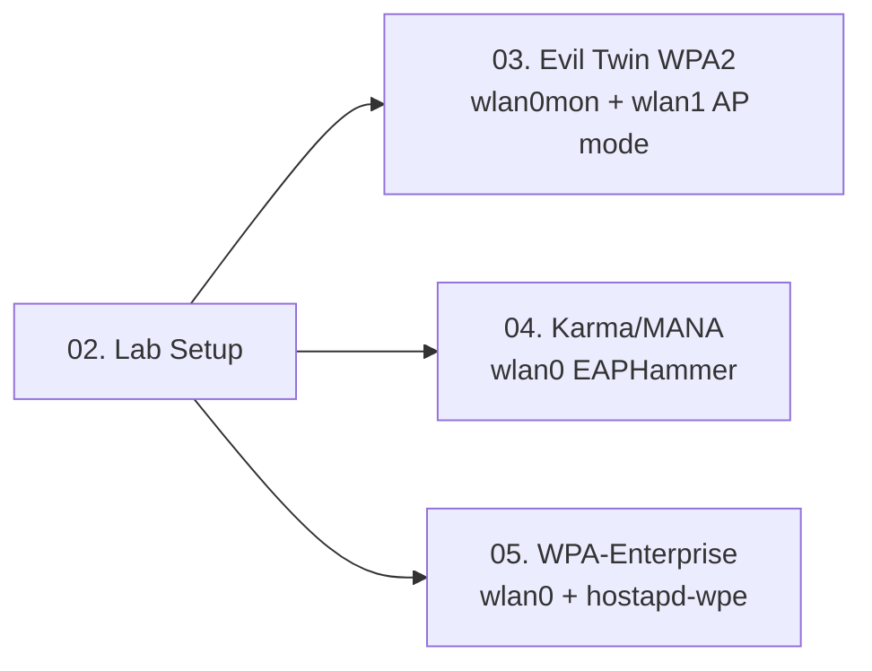

> **Prerequisites**: [[01-802.11-protocol-internals|01. 802.11 Protocol Internals & Wireless Attack Surface]]
> **Objectives**:
> - Chọn đúng wireless adapter cho pentesting
> - Setup monitor mode đúng cách, tránh conflicts
> - Nắm vững aircrack-ng suite cơ bản (airmon-ng, airodump-ng, aireplay-ng)
> - Thiết lập lab environment (Local VMs + HTB Academy)

---

## Động lực

Không có adapter đúng = không thể inject frames = không làm được Evil Twin hay deauth. Đây là bước kỹ thuật thuần túy nhưng cực kỳ quan trọng — nhiều pentesters mới bỏ qua phần này và tốn hàng giờ debug không cần thiết.

Lab environment đúng = reproduce được mọi attack trong bài. Thiếu một wireless card hỗ trợ monitor mode + injection là toàn bộ course này không thực hành được.

---

## Kiến trúc & Cơ chế

### Wireless Adapter Requirements

Không phải adapter nào cũng dùng được cho pentest. Yêu cầu bắt buộc:

**Monitor Mode** — capture tất cả 802.11 frames trong range, không cần associate với AP. Cần thiết cho airodump-ng, passive sniffing.

**Packet Injection** — inject arbitrary frames (deauth, probe responses). Cần thiết cho aireplay-ng, rogue AP attacks.

**AP Mode** — dùng adapter như một Access Point. Cần thiết cho hostapd, EAPHammer, dnsmasq.

> [!info] Chipsets được khuyến nghị
> Các chipset sau hỗ trợ đầy đủ monitor mode + injection + AP mode:
> - **Alfa AWUS036ACH** (RTL8812AU) — 2.4/5GHz, USB 3.0, hiệu suất cao, chuẩn dùng cho OSCP/CWPE
> - **Alfa AWUS036ACM** (MT7612U) — 2.4/5GHz, driver ổn định trong Kali
> - **Alfa AWUS036NHA** (AR9271) — 2.4GHz only, classic, driver built-in Kali
> - **TP-Link TL-WN722N v1** (AR9271) — giá rẻ, chỉ version 1 hỗ trợ injection

> [!warning] Adapter KHÔNG dùng được
> Built-in Intel/Broadcom WiFi thường KHÔNG hỗ trợ injection. Luôn dùng external USB adapter cho wireless pentest.

### Dual-Adapter Setup

Cho Evil Twin attack, cần **ít nhất 2 wireless adapters**:

- **wlan0** (monitor mode): Dùng cho airodump-ng (passive recon) và aireplay-ng (deauth injection)
- **wlan1** (AP mode): Dùng cho hostapd / EAPHammer tạo rogue AP

Cho post-connection MitM sau khi đã làm rogue AP, bettercap dùng wlan1 (interface của rogue AP network).

### Driver Installation (RTL8812AU)

```bash
# Kali Linux — install driver RTL8812AU
sudo apt update
sudo apt install -y dkms
git clone https://github.com/aircrack-ng/rtl8812au.git
cd rtl8812au
sudo make dkms_install

# Verify
sudo dmesg | grep rtl88
iwconfig  # xem wlan0, wlan1 xuất hiện
```

### Monitor Mode Setup

```bash
# Bước 1: Kill tiến trình gây conflict (NetworkManager, wpa_supplicant)
sudo airmon-ng check kill

# Bước 2: Enable monitor mode
sudo airmon-ng start wlan0

# Output: wlan0 → wlan0mon (hoặc mon0)
# Verify:
iwconfig wlan0mon
# Mode phải là: Mode:Monitor

# Bước 3 (alternative — manual): Nếu airmon-ng lỗi
sudo ip link set wlan0 down
sudo iwconfig wlan0 mode monitor
sudo ip link set wlan0 up
iwconfig wlan0  # verify Mode:Monitor
```

> [!tip] Sau khi xong — restore managed mode
> ```bash
> sudo airmon-ng stop wlan0mon
> sudo systemctl start NetworkManager
> ```

### Cài đặt Tools Cần Thiết

```bash
# aircrack-ng suite (thường có sẵn trong Kali)
sudo apt install -y aircrack-ng

# hostapd (cho rogue AP manual)
sudo apt install -y hostapd

# dnsmasq (DHCP + DNS server)
sudo apt install -y dnsmasq

# bettercap (MitM framework)
sudo apt install -y bettercap
# hoặc từ GitHub releases (latest):
# https://github.com/bettercap/bettercap/releases

# EAPHammer (WPA-Enterprise Evil Twin)
git clone https://github.com/s0lst1c3/eaphammer
cd eaphammer
sudo ./kali-setup

# nginx / python3 http.server (captive portal)
sudo apt install -y nginx

# hashcat (offline cracking)
sudo apt install -y hashcat
```

---

## Pentest Checklist — Lab Verification

Sau khi setup, kiểm tra từng item:

```
□ airmon-ng start wlan0 → wlan0mon xuất hiện, Mode:Monitor
□ airodump-ng wlan0mon → thấy APs và clients
□ wlan1 ở managed mode → dùng được với hostapd
□ aireplay-ng --test wlan0mon → injection test pass
□ EAPHammer --cert-wizard → gen cert thành công
□ bettercap -iface wlan1 → khởi động không lỗi
□ ip forwarding: cat /proc/sys/net/ipv4/ip_forward → 0 (bật khi cần)
```

### Local VM Lab Topology

Cấu hình được khuyến nghị cho Local VMs:

```
┌─────────────────────────────────────────────────────┐
│                   Host Machine                       │
│  ┌─────────────────┐    ┌─────────────────┐         │
│  │   Kali Linux VM  │    │  Victim VM       │         │
│  │  (Attacker)      │    │  (Windows/Linux) │         │
│  │                  │    │                  │         │
│  │  wlan0 → USB AP  │    │  WiFi via Host   │         │
│  │  eth0 → NAT/Host │    │  eth0 → HostOnly │         │
│  └─────────────────┘    └─────────────────┘         │
│                                                       │
│  USB Wireless Adapter (Alfa) → passthrough to Kali   │
└─────────────────────────────────────────────────────┘
```

**VMware setup**: Device → USB → Connect Alfa adapter to VM. Kali nhìn thấy adapter qua USB passthrough.

**VirtualBox setup**: Devices → USB → tick adapter. Tương tự.

> [!warning] Không dùng WiFi built-in của host cho injection
> Host machine WiFi card thường không support injection. Luôn dùng external USB adapter pass-through vào Kali VM.

### HTB Academy Lab Environment

HTB Academy có cloud-based wireless lab cho module *Wi-Fi Evil Twin Attacks*. Không cần adapter vật lý — toàn bộ wireless environment được simulate trong cloud.

Truy cập: `academy.hackthebox.com` → *Wi-Fi Penetration Tester* path → chọn module → Start Instance.

---

## Kết nối


