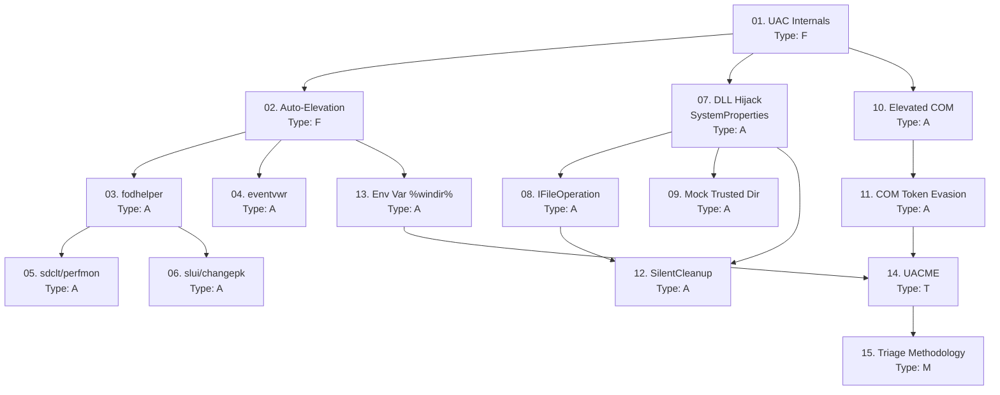

> **Course**: Windows UAC Bypass Techniques
> **Scope**: Toàn bộ các primitive và kỹ thuật bypass UAC — từ registry hijacking, DLL hijacking, COM object abuse, đến scheduled task và environment variable hijacking
> **Depth**: Advanced + OSCP/CPTS Exam-Focused
> **Lab**: HackTheBox + Local VMs (VMware/VirtualBox)
> **Estimated sessions**: 3 sessions × 5 lessons

---

## SVG Assets Plan

| SVG File | Lesson | Mô tả | Priority |
|----------|-------|-------|---------|
| `assets/img-01-uac-integrity-chain.svg` | [[01-uac-internals\|01. UAC Internals]] | Process integrity chain: Low → Medium → High → System + filtered token anatomy | H |
| `assets/img-02-autoelevation-decision.svg` | [[02-auto-elevation-mechanism\|02. Auto-Elevation]] | AppInfo service decision tree: manifest check → path check → signature check → elevate | H |
| `assets/img-07-dll-search-order.svg` | [[07-dll-hijack-systemproperties\|07. DLL Hijack]] | DLL search order + SystemPropertiesAdvanced.exe → srrstr.dll hijack path | M |

---

## Lesson Map

| # | Tên Lesson | Type | Phụ thuộc | Phase |
|---|-----------|------|----------|-------|
| 01 | [[01-uac-internals\|01. UAC Internals & Integrity Levels]] | F | — | Foundation |
| 02 | [[02-auto-elevation-mechanism\|02. Auto-Elevation Mechanism & Binary Whitelist]] | F | 01 | Foundation |
| 03 | [[03-registry-hijack-fodhelper\|03. Registry Hijack — fodhelper & computerdefaults]] | A | 01, 02 | Registry Hijacking |
| 04 | [[04-registry-hijack-eventvwr\|04. Registry Hijack — eventvwr (Fileless)]] | A | 01, 02 | Registry Hijacking |
| 05 | [[05-registry-hijack-sdclt-perfmon\|05. Registry Hijack — sdclt & perfmon]] | A | 03 | Registry Hijacking |
| 06 | [[06-registry-hijack-slui-changepk\|06. Registry Hijack — slui & changepk]] | A | 03 | Registry Hijacking |
| 07 | [[07-dll-hijack-systemproperties\|07. DLL Hijack — SystemPropertiesAdvanced]] | A | 01, 02 | DLL Hijacking |
| 08 | [[08-ifileoperation-dll-hijack\|08. IFileOperation Privileged File Copy + DLL Hijack]] | A | 07 | DLL Hijacking |
| 09 | [[09-mock-trusted-directories\|09. Mock Trusted Directories]] | A | 07 | DLL Hijacking |
| 10 | [[10-elevated-com-icmluautil-cmstp\|10. Elevated COM — ICMLuaUtil & CMSTP]] | A | 01, 02 | COM Object Abuse |
| 11 | [[11-com-token-security-evasion\|11. COM Token Security Attributes & Detection Evasion]] | A | 10 | COM Object Abuse |
| 12 | [[12-silentcleanup-task-hijack\|12. SilentCleanup Scheduled Task Hijack]] | A | 07, 08 | Scheduled Task |
| 13 | [[13-env-var-hijack-windir\|13. Environment Variable Hijack — %windir%]] | A | 01, 02 | Scheduled Task |
| 14 | [[14-uacme-framework\|14. UACME — UAC Bypass Framework]] | T | All | Tools |
| 15 | [[15-uac-triage-methodology\|15. UAC Bypass Triage Methodology + EDR Evasion]] | M | All | Methodology |
| A0 | [[fm-field-manual\|Field Manual]] | — | Tích lũy | — |

**Type legend**: F = Foundation · A = Attack · T = Tool · M = Methodology

---

## Dependency Graph

---

## Phase Breakdown

### Phase 1 — Foundation (Lessons 01–02)
**Mục tiêu**: Hiểu rõ UAC internals, integrity levels, và cơ chế auto-elevation trước khi tấn công.
**Lab**: Không cần lab — đọc và hiểu conceptually. Dùng `Process Hacker` để quan sát token integrity trực tiếp.

### Phase 2 — Registry Hijacking Family (Lessons 03–06)
**Mục tiêu**: Master tất cả registry hijack variants — đây là nhóm phổ biến nhất trong OSCP/CPTS.
**Lab**: Local Windows 10/11 VM (VMware) — test từng technique.

### Phase 3 — DLL Hijacking Family (Lessons 07–09)
**Mục tiêu**: Hiểu IFileOperation, search order, và mock directory tricks.
**Lab**: Local VM + HTB Arkham (SystemPropertiesAdvanced DLL hijack).

### Phase 4 — COM Object Abuse (Lessons 10–11)
**Mục tiêu**: Hiểu cơ chế elevated COM interface và token security attributes.
**Lab**: HTB Arkham (CMSTP bypass).

### Phase 5 — Scheduled Task & Env Var (Lessons 12–13)
**Mục tiêu**: Kỹ thuật work kể cả khi UAC = Always Notify.
**Lab**: Local VM với UAC set to Always Notify.

### Phase 6 — Tools & Methodology (Lessons 14–15)
**Mục tiêu**: Master UACME framework + xây dựng decision workflow cho exam.
**Lab**: Local VM — build UACME từ source, test methods.

---

## Progress Tracker

- [ ] 01. UAC Internals & Integrity Levels
- [ ] 02. Auto-Elevation Mechanism & Binary Whitelist
- [ ] 03. Registry Hijack — fodhelper & computerdefaults
- [ ] 04. Registry Hijack — eventvwr (Fileless)
- [ ] 05. Registry Hijack — sdclt & perfmon
- [ ] 06. Registry Hijack — slui & changepk
- [ ] 07. DLL Hijack — SystemPropertiesAdvanced
- [ ] 08. IFileOperation Privileged File Copy + DLL Hijack
- [ ] 09. Mock Trusted Directories
- [ ] 10. Elevated COM — ICMLuaUtil & CMSTP
- [ ] 11. COM Token Security Attributes & Detection Evasion
- [ ] 12. SilentCleanup Scheduled Task Hijack
- [ ] 13. Environment Variable Hijack — %windir%
- [ ] 14. UACME — UAC Bypass Framework
- [ ] 15. UAC Bypass Triage Methodology + EDR Evasion
- [ ] Field Manual complete

---

## Appendices

| File | Nội dung |
|------|---------|
| [[fm-field-manual\|Field Manual]] | Tài liệu tra cứu thực chiến — tích lũy từ tất cả lessons |
