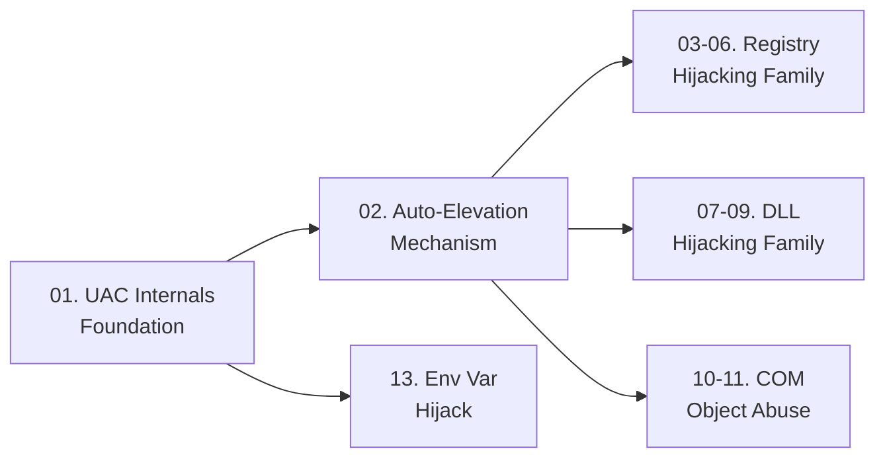

> **Prerequisites**: Không có — đây là bài đầu tiên
> **Objectives**:
> - Hiểu mô hình integrity level và filtered token trong Windows
> - Biết AppInfo service hoạt động như thế nào khi elevate
> - Xác định vị trí của attacker trong chuỗi token filtering
> - Chuẩn bị nền tảng conceptual cho toàn bộ UAC bypass techniques

---

## Động lực

Sau khi có shell trên Windows với tư cách local administrator, bạn thường gặp tình huống: quyền ghi vào `C:\Windows\System32` bị từ chối, không dump SAM database được, không inject vào process SYSTEM được — dù `whoami` ra đúng account admin.

Nguyên nhân: Windows đang chạy shell đó ở **Medium Integrity** với **filtered token** — một cơ chế gọi là User Account Control (UAC). Hiểu rõ cơ chế này là điều kiện tiên quyết để hiểu tại sao mỗi bypass technique lại hoạt động.

---

## Kiến trúc & Cơ chế

### Mandatory Integrity Control (MIC)

![[img-01-uac-integrity-chain.svg]]
*Hình 1: Integrity level chain và mối quan hệ giữa filtered token, AppInfo service, và bypass flow*

Windows gắn cho mỗi process (và mỗi securable object) một **Integrity Level** — còn gọi là Mandatory Label. Hệ thống có 4 mức chính:

| Integrity Level | SID | Ví dụ process |
|----------------|-----|--------------|
| System | S-1-16-16384 (0x4000) | lsass.exe, winlogon.exe |
| High | S-1-16-12288 (0x3000) | cmd.exe (elevated), regedit.exe (elevated) |
| Medium | S-1-16-8192 (0x2000) | cmd.exe (thông thường), explorer.exe |
| Low | S-1-16-4096 (0x1000) | Internet Explorer sandbox, browser tabs |

Quy tắc cơ bản của MIC: **process ở integrity thấp hơn không thể ghi vào object có integrity cao hơn**, kể cả khi có ACL permission.

### Token Splitting — Trái Tim của UAC

Khi user admin đăng nhập, Windows tạo ra **hai token** song song:

**Full Admin Token** chứa toàn bộ đặc quyền: Administrator SID enabled, `SeDebugPrivilege`, `SeImpersonatePrivilege`, `SeBackupPrivilege`... Integrity level là **High**.

**Filtered Token** là bản sao bị loại bỏ: Administrator group SID bị đặt `SE_GROUP_USE_FOR_DENY_ONLY`, hầu hết privilege bị loại, integrity level bị hạ xuống **Medium**.

> [!info] Filtered Token là default
> Khi bạn mở cmd.exe bình thường, nó chạy với Filtered Token — Medium Integrity. Bạn là admin trên máy nhưng cmd không có quyền admin thực sự. Đây là điểm attacker phải vượt qua.

Xác nhận integrity level hiện tại:

```powershell
# Xem integrity level của process hiện tại
whoami /groups | findstr "Mandatory Label"

# Output khi Medium:
# Mandatory Label\Medium Mandatory Level  Label  SE_GROUP_ENABLED

# Output khi High:
# Mandatory Label\High Mandatory Level  Label  SE_GROUP_ENABLED
```

### AppInfo Service — Gatekeeper của UAC

Khi một ứng dụng yêu cầu elevation (có `requestedExecutionLevel = requireAdministrator` trong manifest, hoặc bị Windows heuristic phát hiện cần quyền cao), quá trình xử lý diễn ra qua **AppInfo service** (`appinfo.dll`, chạy trong svchost.exe):

```text
User clicks "Run as administrator"
    ↓
AppInfo service nhận request
    ↓
Kiểm tra: manifest? path? signature?
    ↓
[Default UAC] Hiện consent.exe prompt → user click Yes
    ↓
AppInfo tạo elevated process với Full Admin Token
```

> [!note] Điểm mấu chốt
> UAC bypass không phải là "exploit" một lỗ hổng bảo mật theo nghĩa truyền thống. Đây là việc lạm dụng chính cơ chế Windows tự động elevate một số binary nhất định mà **không cần hỏi user**. Attacker chỉ cần làm cho elevated binary đó thực thi code của mình thay vì code hợp lệ.

### Consent Behavior — Levels của UAC

Registry key `HKLM\SOFTWARE\Microsoft\Windows\CurrentVersion\Policies\System`:

| `ConsentPromptBehaviorAdmin` | Ý nghĩa |
|----|---------|
| 0 | Không prompt, tự động elevate (UAC tắt thực tế) |
| 1 | Prompt trên secure desktop, yêu cầu credentials |
| 2 | Prompt trên secure desktop, chỉ Yes/No |
| **5** (default) | **Prompt cho non-Windows binary, không prompt cho Windows binary** |

Ở mức mặc định (5): Windows binary đã ký → tự động elevate, không hỏi. Đây là lý do tại sao `fodhelper.exe`, `eventvwr.exe`, `sdclt.exe` đều có thể tự nâng lên High Integrity mà không hiện prompt.

Kiểm tra nhanh:

```cmd
reg query HKLM\SOFTWARE\Microsoft\Windows\CurrentVersion\Policies\System /v ConsentPromptBehaviorAdmin
reg query HKLM\SOFTWARE\Microsoft\Windows\CurrentVersion\Policies\System /v EnableLUA
```

> [!warning] EnableLUA = 0
> Nếu `EnableLUA = 0`, UAC bị tắt hoàn toàn. Mọi process đều chạy với Full Admin Token. Không cần bypass gì cả — nhưng cũng dễ bị detect hơn.

---

## Góc nhìn kẻ tấn công

Khi có shell Medium Integrity, attacker nhìn thấy bức tranh này:

| Câu hỏi | Câu trả lời |
|---------|------------|
| User có trong Administrators group không? | Kiểm tra `whoami /groups` → tìm `BUILTIN\Administrators` |
| UAC đang ở mức nào? | `reg query` key trên — mức 5 là default, bypass được |
| Current integrity level? | `whoami /groups | findstr Mandatory Label` |
| Token có bị filter không? | `whoami /priv` — nếu thiếu SeDebugPrivilege → filtered |

**Điều kiện để UAC bypass hoạt động**: User phải ở trong Administrators group (hoặc equivalent) nhưng đang chạy ở Medium Integrity. Nếu user là standard user (không phải admin), không có UAC bypass nào hoạt động — đây là privilege escalation thực sự, cần exploit khác.

---

## Pentest Checklist

```text
□ Kiểm tra user có trong Administrators group: whoami /groups
□ Xác nhận integrity level hiện tại: whoami /groups | findstr "Mandatory Label"
□ Kiểm tra privileges hiện có: whoami /priv
□ Kiểm tra UAC level: reg query HKLM\..\Policies\System /v ConsentPromptBehaviorAdmin
□ Kiểm tra UAC enabled: reg query HKLM\..\Policies\System /v EnableLUA
□ Nếu EnableLUA=0: không cần bypass, đã full admin
□ Nếu user là standard user: UAC bypass không áp dụng, cần exploit khác
```

---

## Kết nối

Lesson này là nền tảng cho toàn bộ UAC bypass series:


