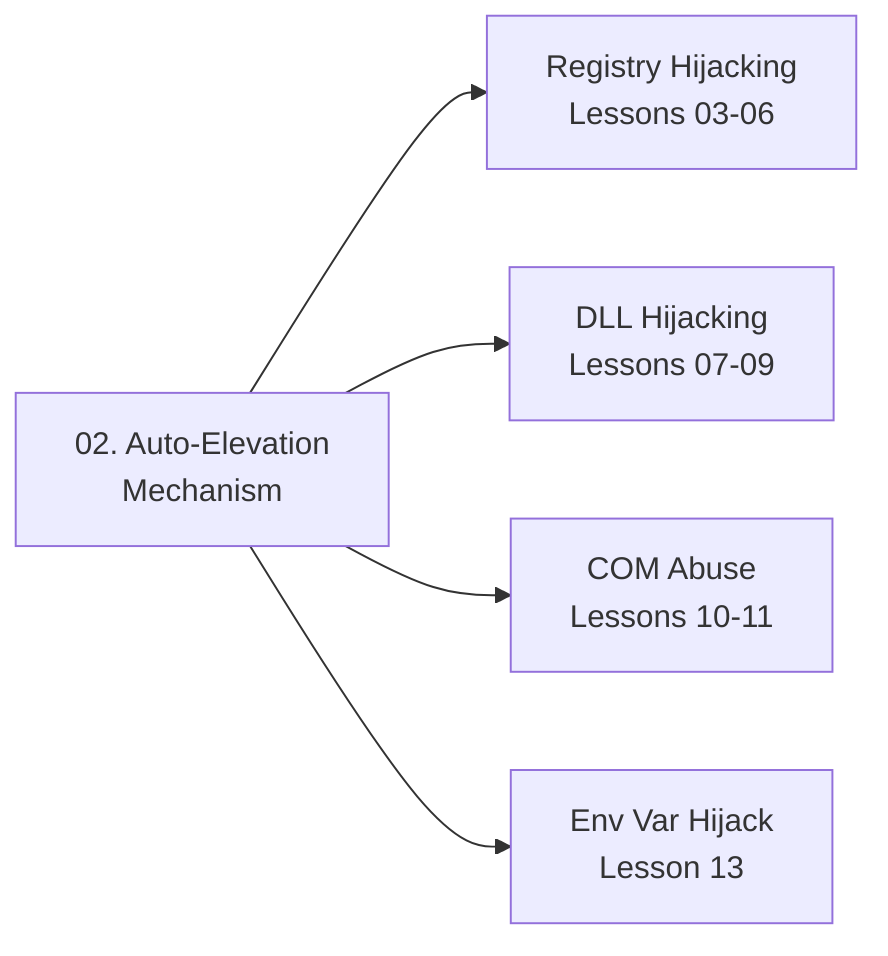

> **Prerequisites**: [[01-uac-internals|01. UAC Internals & Integrity Levels]]
> **Objectives**:
> - Hiểu cơ chế AppInfo service quyết định auto-elevation như thế nào
> - Biết manifest `autoElevate` flag có nghĩa gì và ai có thể đặt nó
> - Xác định whitelist các binary được auto-elevate
> - Hiểu tại sao attacker không thể tự đặt autoElevate vào binary của mình

---

## Động lực

Câu hỏi cốt lõi cho mọi UAC bypass: **tại sao `fodhelper.exe` tự nâng lên High Integrity mà không hỏi user?** Câu trả lời nằm trong cơ chế auto-elevation. Nếu không hiểu cơ chế này, bạn chỉ nhớ được công thức mà không thể improvise khi gặp môi trường lạ hay tìm ra technique mới.

---

## Kiến trúc & Cơ chế

### Manifest autoElevate Flag

![[img-02-autoelevation-decision.svg]]
*Hình 1: AppInfo service quyết định tree — từ elevation request đến auto-elevate hoặc UAC prompt*

Mỗi Windows executable có thể nhúng một XML **application manifest** xác định quyền yêu cầu:

```xml
<!-- Manifest bình thường — không yêu cầu elevation -->
<requestedExecutionLevel level="asInvoker" uiAccess="false"/>

<!-- Yêu cầu admin — sẽ hiện UAC prompt -->
<requestedExecutionLevel level="requireAdministrator" uiAccess="false"/>

<!-- AUTO-ELEVATE — tự elevate không cần prompt -->
<requestedExecutionLevel level="requireAdministrator" uiAccess="false"/>
<!-- + autoElevate=true trong assembly section -->
```

Xem manifest của một binary:

```powershell
# Dùng sigcheck (Sysinternals)
sigcheck -m C:\Windows\System32\fodhelper.exe

# Hoặc dùng Resource Hacker / binwalk
# Hoặc dùng PowerShell
$bytes = [System.IO.File]::ReadAllBytes("C:\Windows\System32\fodhelper.exe")
# Tìm chuỗi "autoElevate" trong bytes
[System.Text.Encoding]::ASCII.GetString($bytes) | Select-String "autoElevate"
```

> [!info] autoElevate trong thực tế
> `autoElevate` không phải là XML attribute chuẩn — nó là giá trị `true`/`false` được embed dưới dạng string trong phần assembly identity của manifest. AppInfo service parse giá trị này bằng custom parser, không phải standard XML parser.

### Ba Điều Kiện AppInfo Kiểm Tra

AppInfo service (`appinfo.dll`) thực hiện ba kiểm tra theo thứ tự:

**Kiểm tra 1 — Manifest flag**: Binary có `autoElevate=true` trong manifest không? Không có → dừng, hiện prompt.

**Kiểm tra 2 — Digital signature**: Binary có được ký bởi Microsoft Windows không (không chỉ Microsoft Corporation — phải là Windows Production PCA)? Không → dừng, hiện prompt.

**Kiểm tra 3 — Trusted path**: Binary có nằm trong trusted directory không?

```text
C:\Windows\
C:\Windows\System32\
C:\Windows\SysWOW64\
C:\Program Files\
C:\Program Files (x86)\
```

Chỉ khi **cả ba điều kiện** đều đúng thì binary được auto-elevate mà không có prompt.

### Tại Sao Attacker Không Thể Fake Điều Này?

Đây là câu hỏi quan trọng. Attacker không thể tự tạo binary thỏa mãn ba điều kiện vì:

- Không thể ký binary bằng chứng chỉ Microsoft Windows Production PCA (không có private key)
- Không thể ghi vào `C:\Windows\System32\` ở Medium Integrity (thiếu quyền)
- Fake manifest trong custom binary sẽ fail kiểm tra signature

**Vậy UAC bypass hoạt động như thế nào?** Thay vì tạo binary mới, attacker **khai thác binary đã có sẵn** trong whitelist — làm cho binary đó thực thi code của attacker thay vì code dự kiến.

### Danh Sách Binaries Phổ Biến Có autoElevate

Kiểm tra toàn bộ System32:

```powershell
# Liệt kê tất cả EXE trong System32 có autoElevate=true
Get-ChildItem C:\Windows\System32\*.exe | ForEach-Object {
    $content = [System.Text.Encoding]::ASCII.GetString(
        [System.IO.File]::ReadAllBytes($_.FullName)
    )
    if ($content -match "autoElevate.*true") {
        Write-Output $_.Name
    }
}
```

Kết quả điển hình:

| Binary | Technique phổ biến | Lesson |
|--------|------------------|--------|
| `fodhelper.exe` | Registry hijack ms-settings | [[03-registry-hijack-fodhelper\|03]] |
| `computerdefaults.exe` | Registry hijack ms-settings | [[03-registry-hijack-fodhelper\|03]] |
| `eventvwr.exe` | Registry hijack mscfile | [[04-registry-hijack-eventvwr\|04]] |
| `sdclt.exe` | Registry hijack IsolatedCommand | [[05-registry-hijack-sdclt-perfmon\|05]] |
| `perfmon.exe` | Registry hijack mscfile | [[05-registry-hijack-sdclt-perfmon\|05]] |
| `slui.exe` | Registry hijack exefile | [[06-registry-hijack-slui-changepk\|06]] |
| `SystemPropertiesAdvanced.exe` | DLL hijack srrstr.dll | [[07-dll-hijack-systemproperties\|07]] |
| `cmstp.exe` | COM interface abuse | [[10-elevated-com-icmluautil-cmstp\|10]] |
| `wsreset.exe` | Registry hijack AppX ProgID | Lesson 11 |

### Hardcoded Whitelist trong AppInfo

Ngoài manifest flag, AppInfo cũng có một **hardcoded whitelist** — danh sách binary mà service luôn auto-elevate bất kể manifest, vì các binary này được MS trust tuyệt đối. Danh sách này nằm trong `appinfo.dll` dưới dạng string literals.

```powershell
# Xem hardcoded list
$dll = [System.IO.File]::ReadAllBytes("C:\Windows\System32\appinfo.dll")
[System.Text.Encoding]::Unicode.GetString($dll) |
    Select-String "\.exe" | Select-Object -First 30
```

Điều này quan trọng vì một số binary được auto-elevate kể cả khi manifest không có `autoElevate` flag.

### COM Auto-Elevation

Ngoài binary, COM objects cũng có thể được auto-elevate thông qua registry key `Elevation\Enabled=1` dưới CLSID:

```text
HKLM\SOFTWARE\Classes\CLSID\{GUID}\Elevation
    Enabled = 1 (DWORD)
```

COM object có key này sẽ được AppInfo elevate khi được tạo từ Medium Integrity process. Đây là nền tảng của COM-based UAC bypass (Lesson 10).

---

## Góc nhìn kẻ tấn công

Mỗi khi muốn tìm technique mới, attacker làm theo quy trình này:

```text
1. Tìm binary có autoElevate=true trong manifest (hoặc hardcoded whitelist)
2. Chạy binary dưới Procmon → xem nó đọc registry/file gì
3. Tìm "NAME NOT FOUND" trong Procmon output → DLL hijack opportunity
4. Tìm HKCU registry read trước HKLM → registry hijack opportunity
5. Nếu đọc HKCU trước HKLM: plant command vào HKCU → binary thực thi
```

Đây chính xác là quy trình Matt Nelson và Matt Graeber dùng để phát hiện `eventvwr.exe` bypass năm 2016 — và quy trình này vẫn hoạt động để tìm techniques mới.

---

## Pentest Checklist

```text
□ Xác nhận UAC level: reg query ..\Policies\System /v ConsentPromptBehaviorAdmin
□ Liệt kê binaries autoElevate: Get-ChildItem System32 + grep autoElevate
□ Kiểm tra binary target có trong System32 không: Test-Path C:\Windows\System32\fodhelper.exe
□ Verify auto-elevation với Procmon: chạy binary → xem Event Log "Process Create" integrity
□ Tìm HKCU reads: chạy Procmon filter "Operation = RegQueryValue, Path contains HKCU"
□ Tìm NAME NOT FOUND DLL: chạy Procmon filter "Operation = CreateFile, Result = NAME NOT FOUND"
```

---

## Kết nối


