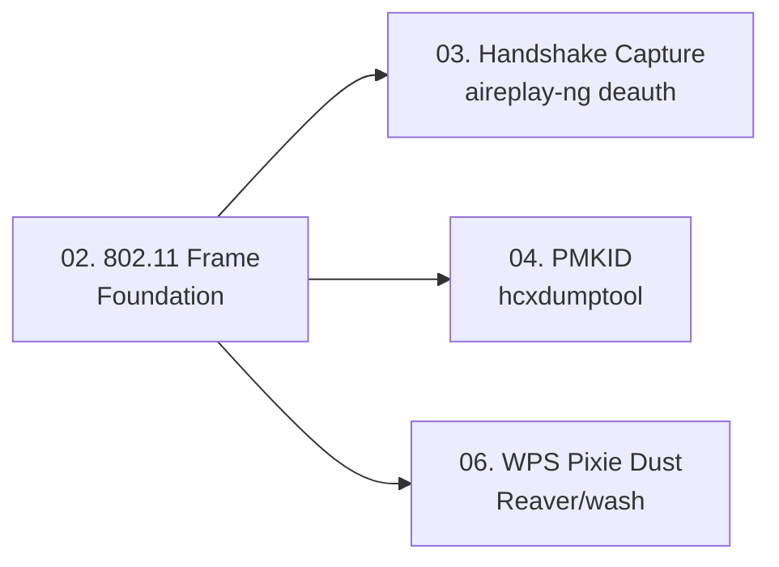

> **Prerequisites**: [[01-wpa2-cryptographic-foundations|01. WPA2-Personal Cryptographic Foundations]]
> **Objectives**:
> - Hiểu cấu trúc 802.11 MPDU frame và các field quan trọng với attacker
> - Phân biệt Management, Control, Data frames
> - Setup monitor mode đúng cách trên Kali Linux
> - Sử dụng airodump-ng để enumerate APs và identify targets

---

## Động lực

Mọi wireless attack đều bắt đầu từ ability to **capture raw 802.11 frames** — điều mà card WiFi bình thường không làm. Managed mode chỉ nhận frames gửi đến MAC của mình. Monitor mode nhận tất cả frames trên channel đó — bao gồm EAPOL handshakes của người khác, Beacon frames, deauth packets.

Hiểu frame structure giúp:
- Biết chính xác field nào chứa handshake data
- Parse Wireshark captures có chủ đích
- Viết custom frame injection (scapy)

---

## Kiến trúc & Cơ chế

### 802.11 Frame Categories

802.11 có 3 loại frame chính:

**Management Frames** — không được mã hóa (trừ khi 802.11w PMF):
- `Beacon` (type=0x08): AP broadcast thông tin mạng mỗi ~100ms
- `Probe Request/Response` (0x04/0x05): Client tìm kiếm mạng
- `Authentication` (0x0B): Bước xác thực Open System
- `Association Request/Response` (0x00/0x01): Client join AP
- `Deauthentication` (0x0C): Kick client — **không authenticate được** trong WPA2 không có PMF

**Control Frames** — low-level MAC coordination:
- `ACK`, `RTS`, `CTS`, `Block ACK`

**Data Frames** — payload thực sự:
- `Data` (0x20): Encrypted user data
- `QoS Data` (0x28): Data với Quality of Service priority
- `Null Function` (0x24): Keep-alive, không có payload

### 802.11 MPDU Frame Layout

![[img-02-80211-frame-structure.svg]]
*Hình 1: 802.11 MPDU layout và EAPOL frame structure với các field quan trọng cho attack*

**Frame Control field** (2 bytes) chứa:

```text
Bit  0-1:  Protocol version (luôn = 0)
Bit  2-3:  Type (00=Mgmt, 01=Ctrl, 10=Data)
Bit  4-7:  Subtype
Bit  8:    To DS
Bit  9:    From DS
Bit 11:    WEP (Protected Frame) — 1 nếu encrypted
Bit 12:    Order
```

**Address fields** — 4 địa chỉ MAC, ý nghĩa phụ thuộc To DS / From DS:

| To DS | From DS | Addr1 | Addr2 | Addr3 |
|-------|---------|-------|-------|-------|
| 0 | 0 | Dest | Src | BSSID |
| 0 | 1 | Dest | BSSID | Src |
| 1 | 0 | BSSID | Src | Dest |
| 1 | 1 | Receiver | Transmitter | Dest |

**CCMP Header** (khi encrypted):
```text
Byte 0:    PN0 (Packet Number — nonce low byte)
Byte 1:    PN1
Byte 2:    0x00 (reserved)
Byte 3:    Key ID || ExtIV=1
Byte 4-7:  PN2..PN5 (nonce high bytes)
```

> [!info] Nonce trong CCMP
> Packet Number (PN) là counter 48-bit tăng dần với mỗi packet. KRACK hoạt động bằng cách reset counter này về 0, cho phép keystream reuse.
>
### EAPOL Frame Breakdown

EAPOL (EtherType 0x888E) chứa handshake messages:

```text
EtherType:  0x888E (2 bytes)
Version:    0x01 hoặc 0x02 (1 byte)
Type:       0x03 = EAPOL-Key (1 byte)
Length:     (2 bytes)
Key Descriptor Type: 0x02 = RSN (1 byte)
Key Information:     (2 bytes) — chứa flags
Key Length:          (2 bytes)
Replay Counter:      (8 bytes) — prevent replay (KRACK bypass này)
Key Nonce:           (32 bytes) — ANonce hoặc SNonce
Key IV:              (16 bytes)
Key RSC:             (8 bytes)
Reserved:            (8 bytes)
Key MIC:             (16 bytes) — Message Integrity Code
Key Data Length:     (2 bytes)
Key Data:            (variable) — RSN IE, GTK, PMKID
```

### Monitor Mode Setup — Đúng cách

**Bước 1 — Kill interfering processes**

```bash
sudo airmon-ng check kill
# Kills NetworkManager, wpa_supplicant, dhclient
```

> [!warning] Bỏ qua bước này gây interference
> NetworkManager và wpa_supplicant sẽ gửi frames ngẫu nhiên, làm hỏng captures. Luôn kill trước.
>
**Bước 2 — Enable monitor mode**

```bash
sudo airmon-ng start wlan0
# Tạo interface wlan0mon (hoặc wlan0 tùy driver)

# Alternative: iw command (không dùng airmon-ng)
sudo ip link set wlan0 down
sudo iw wlan0 set monitor control
sudo ip link set wlan0 up
```

**Bước 3 — Verify**

```bash
iwconfig wlan0mon
# Expected: Mode:Monitor   Frequency:2.412 GHz  ...
```

**Bước 4 — Channel tuning**

```bash
# Lock vào channel cụ thể
sudo iwconfig wlan0mon channel 6

# Hoặc dùng iw
sudo iw dev wlan0mon set channel 6

# 5GHz channel
sudo iw dev wlan0mon set channel 36
```

### airodump-ng — Target Enumeration

```bash
# Scan tất cả channels
sudo airodump-ng wlan0mon

# Lock vào AP cụ thể (2.4GHz)
sudo airodump-ng -c 6 --bssid AA:BB:CC:DD:EE:FF -w capture wlan0mon

# 5GHz
sudo airodump-ng --band a wlan0mon

# Kết hợp 2.4 + 5GHz
sudo airodump-ng --band abg wlan0mon
```

**airodump-ng output interpretation:**

```text
BSSID              PWR  Beacons    #Data  #/s  CH  MB   ENC  CIPHER AUTH ESSID
AA:BB:CC:DD:EE:FF  -42       45      100   12   6  54e  WPA2 CCMP   PSK  TargetNet

BSSID              STATION            PWR   Rate    Lost    Frames  Notes
AA:BB:CC:DD:EE:FF  11:22:33:44:55:66  -55   48 -48     0       45
```

> [!note] Đọc output
> - `ENC: WPA2`, `CIPHER: CCMP`, `AUTH: PSK` → target là WPA2-Personal AES
> - `ENC: WPA`, `CIPHER: TKIP` → TKIP mode — KRACK impact catastrophic
> - `PWR: -42` → signal strength (absolute value nhỏ hơn = mạnh hơn)
> - STATION section: shows clients connected to AP
>
---

## Góc nhìn kẻ tấn công

Khi enumerate wireless targets, attacker tìm:

| Dấu hiệu | Ý nghĩa | Attack |
|---------|---------|--------|
| `ENC: WPA2, CIPHER: CCMP` | Cần crack passphrase | Handshake/PMKID |
| `ENC: WPA, CIPHER: TKIP` | TKIP mode | KRACK → MIC failure |
| WPS enabled (xem wash) | WPS protocol | Pixie Dust / PIN brute |
| Client connected | Có target client | Deauth + handshake capture |
| Không có client | No client available | PMKID clientless |

---

## Pentest Checklist

```bash
□ Card WiFi hỗ trợ monitor mode? (iwconfig, iw list)
□ Kill NetworkManager trước khi bật monitor mode
□ airodump-ng: xác nhận thấy Beacon frames của target
□ Note BSSID, Channel, ESSID, Cipher, Client MAC
□ WPS check: wash -i wlan0mon
□ Signal strength đủ mạnh? (PWR < -70 là yếu)
□ 5GHz support? (dùng --band a)
```

---

## Kết nối


