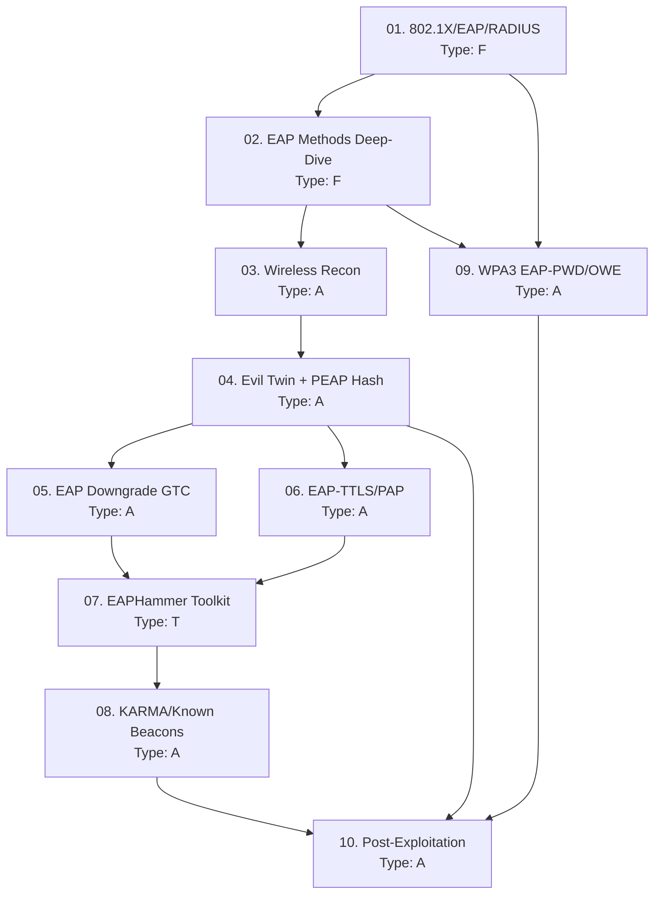

> **Course**: WPA2/WPA3 Enterprise Attacks — EAP, RADIUS & Evil Twin
> **Scope**: Toàn bộ attack chain từ wireless recon đến domain credential capture và post-exploitation
> **Depth**: Advanced + Exam-focused (CPTS/OSCP+)
> **Lab**: HTB Academy + Local VMs (Kali + hostapd-wpe environment)
> **Estimated sessions**: 3–4 sessions × 2–3 lessons

---

## SVG Assets Plan

| SVG File | Lesson | Mô tả | Priority |
|----------|-------|-------|---------|
| `assets/img-01-8021x-architecture.svg` | [[01-8021x-eap-radius-architecture\|01. 802.1X Architecture]] | Supplicant → AP → RADIUS 3-party auth flow với EAP exchange detail | H |
| `assets/img-02-eap-methods-tree.svg` | [[02-eap-methods-deep-dive\|02. EAP Methods]] | EAP method taxonomy với outer/inner auth layers và attack vectors | H |
| `assets/img-04-evil-twin-chain.svg` | [[04-evil-twin-rogue-radius-peap\|04. Evil Twin Attack]] | Evil Twin attack chain: Recon → Deauth → Rogue AP → Hash Capture | H |
| `assets/img-08-karma-pnl-flow.svg` | [[08-karma-known-beacons\|08. KARMA Attack]] | KARMA probe/respond cycle với PNL exploitation flow | M |

**Priority**: H = Cần thiết cho hiểu cơ chế · M = Tăng clarity · L = Nice-to-have

---

## Lesson Map

| # | Tên Lesson | Type | Phụ thuộc | Ước tính |
|---|-----------|------|----------|---------|
| 01 | [[01-8021x-eap-radius-architecture\|01. 802.1X / EAP / RADIUS Architecture]] | F | — | 1 session |
| 02 | [[02-eap-methods-deep-dive\|02. EAP Methods Deep-Dive]] | F | 01 | 1 session |
| 03 | [[03-wireless-recon-eap-fingerprinting\|03. Wireless Recon & EAP Fingerprinting]] | A | 01, 02 | 1 session |
| 04 | [[04-evil-twin-rogue-radius-peap\|04. Evil Twin: Rogue RADIUS + PEAP Hash Capture]] | A | 01, 02, 03 | 1 session |
| 05 | [[05-eap-downgrade-gtc-cleartext\|05. EAP Downgrade: GTC Cleartext Capture]] | A | 04 | 1 session |
| 06 | [[06-eap-ttls-pap-attack\|06. EAP-TTLS/PAP: Cleartext via Inner Auth]] | A | 04 | 1 session |
| 07 | [[07-eaphammer-toolkit\|07. EAPHammer Toolkit Mastery]] | T | 04, 05, 06 | 1 session |
| 08 | [[08-karma-known-beacons\|08. KARMA & Known Beacons Attack]] | A | 07 | 1 session |
| 09 | [[09-wpa3-eap-pwd-owe\|09. WPA3 Enterprise: EAP-PWD & OWE Attacks]] | A | 01, 02 | 1 session |
| 10 | [[10-post-exploitation-credential-reuse\|10. Post-Exploitation: Credential Reuse & Lateral Movement]] | A | 04–09 | 1 session |
| FM | [[fm-field-manual\|Field Manual]] | — | Tích lũy | — |

**Type legend**: F = Foundation · A = Attack · T = Tool · M = Methodology · H = Hybrid

---

## Dependency Graph

---

## Phase Breakdown

### Phase 1 — Foundation (Lessons 01–02)
**Mục tiêu**: Hiểu kiến trúc 802.1X và taxonomy của các EAP methods trước khi tấn công.
**Lab**: Không cần lab — đọc và hiểu conceptually, dùng Wireshark để xem EAP frames.

### Phase 2 — Core Attacks (Lessons 03–06)
**Mục tiêu**: Thực hành kỹ thuật tấn công chính: recon, evil twin, hash capture, EAP downgrade.
**Lab**: Local VM setup (Kali attacker + hostapd-wpe + victim client) · HTB Academy WiFi module.

### Phase 3 — Tools & Advanced Attacks (Lessons 07–09)
**Mục tiêu**: Master EAPHammer toolkit, KARMA attacks, WPA3 enterprise attacks.
**Lab**: HTB Academy "Attacking WPA3" module · Local VM lab.

### Phase 4 — Post-Exploitation (Lesson 10)
**Mục tiêu**: Khai thác captured credentials để lateral movement vào corporate network.
**Lab**: HTB Academy + bất kỳ AD machine nào (Resolute, Forest, Active...).

---

## Progress Tracker

- [ ] 01. 802.1X / EAP / RADIUS Architecture
- [ ] 02. EAP Methods Deep-Dive
- [ ] 03. Wireless Recon & EAP Fingerprinting
- [ ] 04. Evil Twin: Rogue RADIUS + PEAP Hash Capture
- [ ] 05. EAP Downgrade: GTC Cleartext Capture
- [ ] 06. EAP-TTLS/PAP: Cleartext via Inner Auth
- [ ] 07. EAPHammer Toolkit Mastery
- [ ] 08. KARMA & Known Beacons Attack
- [ ] 09. WPA3 Enterprise: EAP-PWD & OWE Attacks
- [ ] 10. Post-Exploitation: Credential Reuse & Lateral Movement
- [ ] Field Manual complete

---

## Appendices

| File | Nội dung |
|------|---------|
| [[fm-field-manual\|Field Manual]] | Tài liệu tra cứu thực chiến — tích lũy từ tất cả lessons |

---

## Study Notes

*Ghi chú thêm của người học — cập nhật trong quá trình học*
