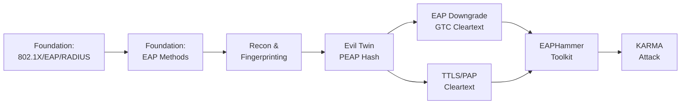

> **Prerequisites**: Không có — đây là bài học nền tảng đầu tiên
> **Objectives**:
> - Hiểu kiến trúc 3 thành phần của 802.1X (Supplicant, Authenticator, Authentication Server)
> - Nắm rõ vai trò của EAPOL, EAP, và RADIUS trong quá trình authentication
> - Xác định điểm yếu cơ bản khiến WPA-Enterprise dễ bị Evil Twin attack
> - Phân biệt WPA2-Personal (PSK) và WPA2-Enterprise (EAP/RADIUS) từ góc độ tấn công

---

## Động lực

WPA2-Enterprise được mặc định coi là "an toàn hơn" WPA2-Personal vì không có một PSK chung dễ crack. Tuy nhiên, kiến trúc phức tạp của nó tạo ra một attack surface hoàn toàn khác — và trong nhiều trường hợp, nguy hiểm hơn.

Attacker không attack PSK nữa — họ attack **client**, không phải AP. Mỗi user có credentials riêng (thường là domain credentials), và những credentials đó có thể capture được nếu client kết nối vào một Rogue AP. Một lần capture = một domain user account = entry point vào toàn bộ corporate network.

Không hiểu 802.1X flow = không hiểu tại sao Evil Twin attack hoạt động = không thể improvise khi gặp môi trường lạ.

---

## Kiến trúc & Cơ chế

### Ba thành phần của 802.1X

![[img-01-8021x-architecture.svg]]
*Hình 1: Kiến trúc 802.1X — Supplicant, Authenticator, và Authentication Server với EAP/RADIUS flow*

Chuẩn 802.1X định nghĩa một mô hình 3 thành phần (three-party model):

**Supplicant (Người yêu cầu truy cập)** là thiết bị của người dùng muốn kết nối vào network — laptop, smartphone, workstation. Supplicant chứa credentials (username/password hoặc certificate) và chạy một EAP client (built-in vào Windows, macOS, Linux, Android).

**Authenticator (Bộ xác thực)** là điểm truy cập (AP) trong wireless hoặc switch trong wired. Authenticator **không tự xác thực** — nó chỉ là relay trung gian, chuyển tiếp EAP messages giữa Supplicant và Authentication Server. Trong quá trình authentication, AP giữ port ở trạng thái "uncontrolled" (chỉ cho phép EAP traffic) cho đến khi authentication thành công.

**Authentication Server (RADIUS Server)** là nơi thực sự quyết định "accept" hay "reject". Thông thường là FreeRADIUS, Microsoft NPS (Network Policy Server), hoặc Cisco ISE. Server này có database credentials của tất cả users và biết EAP method nào được phép.

> [!info] Tại sao AP không tự xác thực?
> Thiết kế này giúp network admin tập trung quản lý credentials ở một nơi (RADIUS server), thay vì phải cấu hình credentials trên từng AP riêng lẻ. Trong doanh nghiệp lớn có hàng trăm APs, đây là yêu cầu bắt buộc.

### EAPOL — EAP over LAN

Giao tiếp giữa Supplicant và Authenticator (AP) sử dụng **EAPOL** (Extensible Authentication Protocol over LAN), được định nghĩa trong IEEE 802.1X. EAPOL chạy trực tiếp trên data link layer (Layer 2), không cần IP address.

Các EAPOL message types quan trọng:

| Message Type | Direction | Ý nghĩa |
|-------------|-----------|---------|
| EAPOL-Start | Client → AP | Client thông báo muốn bắt đầu authentication |
| EAP-Request/Identity | AP → Client | AP yêu cầu identity của client |
| EAP-Response/Identity | Client → AP | Client gửi identity (có thể là "anonymous") |
| EAP-Request (method) | AP → Client | AP đề xuất EAP method cụ thể |
| EAPOL-Logoff | Client → AP | Client kết thúc session |

### RADIUS — Giao tiếp AP và Auth Server

Sau khi nhận EAPOL từ client, AP đóng gói EAP payload vào **RADIUS Access-Request** và gửi đến RADIUS server qua UDP port 1812. RADIUS server xử lý và trả về:

- **Access-Accept**: Authentication thành công → AP mở port
- **Access-Reject**: Sai credentials → AP giữ port đóng
- **Access-Challenge**: Server cần thêm thông tin (ví dụ: gửi challenge để client phản hồi)

> [!note] RADIUS Shared Secret
> AP và RADIUS Server chia sẻ một **shared secret** để xác thực lẫn nhau tại Layer RADIUS. Nếu attacker capture được shared secret (ví dụ từ AP config backup), họ có thể tạo rogue RADIUS responses. Tuy nhiên, đây không phải attack phổ biến — Evil Twin dễ hơn nhiều.

### EAP Authentication Flow — Full Picture

```
Supplicant (Client)         Authenticator (AP)       Auth Server (RADIUS)
       |                           |                         |
       |<-- EAP-Request/Identity --|                         |
       |-- EAP-Response/Identity ->|                         |
       |                           |-- RADIUS Access-Req  -->|
       |                           |<- RADIUS Access-Chall --|
       |<-- EAP-Request (Method) --|                         |
       |                           |                         |
       |  [EAP Method Exchange — có thể nhiều round-trips]   |
       |                           |                         |
       |-- EAP-Response (Auth) --->|                         |
       |                           |-- RADIUS Access-Req  -->|
       |                           |<- RADIUS Access-Accept -|
       |<-- EAP-Success -----------|                         |
       |                           |                         |
       |  [4-Way Handshake — PMK derived từ EAP session]    |
       |<========= Encrypted Data Session =================>|
```

### 4-Way Handshake trong WPA2-Enterprise

Khác với WPA2-Personal nơi PMK (Pairwise Master Key) được derive từ PSK, trong WPA2-Enterprise PMK được derive từ **EAP session key** (MSK — Master Session Key) do RADIUS server tạo ra sau authentication thành công.

| | WPA2-Personal | WPA2-Enterprise |
|-|--------------|----------------|
| PMK source | Derived từ PSK + SSID | Derived từ EAP MSK |
| Ai biết PMK | Tất cả clients + AP | Chỉ RADIUS + client đó |
| Crack handshake? | Có thể (offline) | **Không thể** (PMK unique mỗi session) |

> [!warning] Điểm khác biệt then chốt với PSK
> Vì PMK unique mỗi session và chỉ RADIUS server tạo ra, attacker **không thể crack 4-way handshake** của WPA2-Enterprise như WPA2-Personal. Attack vector phải hoàn toàn khác: thay vì capture handshake, attacker phải **steal credentials trong quá trình EAP auth** — đây là lý do Evil Twin attack tồn tại.

---

## Góc nhìn kẻ tấn công

WPA2-Enterprise tạo ra attack surface hoàn toàn mới:

| Attack Vector | Điều kiện | Lesson liên quan |
|--------------|-----------|-----------------|
| **Evil Twin / Rogue AP** | Client không validate server cert | [[04-evil-twin-rogue-radius-peap\|04. Evil Twin]] |
| **EAP Downgrade** | Server cho phép weak inner auth | [[05-eap-downgrade-gtc-cleartext\|05. GTC Downgrade]] |
| **EAP-TTLS/PAP** | Inner auth là PAP (cleartext) | [[06-eap-ttls-pap-attack\|06. TTLS/PAP]] |
| **KARMA Attack** | Client probe cho known networks | [[08-karma-known-beacons\|08. KARMA]] |
| **EAP Spray** | Large user base với weak passwords | [[07-eaphammer-toolkit\|07. EAPHammer]] |
| **WPA3 EAP-PWD** | Dragonblood side-channel | [[09-wpa3-eap-pwd-owe\|09. WPA3 EAP-PWD]] |

**Insight quan trọng nhất**: Trong WPA2-Enterprise, attacker không attack AP hay RADIUS server trực tiếp. Attacker **impersonates AP** và dụ client kết nối vào Rogue AP, để steal credentials trong quá trình EAP exchange. Client là target thực sự.

---

## Pentest Checklist

Khi enumerate một WPA2-Enterprise network trong engagement:

```
□ Xác nhận AUTH type = MGT trong airodump-ng output (cột AUTH)
□ Capture EAP handshake bằng Wireshark → xác định EAP method (PEAP? TTLS? TLS?)
□ Kiểm tra identity field trong EAP-Response/Identity → có thể leak username format
□ Kiểm tra outer identity — có dùng "anonymous@domain" để ẩn username không?
□ Xác định certificate validation behavior của clients (quan sát handshake timing)
□ Enumerate clients đang kết nối (MAC addresses) → có thể dùng cho targeted deauth
□ Ghi lại channel, BSSID, SSID → cần để setup Evil Twin chính xác
□ Kiểm tra có WPA3 transition mode không → có thể bị downgrade
```

---

## Kết nối

Lesson này là foundation cho toàn bộ attack chain:


