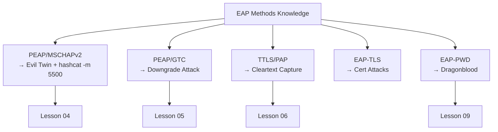

> **Prerequisites**: [[01-8021x-eap-radius-architecture|01. 802.1X / EAP / RADIUS Architecture]]
> **Objectives**:
> - Hiểu cơ chế outer/inner authentication của các EAP methods phổ biến
> - Biết method nào capture được gì (cleartext vs hash vs không được gì)
> - Xác định target EAP method dựa trên pcap analysis
> - Chuẩn bị knowledge base cho tất cả attack lessons tiếp theo

---

## Động lực

EAP là một "framework" — nó không tự định nghĩa authentication mechanism mà cho phép nhiều "methods" khác nhau chạy bên trong. Attacker phải biết method nào đang được dùng để chọn đúng attack vector.

Biết target network dùng **PEAP/MSCHAPv2** → attack để capture NetNTLMv1 hash → crack với hashcat mode 5500.
Biết target dùng **EAP-TTLS/PAP** → attack để capture **cleartext password** ngay lập tức.
Biết target dùng **EAP-TLS** → không có credential để steal, phải tìm hướng khác.

Lesson này là "cheat sheet" để đọc pcap và biết ngay phải làm gì.

---

## Kiến trúc & Cơ chế

### EAP Methods Taxonomy

![[img-02-eap-methods-tree.svg]]
*Hình 2: EAP method taxonomy — outer/inner authentication layers và attack value của từng method*

### PEAP — Protected Extensible Authentication Protocol

**PEAP** (Protected EAP) bọc inner authentication trong một TLS tunnel. Quá trình có **2 phases**:

**Phase 1 (Outer Authentication — TLS Handshake)**

Server gửi certificate đến client. Client kiểm tra cert (hoặc không — đây là attack point). Sau khi TLS handshake hoàn tất, một encrypted tunnel được thiết lập.

**Phase 2 (Inner Authentication — bên trong TLS tunnel)**

Bên trong tunnel, một EAP method thứ hai chạy. Inner method phổ biến nhất là **MSCHAPv2**:

```
[TLS Tunnel]
  ├── Server → Client: EAP-Request/Identity (inner)
  ├── Client → Server: EAP-Response/Identity (real username, vì đã trong tunnel)
  ├── Server → Client: MS-CHAPv2 Challenge (16-byte random nonce)
  └── Client → Server: MS-CHAPv2 Response (NT hash của password XOR với challenge)
```

> [!warning] Attack Point — PEAP Phase 2
> Challenge và Response trong MSCHAPv2 là **NetNTLMv1** format. Attacker capture được pair này từ Rogue RADIUS server → crack offline với `hashcat -m 5500`. Không cần phá TLS — Rogue AP chính là TLS endpoint.

**PEAP Variants:**

| Inner Method | Hashcat Mode | Attack Value |
|-------------|-------------|-------------|
| MSCHAPv2 | -m 5500 (NetNTLMv1) | Crack offline |
| GTC (Generic Token Card) | N/A | **Cleartext password** |
| EAP-TLS (inner) | N/A | Certificate-based, không crack được |

> [!danger] GTC Downgrade = Jackpot
> Nếu Rogue RADIUS server negotiate được **PEAP/GTC** thay vì PEAP/MSCHAPv2, client gửi **plaintext password** bên trong tunnel. Không cần crack — password hiện ra ngay.

### EAP-TTLS — Tunneled TLS

**EAP-TTLS** tương tự PEAP nhưng flexible hơn ở inner authentication. Inner auth không nhất thiết phải là EAP — có thể dùng legacy protocols:

| Inner Protocol | Security | Attack Value |
|---------------|---------|-------------|
| PAP | **Cleartext trong tunnel** | **Cleartext password** |
| CHAP | Hashed với MD5 | Crack với MD5 |
| MSCHAP | Single DES | Crack nhanh |
| MSCHAPv2 | NetNTLMv1 | hashcat -m 5500 |
| EAP-MSCHAPv2 | NetNTLMv1 | hashcat -m 5500 |

> [!danger] EAP-TTLS/PAP = Worst Case for Defender
> Nhiều legacy enterprise systems (đặc biệt older Cisco, Juniper deployments) dùng TTLS/PAP vì PAP đơn giản để implement. Attacker setup Rogue RADIUS chấp nhận PAP → password gửi cleartext trong TLS tunnel của attacker.

**TTLS vs PEAP flow:**

```
PEAP:  TLS Tunnel → [EAP-MSCHAPv2 inside]
TTLS:  TLS Tunnel → [RADIUS AVPs inside — PAP/CHAP/MSCHAP/MSCHAPv2]
```

EAP-TTLS không yêu cầu client certificate (optional). Server certificate vẫn required.

### EAP-TLS — Mutual Certificate Authentication

**EAP-TLS** là method an toàn nhất và hardest to attack:

```
Phase 1: Server presents cert → Client validates
Phase 2: Client presents cert → Server validates (mutual auth)
[No password exchange — pure PKI]
```

**Từ góc độ attacker**: EAP-TLS không có credentials để steal vì authentication hoàn toàn bằng certificates. Tuy nhiên:

- Nếu client cert private key bị compromise → impersonate client
- Client có thể không properly validate server cert → Evil Twin vẫn hoạt động nhưng không có credentials để capture
- Certificate pinning bypass là attack surface trong EAP-TLS environments

> [!tip] Indicator trong Wireshark
> EAP-TLS: packet `Certificate` xuất hiện theo cả hai chiều (client và server đều gửi cert). PEAP/TTLS: chỉ server gửi cert.

### EAP-FAST — Flexible Authentication via Secure Tunneling

**EAP-FAST** (Cisco proprietary, RFC 4851) dùng một **PAC (Protected Access Credential)** thay vì certificate để establish tunnel:

- Phase 0: PAC provisioning (có thể anonymous — đây là attack surface)
- Phase 1: TLS tunnel using PAC
- Phase 2: Inner EAP (thường là MSCHAPv2 hoặc GTC)

> [!note] EAP-FAST Attack Vector
> Anonymous PAC provisioning cho phép attacker receive PAC mà không cần authenticate → establish rogue tunnel. Ít phổ biến hơn PEAP/TTLS trong môi trường modern.

### EAP-PWD — Password-Based Authentication

**EAP-PWD** (RFC 5931) dùng Dragonfly key exchange (giống SAE trong WPA3) để authenticate bằng password mà không bao giờ gửi password hoặc hash trực tiếp. Được dùng trong WPA3-Enterprise với EAP-PWD.

**Dragonblood vulnerabilities (2019)**: Side-channel timing attacks cho phép offline dictionary attack. Chi tiết trong [[09-wpa3-eap-pwd-owe|Lesson 09]].

### Identity Hiding (Outer vs Inner Identity)

Trong PEAP và EAP-TTLS, Phase 1 identity thường là **anonymous** hoặc `anonymous@domain.com` để bảo vệ username khỏi bị sniff trên air. Real identity chỉ gửi inside TLS tunnel (Phase 2).

**Attacker implication**: Rogue RADIUS server receive real identity (real username) trong Phase 2 — vì client tin tưởng Rogue AP là legitimate server. Đây là double win: vừa capture username vừa capture credentials.

---

## Góc nhìn kẻ tấn công

**Decision flowchart nhanh sau khi identify EAP method từ pcap:**

| EAP Method detected | Inner Auth | Attack |
|--------------------|-----------|--------|
| PEAP | MSCHAPv2 | Evil Twin → NetNTLMv1 → hashcat -m 5500 |
| PEAP | GTC | Evil Twin + GTC Downgrade → cleartext |
| EAP-TTLS | PAP | Evil Twin → cleartext password |
| EAP-TTLS | MSCHAPv2 | Evil Twin → NetNTLMv1 → hashcat -m 5500 |
| EAP-TLS | (mutual cert) | Không có cred → look for cert misconfig |
| EAP-FAST | MSCHAPv2 | Rogue PAC provisioning → inner auth capture |
| EAP-PWD | (dragonfly) | Side-channel → offline dict |
| LEAP | MD5 | asleap → crack MD5 (deprecated) |

**Fingerprinting từ pcap** — 3 cách xác định EAP method:

1. **EAP-Type field**: Wireshark hiển thị trong `Extensible Authentication Protocol → Type`. PEAP = 25, EAP-TTLS = 21, EAP-TLS = 13, EAP-PWD = 52.
2. **Certificate presence**: Chỉ server cert? → PEAP/TTLS. Hai certs? → EAP-TLS.
3. **Identity format**: `anonymous@corp.com` trong Phase 1 → PEAP/TTLS. Real username ngay từ đầu → EAP-MD5/LEAP.

---

## Pentest Checklist

```
□ Capture EAP exchange với airodump-ng + Wireshark
□ Filter Wireshark: eap (để xem EAP frames)
□ Xem EAP Type trong packet: Type 25 (PEAP), 21 (TTLS), 13 (TLS), 52 (PWD)
□ Kiểm tra outer identity field — ghi lại domain format
□ Kiểm tra TLS record — có thấy Certificate message không?
□ Nếu PEAP: xem inner EAP Type sau khi TLS established
□ Ghi lại: EAP method, inner method, domain format → chọn attack vector
□ Kiểm tra expiry của server cert (nếu đã hết hạn → easier to trick clients)
```

---

## Kết nối


