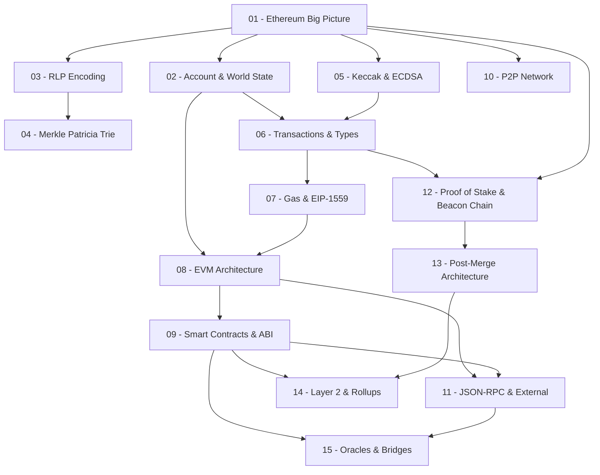

> **Topic**: Ethereum Architecture
> **Domain**: IT / Blockchain Systems
> **Level**: Beginner → Intermediate
> **Background**: Lập trình Python/JS cơ bản, hash/signature/PKI
> **Tools / Code**: Python (web3.py, eth_abi), JavaScript (ethers.js)
> **Sources**: ethereum.org docs, Ethereum Yellow Paper, go-ethereum source, devp2p specs

---

## Lessons

| # | Title | Key Concepts | Prerequisites | Difficulty |
|---|-------|-------------|---------------|------------|
| **Module 0 — Foundations** |||||
| 01 | Ethereum — Big Picture & Design Philosophy | Blockchain vs World Computer, accounts, state, nodes/clients, lịch sử post-Merge | — | ★☆☆☆☆ |
| 02 | Account Model & World State | EOA vs Contract Account, nonce/balance/code/storage, state transition function | 01 | ★★☆☆☆ |
| **Module 1 — Data Structures** |||||
| 03 | RLP Encoding | RLP algorithm, encode bytes/lists, use cases trong Ethereum | 01 | ★★☆☆☆ |
| 04 | Merkle Patricia Trie | Trie variants, node types (leaf/extension/branch), State Trie / Tx Trie / Receipt Trie | 03 | ★★★☆☆ |
| **Module 2 — Cryptography Nền Tảng** |||||
| 05 | Keccak-256, ECDSA & Ethereum Addresses | secp256k1, address derivation, transaction signing, EIP-155 replay protection | 01 | ★★☆☆☆ |
| **Module 3 — Transactions & Gas** |||||
| 06 | Transaction Lifecycle & Types | Legacy / EIP-1559 / EIP-4844 (blob tx), mempool, propagation, inclusion flow | 02, 05 | ★★★☆☆ |
| 07 | Gas Model & EIP-1559 | Gas limit, base fee, priority fee, fee burning, EIP-1559 fee market | 06 | ★★★☆☆ |
| **Module 4 — Execution Layer: EVM** |||||
| 08 | EVM Architecture | Stack machine, memory, storage, opcodes, program counter, execution context | 02, 07 | ★★★☆☆ |
| 09 | Smart Contracts, ABI & Logs | Bytecode/ABI, function selector, calldata encoding, events & logs, DELEGATECALL | 08 | ★★★☆☆ |
| **Module 5 — Networking & External Interaction** |||||
| 10 | P2P Network Layer | devp2p, ENR, discv5, RLPx handshake, Ethereum Wire Protocol, libp2p (consensus layer) | 01 | ★★★☆☆ |
| 11 | JSON-RPC & External Interaction | eth_* / net_* API, web3.py/ethers.js, WebSocket subscriptions, event polling | 08, 09 | ★★☆☆☆ |
| **Module 6 — Consensus Layer** |||||
| 12 | Proof of Stake & Beacon Chain | Validators, staking, slots/epochs, attestations, LMD-GHOST, Casper FFG | 01, 06 | ★★★★☆ |
| 13 | Post-Merge Architecture | Engine API, payload building, fork choice, finality, MEV-Boost overview | 12 | ★★★★☆ |
| **Module 7 — Scalability & Interoperability** |||||
| 14 | Layer 2 & Rollup Architecture | Optimistic Rollup, ZK-Rollup, sequencer, data availability, EIP-4844 blobs | 09, 13 | ★★★★☆ |
| 15 | Oracles & Cross-chain Bridges | Oracle problem, Chainlink, push/pull oracle, bridge types, trust models | 09, 11 | ★★★☆☆ |

## Appendix Candidates

| ID | Content | Liên quan |
|----|---------|-----------|
| A0 | Ethereum Clients Reference | Geth, Nethermind, Reth (execution); Lighthouse, Prysm (consensus) — cấu hình, so sánh |
| A1 | EIP Cheatsheet | EIP-155, 1559, 4844, 4337, 2718, 1167 — tóm tắt từng EIP quan trọng |

---

## Dependency Graph

---

## Deep-Dive Topics (sau khi hoàn thành course)

Sau 15 lessons, bạn có nền tảng vững để tiếp tục theo bất kỳ hướng nào:

1. **Smart Contract Security & Auditing** — reentrancy, integer overflow, access control, formal verification
2. **ZK-Rollup Internals** — PLONK/STARK circuits, proving systems, on-chain verifier contract
3. **MEV (Maximal Extractable Value)** — arbitrage, sandwich attacks, Flashbots, Proposer-Builder Separation
4. **Account Abstraction (ERC-4337)** — UserOperation, Bundler, Paymaster, EntryPoint contract
5. **Solidity Internals & Yul/Assembly** — storage layout, inline assembly, gas optimization patterns
6. **DeFi Protocol Architecture** — AMM (Uniswap v2/v3), lending (Aave), stablecoin (MakerDAO)
7. **Cross-chain Interoperability** — IBC, LayerZero, Wormhole — trust models & security tradeoffs
8. **Ethereum Client Internals** — đọc source Geth/Reth, contributing to execution clients
9. **Ethereum Yellow Paper Deep Dive** — formal state transition function, đọc spec chính thức

---

## Progress Tracker

- [ ] [[00-roadmap|00. Roadmap]]
- [ ] [[01-ethereum-big-picture|01. Ethereum — Big Picture & Design Philosophy]]
- [ ] [[02-account-model-world-state|02. Account Model & World State]]
- [ ] [[03-rlp-encoding|03. RLP Encoding]]
- [ ] [[04-merkle-patricia-trie|04. Merkle Patricia Trie]]
- [ ] [[05-keccak-ecdsa-addresses|05. Keccak-256, ECDSA & Ethereum Addresses]]
- [ ] [[06-transaction-lifecycle|06. Transaction Lifecycle & Types]]
- [ ] [[07-gas-model-eip1559|07. Gas Model & EIP-1559]]
- [ ] [[08-evm-architecture|08. EVM Architecture]]
- [ ] [[09-smart-contracts-abi-logs|09. Smart Contracts, ABI & Logs]]
- [ ] [[10-p2p-network-layer|10. P2P Network Layer]]
- [ ] [[11-json-rpc-external-interaction|11. JSON-RPC & External Interaction]]
- [ ] [[12-proof-of-stake-beacon-chain|12. Proof of Stake & Beacon Chain]]
- [ ] [[13-post-merge-architecture|13. Post-Merge Architecture]]
- [ ] [[14-layer2-rollup-architecture|14. Layer 2 & Rollup Architecture]]
- [ ] [[15-oracles-bridges|15. Oracles & Cross-chain Bridges]]
- [ ] [[a0-ethereum-clients-reference|A0. Ethereum Clients Reference]]
- [ ] [[a1-eip-cheatsheet|A1. EIP Cheatsheet]]
