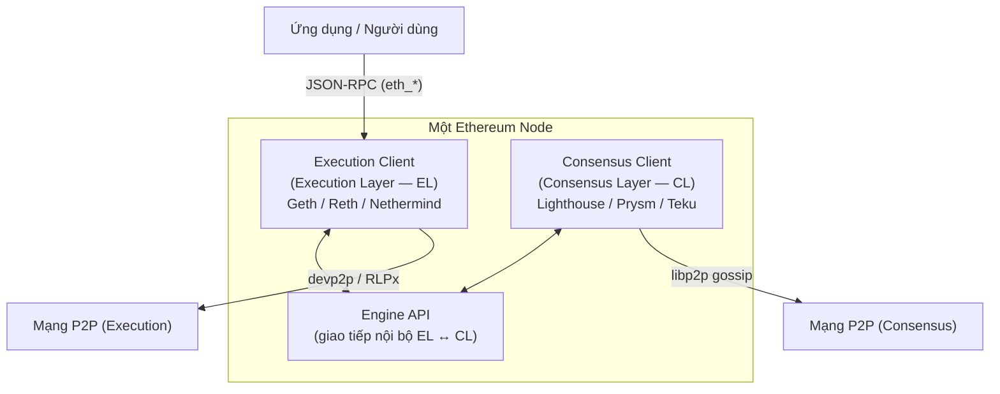

> **Prerequisites**: Không có — đây là bài đầu tiên. Biết hash function (SHA-256, Keccak) ở mức khái niệm là lợi thế.
> **Objectives**:
> - Hiểu Ethereum giải quyết vấn đề gì và tại sao nó ra đời
> - Phân biệt Ethereum với Bitcoin ở cấp kiến trúc
> - Nắm kiến trúc tổng quan: node, client, execution layer, consensus layer
> - Biết các khái niệm nền tảng: state, account, transaction, block, gas
> - Hiểu lịch sử từ PoW sang PoS (The Merge) và ý nghĩa kiến trúc

---

## Motivation

Năm 2008, Bitcoin ra đời và chứng minh rằng một mạng lưới phi tập trung (decentralized network) có thể duy trì một sổ cái (ledger) chung mà không cần bất kỳ bên thứ ba nào. Nhưng Bitcoin chỉ làm được một việc: chuyển tiền (transfer value).

Năm 2013, Vitalik Buterin — khi đó 19 tuổi — đặt câu hỏi: **Điều gì xảy ra nếu blockchain không chỉ chạy một ứng dụng cố định, mà là một máy tính lập trình được?** Thay vì hard-code logic "chuyển Bitcoin từ A sang B", tại sao không để người dùng tự viết bất kỳ chương trình nào và chạy nó trên blockchain?

Đây là ý tưởng cốt lõi của Ethereum: một **World Computer** — một máy tính phi tập trung, không ai sở hữu, không thể tắt, và mọi người có thể lập trình trên đó.

---

## Concept: Ethereum là gì?

> [!definition] Definition 1.1 — Ethereum
> Ethereum là một **nền tảng blockchain lập trình được** (programmable blockchain platform). Nó là một mạng máy tính phân tán toàn cầu duy trì một **trạng thái chung** (shared state) và cho phép bất kỳ ai triển khai và chạy **smart contract** — các chương trình tự thực thi được lưu trực tiếp trên blockchain.

Hãy tưởng tượng Ethereum như một chiếc máy tính mà:
- Không ai có thể tắt nó (decentralized — chạy trên hàng nghìn node trên toàn thế giới)
- Mọi người đều có thể đọc trạng thái của nó (transparent)
- Không ai có thể sửa lịch sử đã ghi (immutable)
- Bất kỳ ai cũng có thể viết chương trình chạy trên nó (permissionless)

### Bitcoin vs Ethereum — Sự khác biệt kiến trúc

| | Bitcoin | Ethereum |
|---|---------|---------|
| **Mục đích chính** | Chuyển giá trị (value transfer) | Nền tảng tính toán (computation platform) |
| **Ngôn ngữ script** | Bitcoin Script (không Turing-complete) | EVM bytecode (Turing-complete) |
| **Mô hình trạng thái** | UTXO (Unspent Transaction Output) | Account-based (số dư tài khoản) |
| **Đơn vị tiền tệ** | BTC | ETH (Ether) |
| **Consensus (hiện tại)** | Proof of Work | Proof of Stake |
| **Block time** | ~10 phút | ~12 giây |

> [!note] Tại sao "Turing-complete" quan trọng?
> Một ngôn ngữ Turing-complete có thể biểu diễn bất kỳ thuật toán nào (với đủ thời gian và bộ nhớ). Bitcoin Script bị giới hạn cố ý để chỉ xử lý điều kiện đơn giản. EVM không có giới hạn này — nhưng để tránh vòng lặp vô tận, mọi thao tác đều tốn **gas** (phí tính toán).

---

## Concept: Các Khái Niệm Nền Tảng

### State — Trạng thái của thế giới

Ethereum là một **state machine** (máy trạng thái). Tại bất kỳ thời điểm nào, toàn bộ Ethereum có thể được mô tả bởi một **world state** — một bảng ánh xạ từ địa chỉ (address) đến dữ liệu tài khoản.

```text
World State = { address_1 → account_data_1,
                address_2 → account_data_2,
                ...
                address_n → account_data_n }
```

Mỗi khi có một transaction được thực thi, world state chuyển từ trạng thái cũ $S$ sang trạng thái mới $S'$. Đây gọi là **state transition**.

### Account — Tài khoản

Có hai loại tài khoản trong Ethereum (chi tiết ở Lesson 02):

- **EOA (Externally Owned Account)**: Tài khoản thông thường của người dùng, kiểm soát bằng private key.
- **Contract Account (CA)**: Tài khoản chứa smart contract code, không có private key.

### Transaction — Giao dịch

Transaction là hành động duy nhất có thể thay đổi world state. Chỉ EOA mới có thể *khởi tạo* transaction. Mỗi transaction phải được ký bằng private key của người gửi.

### Block — Khối

Transactions không được xử lý từng cái một — chúng được gom thành từng **block**. Mỗi block chứa một danh sách transactions và tham chiếu đến block trước (qua hash), tạo thành một **chain** (chuỗi).

### Gas — Phí tính toán

Vì EVM Turing-complete, một chương trình có thể chạy mãi mãi. Ethereum giải quyết vấn đề này bằng **gas**: mỗi opcode (lệnh máy) tốn một lượng gas nhất định. Người gửi transaction phải trả phí bằng ETH cho lượng gas tiêu thụ. Nếu hết gas, transaction bị revert nhưng phí đã trả không được hoàn.

---

## Concept: Kiến Trúc Node Ethereum

Sau sự kiện **The Merge** (tháng 9/2022), mỗi node Ethereum phải chạy **hai phần mềm riêng biệt**:



> [!definition] Definition 1.2 — Execution Layer (EL)
> Execution Layer (lớp thực thi) chịu trách nhiệm cho mọi thứ liên quan đến **tính toán và trạng thái**:
> - Chạy EVM (thực thi smart contract)
> - Quản lý world state (account balances, contract storage)
> - Quản lý mempool (hàng chờ transactions)
> - Cung cấp JSON-RPC API cho ứng dụng bên ngoài
> - Giao tiếp với các execution node khác qua devp2p

> [!definition] Definition 1.3 — Consensus Layer (CL)
> Consensus Layer (lớp đồng thuận) chịu trách nhiệm cho **cơ chế đồng thuận Proof of Stake**:
> - Quản lý validators (người đặt cọc ETH)
> - Chạy giao thức Gasper (LMD-GHOST + Casper FFG)
> - Quyết định block nào là hợp lệ và được chấp nhận vào chain
> - Giao tiếp với các consensus node khác qua libp2p

> [!note] Tại sao tách hai lớp?
> Trước The Merge, Ethereum chỉ có một client duy nhất lo tất cả. Việc tách ra giúp: (1) mỗi team chuyên biệt hóa, (2) dễ upgrade từng lớp độc lập, (3) tăng đa dạng client (client diversity) — tránh một lỗi duy nhất làm sập toàn mạng.

### Engine API — Cầu nối giữa hai lớp

EL và CL giao tiếp với nhau qua **Engine API** (một JSON-RPC interface chạy nội bộ). Khi CL muốn EL chuẩn bị một block mới, nó gọi `engine_forkchoiceUpdated`. Khi EL hoàn tất execution, nó trả kết quả qua `engine_newPayload`.

---

## Concept: Lịch Sử & Các Cột Mốc Quan Trọng

| Năm | Sự kiện | Ý nghĩa |
|-----|---------|---------|
| 2013 | Vitalik publish Ethereum whitepaper | Ý tưởng "programmable blockchain" |
| 2015 | Ethereum mainnet ra mắt (Frontier) | Ethereum Proof of Work đầu tiên |
| 2017 | CryptoKitties làm tắc mạng | Lộ rõ vấn đề scalability |
| 2020 | Beacon Chain ra mắt | Consensus layer hoạt động song song với PoW |
| 2021 | EIP-1559 (London hard fork) | Thay đổi cơ chế gas, đốt base fee |
| **2022** | **The Merge** | **Chuyển hoàn toàn từ PoW sang PoS, giảm ~99.95% energy** |
| 2023 | Shanghai/Capella | Cho phép rút staking ETH |
| 2024 | Dencun (EIP-4844) | Blob transactions — giảm phí Layer 2 |
| 2025 | Pectra | Account abstraction cải tiến (EIP-7702) |

> [!note] "Eth1" và "Eth2" là gì?
> Trước The Merge, cộng đồng gọi execution layer là "Eth1" và consensus layer là "Eth2". Sau The Merge, hai tên này bị **deprecated** vì gây nhầm lẫn (nhiều người nghĩ "Eth2" là một blockchain khác). Tên chính xác hiện nay là **Execution Layer (EL)** và **Consensus Layer (CL)**.

---

## Worked Example — Trace một Transaction đơn giản

Hãy theo dõi điều gì xảy ra khi Alice gửi 1 ETH cho Bob:

**Bước 1: Alice tạo và ký transaction**
```python
tx = {
    "from": "0xAlice...",
    "to":   "0xBob...",
    "value": 1_000_000_000_000_000_000,  # 1 ETH in wei
    "nonce": 5,
    "gasLimit": 21000,
    "maxFeePerGas": 20_000_000_000,      # 20 gwei
    "maxPriorityFeePerGas": 1_000_000_000,
}
# Alice ký tx bằng private key của mình → tạo chữ ký ECDSA (v, r, s)
```

**Bước 2: Transaction vào mempool**

Node của Alice broadcast transaction lên mạng P2P (devp2p). Các node khác nhận được, verify chữ ký, kiểm tra nonce và balance, rồi đưa vào **mempool** (hàng chờ transactions).

**Bước 3: Validator chọn transaction vào block**

Validator được chọn ngẫu nhiên (theo PoS) lấy transactions từ mempool, sắp xếp (thường theo priority fee cao trước), đóng gói thành **execution payload**, gửi lên CL để đóng thành block.

**Bước 4: EVM thực thi**

EVM xử lý transaction: trừ `1 ETH + gas fee` từ account Alice, cộng `1 ETH` vào account Bob. World state cập nhật.

**Bước 5: Block được finalize**

Các validators khác attesting (xác nhận) block. Sau 2 epochs (~12 phút), block được **finalized** — không thể bị revert.

---

## Summary / Key Takeaways

- Ethereum là **programmable blockchain** — "World Computer" có thể chạy bất kỳ smart contract nào.
- Khác Bitcoin (UTXO, limited script), Ethereum dùng **account model** và **EVM Turing-complete**.
- Mỗi node gồm hai lớp: **Execution Layer** (EVM, state, mempool) và **Consensus Layer** (PoS, validators, finality).
- Hai lớp giao tiếp qua **Engine API** nội bộ.
- **Gas** là cơ chế giới hạn tính toán — mọi opcode đều tốn phí, tránh vòng lặp vô tận.
- **The Merge (2022)** là cột mốc lớn nhất: chuyển từ Proof of Work sang Proof of Stake.
- World state là **bảng ánh xạ address → account data**, thay đổi bằng transactions.

---

## References

- Ethereum.org — [ethereum.org/developers/docs](https://ethereum.org/developers/docs)
- Ethereum Whitepaper — [ethereum.org/whitepaper](https://ethereum.org/whitepaper)
- Ethereum Yellow Paper — Gavin Wood, [ethereum.github.io/yellowpaper](https://ethereum.github.io/yellowpaper/paper.pdf)
- ethereum.org — [The Merge](https://ethereum.org/en/roadmap/merge/)
- Ethereum.org — [Nodes and Clients](https://ethereum.org/en/developers/docs/nodes-and-clients/)
