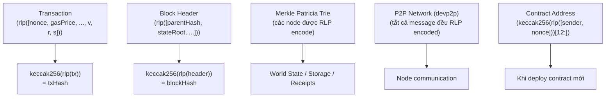

> **Prerequisites**: [[01-ethereum-big-picture|01. Ethereum — Big Picture & Design Philosophy]]
> **Objectives**:
> - Hiểu tại sao Ethereum cần một định dạng encoding riêng
> - Nắm toàn bộ 5 quy tắc RLP encoding cho byte string và list
> - Tự implement RLP encode/decode bằng Python từ đầu
> - Nhận biết RLP được dùng ở đâu trong Ethereum (transaction, state, p2p)

---

## Motivation

Ethereum là một mạng máy tính phân tán. Để hàng nghìn node trên khắp thế giới đạt được **đồng thuận** (consensus), mọi node phải biểu diễn cùng một dữ liệu theo **chính xác một cách duy nhất**. Nếu Alice encode một transaction theo kiểu A và Bob encode theo kiểu B, họ sẽ tính ra hai hash khác nhau và không bao giờ đồng ý với nhau.

Bài toán này gọi là **canonical serialization** — cần một định dạng serialize dữ liệu mà: (1) tất định (deterministic), (2) nhỏ gọn, (3) đơn giản để implement, (4) hỗ trợ cấu trúc lồng nhau tùy ý.

Ethereum giải quyết bằng **RLP (Recursive Length Prefix)** — một định dạng do chính đội Ethereum thiết kế, cực kỳ đơn giản, chỉ có 2 kiểu dữ liệu nguyên thủy: **byte string** và **list**.

> [!note] Tại sao không dùng JSON, MessagePack hay Protobuf?
> JSON không tất định (key ordering), tốn không gian. MessagePack và Protobuf cần schema riêng và phức tạp hơn cần thiết cho mục đích này. RLP được thiết kế tối giản — chỉ encode cấu trúc, không encode kiểu dữ liệu (type). Tầng ứng dụng tự quyết định ý nghĩa của từng byte.

---

## Concept: Hai Kiểu Dữ Liệu của RLP

> [!definition] Definition 3.1 — RLP Item
> RLP chỉ làm việc với hai kiểu dữ liệu:
>
> - **Byte string** (chuỗi byte): Một chuỗi byte có độ dài tùy ý, bao gồm cả chuỗi rỗng `b""`. Trong Ethereum, đây có thể là địa chỉ, hash, số nguyên (big-endian, không có leading zero), v.v.
> - **List** (danh sách): Một danh sách các RLP items, bao gồm cả list rỗng `[]`. List có thể lồng nhau tùy ý (vì thế mới có chữ "Recursive" trong tên).

Số nguyên phải được convert sang dạng byte trước khi encode: dùng **big-endian, không có leading zero** (số 0 được biểu diễn bằng `b""`).

---

## Concept: 5 Quy Tắc Encoding

RLP encoding tuân theo **5 quy tắc** dựa trên giá trị của byte đầu tiên (gọi là **prefix byte**):

> [!definition] Definition 3.2 — RLP Encoding Rules
>
> **Quy tắc 1 — Single byte** `[0x00, 0x7f]`:
> Nếu byte string chỉ có 1 byte và giá trị trong `[0x00, 0x7f]`, encode **nguyên xi** byte đó.
>
> **Quy tắc 2 — Short string** (0–55 byte):
> Nếu byte string có độ dài `len` trong `[0, 55]`:
> prefix = `0x80 + len`, theo sau là dữ liệu.
>
> **Quy tắc 3 — Long string** (> 55 byte):
> Nếu byte string có độ dài `len > 55`:
> Gọi `len_of_len` = số byte cần để biểu diễn `len`.
> prefix = `0xb7 + len_of_len`, theo sau là `len` (big-endian), rồi dữ liệu.
>
> **Quy tắc 4 — Short list** (tổng payload 0–55 byte):
> Nếu tổng byte của các item đã encoded có độ dài `len` trong `[0, 55]`:
> prefix = `0xc0 + len`, theo sau là các item đã encoded.
>
> **Quy tắc 5 — Long list** (tổng payload > 55 byte):
> Nếu tổng byte của các item đã encoded có độ dài `len > 55`:
> Gọi `len_of_len` = số byte cần để biểu diễn `len`.
> prefix = `0xf7 + len_of_len`, theo sau là `len` (big-endian), rồi các item đã encoded.

### Bảng tóm tắt prefix byte

| Prefix range | Ý nghĩa |
|---|---|
| `[0x00, 0x7f]` | Single byte — chính là dữ liệu |
| `[0x80, 0xb7]` | Short string: độ dài = prefix - `0x80` |
| `[0xb8, 0xbf]` | Long string: `len_of_len` = prefix - `0xb7` |
| `[0xc0, 0xf7]` | Short list: payload length = prefix - `0xc0` |
| `[0xf8, 0xff]` | Long list: `len_of_len` = prefix - `0xf7` |

---

## Concept: Ví dụ Từng Bước

Hãy trace tay một vài ví dụ để nắm chắc quy tắc:

**Ví dụ 1: `encode(b""`)** — chuỗi rỗng
- Không phải single byte (Quy tắc 1 không áp dụng)
- Short string, `len = 0` → prefix = `0x80 + 0 = 0x80`
- Kết quả: `0x80`

**Ví dụ 2: `encode(b"a"`)** — byte có giá trị `0x61`
- Single byte, `0x61 ∈ [0x00, 0x7f]` → encode nguyên xi
- Kết quả: `0x61`

**Ví dụ 3: `encode(b"dog"`)** — 3 byte: `0x64 0x6f 0x67`
- Short string, `len = 3` → prefix = `0x80 + 3 = 0x83`
- Kết quả: `0x83 64 6f 67`

**Ví dụ 4: `encode([])`)** — list rỗng
- Short list, `len = 0` → prefix = `0xc0 + 0 = 0xc0`
- Kết quả: `0xc0`

**Ví dụ 5: `encode([b"cat", b"dog"]`)** — list hai phần tử
- Bước 1: encode từng item:
  - `encode(b"cat")` = `0x83 63 61 74` (4 byte)
  - `encode(b"dog")` = `0x83 64 6f 67` (4 byte)
- Bước 2: ghép lại → payload = `83 63 61 74 83 64 6f 67` (8 byte)
- Bước 3: Short list, `len = 8` → prefix = `0xc0 + 8 = 0xc8`
- Kết quả: `0xc8 83 63 61 74 83 64 6f 67`

**Ví dụ 6: List lồng nhau `[[], [[]], [[], [[]]]]`**

Đây là ví dụ kinh điển trong spec RLP để test implementation:

```text
encode([]) = c0
encode([[]])         = encode([ c0 ])
                     = payload: c0 (1 byte)
                     = c1 c0
encode([[], [[]]])   = payload: encode([]) + encode([[]])
                     = c0 + c1c0 = 3 bytes
                     = c3 c0 c1 c0
encode([[], [[]], [[], [[]]]])
  item1 = encode([])          = c0           (1 byte)
  item2 = encode([[]])        = c1 c0        (2 byte)
  item3 = encode([[], [[]]]) = c3 c0 c1 c0  (4 byte)
  payload = 1 + 2 + 4 = 7 bytes
  prefix  = 0xc0 + 7 = 0xc7
  kết quả = c7 c0 c1c0 c3c0c1c0
```

---

## Implementation: RLP Encode/Decode từ đầu

```python
def rlp_encode(data):
    """
    Encode data theo RLP.
    Input: bytes hoặc list of (bytes | list)
    Output: bytes
    """
    if isinstance(data, bytes):
        # Quy tắc 1: single byte trong [0x00, 0x7f]
        if len(data) == 1 and data[0] < 0x80:
            return data

        # Quy tắc 2: short string (0-55 byte)
        if len(data) <= 55:
            return bytes([0x80 + len(data)]) + data

        # Quy tắc 3: long string (> 55 byte)
        len_bytes = _encode_length(len(data))
        return bytes([0xb7 + len(len_bytes)]) + len_bytes + data

    elif isinstance(data, list):
        # Encode từng item trước
        payload = b"".join(rlp_encode(item) for item in data)

        # Quy tắc 4: short list (payload 0-55 byte)
        if len(payload) <= 55:
            return bytes([0xc0 + len(payload)]) + payload

        # Quy tắc 5: long list (payload > 55 byte)
        len_bytes = _encode_length(len(payload))
        return bytes([0xf7 + len(len_bytes)]) + len_bytes + payload

    else:
        raise TypeError(f"RLP không hỗ trợ kiểu {type(data)}")


def _encode_length(n):
    """Encode số nguyên n thành bytes big-endian, không leading zero."""
    if n == 0:
        return b""
    return n.to_bytes((n.bit_length() + 7) // 8, "big")


def rlp_decode(data, pos=0):
    """
    Decode RLP bytes thành bytes hoặc list.
    Trả về (decoded_item, new_pos).
    """
    prefix = data[pos]

    # Single byte [0x00, 0x7f]
    if prefix < 0x80:
        return data[pos:pos+1], pos + 1

    # Short string [0x80, 0xb7]
    elif prefix <= 0xb7:
        length = prefix - 0x80
        return data[pos+1 : pos+1+length], pos + 1 + length

    # Long string [0xb8, 0xbf]
    elif prefix <= 0xbf:
        len_of_len = prefix - 0xb7
        length = int.from_bytes(data[pos+1 : pos+1+len_of_len], "big")
        start = pos + 1 + len_of_len
        return data[start : start+length], start + length

    # Short list [0xc0, 0xf7]
    elif prefix <= 0xf7:
        payload_len = prefix - 0xc0
        return _decode_list(data, pos + 1, pos + 1 + payload_len)

    # Long list [0xf8, 0xff]
    else:
        len_of_len = prefix - 0xf7
        payload_len = int.from_bytes(data[pos+1 : pos+1+len_of_len], "big")
        start = pos + 1 + len_of_len
        return _decode_list(data, start, start + payload_len)


def _decode_list(data, start, end):
    """Decode payload của một list từ vị trí start đến end."""
    items = []
    pos = start
    while pos < end:
        item, pos = rlp_decode(data, pos)
        items.append(item)
    return items, end
```

### Kiểm tra implementation

```python
# Test với các ví dụ đã trace tay ở trên
assert rlp_encode(b"")             == bytes.fromhex("80")
assert rlp_encode(b"a")            == bytes.fromhex("61")
assert rlp_encode(b"dog")          == bytes.fromhex("83646f67")
assert rlp_encode([])              == bytes.fromhex("c0")
assert rlp_encode([b"cat", b"dog"]) == bytes.fromhex("c883636174 83646f67".replace(" ", ""))

# Test list lồng nhau
nested = [[], [[]], [[], [[]]]]
enc = rlp_encode(nested)
print(f"encode([[], [[]], [[], [[]]]]) = 0x{enc.hex()}")

# Test round-trip: decode(encode(x)) == x
def roundtrip(x):
    encoded = rlp_encode(x)
    decoded, _ = rlp_decode(encoded)
    return decoded

assert roundtrip(b"dog") == b"dog"
assert roundtrip([b"cat", b"dog"]) == [b"cat", b"dog"]
print("Tất cả test pass!")
```

---

## Concept: RLP trong Ethereum — Dùng ở Đâu?

RLP là xương sống của serialization trong Ethereum. Nó xuất hiện ở **mọi tầng** của hệ thống:



Một số ví dụ cụ thể:

**Transaction hash**: Khi bạn gửi một transaction, hash của nó (txHash) = `keccak256(rlp(tx_fields))`. Đây là lý do tại sao cùng một transaction luôn cho cùng một txHash.

**Contract address**: Địa chỉ của contract mới được tính là `keccak256(rlp([sender_address, sender_nonce]))[12:]`. Vì địa chỉ phụ thuộc vào nonce, deploy cùng contract từ cùng địa chỉ sẽ cho địa chỉ khác nhau nếu nonce khác.

**devp2p message**: Tất cả message giữa các Ethereum node (GetBlockHeaders, BlockBodies, Transactions, v.v.) đều được RLP encode trước khi gửi qua mạng.

---

## Worked Example — Transaction RLP trong thực tế

Một **Legacy Transaction** (Type 0) trong Ethereum được RLP encode như sau:

```python
# Cấu trúc Legacy Transaction (EIP-155):
# rlp([nonce, gasPrice, gasLimit, to, value, data, v, r, s])

# Ví dụ: Alice gửi 1 ETH cho Bob
tx_fields = [
    b"\x05",                          # nonce = 5
    b"\x04\xa8\x17\xc8\x00",          # gasPrice = 20 gwei
    b"\x52\x08",                      # gasLimit = 21000
    bytes.fromhex("d8dA6BF26964aF9D7eEd9e03E53415D37aA96045"),  # to (20 bytes)
    b"\x0d\xe0\xb6\xb3\xa7\x64\x00\x00",  # value = 1 ETH
    b"",                              # data (rỗng, chỉ transfer ETH)
    b"\x01",                          # v (chain ID phần của chữ ký)
    b"\xab\xcd\xef...",               # r (32 bytes)
    b"\x12\x34\x56...",               # s (32 bytes)
]

raw_tx = rlp_encode(tx_fields)

from eth_hash.auto import keccak
tx_hash = keccak(raw_tx)
print(f"txHash = 0x{tx_hash.hex()}")
```

> [!note] Integer encoding trong RLP
> Số nguyên phải được convert sang bytes theo big-endian, **không có leading zero**. Số `0` được biểu diễn bằng `b""` (chuỗi rỗng). Ví dụ: `5` → `b"\x05"`, `256` → `b"\x01\x00"`, `0` → `b""`.

---

## Summary / Key Takeaways

- **RLP (Recursive Length Prefix)** là định dạng serialization tất định, nhỏ gọn, dùng khắp nơi trong Ethereum.
- Chỉ có **2 kiểu dữ liệu**: byte string và list (lồng nhau tùy ý).
- **5 quy tắc** encoding dựa trên prefix byte: single byte, short/long string, short/long list.
- **Số nguyên**: big-endian bytes, không leading zero; số 0 = `b""`.
- RLP được dùng cho: transaction hash, block hash, contract address, MPT nodes, devp2p messages.
- Dễ implement từ đầu — toàn bộ logic chỉ ~40 dòng Python.

---

## References

- Ethereum Yellow Paper — Appendix B (RLP)
- ethereum.org — [RLP Encoding](https://ethereum.org/en/developers/docs/data-structures-and-encoding/rlp/)
- ethereum/wiki — [RLP](https://eth.wiki/en/fundamentals/rlp)
- Python `rlp` library — [github.com/ethereum/pyrlp](https://github.com/ethereum/pyrlp)
