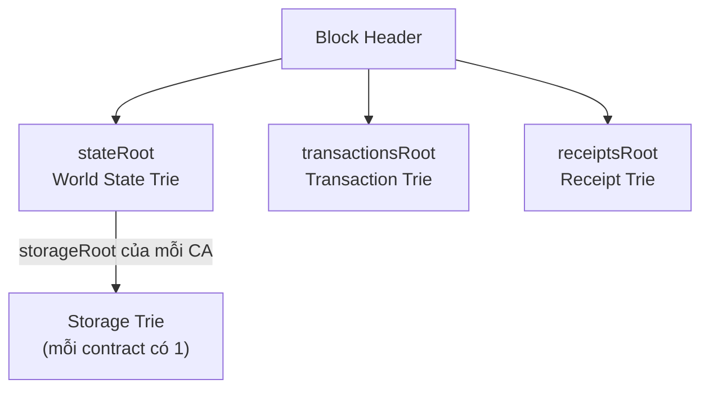

> **Prerequisites**: [[03-rlp-encoding|03. RLP Encoding]], [[02-account-model-world-state|02. Account Model & World State]]
> **Objectives**:
> - Hiểu tại sao Ethereum cần MPT thay vì hashmap thông thường
> - Phân biệt 3 loại node trong MPT: branch, extension, leaf
> - Nắm Hex-prefix (compact) encoding cho path của node
> - Biết 4 loại Trie trong Ethereum và vai trò của từng cái
> - Hiểu Merkle proof và tại sao nó quan trọng
> - Sử dụng được thư viện `trie` trong Python

---

## Motivation

Ở Lesson 02, ta biết world state là một ánh xạ `address → account_state`. Câu hỏi thực tế là: **cấu trúc dữ liệu nào lưu trữ ánh xạ này?**

Một **hashmap** đơn giản (dict trong Python) sẽ không đủ vì:

1. **Không có cryptographic commitment** — không thể tạo "chứng minh" nhỏ gọn rằng một account cụ thể có balance X mà không cần gửi toàn bộ database.
2. **Không tất định về thứ tự** — hai node có cùng dữ liệu có thể tạo ra hash khác nhau.
3. **Không hỗ trợ proof cho light clients** — light client chỉ download block header, nhưng cần prove trạng thái của một account.

Ethereum giải quyết bằng **Merkle Patricia Trie (MPT)** — một cấu trúc kết hợp ba ý tưởng:

- **Trie (prefix tree)**: tổ chức key-value theo từng nibble (4 bit) của key
- **Patricia Trie**: nén các path dài, tiết kiệm không gian
- **Merkle Tree**: mỗi node chứa hash của các node con → toàn bộ cây được "commit" bởi một root hash duy nhất

---

## Concept: Từ Trie Cơ Bản đến Merkle Patricia Trie

### Bước 1 — Basic Trie (Prefix Tree)

Trie lưu trữ các chuỗi bằng cách chia sẻ prefix chung. Ví dụ với các key `"do"`, `"dog"`, `"doge"`, `"horse"`:

```text
          root
         /    \
        d      h
        |      |
        o      o
       / \     |
      (v) g   r
           |   |
          (p)  s
            \   \
            e    e
            |    |
           (c)  (s)
```

Ký hiệu: `(v)` = leaf với value. Nhược điểm: trie có thể rất sâu với key dài (Ethereum address = 40 hex chars = 20 bytes).

### Bước 2 — Patricia Trie (Radix Trie)

Patricia Trie **nén** các chuỗi node chỉ có một child thành một node duy nhất với label là toàn bộ path đó. Ví dụ chuỗi `h → o → r → s → e` được nén thành một node với label `horse`.

### Bước 3 — Merkle Hashing

Thêm **hashing**: mỗi node được lưu dưới dạng `keccak256(rlp(node))` thay vì địa chỉ bộ nhớ. Con trỏ đến node con = hash của node đó. Kết quả: root hash của cây cam kết (commit) toàn bộ nội dung — thay đổi bất kỳ leaf nào đều làm thay đổi root hash.

---

## Concept: Ba Loại Node trong MPT

> [!definition] Definition 4.1 — Branch Node
> **Branch node** (nút phân nhánh) có **17 trường**:
> - 16 trường đầu (index 0–15): con trỏ (hash) đến các child node, tương ứng với 16 giá trị nibble `[0, 1, ..., 9, a, b, c, d, e, f]`
> - Trường thứ 17: value (nếu có một key kết thúc tại node này)
>
> Biểu diễn: `[child_0, child_1, ..., child_f, value]`

> [!definition] Definition 4.2 — Extension Node
> **Extension node** (nút mở rộng) dùng để nén các path chung — thay vì chuỗi nhiều branch node chỉ có một child.
>
> Biểu diễn: `[hex_prefix_path, hash_of_next_node]`
>
> Trong đó `hex_prefix_path` là path được nén, có tiền tố (prefix flag) để phân biệt với leaf node.

> [!definition] Definition 4.3 — Leaf Node
> **Leaf node** (nút lá) lưu phần còn lại của key và value tương ứng.
>
> Biểu diễn: `[hex_prefix_path, value]`
>
> Trong đó `hex_prefix_path` có flag đánh dấu đây là leaf, khác với extension node.

### Hex-prefix (Compact) Encoding

Vì MPT dùng nibble (4 bit) làm đơn vị, path của node là một chuỗi nibble. Để lưu vào bytes, Ethereum dùng **hex-prefix encoding** (compact encoding):

| Loại node | Độ dài path | Prefix nibble đầu |
|---|---|---|
| Extension | Chẵn | `0x00` + path |
| Extension | Lẻ | `0x1` + path |
| Leaf | Chẵn | `0x20` + path |
| Leaf | Lẻ | `0x3` + path |

Ví dụ: path `[1, 2, 3, 4]` (chẵn) của leaf node → compact = `bytes([0x20, 0x12, 0x34])`.

---

## Concept: Ví Dụ MPT Cụ Thể

Hãy xây dựng MPT với 4 cặp key-value (dùng hex nibbles):

```text
key: 646f         value: "verb"   (hex của "do")
key: 646f67       value: "puppy"  (hex của "dog")
key: 646f6765     value: "coin"   (hex của "doge")
key: 686f727365   value: "stallion" (hex của "horse")
```

Cấu trúc MPT kết quả:

```text
ROOT (Branch node)
├── [6] → Extension node, path=[4], next→
│          Branch node
│          ├── [f] → Extension node, path=[6, f], next→
│          │          Branch node
│          │          ├── value = "verb"   (key "do" kết thúc đây)
│          │          └── [6] → Extension node, path=[7], next→
│          │                     Branch node
│          │                     ├── value = "puppy"  (key "dog")
│          │                     └── [6] → Leaf, path=[5], value="coin"
│          │                                (key "doge" — nibble còn lại = '5')
│          └── (các nibble khác trống)
└── [6] → ... (bắt đầu "horse": 6-8-6-f-7-2-7-3-6-5)
    (thực ra 'h'=0x68, khác với 'd'=0x64 ở nibble thứ 2)
```

> [!note] Lưu ý kỹ thuật
> Trong thực tế, key trước khi đưa vào MPT được **keccak256 hash** (để cân bằng chiều dài key). Ví dụ State Trie dùng `keccak256(address)` làm key. Storage Trie dùng `keccak256(slot_index)` làm key. Điều này ngăn attacker tạo các key cực dài gây "trie bloat".

---

## Concept: Bốn Loại Trie trong Ethereum

Mỗi block header Ethereum chứa **bốn root hash** tương ứng với bốn MPT:



> [!definition] Definition 4.4 — State Trie (World State Trie)
> **Key**: `keccak256(address)` — 32 byte
> **Value**: RLP encode của account state `[nonce, balance, storageRoot, codeHash]`
>
> Đây là cây lớn nhất, chứa tất cả accounts đang tồn tại. Thay đổi theo từng block.

> [!definition] Definition 4.5 — Transaction Trie
> **Key**: RLP encode của transaction index trong block (0, 1, 2, ...)
> **Value**: RLP encode của transaction
>
> Được tính lại từ đầu cho mỗi block. `transactionsRoot` trong block header.

> [!definition] Definition 4.6 — Receipt Trie
> **Key**: RLP encode của transaction index
> **Value**: RLP encode của transaction receipt (status, gasUsed, logs, bloom filter)
>
> Receipt chứa kết quả thực thi của mỗi transaction. `receiptsRoot` trong block header.

> [!definition] Definition 4.7 — Storage Trie
> **Key**: `keccak256(slot_index)` — 32 byte
> **Value**: RLP encode của giá trị tại slot đó
>
> Mỗi Contract Account có **một Storage Trie riêng**. Root hash của cây này chính là `storageRoot` trong account state.

---

## Concept: Merkle Proof

Đây là một trong những tính chất quan trọng nhất của MPT.

> [!definition] Definition 4.8 — Merkle Proof
> Cho một MPT với root hash $R$, **Merkle proof** cho key $k$ là tập hợp tối thiểu các node trên đường đi từ root đến leaf $k$. Bất kỳ ai biết $R$ đều có thể **verify** rằng value $v$ thực sự được map với key $k$ trong trie — mà **không cần tải toàn bộ trie**.

Ứng dụng thực tế:

- **Light client**: Chỉ cần download block headers (chứa `stateRoot`). Để biết balance của một address, nó request Merkle proof từ full node, verify proof bằng `stateRoot`.
- **Cross-chain bridge**: Để prove rằng một transaction đã xảy ra trên Ethereum, cần proof trong `transactionsRoot`.
- **eth_getProof RPC**: API cho phép lấy Merkle proof cho bất kỳ account hoặc storage slot nào.

---

## Worked Example — MPT với Python

```python
from trie import HexaryTrie
from eth_hash.auto import keccak

# Khởi tạo một MPT rỗng (db = in-memory dict)
db = {}
trie = HexaryTrie(db)

print(f"Root (rỗng): {trie.root_hash.hex()}")

# Insert các key-value
trie[b"do"]    = b"verb"
trie[b"dog"]   = b"puppy"
trie[b"doge"]  = b"coin"
trie[b"horse"] = b"stallion"

root_v1 = trie.root_hash
print(f"Root sau khi insert: {root_v1.hex()[:16]}...")

# Lookup
print(f"trie['do']    = {trie[b'do']}")
print(f"trie['dog']   = {trie[b'dog']}")
print(f"trie['doge']  = {trie[b'doge']}")
print(f"trie['horse'] = {trie[b'horse']}")

# Root hash bất biến nếu data giống nhau
db2 = {}
trie2 = HexaryTrie(db2)
trie2[b"horse"] = b"stallion"
trie2[b"doge"]  = b"coin"
trie2[b"dog"]   = b"puppy"
trie2[b"do"]    = b"verb"

print(f"\nCùng data, thứ tự insert khác:")
print(f"root_v1 == trie2.root_hash? {root_v1 == trie2.root_hash}")
```

### Lấy và verify Merkle Proof

```python
# Lấy Merkle proof cho key "dog"
proof_nodes = trie.get_proof(b"dog")
print(f"\nMerkle proof cho 'dog': {len(proof_nodes)} nodes")

# Verify proof: chỉ cần root_hash + proof → xác minh value
verified_value = HexaryTrie.get_from_proof(root_v1, b"dog", proof_nodes)
print(f"Verified value: {verified_value}")

# Thay đổi một giá trị → root hash thay đổi
trie[b"dog"] = b"wolf"
root_v2 = trie.root_hash
print(f"\nSau khi sửa dog → wolf:")
print(f"root_v1: {root_v1.hex()[:16]}...")
print(f"root_v2: {root_v2.hex()[:16]}...")
print(f"Root thay đổi: {root_v1 != root_v2}")
```

**Output mẫu:**
```text
Root (rỗng): 56e81f171bcc55a6ff8345e692c0f86e5b48e01b996cadc001622fb5e363b421
Root sau khi insert: 5991bb8c6514148a...
trie['do']    = b'verb'
trie['dog']   = b'puppy'
trie['doge']  = b'coin'
trie['horse'] = b'stallion'

Cùng data, thứ tự insert khác:
root_v1 == trie2.root_hash? True

Merkle proof cho 'dog': 6 nodes
Verified value: b'puppy'

Sau khi sửa dog → wolf:
root_v1: 5991bb8c6514148a...
root_v2: 4f4d2e9abc123456...
Root thay đổi: True
```

---

## Concept: MPT trong Block Header

```python
from eth_hash.auto import keccak
from web3 import Web3

w3 = Web3(Web3.HTTPProvider("https://eth.llamarpc.com"))

# Lấy block header và xem các root hash
block = w3.eth.get_block("latest")

print(f"Block: #{block['number']}")
print(f"stateRoot        : 0x{block['stateRoot'].hex()}")
print(f"transactionsRoot : 0x{block['transactionsRoot'].hex()}")
print(f"receiptsRoot     : 0x{block['receiptsRoot'].hex()}")
print(f"Số transactions  : {len(block['transactions'])}")
```

> [!note] Trie persistence giữa các block
> State Trie không được tạo lại từ đầu mỗi block — nó được **update incremental**. Chỉ các account bị thay đổi mới có node mới. Các phần không đổi vẫn dùng chung node cũ. Đây gọi là **copy-on-write / persistent data structure** và là lý do Ethereum có thể xử lý state trie hàng trăm triệu account hiệu quả.

---

## Summary / Key Takeaways

- **MPT = Trie + Patricia compression + Merkle hashing** — kết hợp để có key-value store vừa hiệu quả vừa verifiable.
- Ba loại node: **Branch** (17 fields, phân nhánh theo nibble), **Extension** (nén path chung), **Leaf** (giá trị cuối).
- **Hex-prefix encoding** phân biệt Extension và Leaf qua prefix flag, đồng thời handle path có độ dài lẻ.
- Ethereum có **4 MPT**: State Trie, Transaction Trie, Receipt Trie, Storage Trie (mỗi contract).
- **Root hash** trong block header commit toàn bộ trạng thái tương ứng.
- **Merkle proof** cho phép verify một value cụ thể chỉ bằng root hash — nền tảng của light client và bridge.
- State Trie dùng **keccak256(address)** làm key; Storage Trie dùng **keccak256(slot)** làm key.

---

## References

- Ethereum Yellow Paper — Appendix D (Modified Merkle Patricia Tree)
- ethereum.org — [Patricia Merkle Trie](https://ethereum.org/en/developers/docs/data-structures-and-encoding/patricia-merkle-trie/)
- Vitalik's original post — [Merkling in Ethereum](https://blog.ethereum.org/2015/11/15/merkling-in-ethereum)
- Python `trie` library — [github.com/ethereum/py-trie](https://github.com/ethereum/py-trie)
