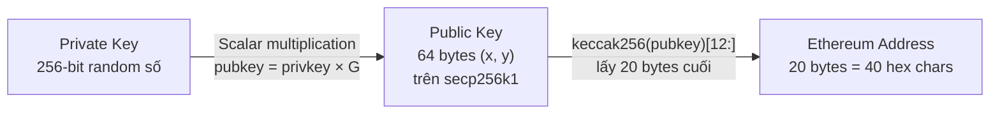

> **Prerequisites**: [[01-ethereum-big-picture|01. Ethereum — Big Picture & Design Philosophy]], [[02-account-model-world-state|02. Account Model & World State]]
> **Objectives**:
> - Hiểu Keccak-256 là gì và tại sao khác SHA-3 tiêu chuẩn
> - Nắm đường cong secp256k1 ở mức khái niệm
> - Hiểu toàn bộ luồng: private key → public key → Ethereum address
> - Biết ECDSA signing và recovery hoạt động như thế nào
> - Hiểu EIP-155 (replay protection) và EIP-55 (checksum address)
> - Tự implement address derivation bằng Python

---

## Motivation

Ethereum là mạng **permissionless** — không ai cần xin phép để tham gia. Vậy làm sao hệ thống biết rằng chính Alice — chứ không phải kẻ nào đó giả mạo — đã gửi transaction "chuyển 1 ETH"? Câu trả lời nằm ở hai thứ:

1. **Keccak-256** — hàm hash một chiều, dùng làm "dấu vân tay" cho bất kỳ dữ liệu nào
2. **ECDSA trên secp256k1** — thuật toán chữ ký số cho phép Alice ký transaction bằng private key và bất kỳ ai cũng có thể verify bằng public key của Alice — mà không cần biết private key

Đây là nền móng mật mã học của toàn bộ hệ thống Ethereum: tạo ví, ký transaction, deploy contract, tất cả đều quy về hai thứ này.

---

## Concept: Keccak-256

> [!definition] Definition 5.1 — Keccak-256
> **Keccak-256** là hàm hash mật mã học với các tính chất:
>
> - **Output cố định**: Bất kỳ input nào cũng cho output 32 byte (256 bit)
> - **One-way**: Không thể tính ngược từ hash về input
> - **Collision resistant**: Cực kỳ khó tìm hai input khác nhau cho cùng hash
> - **Avalanche effect**: Thay đổi 1 bit input → ~50% bit output thay đổi

> [!warning] Keccak-256 ≠ SHA3-256
> Ethereum dùng **Keccak-256** — đây là phiên bản gốc của thuật toán trước khi NIST chuẩn hóa. SHA3-256 (NIST FIPS 202) có padding khác nhau (`0x06` thay vì `0x01`), cho kết quả khác. Nếu dùng thư viện Python `hashlib.sha3_256`, bạn sẽ nhận được kết quả **sai** cho Ethereum. Phải dùng `eth_hash` hoặc `pysha3`.

Keccak-256 được dùng ở **mọi nơi** trong Ethereum:

| Dùng cho | Input | Output |
|---|---|---|
| Address derivation | 64-byte public key | 32 bytes → lấy 20 bytes cuối = address |
| Transaction hash | RLP-encoded transaction | 32-byte txHash |
| Block hash | RLP-encoded block header | 32-byte blockHash |
| Storage key | Slot index (32 bytes) | 32-byte key vào Storage Trie |
| Function selector | `"transfer(address,uint256)"` | 4 bytes đầu = function selector |
| MPT node key | Mỗi account address | 32-byte key vào State Trie |

---

## Concept: Đường Cong Elliptic secp256k1

Ethereum dùng đường cong elliptic **secp256k1** cho mọi thao tác key/signing. Đây cũng là đường cong Bitcoin dùng.

> [!definition] Definition 5.2 — secp256k1
> secp256k1 là đường cong elliptic được định nghĩa bởi phương trình:
>
> $$y^2 \equiv x^3 + 7 \pmod{p}$$
>
> Với $p = 2^{256} - 2^{32} - 2^9 - 2^8 - 2^7 - 2^6 - 2^4 - 1$ (một số nguyên tố 256-bit).
>
> Các tham số quan trọng:
> - **Generator point** $G$: Điểm cơ sở trên đường cong (cố định, được chọn trong spec)
> - **Order** $n$: Số nguyên tố ~$2^{256}$, xác định kích thước của nhóm

Ở mức khái niệm, phép nhân vô hướng (scalar multiplication) trên đường cong là **một chiều**: dễ tính $P = k \cdot G$ từ $k$, nhưng cực kỳ khó tính ngược $k$ từ $P$ và $G$ (bài toán **ECDLP** — Elliptic Curve Discrete Logarithm Problem).

---

## Concept: Private Key → Public Key → Address

Toàn bộ luồng tạo Ethereum identity chỉ có 3 bước:



> [!definition] Definition 5.3 — Private Key
> **Private key** là một số nguyên ngẫu nhiên trong khoảng $[1, n-1]$ với $n$ là order của secp256k1. Thực tế là 32 byte ngẫu nhiên, yêu cầu nguồn entropy mạnh (CSPRNG).
>
> Ví dụ: `0xac0974bec39a17e36ba4a6b4d238ff944bacb478cbed5efcae784d7bf4f2ff80`

> [!definition] Definition 5.4 — Public Key
> **Public key** = `privkey × G` — phép nhân vô hướng trên secp256k1.
>
> Kết quả là một điểm $(x, y)$ trên đường cong, mỗi tọa độ 32 byte → tổng 64 byte (dạng **uncompressed**, không có prefix `0x04`).
>
> Public key được chia sẻ công khai — từ public key không thể tính được private key.

> [!definition] Definition 5.5 — Ethereum Address
> **Ethereum address** được dẫn xuất từ public key:
>
> $$\text{address} = \text{keccak256}(\text{pubkey\_64bytes})[12:]$$
>
> Tức là: hash 64-byte public key, lấy **20 bytes cuối** (bỏ 12 bytes đầu). Địa chỉ thường hiển thị dạng hex 40 ký tự với tiền tố `0x`.

> [!note] Tại sao lấy 20 bytes cuối chứ không phải 20 bytes đầu?
> Đây là lựa chọn thiết kế ban đầu của Ethereum — không có lý do kỹ thuật đặc biệt. Thực tế là bytes cuối và bytes đầu của Keccak-256 đều có phân phối đồng đều như nhau.

---

## Concept: ECDSA Signing & Verification

**ECDSA (Elliptic Curve Digital Signature Algorithm)** cho phép Alice chứng minh cô ấy biết private key mà không tiết lộ nó.

> [!definition] Definition 5.6 — ECDSA Signing
> **Input**: private key $k$, message hash $z = \text{keccak256}(\text{message})$
>
> **Output**: chữ ký $(v, r, s)$
>
> **Quá trình** (phiên bản đơn giản hóa):
> 1. Chọn ngẫu nhiên **nonce** $k_{nonce} \in [1, n-1]$ (phải mới cho mỗi lần ký!)
> 2. Tính $R = k_{nonce} \cdot G$ → lấy $r = R.x \bmod n$
> 3. Tính $s = k_{nonce}^{-1} \cdot (z + r \cdot \text{privkey}) \bmod n$
> 4. $v$ = recovery bit (0 hoặc 1) — dùng để recover public key từ chữ ký

> [!warning] Nonce reuse là thảm họa
> Nếu dùng cùng một $k_{nonce}$ cho hai message khác nhau, private key có thể bị recover từ hai chữ ký. Đây là lỗ hổng nổi tiếng dẫn đến vụ hack PS3 (2010). Ethereum client luôn dùng CSPRNG để tạo $k_{nonce}$.

> [!definition] Definition 5.7 — ECDSA Verification
> **Input**: public key, message hash $z$, chữ ký $(r, s)$
>
> **Quá trình**:
> 1. Tính $u_1 = s^{-1} \cdot z \bmod n$, $u_2 = s^{-1} \cdot r \bmod n$
> 2. Tính $P = u_1 \cdot G + u_2 \cdot \text{pubkey}$
> 3. Chữ ký hợp lệ nếu $P.x \equiv r \pmod{n}$

**Public key recovery**: Với $(v, r, s)$ và message hash $z$, có thể **recover public key** (và do đó địa chỉ) mà không cần biết public key trước. Đây là lý do Ethereum transaction chỉ cần lưu `(v, r, s)` — không cần lưu public key hay địa chỉ người gửi rõ ràng.

---

## Concept: EIP-155 — Replay Protection

**Vấn đề**: Trước EIP-155, một transaction hợp lệ trên Ethereum mainnet cũng hợp lệ trên Ethereum Classic (cùng chain ID=1 ban đầu sau hard fork). Attacker có thể "replay" transaction từ mainnet sang Classic.

**Giải pháp EIP-155**: Đưa **chain ID** vào dữ liệu được ký.

> [!definition] Definition 5.8 — EIP-155 Replay Protection
> Khi ký transaction với EIP-155, thay vì ký RLP thông thường, ta ký:
>
> `sign_hash = keccak256(rlp([nonce, gasPrice, gasLimit, to, value, data, chainId, 0, 0]))`
>
> Và giá trị `v` trong chữ ký được tính là:
>
> $$v = \text{chain\_id} \times 2 + 35 + \text{recovery\_bit}$$
>
> Với mainnet (chain_id = 1): $v \in \{37, 38\}$.
>
> Nếu replay transaction sang chain khác (chain_id khác), chữ ký sẽ không hợp lệ.

**Các chain_id phổ biến:**

| Mạng | Chain ID |
|---|---|
| Ethereum Mainnet | 1 |
| Sepolia Testnet | 11155111 |
| Polygon | 137 |
| Arbitrum One | 42161 |
| Optimism | 10 |
| Base | 8453 |

---

## Concept: EIP-55 — Checksum Address

Ethereum address chỉ là 20 byte hex — dễ nhầm lẫn khi gõ. **EIP-55** thêm checksum bằng cách mixed-case hóa các ký tự hex:

> [!definition] Definition 5.9 — EIP-55 Checksum Address
> Cho địa chỉ lowercase `addr`:
> 1. Tính `h = keccak256(addr_lowercase_hex_string)` (không có `0x`)
> 2. Với mỗi ký tự hex tại vị trí `i`:
>    - Nếu `h[i] >= 8`: ký tự chữ cái viết **HOA**
>    - Ngược lại: viết **thường**
>
> Ví dụ: `0x5aaeb6053f3e94c9b9a09f33669435e7ef1beaed` → `0x5aAeb6053F3E94C9b9A09f33669435E7Ef1BeAed`

---

## Implementation: Address Derivation từ đầu

```python
from eth_keys import keys
from eth_hash.auto import keccak
import secrets


def generate_keypair():
    """Tạo private key ngẫu nhiên và derive public key + address."""
    privkey_bytes = secrets.token_bytes(32)
    privkey = keys.PrivateKey(privkey_bytes)
    pubkey  = privkey.public_key
    raw_pubkey = pubkey._raw_key  # 64 bytes uncompressed (x || y)
    address = "0x" + keccak(raw_pubkey)[12:].hex()
    return privkey_bytes, raw_pubkey, address


def to_checksum_address(addr_hex: str) -> str:
    """Áp dụng EIP-55 checksum cho một Ethereum address."""
    addr = addr_hex.lower().replace("0x", "")
    h = keccak(addr.encode()).hex()
    checksum = "0x"
    for i, c in enumerate(addr):
        if c.isdigit():
            checksum += c
        elif int(h[i], 16) >= 8:
            checksum += c.upper()
        else:
            checksum += c.lower()
    return checksum


privkey_bytes, raw_pubkey, address = generate_keypair()
checksum_addr = to_checksum_address(address)

print(f"Private key  : 0x{privkey_bytes.hex()}")
print(f"Public key   : 0x{raw_pubkey.hex()[:32]}...  ({len(raw_pubkey)} bytes)")
print(f"Address      : {address}")
print(f"Checksum addr: {checksum_addr}")
```

### Ký và verify transaction hash

```python
def sign_tx_hash(privkey_bytes: bytes, tx_hash: bytes):
    """Ký một transaction hash, trả về (v, r, s)."""
    privkey = keys.PrivateKey(privkey_bytes)
    sig = privkey.sign_msg_hash(tx_hash)
    return sig.v, sig.r, sig.s


def recover_sender(tx_hash: bytes, v: int, r: int, s: int) -> str:
    """Recover địa chỉ người gửi từ chữ ký ECDSA."""
    sig = keys.Signature(vrs=(v, r, s))
    pubkey = sig.recover_public_key_from_msg_hash(tx_hash)
    raw = pubkey._raw_key
    return to_checksum_address("0x" + keccak(raw)[12:].hex())


privkey_bytes, _, address = generate_keypair()
tx_hash = keccak(b"some_rlp_encoded_transaction_data")

v, r, s = sign_tx_hash(privkey_bytes, tx_hash)
recovered = recover_sender(tx_hash, v, r, s)

print(f"Signer address  : {to_checksum_address(address)}")
print(f"Recovered from sig: {recovered}")
print(f"Match: {recovered.lower() == address.lower()}")
print(f"v={v}, r=0x{r.to_bytes(32,'big').hex()[:16]}..., s=0x{s.to_bytes(32,'big').hex()[:16]}...")
```

### Kiểm tra: Keccak-256 vs SHA3-256

```python
import hashlib
from eth_hash.auto import keccak

data = b"Hello Ethereum"
eth_keccak = keccak(data).hex()
std_sha3   = hashlib.sha3_256(data).hexdigest()

print(f"Keccak-256 (Ethereum) : {eth_keccak}")
print(f"SHA3-256   (NIST)     : {std_sha3}")
print(f"Khác nhau? {eth_keccak != std_sha3}")
```

---

## Worked Example — Trace địa chỉ Vitalik

Vitalik Buterin có public ENS `vitalik.eth`. Địa chỉ của ông được public biết:

```python
from eth_hash.auto import keccak
from eth_keys import keys

known_address = "0xd8dA6BF26964aF9D7eEd9e03E53415D37aA96045"

# Verify EIP-55 checksum của địa chỉ này
def verify_checksum(addr: str) -> bool:
    lower = addr.lower().replace("0x", "")
    h = keccak(lower.encode()).hex()
    for i, c in enumerate(lower):
        if c.isdigit():
            continue
        bit = int(h[i], 16)
        expected_case = c.upper() if bit >= 8 else c.lower()
        actual_char = addr[2:][i]
        if actual_char != expected_case:
            return False
    return True

print(f"Address: {known_address}")
print(f"EIP-55 checksum valid: {verify_checksum(known_address)}")
```

---

## Summary / Key Takeaways

- **Keccak-256 ≠ SHA3-256** — Ethereum dùng phiên bản pre-NIST với padding khác.
- **Private key**: 32 byte ngẫu nhiên trong $[1, n-1]$ của secp256k1.
- **Public key**: `privkey × G` trên secp256k1 → 64 bytes (x, y).
- **Address**: `keccak256(pubkey_64bytes)[12:]` → 20 bytes.
- **ECDSA signature**: `(v, r, s)` — public key có thể **recover** từ signature + message hash.
- **EIP-155**: Đưa `chain_id` vào dữ liệu ký → ngăn replay attack cross-chain.
- **EIP-55**: Mixed-case checksum address — phát hiện lỗi đánh máy.

---

## References

- Ethereum Yellow Paper — Appendix F (ECDSA Signing)
- EIP-155 — [github.com/ethereum/EIPs/blob/master/EIPS/eip-155.md](https://eips.ethereum.org/EIPS/eip-155)
- EIP-55 — [eips.ethereum.org/EIPS/eip-55](https://eips.ethereum.org/EIPS/eip-55)
- ethereum.org — [Accounts](https://ethereum.org/en/developers/docs/accounts/)
- eth-keys Python library — [github.com/ethereum/eth-keys](https://github.com/ethereum/eth-keys)
