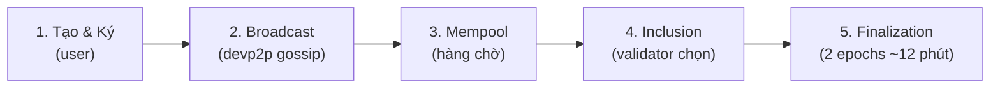

> **Prerequisites**: [[02-account-model-world-state|02. Account Model & World State]], [[05-keccak-ecdsa-addresses|05. Keccak-256, ECDSA & Ethereum Addresses]]
> **Objectives**:
> - Hiểu toàn bộ vòng đời của một transaction: từ ký đến finalize
> - Phân biệt 3 loại transaction: Type 0 (Legacy), Type 2 (EIP-1559), Type 3 (EIP-4844)
> - Nắm cơ chế mempool: pending, queued, inclusion
> - Biết access list (EIP-2930) là gì và khi nào dùng
> - Hiểu EIP-4844 blob transaction ở mức khái niệm

---

## Motivation

Trong Lesson 01, ta đã trace sơ lược một transaction từ "Alice ký" đến "block finalized". Nhưng thực tế phức tạp hơn nhiều. Ethereum đã có **3 thế hệ** định dạng transaction với cơ chế gas hoàn toàn khác nhau. Hiểu rõ từng loại sẽ giúp bạn:

- Debug tại sao transaction bị "stuck" trong mempool
- Hiểu tại sao phí Layer 2 giảm mạnh sau EIP-4844
- Đọc được raw transaction data từ block explorer
- Xây dựng ứng dụng tương tác với Ethereum đúng cách

---

## Concept: Vòng Đời Một Transaction

Một transaction đi qua **5 giai đoạn** trước khi được ghi vĩnh viễn vào blockchain:



### Giai đoạn 1 — Tạo & Ký

Người dùng (hoặc ứng dụng) tạo transaction object, RLP encode các trường, tính hash, ký bằng private key → nhận `(v, r, s)`. Raw signed transaction là `rlp([...fields..., v, r, s])`.

### Giai đoạn 2 — Broadcast

Transaction được gửi đến một Ethereum node (qua JSON-RPC `eth_sendRawTransaction`). Node đó kiểm tra tính hợp lệ cơ bản rồi **gossip** (lan truyền) sang các peer node khác qua devp2p. Trong vài giây, hầu hết nodes trên mạng đều biết về transaction này.

### Giai đoạn 3 — Mempool (Memory Pool)

> [!definition] Definition 6.1 — Mempool
> **Mempool** (memory pool, còn gọi là txpool) là hàng chờ trong bộ nhớ của mỗi node, lưu các transaction đã nhận nhưng chưa được include vào block.
>
> Mempool chia làm hai phần:
> - **Pending**: Transaction hợp lệ, nonce đúng thứ tự → có thể include ngay
> - **Queued**: Transaction có nonce cao hơn nonce hiện tại của sender (đang chờ các tx nonce thấp hơn)

Ví dụ: Alice có nonce hiện tại là 5. Nếu Alice gửi tx với nonce=7 trước khi tx nonce=6 được confirm, tx nonce=7 sẽ nằm trong **queued** cho đến khi nonce=6 được xử lý.

> [!note] Mempool không phải global
> Mỗi node có mempool riêng. Mempool của bạn chỉ chứa các tx mà node của bạn đã nhận được. Các nodes khác có thể có các tx khác. Đây là lý do tại sao "pending transaction" đôi khi khó track.

### Giai đoạn 4 — Inclusion

Validator được chọn ngẫu nhiên (theo PoS) để propose block. Validator chạy **MEV-Boost** hoặc tự chọn tx từ mempool, sắp xếp theo `priority fee` (tip) từ cao xuống thấp, đóng gói thành **execution payload**, gửi lên consensus layer.

### Giai đoạn 5 — Finalization

Sau khi block được propose, các validator khác attestation (xác nhận). Block được **justified** sau 1 epoch (6.4 phút), **finalized** sau 2 epochs (~12.8 phút). Finalized block không thể bị reorg hay revert.

---

## Concept: Ba Loại Transaction

Ethereum dùng **EIP-2718 (Typed Transaction Envelope)** để phân biệt các loại transaction. Mỗi loại có type byte ở đầu raw transaction.

### Type 0 — Legacy Transaction (trước EIP-1559)

Định dạng gốc, không có type byte (hoặc được coi là type 0):

```text
RLP([nonce, gasPrice, gasLimit, to, value, data, v, r, s])
```

| Trường | Kiểu | Mô tả |
|--------|------|-------|
| `nonce` | uint64 | Số tx đã gửi từ địa chỉ này |
| `gasPrice` | uint256 | Giá mỗi gas unit (wei) |
| `gasLimit` | uint64 | Gas tối đa được phép dùng |
| `to` | address / null | Địa chỉ nhận (null = deploy contract) |
| `value` | uint256 | Số wei chuyển đi |
| `data` | bytes | Calldata (rỗng với ETH transfer, có data khi gọi contract) |
| `v, r, s` | — | Chữ ký ECDSA (v chứa chain_id theo EIP-155) |

**Nhược điểm**: `gasPrice` là giá cứng — người dùng phải đoán fee phù hợp. Khi mạng tắc nghẽn, mọi người bid cao hơn nhau dẫn đến fee rất khó đoán.

### Type 2 — EIP-1559 Transaction (từ London hard fork, 2021)

```text
0x02 || RLP([chainId, nonce, maxPriorityFeePerGas, maxFeePerGas, gasLimit,
             to, value, data, accessList, signatureYParity, r, s])
```

| Trường mới | Mô tả |
|-----------|-------|
| `maxFeePerGas` | Mức giá tối đa sẵn sàng trả mỗi gas (wei) |
| `maxPriorityFeePerGas` | Tip tối đa cho validator (wei) |
| `accessList` | Danh sách address/storage slots sẽ dùng (EIP-2930) |
| `signatureYParity` | 0 hoặc 1 (thay vì v = chain_id*2+35) |

**Cơ chế EIP-1559** (học kỹ ở Lesson 07):
- Mỗi block có **base fee** cố định (do protocol tính tự động)
- Người dùng đặt `maxFeePerGas` ≥ base_fee + `maxPriorityFeePerGas`
- **Base fee bị đốt** (burn) hoàn toàn, không ai nhận
- Validator chỉ nhận `min(maxFeePerGas - baseFee, maxPriorityFeePerGas)` × gasUsed
- Phần dư (`maxFeePerGas - actualFee`) được hoàn trả

> [!note] Tại sao Type 2 tốt hơn Type 0?
> Người dùng chỉ cần đặt `maxFeePerGas` đủ cao (an toàn), không cần đoán chính xác. Protocol tự điều chỉnh base fee theo demand — nếu block đầy, base fee tăng; nếu block rỗng, base fee giảm. Phí trở nên có thể dự đoán hơn.

### Type 3 — EIP-4844 Blob Transaction (từ Dencun hard fork, 2024)

```text
0x03 || RLP([chainId, nonce, maxPriorityFeePerGas, maxFeePerGas, gasLimit,
             to, value, data, accessList, maxFeePerBlobGas,
             blobVersionedHashes, signatureYParity, r, s])
```

| Trường mới | Mô tả |
|-----------|-------|
| `maxFeePerBlobGas` | Giá tối đa cho mỗi blob gas unit |
| `blobVersionedHashes` | List hash của các blob đính kèm |

**Blob là gì?** Blob (Binary Large Object) là gói dữ liệu lớn (~128 KB) được đính kèm vào transaction nhưng **không được EVM truy cập** — chỉ được lưu tạm thời (~18 ngày) trên consensus layer. Đây là cơ chế **data availability** cho Layer 2:

- L2 rollup gửi batch transaction data lên L1 dưới dạng blob → rẻ hơn nhiều so với calldata thông thường
- EVM trên L1 chỉ verify hash của blob (qua `BLOBHASH` opcode), không đọc nội dung
- Sau 18 ngày, blob bị xóa (pruned) — chỉ hash còn lại vĩnh viễn

> [!note] Tác động thực tế của EIP-4844
> Trước Dencun: phí L2 ~$0.10–$1.00 mỗi tx. Sau Dencun: phí L2 xuống ~$0.001–$0.01. Tiết kiệm 10–100x nhờ blob data rẻ hơn calldata cũ đến 100x.

---

## Concept: Access List (EIP-2930)

Type 1 (EIP-2930) và Type 2, 3 đều có trường `accessList`. Đây là danh sách khai báo trước các address và storage slots mà transaction sẽ đọc/ghi:

```python
accessList = [
    {
        "address": "0xContractAddress...",
        "storageKeys": [
            "0x0000000000000000000000000000000000000000000000000000000000000001",
            "0x0000000000000000000000000000000000000000000000000000000000000002",
        ]
    }
]
```

**Lý do**: EVM tính phí cao hơn cho lần đầu truy cập một storage slot ("cold access"). Khai báo trước trong `accessList` → slot được **pre-warmed** → phí thấp hơn (warm access). Dùng khi biết trước transaction sẽ đọc/ghi gì.

---

## Worked Example — Phân tích Raw Transaction

Đây là ví dụ cấu trúc một Type 2 transaction điển hình như bạn sẽ thấy qua `eth_getTransactionByHash`:

```python
tx = {
    "blockHash": "0x4e3a3754410177e6937ef1f84bba68ea139e8d1a2258c5f85db9f1cd715a1bdd",
    "blockNumber": 19_500_000,
    "hash": "0x5c504ed432cb51138bcf09aa5e8a410dd4a1e204ef84bfed1be16dfba1b22060",
    "type": "0x2",

    "from": "0xA1E4380A3B1f749673E270229993eE55F35663b4",
    "to":   "0xd8dA6BF26964aF9D7eEd9e03E53415D37aA96045",
    "value": 10**18,

    "nonce": 42,
    "gas":   21000,
    "gasUsed": 21000,

    "maxFeePerGas":         30_000_000_000,  # 30 gwei
    "maxPriorityFeePerGas":  2_000_000_000,  # 2  gwei
    "effectiveGasPrice":    17_000_000_000,  # base_fee(15) + tip(2) = 17 gwei

    "input": "0x",
    "accessList": [],
    "chainId": "0x1",
    "v": "0x0",
    "r": "0xabc123...",
    "s": "0xdef456...",
}

# Tính phí thực tế
base_fee     = 15_000_000_000  # gwei từ block header
priority_fee = tx["maxPriorityFeePerGas"]
actual_price = min(tx["maxFeePerGas"], base_fee + priority_fee)
total_fee    = tx["gasUsed"] * actual_price
burned       = tx["gasUsed"] * base_fee
validator    = tx["gasUsed"] * priority_fee

from web3 import Web3
print(f"Total fee paid : {Web3.from_wei(total_fee, 'ether'):.8f} ETH")
print(f"Burned (base)  : {Web3.from_wei(burned, 'ether'):.8f} ETH  ({burned/total_fee*100:.1f}%)")
print(f"Validator tip  : {Web3.from_wei(validator, 'ether'):.8f} ETH  ({validator/total_fee*100:.1f}%)")
```

**Output:**
```text
Total fee paid : 0.00000035700 ETH
Burned (base)  : 0.00000031500 ETH  (88.2%)
Validator tip  : 0.00000004200 ETH  (11.8%)
```

---

## Concept: Đọc Transaction từ web3.py

```python
from web3 import Web3

w3 = Web3(Web3.HTTPProvider("https://eth.llamarpc.com"))

# Lấy một transaction theo hash
tx_hash = "0x5c504ed432cb51138bcf09aa5e8a410dd4a1e204ef84bfed1be16dfba1b22060"
tx = w3.eth.get_transaction(tx_hash)

print(f"Type           : {tx.get('type', 0)}")
print(f"From           : {tx['from']}")
print(f"To             : {tx['to']}")
print(f"Value          : {Web3.from_wei(tx['value'], 'ether')} ETH")
print(f"Nonce          : {tx['nonce']}")
print(f"Gas limit      : {tx['gas']}")

# Lấy receipt để biết gas thực tế đã dùng
receipt = w3.eth.get_transaction_receipt(tx_hash)
print(f"Gas used       : {receipt['gasUsed']}")
print(f"Status         : {'Success' if receipt['status'] == 1 else 'Failed'}")
```

---

## Summary / Key Takeaways

- Transaction có **5 giai đoạn**: tạo/ký → broadcast → mempool → inclusion → finalization.
- **Mempool** chia làm pending (nonce kế tiếp) và queued (nonce tương lai).
- **Type 0 (Legacy)**: gasPrice cứng, cơ chế cũ trước EIP-1559.
- **Type 2 (EIP-1559)**: `maxFeePerGas` + `maxPriorityFeePerGas`, base fee bị đốt, phí dự đoán tốt hơn.
- **Type 3 (EIP-4844)**: Thêm blob data cho L2, `maxFeePerBlobGas`, blobs bị xóa sau ~18 ngày.
- **Access list**: Khai báo trước storage slots để trả phí warm access thay vì cold.
- Ghi nhớ: `actual_gas_price = min(maxFeePerGas, baseFee + maxPriorityFeePerGas)`.

---

## References

- EIP-1559 — [eips.ethereum.org/EIPS/eip-1559](https://eips.ethereum.org/EIPS/eip-1559)
- EIP-2718 — [eips.ethereum.org/EIPS/eip-2718](https://eips.ethereum.org/EIPS/eip-2718) (Typed Transaction Envelope)
- EIP-2930 — [eips.ethereum.org/EIPS/eip-2930](https://eips.ethereum.org/EIPS/eip-2930) (Access List)
- EIP-4844 — [eips.ethereum.org/EIPS/eip-4844](https://eips.ethereum.org/EIPS/eip-4844) (Blob Transactions)
- ethereum.org — [Transactions](https://ethereum.org/en/developers/docs/transactions/)
- web3.py docs — [eth module](https://web3py.readthedocs.io/en/stable/web3.eth.html)
