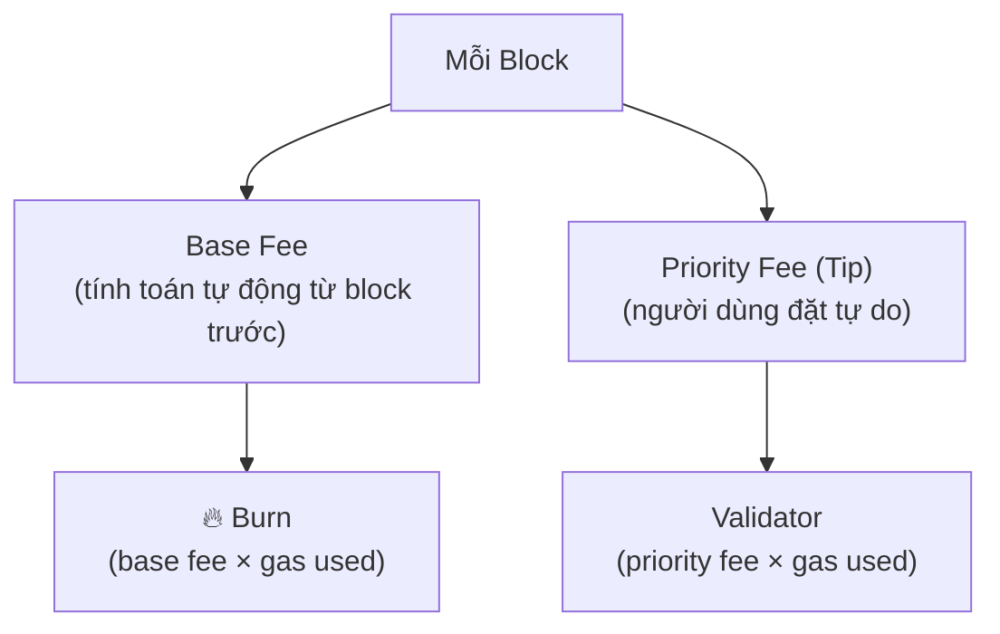

> **Prerequisites**: [[06-transaction-lifecycle|06. Transaction Lifecycle & Types]]
> **Objectives**:
> - Hiểu tại sao Ethereum cần gas và gas đo lường cái gì
> - Phân biệt gas limit, gas used, gas price, base fee, priority fee
> - Nắm thuật toán điều chỉnh base fee của EIP-1559
> - Hiểu tại sao base fee bị đốt (burn) và tác động kinh tế
> - Tính được phí thực tế của một transaction trong mọi kịch bản
> - Biết intrinsic gas (chi phí tối thiểu của một tx)

---

## Motivation

Hãy tưởng tượng một network toàn cầu không giới hạn, nơi bất kỳ ai cũng có thể gửi bất kỳ đoạn code nào để mọi node thực thi. Nếu không có cơ chế giới hạn, kẻ tấn công chỉ cần gửi một vòng lặp vô tận để làm tê liệt toàn mạng với chi phí gần như bằng không.

**Gas** là giải pháp của Ethereum: mỗi thao tác tính toán tốn một lượng gas cố định, và người dùng phải trả tiền thật (ETH) cho lượng gas họ tiêu thụ. Khi gas hết, execution dừng lại — code không thể chạy mãi mãi.

Cơ chế gas hoàn toàn thay đổi vào năm 2021 với **EIP-1559**, chuyển từ mô hình đấu giá đơn giản (người trả nhiều nhất được ưu tiên) sang mô hình phí thị trường có thuật toán điều chỉnh tự động.

---

## Concept: Gas là Gì?

> [!definition] Definition 7.1 — Gas
> **Gas** là đơn vị đo lường **công tính toán** (computational work) trong EVM. Mỗi opcode có một chi phí gas cố định. Gas không phải ETH — nó là một đơn vị trừu tượng. ETH chỉ được dùng để **trả tiền** cho gas.
>
> Gas tách biệt hai khái niệm:
> - **Bao nhiêu công** phải làm (gas amount — đơn vị cố định theo spec)
> - **Trả bao nhiêu tiền** cho một đơn vị công (gas price — biến động theo thị trường)

### Chi phí gas của các opcode phổ biến

| Opcode | Gas | Ghi chú |
|--------|-----|---------|
| `ADD`, `SUB` | 3 | Số học đơn giản |
| `MUL`, `DIV` | 5 | Số học phức tạp hơn |
| `KECCAK256` | 30 + 6/word | Hash 32 bytes đầu = 30+6=36 |
| `MLOAD`, `MSTORE` | 3 | Đọc/ghi memory (+ memory expansion) |
| `SLOAD` | 100 (warm) / 2100 (cold) | Đọc storage — cold = lần đầu truy cập |
| `SSTORE` | 100 (warm) / 2900 (cold) | Ghi storage — cực kỳ đắt |
| `CALL` | 100 + stipend | Gọi contract khác |
| `CREATE` | 32,000 | Deploy contract mới |
| `LOG1` | 750 + 8/byte | Emit event với 1 topic |
| `JUMP` | 8 | Nhảy đến vị trí khác |

> [!note] Cold vs Warm access (EIP-2929)
> Lần đầu đọc/ghi một storage slot hoặc địa chỉ trong một transaction là **cold access** (đắt hơn) vì node phải tải dữ liệu từ disk. Các lần tiếp theo trong cùng transaction là **warm access** (rẻ hơn). `accessList` (Lesson 06) cho phép pre-warm các slot để tránh chi phí cold.

### Intrinsic Gas

Mỗi transaction tốn một lượng gas **tối thiểu** trước khi EVM bắt đầu chạy bất kỳ opcode nào:

| Loại | Gas |
|------|-----|
| Transaction cơ bản (ETH transfer) | 21,000 |
| Mỗi byte zero trong `data` | 4 |
| Mỗi byte non-zero trong `data` | 16 |
| Contract creation | + 32,000 |

Ví dụ: transfer ETH đơn thuần không có data → `gasLimit` tối thiểu = 21,000. Gọi contract với calldata `0xabcdef00` (3 non-zero + 1 zero byte) → 21,000 + 3×16 + 1×4 = 21,052.

---

## Concept: Các Tham Số Gas

> [!definition] Definition 7.2 — Gas Limit, Gas Used, Gas Price
>
> - **Gas Limit** (per tx): Lượng gas tối đa người gửi cho phép tx dùng. Nếu execution vượt quá giới hạn này → tx revert, toàn bộ gas đã set bị mất (không hoàn trả).
>
> - **Gas Used**: Lượng gas thực tế đã tiêu thụ. Phần dư (`gasLimit - gasUsed`) được hoàn trả về sender.
>
> - **Block Gas Limit**: Tổng gas tối đa của tất cả tx trong một block. Hiện tại ~30M gas. Validator có thể vote thay đổi giới hạn này từng bước nhỏ.
>
> - **Block Gas Target**: Một nửa block gas limit (~15M gas). EIP-1559 điều chỉnh base fee để block trung bình đạt target này.

---

## Concept: EIP-1559 Fee Market

Trước EIP-1559, phí gas hoạt động theo cơ chế **đấu giá đơn giản** (first-price auction): node bao gồm các tx có gasPrice cao nhất. Kết quả: phí rất khó đoán, người dùng thường overbid, validator thu hết phần thắng.

EIP-1559 thay thế bằng cơ chế **base fee + priority fee**:



> [!definition] Definition 7.3 — EIP-1559 Fee Formula
>
> **Giá gas thực tế** được tính như sau:
>
> $$\text{effectiveGasPrice} = \min(\text{maxFeePerGas},\ \text{baseFee} + \text{maxPriorityFeePerGas})$$
>
> **Phí tổng** = `effectiveGasPrice × gasUsed`
>
> Trong đó:
> - `baseFee × gasUsed` → **bị đốt** (burn) vĩnh viễn, giảm cung ETH
> - `(effectiveGasPrice − baseFee) × gasUsed` → validator nhận làm tip
> - `(maxFeePerGas − effectiveGasPrice) × gasUsed` → hoàn trả về sender

### Ví dụ tính phí

```python
base_fee             = 15_000_000_000  # 15 gwei (từ block header)
max_fee_per_gas      = 30_000_000_000  # 30 gwei (sender đặt)
max_priority_fee     =  2_000_000_000  #  2 gwei (sender đặt)
gas_used             = 21_000          # ETH transfer đơn giản

# Tính effective gas price
effective_price = min(max_fee_per_gas, base_fee + max_priority_fee)
# = min(30, 15 + 2) = 17 gwei

total_fee   = gas_used * effective_price
burned      = gas_used * base_fee
to_validator = gas_used * (effective_price - base_fee)
refund      = gas_used * (max_fee_per_gas - effective_price)

print(f"Effective gas price : {effective_price / 1e9:.1f} gwei")
print(f"Total fee paid      : {total_fee / 1e18:.8f} ETH")
print(f"Burned (base fee)   : {burned / 1e18:.8f} ETH  ({burned/total_fee*100:.1f}%)")
print(f"Validator tip       : {to_validator / 1e18:.8f} ETH  ({to_validator/total_fee*100:.1f}%)")
print(f"Refund to sender    : {refund / 1e18:.8f} ETH")
```

**Output:**
```text
Effective gas price : 17.0 gwei
Total fee paid      : 0.00000035700 ETH
Burned (base fee)   : 0.00000031500 ETH  (88.2%)
Validator tip       : 0.00000004200 ETH  (11.8%)
Refund to sender    : 0.00000027300 ETH
```

---

## Concept: Thuật Toán Điều Chỉnh Base Fee

Đây là trái tim của EIP-1559 — base fee tự động điều chỉnh để block trung bình luôn đạt 50% đầy.

> [!definition] Definition 7.4 — Base Fee Adjustment
>
> Gọi:
> - $B_n$ = base fee của block $n$
> - $G_n$ = gas used của block $n$
> - $G_T$ = gas target = `block_gas_limit // 2`
>
> Base fee của block tiếp theo:
>
> $$B_{n+1} = B_n \times \left(1 + \frac{1}{8} \cdot \frac{G_n - G_T}{G_T}\right)$$
>
> Giới hạn thay đổi: tối đa **±12.5%** mỗi block.
>
> - Block 100% đầy ($G_n = 2G_T$): $B_{n+1} = B_n \times 1.125$
> - Block 0% rỗng ($G_n = 0$): $B_{n+1} = B_n \times 0.875$
> - Block đúng 50% ($G_n = G_T$): $B_{n+1} = B_n$ (không đổi)

```python
def next_base_fee(parent_base_fee, parent_gas_used, parent_gas_target):
    if parent_gas_used == parent_gas_target:
        return parent_base_fee
    elif parent_gas_used > parent_gas_target:
        gas_delta = parent_gas_used - parent_gas_target
        fee_delta = max(parent_base_fee * gas_delta // parent_gas_target // 8, 1)
        return parent_base_fee + fee_delta
    else:
        gas_delta = parent_gas_target - parent_gas_used
        fee_delta = parent_base_fee * gas_delta // parent_gas_target // 8
        return parent_base_fee - fee_delta

# Simulate: 3 block đầy 100%, rồi 3 block rỗng 0%
base_fee    = 10_000_000_000  # 10 gwei
gas_limit   = 30_000_000
gas_target  = gas_limit // 2  # 15M

print(f"{'Scenario':<20} {'Gas Used':>12}  {'Base Fee':>14}  {'Δ':>8}")
print("-" * 60)
for label, gas_used in [
    ("50% (target)",  gas_target),
    ("100% full",     gas_limit),
    ("100% full",     gas_limit),
    ("100% full",     gas_limit),
    ("0% empty",      0),
    ("0% empty",      0),
    ("0% empty",      0),
]:
    new_fee = next_base_fee(base_fee, gas_used, gas_target)
    delta = (new_fee - base_fee) / base_fee * 100
    print(f"{label:<20} {gas_used:>12,}  {new_fee/1e9:>10.4f} gwei  {delta:>+7.2f}%")
    base_fee = new_fee
```

**Output:**
```text
Scenario             Gas Used        Base Fee         Δ
------------------------------------------------------------
50% (target)        15,000,000    10.0000 gwei    +0.00%
100% full           30,000,000    11.2500 gwei   +12.50%
100% full           30,000,000    12.6562 gwei   +12.50%
100% full           30,000,000    14.2383 gwei   +12.50%
0% empty                     0    12.4585 gwei   -12.50%
0% empty                     0    10.9012 gwei   -12.50%
0% empty                     0     9.5385 gwei   -12.50%
```

> [!note] Tại sao giới hạn 12.5% mỗi block?
> Giới hạn này đảm bảo base fee không thể tăng/giảm quá nhanh, cho phép wallets và ứng dụng đoán được base fee trong vài block tới. Ngay cả trong trường hợp tắc nghẽn cực đoan (100 block liên tiếp đầy), base fee chỉ tăng tối đa ~$(1.125)^{100} \approx 160\times$.

---

## Concept: ETH Burn — Tác Động Kinh Tế

Việc đốt base fee là một quyết định thiết kế quan trọng với nhiều hệ quả:

**Giảm lạm phát ETH**: Trước EIP-1559, toàn bộ phí gas vào túi validator/miner → ETH chỉ tăng cung theo block reward. Sau EIP-1559, base fee bị đốt → khi mạng bận, ETH có thể giảm cung ròng (deflationary).

**Tại sao không trả base fee cho validator?** Nếu validator nhận base fee, họ có incentive để tự gửi tx "giả" với giá gas cao (vì tiền sẽ quay về mình). Bằng cách đốt base fee, cơ chế này bị loại trừ hoàn toàn.

**Ultra Sound Money narrative**: Nếu `ETH burned > ETH issued` (block reward), tổng cung ETH giảm theo thời gian. Điều này xảy ra khi mạng đủ bận. Bạn có thể theo dõi trực tiếp tại [ultrasound.money](https://ultrasound.money).

---

## Worked Example — Kịch bản thực tế

### Kịch bản 1: Giao dịch bình thường

```python
base_fee         = 12_000_000_000  # 12 gwei (thấp, mạng bình thường)
max_fee          = 15_000_000_000  # 15 gwei
max_priority_fee =  1_500_000_000  #  1.5 gwei
gas_limit        = 21_000

effective = min(max_fee, base_fee + max_priority_fee)
# = min(15, 12 + 1.5) = 13.5 gwei
print(f"Scenario 1 (normal): {effective/1e9:.1f} gwei → "
      f"{gas_limit * effective / 1e18:.8f} ETH")
```

### Kịch bản 2: Mạng tắc nghẽn — base fee vượt maxFeePerGas

```python
base_fee         = 50_000_000_000  # 50 gwei (tắc nghẽn!)
max_fee          = 30_000_000_000  # 30 gwei (người dùng đặt thấp)
max_priority_fee =  2_000_000_000  #  2 gwei

# base_fee > max_fee → transaction KHÔNG được include
# Node sẽ từ chối vì sender không đủ trả base fee
if base_fee > max_fee:
    print("Scenario 2 (congested): Tx bị từ chối — maxFeePerGas < baseFee!")
    print(f"  baseFee={base_fee/1e9:.0f} gwei > maxFeePerGas={max_fee/1e9:.0f} gwei")
    print("  Tx nằm trong mempool, chờ base fee giảm xuống dưới 30 gwei.")
```

### Kịch bản 3: Tx thất bại (out of gas)

```python
gas_limit  = 21_000   # đủ cho ETH transfer
gas_needed = 50_000   # thực ra cần 50K (ví dụ gọi contract phức tạp)

if gas_needed > gas_limit:
    print("Scenario 3 (OOG): Out of Gas!")
    print(f"  gasLimit={gas_limit} < gas needed={gas_needed}")
    print("  Tx revert, toàn bộ gasLimit bị tiêu — không hoàn trả!")
    print(f"  Mất: {gas_limit * base_fee / 1e18:.8f} ETH phí")
```

---

## Summary / Key Takeaways

- **Gas** đo lường công tính toán; người dùng trả ETH cho gas tiêu thụ.
- **Intrinsic gas**: mỗi tx tối thiểu 21,000 gas; thêm 16/byte non-zero và 4/byte zero trong calldata.
- **SSTORE/SLOAD** là các opcode đắt nhất — storage I/O tốn kém nhất trong EVM.
- **EIP-1559**: `effectiveGasPrice = min(maxFeePerGas, baseFee + maxPriorityFeePerGas)`
- **Base fee bị đốt** hoàn toàn; validator chỉ nhận priority fee.
- **Base fee điều chỉnh ±12.5% mỗi block** để target 50% đầy.
- **Out of Gas** = tx revert + mất toàn bộ gas đã đặt (không hoàn trả).

---

## References

- EIP-1559 — [eips.ethereum.org/EIPS/eip-1559](https://eips.ethereum.org/EIPS/eip-1559)
- EIP-2929 — [eips.ethereum.org/EIPS/eip-2929](https://eips.ethereum.org/EIPS/eip-2929) (Cold/Warm access)
- Ethereum Yellow Paper — Section 6 (Transaction Execution), Appendix G (Fee Schedule)
- ethereum.org — [Gas and Fees](https://ethereum.org/en/developers/docs/gas/)
- ultrasound.money — ETH issuance/burn tracker
